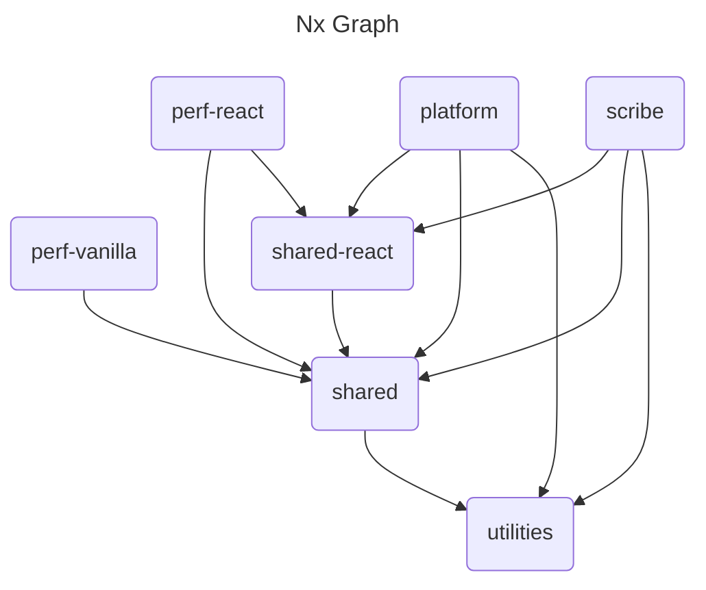

# Scripture Editors

This monorepo contains packages for various Scripture editors.

Each Scripture application's editor will have many behaviors in common with other Scripture applications. Each will need some features that are unique. We are developing all of these parts in a compatible way and in one place in order to maximize collaboration and sharing.

In this monorepo:

- Each application produces their own editor package - the application uses the package produced from this repo because the source is there.
- Common nodes, plugins, and formatters for the toolbar plugin.
- Specific sets of nodes, plugins, and formatters for each data type extending from the common items where applicable.

Sharing in this monorepo is a commitment to maintain and organize it. Each application package is free to move in its own direction but keeping in mind items that can be pushed up outside the specific editor package to be used in common.

## Developer Quick Start

1. Install [Volta](https://docs.volta.sh/guide/getting-started).
2. Clone the monorepo:
   ```bash
   git clone https://github.com/BiblioNexus-Foundation/scripture-editors.git
   cd scripture-editors
   pnpm install
   ```
3. Install [Nx](https://nx.dev/) globally (note we intentionally use `npm` rather than `pnpm` for global installs, see [JavaScript Tool Manager](#javascript-tool-manager)):
   ```bash
   npm i -g nx
   ```
4. Run one of the top level developer environments (see the **Nx Graph** below), e.g.:
   ```bash
   nx dev perf-react
   ```

## JavaScript Tool Manager

You can use [Volta](https://volta.sh/) with this repo to use the right version of tools such as Node.js and PNPM.

If you don't use Volta just look at the `volta` property in [package.json](/package.json) to see the right tool versions to install in your preferred way.

NOTE: there is a [known limitation using PNPM with Volta](https://docs.volta.sh/advanced/pnpm). So to install packages globally, use NPM instead of PNPM (only for global installs). For an example, see step 2 of [Developer Quick Start](#developer-quick-start).

## Nx Monorepo Build System

| Source                                 | Package                                                                 |
| -------------------------------------- | ----------------------------------------------------------------------- |
| [perf-vanilla](/packages/perf-react)   |                                                                         |
| [perf-react](/packages/perf-react)     |                                                                         |
| [platform](/packages/platform)         | [![Github Tag][npm-platform-version-image]][npm-platform-version-url]   |
| [scribe](/packages/scribe)             | [![Github Tag][npm-scribe-version-image]][npm-scribe-version-url]       |
| [shared-react](/packages/shared-react) |                                                                         |
| [shared](/packages/shared)             |                                                                         |
| [utilities](/packages/utilities)       | [![Github Tag][npm-utilities-version-image]][npm-utilities-version-url] |



<a alt="Nx logo" href="https://nx.dev" target="_blank" rel="noreferrer"></a>

✨ **This workspace has been generated by [Nx, a Smart, fast and extensible build system.](https://nx.dev)** ✨

### Nx Installed Globally?

If you haven't installed Nx globally (as recommended in step 2 of [Developer Quick Start](#developer-quick-start)), then just prefix each call to `nx` with `pnpm`, e.g. `pnpm nx build perf-react`.

### Running tasks

To execute tasks with Nx use the following syntax:

```bash
nx <target> <project> <...options>
# e.g.
nx build perf-react
```

You can also run multiple targets:

```bash
nx run-many -t <target1> <target2>
```

..or add `-p` to filter specific projects

```bash
nx run-many -t <target1> <target2> -p <proj1> <proj2>
```

Targets can be defined in the `package.json` or `projects.json`. Learn more [in the docs](https://nx.dev/core-features/run-tasks).

### Generate code

If you happen to use Nx plugins, you can leverage code generators that might come with it.

Run `nx list` to get a list of available plugins and whether they have generators. Then run `nx list <plugin-name>` to see what generators are available.

Learn more about [Nx generators on the docs](https://nx.dev/plugin-features/use-code-generators).

### Want better Editor Integration?

Have a look at the [Nx Console extensions](https://nx.dev/nx-console). It provides autocomplete support, a UI for exploring and running tasks & generators, and more! Available for VSCode, IntelliJ and comes with a LSP for Vim users.

### Ready to deploy?

Just run `nx build perf-react` to build that application. The build artifacts will be stored in the `dist/` directory, ready to be deployed.

### Set up CI!

Nx comes with local caching already built-in (check your `nx.json`). On CI you might want to go a step further.

- [Set up remote caching](https://nx.dev/core-features/share-your-cache)
- [Set up task distribution across multiple machines](https://nx.dev/core-features/distribute-task-execution)
- [Learn more how to setup CI](https://nx.dev/recipes/ci)

### Connect with us!

- [Join the community](https://nx.dev/community)
- [Subscribe to the Nx Youtube Channel](https://www.youtube.com/@nxdevtools)
- [Follow us on Twitter](https://twitter.com/nxdevtools)

## Testing

The unit tests run automatically on each GitHub PR (see [test.yml](/.github/workflows/test.yml)).

To run all TS unit tests:

```bash
nx run-many -t test
```

To run all TS unit tests for a single package (in this example the **shared** package):

```bash
nx test shared
```

To run all TS unit tests watching for file changes:

- On Windows:
  ```bash
  nx watch --all -- nx test %NX_PROJECT_NAME%
  ```
- On Linux or macOS:
  ```bash
  nx watch --all -- nx test \$NX_PROJECT_NAME
  ```

You can also use the [recommended VS Code extensions](/.vscode/extensions.json) to run tests there. This is particularly useful for running individual tests and debugging.

## Formatting, Linting and Typechecking

Formatting happens automatically when you commit. If you use VS Code with this repo's recommended extensions, files will be formatted when you save.

To check TypeScript for readability, maintainability, and functionality errors, and to check a few other files for proper formatting, run the following from the repo root (or just use VS Code with this repo's recommended extensions).

```bash
nx format:check # to check formatting
nx format:write # to fix formatting
nx run-many -t lint # to check linting
nx run-many -t typecheck # to check types
```

## Collaborative Web Development Environment

Thanks to [CodeSandbox](https://codesandbox.io/) for the instant dev environment: https://codesandbox.io/p/github/BiblioNexus-Foundation/scripture-editors/main

## Plain Vanilla JS and React

Lexical works with plain-vanilla JS/TS as well as with React. To that end, the editor packages in this repo `perf-react` and `perf-vanilla` are 2 editor components that behave the same to edit the [PERF](https://github.com/Proskomma/proskomma-json-tools/blob/main/doc/schema/perf.html) data format.

If you are using a framework other than React and need to wrap a plain-vanilla JS editor for your framework, you could add your own vanilla TS editor package to this repo. By comparing `perf-vanilla` and `perf-react` you can see how to take any existing React plugins you might want and convert them to vanilla TS.

## License

[MIT][github-license] © [BiblioNexus Foundation](https://biblionexus.org/)

<!-- define variables used above -->

[npm-platform-version-image]: https://img.shields.io/npm/v/@biblionexus-foundation/platform-editor
[npm-platform-version-url]: https://www.npmjs.com/package/@biblionexus-foundation/platform-editor
[npm-scribe-version-image]: https://img.shields.io/npm/v/@biblionexus-foundation/scribe-editor
[npm-scribe-version-url]: https://www.npmjs.com/package/@biblionexus-foundation/scribe-editor
[npm-utilities-version-image]: https://img.shields.io/npm/v/@biblionexus-foundation/scripture-utilities
[npm-utilities-version-url]: https://www.npmjs.com/package/@biblionexus-foundation/scripture-utilities
[github-license]: https://github.com/BiblioNexus-Foundation/scripture-editors/blob/main/LICENSE
