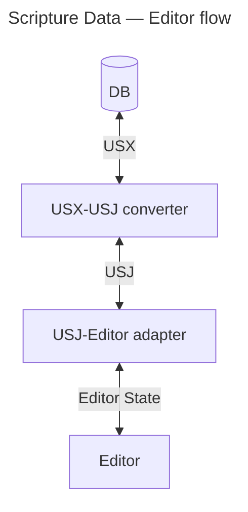

# Scripture Editor for [Platform](https://platform.bible) using USJ

<div align="center">

[![Build Status][github-actions-status]][github-actions-url]
[![CodeQL][gitghub-codeql-status]][gitghub-codeql-url]
[![Github Tag][npm-version-image]][npm-version-url]

</div>

A Scripture editor React component that works on USJ Scripture data. A utility that converts USX to USJ is also included. It is expected that data conforms to [USJ v3.1](https://docs.usfm.bible/usfm/3.1/).



## Install

```sh
npm install @biblionexus-foundation/platform-editor
```

## Usage

> [!NOTE]
> This is an [uncontrolled React component](https://react.dev/learn/sharing-state-between-components#controlled-and-uncontrolled-components).

> [!NOTE]
>
> - Use the `<Editorial />` component for an editor without commenting features.
> - Use the `<Marginal />` component for an editor with comments (comments appear in the margin).

```typescript
import { EditorOptions, immutableNoteCallerNodeName, Marginal, MarginalRef, usxStringToUsj, UsjNodeOptions } from '@biblionexus-foundation/platform-editor';
import { BookChapterControl } from 'platform-bible-react';

const emptyUsx = '<usx version="3.1" />';
const usx = `
<?xml version="1.0" encoding="utf-8"?>
<usx version="3.1">
  <book code="PSA" style="id">World English Bible (WEB)</book>
  <para style="mt1">The Psalms</para>
  <chapter number="1" style="c" sid="PSA 1" />
  <para style="q1">
    <verse number="1" style="v" sid="PSA 1:1" />Blessed is the man who doesn’t walk in the counsel of the wicked,</para>
  <para style="q2" vid="PSA 1:1">nor stand on the path of sinners,</para>
  <para style="q2" vid="PSA 1:1">nor sit in the seat of scoffers;<verse eid="PSA 1:1" /></para>
</usx>
`;
const defaultUsj = usxStringToUsj(emptyUsx);
const defaultScrRef = { /* PSA */ bookNum: 19, chapterNum: 1, verseNum: 1 };
const nodeOptions: UsjNodeOptions = { [immutableNoteCallerNodeName]: { onClick: () => console.log('Note was clicked!') } };
const options: EditorOptions = { isReadonly: false, textDirection: "ltr", nodes: nodeOptions };
// Word "man" inside first q1 of PSA 1:1.
const annotationRange1 = {
  start: { jsonPath: "$.content[3].content[1]", offset: 15 },
  end: { jsonPath: "$.content[3].content[1]", offset: 18 },
};
// Phrase "man who" inside first q1 of PSA 1:1.
const annotationRange2 = {
  start: { jsonPath: "$.content[3].content[1]", offset: 15 },
  end: { jsonPath: "$.content[3].content[1]", offset: 22 },
};
const cursorLocation = { start: { jsonPath: "$.content[3].content[1]", offset: 15 } };

export default function App() {
  const marginalRef = useRef<MarginalRef | null>(null);
  const [scrRef, setScrRef] = useState(defaultScrRef);

  const handleUsjChange = useCallback((usj: Usj, comments: Comments | undefined) => console.log({ usj, comments }), []);

  // Simulate USJ updating after the editor is loaded.
  useEffect(() => {
    const timeoutId = setTimeout(() => {
      marginalRef.current?.setComments?.([]);
      marginalRef.current?.setUsj(usxStringToUsj(usx));
    }, 1000);
    return () => clearTimeout(timeoutId);
  }, []);

  // Add and remove annotations after USJ is loaded, and set cursor location.
  useEffect(() => {
    const timeoutId = setTimeout(() => {
      marginalRef.current?.addAnnotation(annotationRange1, "spelling", "annotationId");
      marginalRef.current?.addAnnotation(annotationRange2, "grammar", "abc123");
      marginalRef.current?.removeAnnotation("spelling", "annotationId");
      marginalRef.current?.setSelection(cursorLocation);
    }, 3000);
    return () => clearTimeout(timeoutId);
  }, []);

  return (
    <>
      <div className="controls">
        <BookChapterControl handleSubmit={setScrRef} scrRef={scrRef} />
      </div>
      <Marginal
        ref={marginalRef}
        defaultUsj={defaultUsj}
        scrRef={scrRef}
        onScrRefChange={setScrRef}
        onUsjChange={handleUsjChange}
        options={options}
        logger={console}
      />
    </>
  );
}
```

## Styling

This npm package does not include styling so you need to style the editor component to suit your application. A good place to start is to copy the **CSS** from this repo:

- Scripture Nodes [/packages/platform/src/usj-nodes.css](/packages/platform/src/usj-nodes.css)
- Editor [/packages/platform/src/editor/editor.css](/packages/platform/src/editor/editor.css)
- Marker Menu [/packages/shared/styles/nodes-menu.css](/packages/shared/styles/nodes-menu.css)

For **icon assets** for the editor referenced in `editor.css` (the license file is included):

- [/packages/platform/assets](/packages/platform/assets)

If using the **commenting features** in the `<Marginal />` component:

- [/packages/platform/src/marginal/comments/ui/Button.css](/packages/platform/src/marginal/comments/ui/Button.css)
- [/packages/platform/src/marginal/comments/ui/ContentEditable.css](/packages/platform/src/marginal/comments/ui/ContentEditable.css)
- [/packages/platform/src/marginal/comments/ui/Modal.css](/packages/platform/src/marginal/comments/ui/Modal.css)
- [/packages/platform/src/marginal/comments/ui/Placeholder.css](/packages/platform/src/marginal/comments/ui/Placeholder.css)
- [/packages/platform/src/marginal/comments/comment-editor.theme.css](/packages/platform/src/marginal/comments/comment-editor.theme.css)
- [/packages/platform/src/marginal/comments/CommentPlugin.css](/packages/platform/src/marginal/comments/CommentPlugin.css)

## Features

- USJ editor with USX support
- Read-only and edit mode
- History - undo & redo
- Cut, copy, paste, paste as plain text - context menu and keyboard shortcuts
- Format block type - change `<para>` markers. The current implementation is a proof-of-concept and doesn't have all the markers available yet.
- Add comments to selected text, reply in comment threads, delete comments and threads.
  - To enable comments use the `<Marginal />` editor component (comments appear in the margin).
  - To use the editor without comments use the `<Editorial />` component.
- Add and remove different types of annotations. Style the different annotations types with CSS, e.g. style a spelling annotation with a red squiggly underline.
- Get and set the cursor location or selection range.
- Specify `textDirection` as `"ltr"`, `"rtl"`, or `"auto"` (`"auto"` is unlikely to be useful for minority languages).
- BCV linkage - change the book/chapter/verse externally and the cursor moves; move the cursor and it updates the external book/chapter/verse
- Nodes supported `<book>`, `<chapter>`, `<verse>`, `<para>`, `<char>`, `<note>`, `<ms>`
- Nodes not yet supported `<table>`, `<row>`, `<cell>`, `<sidebar>`, `<periph>`, `<figure>`, `<optbreak>`, `<ref>`
- Node options - callback for when a `<note>` link is clicked

## `<Editorial />` API

### Editorial Properties

```ts
/**
 * Scripture Editor for USJ. Created for use in [Platform](https://platform.bible).
 * @see https://github.com/usfm-bible/tcdocs/blob/usj/grammar/usj.js
 *
 * @param props.ref - Forward reference for the editor.
 * @param props.defaultUsj - Initial Scripture data in USJ format.
 * @param props.scrRef - Scripture reference that links the general cursor location of the Scripture.
 * @param props.onScrRefChange - Callback function when the Scripture reference changes in the editor as the cursor moves.
 * @param props.onSelectionChange - Callback function when the cursor selection changes.
 * @param props.onUsjChange - Callback function when USJ Scripture data has changed.
 * @param props.options - Options to configure the editor.
 * @param props.logger - Logger instance.
 * @returns the editor element.
 */
```

### Editorial Ref

```ts
/** Forward reference for the editor. */
export type EditorRef = {
  /** Focus the editor. */
  focus(): void;
  /** Get USJ Scripture data. */
  getUsj(): Usj | undefined;
  /** Set the USJ Scripture data. */
  setUsj(usj: Usj): void;
  /**
   * Get the selection location or range.
   * @returns the selection location or range, or `undefined` if there is no selection. The
   *   json-path in the selection assumes no comment Milestone nodes are present in the USJ.
   */
  getSelection(): SelectionRange | undefined;
  /**
   * Set the selection location or range.
   * @param selection - A selection location or range. The json-path in the selection assumes no
   *   comment Milestone nodes are present in the USJ.
   */
  setSelection(selection: SelectionRange): void;
  /**
   * Add an ephemeral annotation.
   * @param selection - An annotation range containing the start and end location. The json-path in
   *   an annotation location assumes no comment Milestone nodes are present in the USJ.
   * @param type - Type of the annotation.
   * @param id - ID of the annotation.
   */
  addAnnotation(selection: AnnotationRange, type: string, id: string): void;
  /**
   * Remove an ephemeral annotation.
   * @param type - Type of the annotation.
   * @param id - ID of the annotation.
   */
  removeAnnotation(type: string, id: string): void;
  /** Ref to the end of the toolbar - INTERNAL USE ONLY to dynamically add controls in the toolbar. */
  toolbarEndRef: React.RefObject<HTMLElement> | null;
};
```

### Editorial Options

```ts
/** Options to configure the editor. */
export type EditorOptions = {
  /** Is the editor readonly or editable. */
  isReadonly?: boolean;
  /** Is the editor enabled for spell checking. */
  hasSpellCheck?: boolean;
  /** Text direction: "ltr" | "rtl" | "auto". */
  textDirection?: TextDirection;
  /** Key to trigger the marker menu. Defaults to '\'. */
  markerMenuTrigger?: string;
  /** View options - EXPERIMENTAL. Defaults to the formatted view mode which is currently the only functional option. */
  view?: ViewOptions;
  /** Options for each editor node:
   * @param nodes.ImmutableNoteCallerNode.noteCallers - Possible note callers to use when caller is
   *   '+'. Defaults to Latin lower case letters.
   * @param nodes.ImmutableNoteCallerNode.onClick - Click handler method.
   */
  nodes?: UsjNodeOptions;
};
```

## `<Marginal />` API

These are the same as Editorial except where noted below. See [Editorial API](#editorial--api).

### Marginal Properties

Inherits from the [Editorial Properties](#editorial-properties).

```ts
export type MarginalProps<TLogger extends LoggerBasic> = Omit<
  EditorProps<TLogger>,
  "onUsjChange"
> & {
  /** Callback function when comments have changed. */
  onCommentChange?: (comments: Comments | undefined) => void;
  /** Callback function when USJ Scripture data has changed. */
  onUsjChange?: (usj: Usj, comments: Comments | undefined) => void;
};
```

### Marginal Ref

Inherits from the [Editorial Ref](#editorial-ref).

```ts
/** Forward reference for the editor. */
export type MarginalRef = EditorRef & {
  /** Set the comments to accompany USJ Scripture. */
  setComments?(comments: Comments): void;
};
```

## Demo and Collaborative Web Development Environment

Thanks to [CodeSandbox](https://codesandbox.io/) for the instant dev environment: https://codesandbox.io/p/github/BiblioNexus-Foundation/scripture-editors/main

This package is the third tab (`dev:platform:5175`).

OR

To run the demo app locally, first follow the [Developer Quick Start](/README.md#developer-quick-start), but instead of running the last step, instead run:

```sh
nx dev platform
```

## Develop in App

To develop an editor in a target application you can use [yalc](https://www.npmjs.com/package/yalc) to link the editor in without having to publish to NPM every time something changes.

1. In this monorepo, publish the editor to `yalc`, e.g.:
   ```bash
   nx devpub platform
   ```
2. In the target application repo, link from `yalc`:
   ```bash
   yalc link @biblionexus-foundation/platform-editor
   ```
3. In this monorepo, make changes and re-publish the editor (see step 1).
4. When you have finished developing in the target application repo, unlink from `yalc`:
   ```bash
   yalc remove @biblionexus-foundation/platform-editor && npm i
   ```

## License

[MIT][github-license] © [BiblioNexus Foundation](https://biblionexus.org/)

<!-- define variables used above -->

[github-actions-status]: https://github.com/BiblioNexus-Foundation/scripture-editors/actions/workflows/test-publish.yml/badge.svg
[github-actions-url]: https://github.com/BiblioNexus-Foundation/scripture-editors/actions
[gitghub-codeql-status]: https://github.com/BiblioNexus-Foundation/scripture-editors/actions/workflows/codeql.yml/badge.svg
[gitghub-codeql-url]: https://github.com/BiblioNexus-Foundation/scripture-editors/actions/workflows/codeql.yml
[npm-version-image]: https://img.shields.io/npm/v/@biblionexus-foundation/platform-editor
[npm-version-url]: https://github.com/BiblioNexus-Foundation/scripture-editors/releases
[github-license]: https://github.com/BiblioNexus-Foundation/scripture-editors/blob/main/packages/platform/LICENSE
