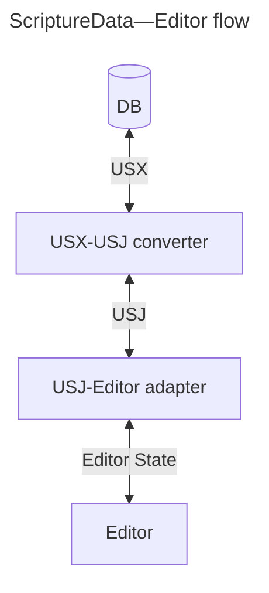

# Scripture Editor for Platform.Bible using USX3.0 <-> USJ

<div align="center">

[![Build Status][github-actions-status]][github-actions-url]
[![CodeQL][gitghub-codeql-status]][gitghub-codeql-url]
[![Github Tag][npm-version-image]][npm-version-url]

</div>

A Scripture editor React component that works on USJ Scripture data. A utility that converts USX to USJ is also included. It is expected that data conforms to [USX v3.0](https://ubsicap.github.io/usx/).



## Install

```sh
npm install @biblionexus-foundation/platform-editor
```

## Usage

**Note:** this is an [uncontrolled React component](https://react.dev/learn/sharing-state-between-components#controlled-and-uncontrolled-components).

```typescript
import { EditorOptions, immutableNoteCallerNodeName, Marginal, MarginalRef, usxStringToUsj, UsjNodeOptions } from '@biblionexus-foundation/platform-editor';
import { BookChapterControl } from 'platform-bible-react';

const emptyUsx = '<usx version="3.0" />';
const usx = `
<?xml version="1.0" encoding="utf-8"?>
<usx version="3.0">
  <book code="PSA" style="id">World English Bible (WEB)</book>
  <para style="mt1">The Psalms</para>
  <chapter number="1" style="c" sid="PSA 1" />
  <para style="q1">
    <verse number="1" style="v" sid="PSA 1:1" />Blessed is the man who doesn’t walk in the counsel of the wicked,</para>
  <para style="q2" vid="PSA 1:1">nor stand on the path of sinners,</para>
  <para style="q2" vid="PSA 1:1">nor sit in the seat of scoffers;<verse eid="PSA 1:1" /></para>
</usx>
`;
const defaultUsj = usxStringToUsj(emptyUsx);
const defaultScrRef = { /* PSA */ bookNum: 19, chapterNum: 1, verseNum: 1 };
const nodeOptions: UsjNodeOptions = { [immutableNoteCallerNodeName]: { onClick: () => console.log('Note was clicked!') } };
const options: EditorOptions = { nodes: nodeOptions };
// Word "man" inside first q1 of PSA 1:1.
const annotationRange1 = {
  start: { jsonPath: "$.content[3].content[1]", offset: 15 },
  end: { jsonPath: "$.content[3].content[1]", offset: 18 },
};
// Phrase "man who" inside first q1 of PSA 1:1.
const annotationRange2 = {
  start: { jsonPath: "$.content[3].content[1]", offset: 15 },
  end: { jsonPath: "$.content[3].content[1]", offset: 22 },
};
const cursorLocation = { start: { jsonPath: "$.content[3].content[1]", offset: 15 } };

export default function App() {
  const marginalRef = useRef<MarginalRef | null>(null);
  const [scrRef, setScrRef] = useState(defaultScrRef);

  const handleChange = useCallback((usj: Usj, comments: Comments | undefined) => console.log({ usj, comments }), []);

  // Simulate USJ updating after the editor is loaded.
  useEffect(() => {
    const timeoutId = setTimeout(() => {
      marginalRef.current?.setComments?.([]);
      marginalRef.current?.setUsj(usxStringToUsj(usx));
    }, 1000);
    return () => clearTimeout(timeoutId);
  }, []);

  // Add and remove annotations after USJ is loaded, and set cursor location.
  useEffect(() => {
    const timeoutId = setTimeout(() => {
      marginalRef.current?.addAnnotation(annotationRange1, "spelling", "annotationId");
      marginalRef.current?.addAnnotation(annotationRange2, "grammar", "abc123");
      marginalRef.current?.removeAnnotation("spelling", "annotationId");
      marginalRef.current?.setSelection(cursorLocation);
    }, 3000);
    return () => clearTimeout(timeoutId);
  }, []);

  return (
    <>
      <div className="controls">
        <BookChapterControl handleSubmit={setScrRef} scrRef={scrRef} />
      </div>
      <Marginal
        ref={marginalRef}
        defaultUsj={defaultUsj}
        scrRef={scrRef}
        setScrRef={setScrRef}
        options={options}
        onChange={handleChange}
        logger={console}
      />
    </>
  );
}
```

## Features

- USJ editor with USX support
- Read-only and edit mode
- History - undo & redo
- Format block type - change `<para>` markers. The current implementation is a proof-of-concept and doesn't have all the markers available yet.
- Add comments to selected text, reply in comment threads, delete comments and threads.
  - To enable comments use the `<Marginal>` editor component (comments appear in the margin).
  - To use the editor without comments use the `<Editorial>` component.
- Add and remove different types of annotations. Style the different annotations types with CSS, e.g. style a spelling annotation with a red squiggly underline.
- Set the cursor location or select a range.
- BCV linkage - change the book/chapter/verse externally and the cursor moves; move the cursor and it updates the external book/chapter/verse
- Nodes supported `<book>`, `<chapter>`, `<verse>`, `<para>`, `<char>`, `<note>`, `<ms>`
- Nodes not yet supported `<table>`, `<row>`, `<cell>`, `<sidebar>`, `<periph>`, `<figure>`, `<optbreak>`, `<ref>`
- Node options - callback for `<note>` link

## Demo and Collaborative Web Development Environment

Thanks to [CodeSandbox](https://codesandbox.io/) for the instant dev environment: https://codesandbox.io/p/github/BiblioNexus-Foundation/scripture-editors/main

This package is the third tab (`dev:platform:5175`).

## Develop in App

To develop an editor in a target application you can use [yalc](https://www.npmjs.com/package/yalc) to link the editor in without having to publish to NPM every time something changes.

1. In this monorepo, publish the editor to `yalc`, e.g.:
   ```bash
   nx devpub platform
   ```
2. In the target application repo, link from `yalc`:
   ```bash
   yalc link @biblionexus-foundation/platform-editor
   ```
3. In this monorepo, make changes and re-publish the editor (see step 2).
4. When you have finished developing in the target application repo, unlink from `yalc`:
   ```bash
   yalc remove @biblionexus-foundation/platform-editor && npm i
   ```

## License

[MIT][github-license] © [BiblioNexus Foundation](https://biblionexus.org/)

<!-- define variables used above -->

[github-actions-status]: https://github.com/BiblioNexus-Foundation/scripture-editors/actions/workflows/test-publish.yml/badge.svg
[github-actions-url]: https://github.com/BiblioNexus-Foundation/scripture-editors/actions
[gitghub-codeql-status]: https://github.com/BiblioNexus-Foundation/scripture-editors/actions/workflows/codeql.yml/badge.svg
[gitghub-codeql-url]: https://github.com/BiblioNexus-Foundation/scripture-editors/actions/workflows/codeql.yml
[npm-version-image]: https://img.shields.io/npm/v/@biblionexus-foundation/platform-editor
[npm-version-url]: https://github.com/BiblioNexus-Foundation/scripture-editors/releases
[github-license]: https://github.com/BiblioNexus-Foundation/scripture-editors/blob/main/packages/platform/LICENSE
