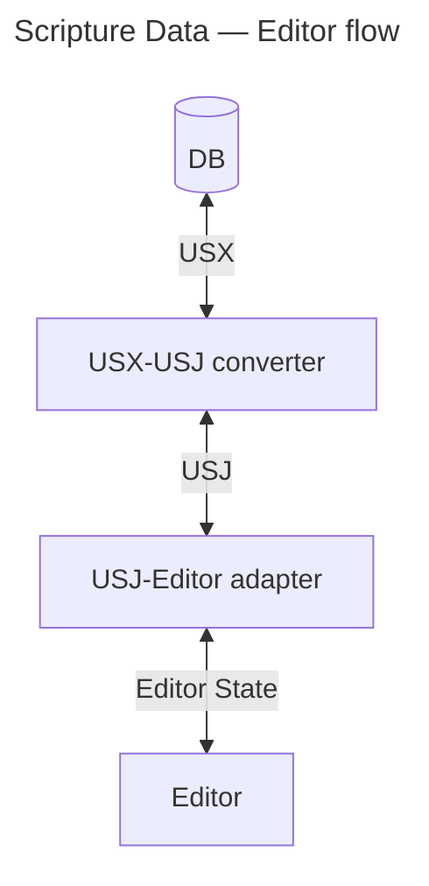

# Scripture Editor for [Platform](https://platform.bible) using USJ

<div align="center">

[![Build Status][github-actions-status]][github-actions-url]
[![CodeQL][gitghub-codeql-status]][gitghub-codeql-url]
[![Github Tag][npm-version-image]][npm-version-url]

</div>

A Scripture editor React component that works on USJ Scripture data. A utility that converts USX to USJ is also included. It is expected that data conforms to [USJ v3.1](https://docs.usfm.bible/usfm/3.1/).


```mermaid
---
title: Scripture Data — Editor flow
---
graph TB
  DB[(DB)] <-- USX --> C
  C[USX-USJ converter] <-- USJ --> A
  A[USJ-Editor adapter] <-- Editor State --> Editor
```

## Install

```sh
npm install @eten-tech-foundation/platform-editor
```

## Usage

> [!NOTE]
> This is an [uncontrolled React component](https://react.dev/learn/sharing-state-between-components#controlled-and-uncontrolled-components).

> [!NOTE]
>
> - Use the `<Editorial />` component for an editor without commenting features.
> - Use the `<Marginal />` component (DEPRECATED) for an editor with comments (comments appear in the margin).

> [!IMPORTANT]
> `<Marginal />` is deprecated and will be removed in a future release.

```ts
import { EditorOptions, Editorial, EditorRef, usxStringToUsj, UsjNodeOptions } from "@eten-tech-foundation/platform-editor";
import { BookChapterControl } from "platform-bible-react";

const emptyUsx = '<usx version="3.1" />';
const usx = `<?xml version="1.0" encoding="utf-8"?>
<usx version="3.1">
  <book code="PSA" style="id">World English Bible (WEB)</book>
  <para style="mt1">The Psalms</para>
  <chapter number="1" style="c" sid="PSA 1" />
  <para style="q1">
    <verse number="1" style="v" sid="PSA 1:1" />Blessed is the man who doesn’t walk in the counsel of the wicked,</para>
  <para style="q2" vid="PSA 1:1">nor stand on the path of sinners,</para>
  <para style="q2" vid="PSA 1:1">nor sit in the seat of scoffers;<verse eid="PSA 1:1" /></para>
</usx>
`;
const defaultUsj = usxStringToUsj(emptyUsx);
const defaultScrRef = { book: "PSA", chapterNum: 1, verseNum: 1 };
const nodeOptions: UsjNodeOptions = { noteCallerOnClick: () => console.log("Note was clicked!") };
const options: EditorOptions = { isReadonly: false, textDirection: "ltr", nodes: nodeOptions };
// Word "man" inside first q1 of PSA 1:1.
const annotationRange1 = {
  start: { jsonPath: "$.content[3].content[1]", offset: 15 },
  end: { jsonPath: "$.content[3].content[1]", offset: 18 },
};
// Phrase "man who" inside first q1 of PSA 1:1.
const annotationRange2 = {
  start: { jsonPath: "$.content[3].content[1]", offset: 15 },
  end: { jsonPath: "$.content[3].content[1]", offset: 22 },
};
const cursorLocation = { start: { jsonPath: "$.content[3].content[1]", offset: 15 } };

export default function App() {
  const editorialRef = useRef<EditorRef | null>(null);
  const [scrRef, setScrRef] = useState(defaultScrRef);

  const handleUsjChange = useCallback((usj: Usj, comments: Comments | undefined) => console.log({ usj, comments }), []);

  // Simulate USJ updating after the editor is loaded.
  useEffect(() => {
    const timeoutId = setTimeout(() => {
      editorialRef.current?.setUsj(usxStringToUsj(usx));
    }, 1000);
    return () => clearTimeout(timeoutId);
  }, []);

  // Add and remove annotations after USJ is loaded, and set cursor location.
  useEffect(() => {
    const timeoutId = setTimeout(() => {
      editorialRef.current?.setAnnotation(annotationRange1, "spelling", "annotationId");
      editorialRef.current?.setAnnotation(annotationRange2, "grammar", "abc123");
      editorialRef.current?.removeAnnotation("spelling", "annotationId");
      editorialRef.current?.setSelection(cursorLocation);
    }, 3000);
    return () => clearTimeout(timeoutId);
  }, []);

  return (
    <>
      <div className="controls">
        <BookChapterControl scrRef={scrRef} handleSubmit={setScrRef} />
      </div>
      <Editorial
        ref={editorialRef}
        defaultUsj={defaultUsj}
        scrRef={scrRef}
        onScrRefChange={setScrRef}
        onUsjChange={handleUsjChange}
        options={options}
        logger={console}
      />
    </>
  );
}
```

## Features

- USJ editor with USX support
- Read-only and edit mode
- History - undo & redo
- Cut, copy, paste, paste as plain text - context menu and keyboard shortcuts
- Format block type - change `<para>` markers. The current implementation is a proof-of-concept and doesn't have all the markers available yet.
- Insert markers - type '\\' (backslash - configurable to another key) for a marker menu. If text is selected first the marker will apply to the selection if possible, e.g. use '\\wj' to "red-letter" selected text.
- Add comments to selected text, reply in comment threads, delete comments and threads (deprecated).
  - To enable comments use the `<Marginal />` editor component (comments appear in the margin).
  - To use the editor without comments use the `<Editorial />` component.
- Add and remove different types of annotations. Style the different annotations types with CSS, e.g. style a spelling annotation with a red squiggly underline.
- Get and set the cursor location or selection range.
- Specify `textDirection` as `"ltr"`, `"rtl"`, or `"auto"` (`"auto"` is unlikely to be useful for minority languages).
- Insert note at selection, e.g. footnote, cross-reference. If text is selected it will be used as the quote in a footnote.
- BCV linkage - change the book/chapter/verse externally and the cursor moves; move the cursor and it updates the external book/chapter/verse
- Nodes supported `<book>`, `<chapter>`, `<verse>`, `<para>`, `<char>`, `<note>`, `<ms>`
- Nodes not yet supported `<table>`, `<row>`, `<cell>`, `<sidebar>`, `<periph>`, `<figure>`, `<optbreak>`, `<ref>`
- Node options:
  - callback for when a `<note>` link is clicked
  - customize possible note callers list
- Apply [Delta Operation](https://github.com/slab/delta) changes to the editor and see Delta Operations when changes are made in the editor. For use with realtime collaborative editing.

## Styling

The package ships a stylesheet covering the editor chrome. Import it once, wherever your app imports CSS:

```ts
import "@eten-tech-foundation/platform-editor/styles.css";
```

Every consumer also needs the context menu today, because `ContextMenuPlugin` currently renders unconditionally:

```ts
import "@eten-tech-foundation/platform-editor/context-menu.css";
```

It is a separate entry because it is expected to become gated on `hasExternalUI` like the toolbar; until then, import it.

If you use the **built-in UI** (`hasExternalUI` is `false`, the default), also import the toolbar, and the marker menu if you pass `scrRef`:

```ts
import "@eten-tech-foundation/platform-editor/toolbar.css";
import "@eten-tech-foundation/platform-editor/nodes-menu.css";
```

They are separate entries so an app supplying its own toolbar or marker menu doesn't ship styles it will override anyway.

The toolbar's 15 icons are inlined into `toolbar.css` as data URIs, so **no asset copying is required**. `styles.css`, `context-menu.css` and `nodes-menu.css` reference no images at all. Two things worth knowing:

- Importing from a **bundler-processed stylesheet** works too (`@import "@eten-tech-foundation/platform-editor/styles.css";`), but a browser loading a plain `<link>`ed file cannot resolve a bare package specifier.
- If your host page sets a Content Security Policy, `img-src` must allow `data:` or the toolbar icons silently disappear — which looks like the stylesheet failed to load.

### Scripture node styles are not bundled

`usj-nodes.css` is deliberately **not** part of the bundle. Platform generates it per project, because it has to respond to project-specific stylesheets, `custom.sty` markers and the active view mode, so a fixed copy shipped in the package would be wrong for most consumers. The file in this repo is a placeholder for a formatted view.

Until that generation lands, copy it out of the repo:

- Scripture Nodes [/packages/platform/src/usj-nodes.css](/packages/platform/src/usj-nodes.css)

Comment styles for the deprecated `<Marginal />` component are not published under a subpath either — `<Marginal />` is on its way out, so a public entry would only buy a breaking removal later. Copy them from the repo (list below) if you still use it.

Consumers doing a bare `tsc` (no bundler types) may need `declare module "*.css";` for the import to type-check; anything using `vite/client` types already has it.

Icons are [Bootstrap Icons](https://icons.getbootstrap.com/) (MIT); the license travels with the package at `assets/images/icons/LICENSE.md`.

### Overriding or forking the stylesheets

To restyle beyond CSS overrides, copy the sources out of this repo instead:

- Scripture Nodes [/packages/platform/src/usj-nodes.css](/packages/platform/src/usj-nodes.css)
- Editor [/packages/platform/src/editor/editor.css](/packages/platform/src/editor/editor.css)
- Built-in toolbar [/packages/platform/src/editor/toolbar.css](/packages/platform/src/editor/toolbar.css)
- Context menu [/packages/platform/src/editor/context-menu.css](/packages/platform/src/editor/context-menu.css)
- Marker Menu [/libs/shared/src/styles/nodes-menu.css](/libs/shared/src/styles/nodes-menu.css)
- TreeView, `debug` only [/packages/platform/src/editor/debug-tree-view.css](/packages/platform/src/editor/debug-tree-view.css) — the only stylesheet with no published subpath at all, because `debug` is an experimental dev-only prop and the file carries unscoped `pre` selectors that would restyle every `<pre>` on your page. Copy it if you turn `debug` on.

`toolbar.css` references its icons from [/packages/platform/assets](/packages/platform/assets) by absolute URL, so a hand-copied stylesheet also needs those assets served from your web root. Swap the vendored imports for the matching published stylesheets (`styles.css`, `toolbar.css`, `context-menu.css` and `nodes-menu.css`) rather than stacking both, or the rules double up.

Comment styles, if using `<Marginal />`:

- [/packages/platform/src/marginal/comments/ui/Button.css](/packages/platform/src/marginal/comments/ui/Button.css)
- [/packages/platform/src/marginal/comments/ui/ContentEditable.css](/packages/platform/src/marginal/comments/ui/ContentEditable.css)
- [/packages/platform/src/marginal/comments/ui/Modal.css](/packages/platform/src/marginal/comments/ui/Modal.css)
- [/packages/platform/src/marginal/comments/ui/Placeholder.css](/packages/platform/src/marginal/comments/ui/Placeholder.css)
- [/packages/platform/src/marginal/comments/comment-editor.theme.css](/packages/platform/src/marginal/comments/comment-editor.theme.css)
- [/packages/platform/src/marginal/comments/CommentPlugin.css](/packages/platform/src/marginal/comments/CommentPlugin.css)

### Annotation Styles

Annotations are added with a specific `type` via the editor's reference API (see [Editorial Ref](#editorial-ref)). This `type` can then be used to apply custom CSS styles (e.g., a green squiggly underline for a _"grammar"_ type annotation). The CSS classname for an annotation takes the form of `.${annotationPrefix}-external-${type}`, where `type` is the string you pass to the `setAnnotation()` method and `annotationPrefix` is set by `config.theme.typedMark` (defaults to _"editor-typed-mark"_). If annotations overlap with each other an additional CSS classname is added where `annotationPrefix` is set by `config.theme.typedMarkOverlap` (defaults to _"editor-typed-markOverlap"_).

For example, if an annotation of type _"grammar"_ is overlapping it will have both CSS classnames `editor-typed-mark-external-grammar` and `editor-typed-markOverlap-external-grammar`. If it's not overlapping it still has the first classname. Annotations and comments are the same when considering if it's overlapping.

### Comment Styles

These follow a similar patter to [Annotation Styles](#annotation-styles). If a comment is overlapping it will have both CSS classnames `editor-typed-mark-internal-comment` and `editor-typed-markOverlap-internal-comment`. If it's not overlapping it still has the first classname. Annotations and comments are the same when considering if it's overlapping.

## `<Editorial />` API

### Editorial Properties

Controls initial data, BCV linkage, and change callbacks. Self-evident props (`options`,
`onSelectionChange`, `logger`) are omitted — see the full reference below.

| Prop                        | Note                                                                                                    |
| --------------------------- | ------------------------------------------------------------------------------------------------------- |
| `defaultUsj`                | Uncontrolled: only sets initial value; external changes after mount are ignored                         |
| `scrRef` + `onScrRefChange` | Both required together for BCV linkage; cursor moves when ref changes and ref updates when cursor moves |
| `onUsjChange`               | Optionally receives delta ops for collaborative editing                                                 |
| `onStateChange`             | Yields `canUndo`, `canRedo`, current `blockMarker` and `contextMarker`                                  |

> Full API reference: [platform-editor.api.md](etc/platform-editor.api.md)

### Editorial Ref

Programmatic control over the editor. Self-evident methods (`focus`, `undo`, `redo`, `cut`, `copy`,
`paste`, `pastePlainText`, `getUsj`, `setUsj`, `formatPara`, `getElementByKey`, `selectNote`,
`getNoteOps`) are omitted — see the full reference below.

| Method                               | Note                                                                                                                                                                                                                                                                                                                                                                                                                                                |
| ------------------------------------ | --------------------------------------------------------------------------------------------------------------------------------------------------------------------------------------------------------------------------------------------------------------------------------------------------------------------------------------------------------------------------------------------------------------------------------------------------- |
| `getSelection` / `setSelection`      | Uses json-path; assumes no comment Milestone nodes in the USJ                                                                                                                                                                                                                                                                                                                                                                                       |
| `setAnnotation` / `removeAnnotation` | Ephemeral — not persisted; same json-path caveat                                                                                                                                                                                                                                                                                                                                                                                                    |
| `applyUpdate` / `replaceEmbedUpdate` | EXPERIMENTAL: real-time collaborative editing                                                                                                                                                                                                                                                                                                                                                                                                       |
| `insertMarker`                       | Replicates marker menu; throws if readonly, `scrRef` not provided, or marker is unsupported                                                                                                                                                                                                                                                                                                                                                         |
| `removeCharacterMarker`              | Removes a character marker, keeping its text. Returns `false` and changes nothing when no marker matches, the selection is in a note, or removal can't be confined to the selection; throws if readonly or marker is unsupported                                                                                                                                                                                                                    |
| `replaceCharacterMarker`             | Changes a character marker, keeping its text. Returns `false` and changes nothing when no marker matches, the marker is already the target, the selection is in a note, or the change can't be confined to the selection; throws if readonly or a marker is unsupported                                                                                                                                                                             |
| `extendCharacterMarker`              | Extends a character marker over the whole selection, wrapping only the parts not already covered so no nested identical markers are produced. Optionally takes `conflictingMarkers`, which are removed from the selection first. Returns `false` and changes nothing when the selection is collapsed, resolves to no editable text, or is already fully covered and no conflicting marker is present; throws if readonly or a marker is unsupported |
| `insertNote`                         | Deprecated — use `insertMarker`                                                                                                                                                                                                                                                                                                                                                                                                                     |
| `toolbarEndRef`                      | Internal use only: for dynamically adding toolbar controls                                                                                                                                                                                                                                                                                                                                                                                          |

> Full API reference: [platform-editor.api.md](etc/platform-editor.api.md)

### Editorial Options

Self-evident options (`isReadonly`, `hasSpellCheck`, `textDirection`, `nodes`) are omitted — see
the full reference below.

| Option              | Note                                                       |
| ------------------- | ---------------------------------------------------------- |
| `hasExternalUI`     | Disables the built-in toolbar and marker menu              |
| `markerMenuTrigger` | Defaults to `\`; has no effect when `hasExternalUI` is set |
| `contextMenu`       | Append custom items to the built-in context menu           |
| `view`              | EXPERIMENTAL: only formatted view is functional            |
| `debug`             | Shows Lexical TreeView                                     |

> Full API reference: [platform-editor.api.md](etc/platform-editor.api.md)

### Node Options

Set in `EditorOptions.nodes`. Self-evident options are omitted — see the full reference below.

| Option              | Note                                                                                                                          |
| ------------------- | ----------------------------------------------------------------------------------------------------------------------------- |
| `noteCallers`       | Defaults to `["a"…"z"]`; override for vernacular scripts                                                                      |
| `noteCallerOnClick` | Callback receives `getCaller`/`setCaller`; use `GENERATOR_NOTE_CALLER` / `HIDDEN_NOTE_CALLER` constants to toggle caller type |

> Full API reference: [platform-editor.api.md](etc/platform-editor.api.md)

## `<Marginal />` API (DEPRECATED)

These are the same as Editorial except where noted below. See [Editorial API](#editorial--api).

## Marginal deprecation and migration

`<Marginal />` is in maintenance mode. The component continues to ship for backwards compatibility, but it will be removed in a future release. Prefer `<Editorial />` or an alternative commenting
workflow if you can.

If you must continue using `<Marginal />`, watch release notes for the removal timeline and plan a migration away from the margin-based commenting experience.

### Marginal Properties

Inherits all [Editorial Properties](#editorial-properties). Non-obvious additions:

| Prop                       | Note                                                                |
| -------------------------- | ------------------------------------------------------------------- |
| `onCommentChange`          | Fires when comments change independently of USJ                     |
| `onUsjChange`              | Re-declared: adds `comments: Comments \| undefined` as 2nd argument |
| `showCommentsContainerRef` | Overrides where the "show comments" button renders                  |

> Full API reference: [platform-editor.api.md](etc/platform-editor.api.md)

### Marginal Ref

Inherits all [Editorial Ref](#editorial-ref) methods. Non-obvious additions:

| Method        | Note                                                |
| ------------- | --------------------------------------------------- |
| `setComments` | Programmatically load comments without a USJ change |

> Full API reference: [platform-editor.api.md](etc/platform-editor.api.md)

## Demo and Collaborative Web Development Environment

Thanks to [CodeSandbox](https://codesandbox.io/) for the instant dev environment: https://codesandbox.io/p/github/eten-tech-foundation/scripture-editors/main

This package is the third tab (`dev:platform:5175`).

OR

To run the demo app locally, first follow the [Developer Quick Start](/README.md#developer-quick-start), but instead of running the last step, instead run:

```sh
nx dev platform
```

## Develop in App

To develop an editor in a target application you can use [yalc](https://www.npmjs.com/package/yalc) to link the editor in without having to publish to NPM every time something changes.

1. In this monorepo, publish the editor to `yalc`, e.g.:
   ```bash
   nx devpub platform-editor
   ```
2. In the target application repo, link from `yalc`:
   ```bash
   yalc link @eten-tech-foundation/platform-editor
   ```
3. In this monorepo, make changes and re-publish the editor (see step 1).
4. When you have finished developing in the target application repo, unlink from `yalc`:
   ```bash
   yalc remove @eten-tech-foundation/platform-editor && npm i
   ```

## License

[MIT][github-license] © [ETEN Tech Foundation](https://missionmutual.org)

<!-- define variables used above -->

[github-actions-status]: https://github.com/eten-tech-foundation/scripture-editors/actions/workflows/test-publish.yml/badge.svg
[github-actions-url]: https://github.com/eten-tech-foundation/scripture-editors/actions
[gitghub-codeql-status]: https://github.com/eten-tech-foundation/scripture-editors/actions/workflows/codeql.yml/badge.svg
[gitghub-codeql-url]: https://github.com/eten-tech-foundation/scripture-editors/actions/workflows/codeql.yml
[npm-version-image]: https://img.shields.io/npm/v/@eten-tech-foundation/platform-editor
[npm-version-url]: https://github.com/eten-tech-foundation/scripture-editors/releases
[github-license]: https://github.com/eten-tech-foundation/scripture-editors/blob/main/packages/platform/LICENSE
