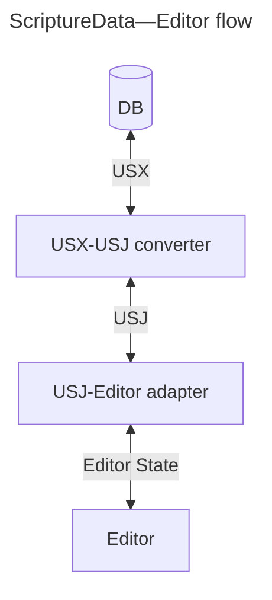

# ../README.md

````markdown
# Scripture Editor for Platform.Bible using USX3.0 <-> USJ

<div align="center">

[![Build Status][github-actions-status]][github-actions-url]
[![CodeQL][gitghub-codeql-status]][gitghub-codeql-url]
[![Github Tag][npm-version-image]][npm-version-url]

</div>

A Scripture editor React component that works on USJ Scripture data. A utility that converts USX to USJ is also included. It is expected that data conforms to [USX v3.0](https://ubsicap.github.io/usx/).


````

## Install

```sh
npm install @biblionexus-foundation/platform-editor
```

## Usage

**Note:** this is an [uncontrolled React component](https://react.dev/learn/sharing-state-between-components#controlled-and-uncontrolled-components).

```typescript
import { EditorOptions, immutableNoteCallerNodeName, Marginal, MarginalRef, usxStringToUsj, UsjNodeOptions } from '@biblionexus-foundation/platform-editor';
import { BookChapterControl } from 'platform-bible-react';

const emptyUsx = '<usx version="3.0" />';
const usx = `
<?xml version="1.0" encoding="utf-8"?>
<usx version="3.0">
  <book code="PSA" style="id">World English Bible (WEB)</book>
  <para style="mt1">The Psalms</para>
  <chapter number="1" style="c" sid="PSA 1" />
  <para style="q1">
    <verse number="1" style="v" sid="PSA 1:1" />Blessed is the man who doesn’t walk in the counsel of the wicked,</para>
  <para style="q2" vid="PSA 1:1">nor stand on the path of sinners,</para>
  <para style="q2" vid="PSA 1:1">nor sit in the seat of scoffers;<verse eid="PSA 1:1" /></para>
</usx>
`;
const defaultUsj = usxStringToUsj(emptyUsx);
const defaultScrRef = { /* PSA */ bookNum: 19, chapterNum: 1, verseNum: 1 };
const nodeOptions: UsjNodeOptions = { [immutableNoteCallerNodeName]: { onClick: () => console.log('Note was clicked!') } };
const options: EditorOptions = { isReadonly: false, textDirection: "ltr", nodes: nodeOptions };
// Word "man" inside first q1 of PSA 1:1.
const annotationRange1 = {
  start: { jsonPath: "$.content[3].content[1]", offset: 15 },
  end: { jsonPath: "$.content[3].content[1]", offset: 18 },
};
// Phrase "man who" inside first q1 of PSA 1:1.
const annotationRange2 = {
  start: { jsonPath: "$.content[3].content[1]", offset: 15 },
  end: { jsonPath: "$.content[3].content[1]", offset: 22 },
};
const cursorLocation = { start: { jsonPath: "$.content[3].content[1]", offset: 15 } };

export default function App() {
  const marginalRef = useRef<MarginalRef | null>(null);
  const [scrRef, setScrRef] = useState(defaultScrRef);

  const handleChange = useCallback((usj: Usj, comments: Comments | undefined) => console.log({ usj, comments }), []);

  // Simulate USJ updating after the editor is loaded.
  useEffect(() => {
    const timeoutId = setTimeout(() => {
      marginalRef.current?.setComments?.([]);
      marginalRef.current?.setUsj(usxStringToUsj(usx));
    }, 1000);
    return () => clearTimeout(timeoutId);
  }, []);

  // Add and remove annotations after USJ is loaded, and set cursor location.
  useEffect(() => {
    const timeoutId = setTimeout(() => {
      marginalRef.current?.addAnnotation(annotationRange1, "spelling", "annotationId");
      marginalRef.current?.addAnnotation(annotationRange2, "grammar", "abc123");
      marginalRef.current?.removeAnnotation("spelling", "annotationId");
      marginalRef.current?.setSelection(cursorLocation);
    }, 3000);
    return () => clearTimeout(timeoutId);
  }, []);

  return (
    <>
      <div className="controls">
        <BookChapterControl handleSubmit={setScrRef} scrRef={scrRef} />
      </div>
      <Marginal
        ref={marginalRef}
        defaultUsj={defaultUsj}
        scrRef={scrRef}
        setScrRef={setScrRef}
        options={options}
        onChange={handleChange}
        logger={console}
      />
    </>
  );
}
```

## Features

- USJ editor with USX support
- Read-only and edit mode
- History - undo & redo
- Format block type - change `<para>` markers. The current implementation is a proof-of-concept and doesn't have all the markers available yet.
- Add comments to selected text, reply in comment threads, delete comments and threads.
  - To enable comments use the `<Marginal>` editor component (comments appear in the margin).
  - To use the editor without comments use the `<Editorial>` component.
- Add and remove different types of annotations. Style the different annotations types with CSS, e.g. style a spelling annotation with a red squiggly underline.
- Set the cursor location or select a range.
- Specify `textDirection` as `"ltr"`, `"rtl"`, or `"auto"`.
- BCV linkage - change the book/chapter/verse externally and the cursor moves; move the cursor and it updates the external book/chapter/verse
- Nodes supported `<book>`, `<chapter>`, `<verse>`, `<para>`, `<char>`, `<note>`, `<ms>`
- Nodes not yet supported `<table>`, `<row>`, `<cell>`, `<sidebar>`, `<periph>`, `<figure>`, `<optbreak>`, `<ref>`
- Node options - callback for when a `<note>` link is clicked

## Demo and Collaborative Web Development Environment

Thanks to [CodeSandbox](https://codesandbox.io/) for the instant dev environment: https://codesandbox.io/p/github/BiblioNexus-Foundation/scripture-editors/main

This package is the third tab (`dev:platform:5175`).

## Develop in App

To develop an editor in a target application you can use [yalc](https://www.npmjs.com/package/yalc) to link the editor in without having to publish to NPM every time something changes.

1. In this monorepo, publish the editor to `yalc`, e.g.:
   ```bash
   nx devpub platform
   ```
2. In the target application repo, link from `yalc`:
   ```bash
   yalc link @biblionexus-foundation/platform-editor
   ```
3. In this monorepo, make changes and re-publish the editor (see step 2).
4. When you have finished developing in the target application repo, unlink from `yalc`:
   ```bash
   yalc remove @biblionexus-foundation/platform-editor && npm i
   ```

## License

[MIT][github-license] © [BiblioNexus Foundation](https://biblionexus.org/)

<!-- define variables used above -->

[github-actions-status]: https://github.com/BiblioNexus-Foundation/scripture-editors/actions/workflows/test-publish.yml/badge.svg
[github-actions-url]: https://github.com/BiblioNexus-Foundation/scripture-editors/actions
[gitghub-codeql-status]: https://github.com/BiblioNexus-Foundation/scripture-editors/actions/workflows/codeql.yml/badge.svg
[gitghub-codeql-url]: https://github.com/BiblioNexus-Foundation/scripture-editors/actions/workflows/codeql.yml
[npm-version-image]: https://img.shields.io/npm/v/@biblionexus-foundation/platform-editor
[npm-version-url]: https://github.com/BiblioNexus-Foundation/scripture-editors/releases
[github-license]: https://github.com/BiblioNexus-Foundation/scripture-editors/blob/main/packages/platform/LICENSE

````

# ../src\App.css

```css
@import "./usj-nodes";
@import "./editor/editor";

@import "https://fonts.googleapis.com/css?family=Reenie+Beanie";

body {
  font-family:
    system-ui,
    -apple-system,
    BlinkMacSystemFont,
    ".SFNSText-Regular",
    sans-serif;
  margin: 0;
  display: flex;
  place-items: center;
  min-width: 320px;
  min-height: 100vh;
  background: #eee;
}

.controls {
  display: flex;
  justify-content: space-between;
  margin-bottom: 20px;
}

.controls button {
  cursor: pointer;
  border: 0;
  border-radius: 10px;
  background-color: inherit;
}
.controls button:hover {
  background-color: #ddd;
}

.defined-options {
  display: flex;
  justify-content: space-between;
  margin-bottom: 20px;
}

div.checkbox {
  border: 0;
  display: flex;
  background: none;
  border-radius: 10px;
  padding: 8px;
  vertical-align: middle;
  flex-shrink: 0;
  align-items: center;
  justify-content: space-between;
}

input[type="checkbox"] {
  cursor: pointer;
}

.defined-options label {
  cursor: pointer;
  color: black;
  font-size: 13.3333px;
}

.defined-options .toolbar-item:hover:not([disabled]) {
  background-color: #ddd;
}

#root {
  max-width: 1280px;
  margin: 0 auto;
  padding: 2rem;
  text-align: center;

  font-size: 16px;
  line-height: 24px;
  font-weight: 400;

  color-scheme: light dark;
  color: rgba(255, 255, 255, 0.87);

  font-synthesis: none;
  text-rendering: optimizeLegibility;
  -webkit-font-smoothing: antialiased;
  -moz-osx-font-smoothing: grayscale;
  -webkit-text-size-adjust: 100%;
}

````

# ../src\App.tsx

```typescript
import { Usj, usxStringToUsj } from "@biblionexus-foundation/scripture-utilities";
import { BookChapterControl, ScriptureReference } from "platform-bible-react";
import { useCallback, useMemo, useRef, useState } from "react";
import { WEB_PSA_USX as usx } from "shared/data/WEB-PSA.usx";
// import { PSA_USX as usx } from "shared/data/psa.usfm.usx";
import { immutableNoteCallerNodeName } from "shared-react/nodes/scripture/usj/ImmutableNoteCallerNode";
import { UsjNodeOptions } from "shared-react/nodes/scripture/usj/usj-node-options.model";
import { TextDirection } from "shared-react/plugins/text-direction.model";
import { getViewOptions, DEFAULT_VIEW_MODE } from "./editor/adaptors/view-options.utils";
import { EditorOptions } from "./editor/Editor";
import { Comments } from "./marginal/comments/commenting";
import Marginal, { MarginalRef } from "./marginal/Marginal";
import TextDirectionDropDown from "./TextDirectionDropDown";
import ViewModeDropDown from "./ViewModeDropDown";

import "./App.css";

const defaultUsj = usxStringToUsj(usx);
const defaultScrRef: ScriptureReference = { /* PSA */ bookNum: 19, chapterNum: 1, verseNum: 1 };
const nodeOptions: UsjNodeOptions = { [immutableNoteCallerNodeName]: { onClick: () => undefined } };

function getOptions(
  definedOptions: boolean,
  hasSpellCheck: boolean,
  textDirection: TextDirection,
  viewMode: string | undefined,
): EditorOptions {
  return definedOptions
    ? { hasSpellCheck, textDirection, view: getViewOptions(viewMode), nodes: nodeOptions }
    : {};
}

export default function App() {
  const marginalRef = useRef<MarginalRef | null>(null);
  const [definedOptions, setDefinedOptions] = useState(true);
  const [hasSpellCheck, setHasSpellCheck] = useState(false);
  const [textDirection, setTextDirection] = useState<TextDirection>("ltr");
  const [viewMode, setViewMode] = useState(DEFAULT_VIEW_MODE);
  const [scrRef, setScrRef] = useState(defaultScrRef);

  const options = useMemo<EditorOptions>(
    () => getOptions(definedOptions, hasSpellCheck, textDirection, viewMode),
    [definedOptions, hasSpellCheck, textDirection, viewMode],
  );

  const handleChange = useCallback((usj: Usj, comments: Comments | undefined) => {
    console.log({ usj, comments });
    marginalRef.current?.setUsj(usj);
  }, []);

  const toggleDefineOptions = useCallback(() => setDefinedOptions((value) => !value), []);

  return (
    <>
      <div className="controls">
        <BookChapterControl scrRef={scrRef} handleSubmit={setScrRef} />
        <button onClick={toggleDefineOptions}>
          {definedOptions ? "Undefine" : "Define"} Options
        </button>
      </div>
      {definedOptions && (
        <div className="defined-options">
          <div className="checkbox">
            <input
              type="checkbox"
              id="hasSpellCheckBox"
              checked={hasSpellCheck}
              onChange={(e) => setHasSpellCheck(e.target.checked)}
            />
            <label htmlFor="hasSpellCheckBox">Has Spell Check</label>
          </div>
          <TextDirectionDropDown textDirection={textDirection} handleSelect={setTextDirection} />
          <ViewModeDropDown viewMode={viewMode} handleSelect={setViewMode} />
        </div>
      )}
      <Marginal
        ref={marginalRef}
        defaultUsj={defaultUsj}
        scrRef={scrRef}
        setScrRef={setScrRef}
        options={options}
        onChange={handleChange}
        logger={console}
      />
    </>
  );
}

```

# ../src\Editorial.tsx

```typescript
import React, { JSX, PropsWithChildren, forwardRef } from "react";
import { LoggerBasic } from "shared-react/plugins/logger-basic.model";
import Editor, { EditorRef, EditorProps } from "./editor/Editor";

/**
 * Scripture Editor for USJ. Created for use in Platform.Bible.
 * @see https://github.com/usfm-bible/tcdocs/blob/usj/grammar/usj.js
 *
 * @param props.ref - Forward reference for the editor.
 * @param props.defaultUsj - Default USJ Scripture data.
 * @param props.scrRef - Scripture reference that controls the cursor in the Scripture.
 * @param props.setScrRef - Scripture reference set callback function when the reference changes in
 *   the editor as the cursor moves.
 * @param props.options - Options to configure the editor.
 * @param props.onChange - Callback function when USJ Scripture data has changed.
 * @param props.logger - Logger instance.
 * @returns the editor element.
 */
const Editorial = forwardRef(function Editorial<TLogger extends LoggerBasic>(
  props: EditorProps<TLogger>,
  ref: React.ForwardedRef<EditorRef | null>,
): JSX.Element {
  const { children, ...propsWithoutChildren } = props as PropsWithChildren<EditorProps<TLogger>>;
  return <Editor ref={ref} {...propsWithoutChildren} />;
});

export default Editorial;

```

# ../src\index.ts

```typescript
export { default as Editorial } from "./Editorial";
export { default as Marginal, type MarginalRef } from "./marginal/Marginal";
export { immutableNoteCallerNodeName } from "shared-react/nodes/scripture/usj/ImmutableNoteCallerNode";
export { type UsjNodeOptions } from "shared-react/nodes/scripture/usj/usj-node-options.model";
export {
  type ViewOptions,
  DEFAULT_VIEW_MODE,
  getViewOptions,
  viewOptionsToMode,
} from "./editor/adaptors/view-options.utils";
export { type EditorOptions, type EditorRef } from "./editor/Editor";
export { type ViewMode } from "./editor/adaptors/view-mode.model";
export { type Comments } from "./marginal/comments/commenting";
```

# ../src\main.tsx

```typescript
import React from "react";
import ReactDOM from "react-dom/client";
import App from "./App";

const container = document.getElementById("root");
if (!container) {
  throw new Error("Document root element not found!");
}

ReactDOM.createRoot(container).render(
  <React.StrictMode>
    <App />
  </React.StrictMode>,
);

```

# ../src\TextDirectionDropDown.tsx

```typescript
import { JSX } from "react";
import { directionToNames, type TextDirection } from "shared-react/plugins/text-direction.model";
import DropDown, { DropDownItem } from "./editor/toolbar/DropDown";

function directionLabel(textDirection: TextDirection): string {
  return textDirection in directionToNames ? directionToNames[textDirection] : "select...";
}

function dropDownActiveClass(active: boolean): string {
  return active ? "active dropdown-item-active" : "";
}

export default function TextDirectionDropDown({
  textDirection,
  handleSelect,
  disabled = false,
}: {
  textDirection: TextDirection;
  handleSelect: (textDirection: TextDirection) => void;
  disabled?: boolean;
}): JSX.Element {
  return (
    <DropDown
      disabled={disabled}
      buttonClassName="toolbar-item"
      buttonIconClassName={"icon view-mode " + textDirection}
      buttonLabel={directionLabel(textDirection)}
      buttonAriaLabel="Selection options for text direction"
    >
      {Object.keys(directionToNames).map((item) => (
        <DropDownItem
          key={item}
          className={"item view-mode " + dropDownActiveClass(textDirection === item)}
          onClick={() => handleSelect(item as TextDirection)}
        >
          <i className={"icon view-mode " + item} />
          {directionToNames[item as TextDirection]}
        </DropDownItem>
      ))}
    </DropDown>
  );
}

```

# ../src\usj-nodes.css

```css
/* Sample styles for USJ Nodes */

.leadingFloat {
  float: start;
}
.clearFloat {
  clear: both;
}
.align_start {
  text-align: start;
}
.align_center {
  text-align: center;
}
.align_end {
  text-align: end;
}
@font-face {
  font-family: "Charis SIL";
  src: local("Charis SIL"), local("Charis SIL Bold"), local("Charis SIL Bold Italic"),
    local("Charis SIL Italic"), url("file:///C:/Windows/Fonts/CharisSIL-B.ttf");
  font-weight: normal;
}
@font-face {
  font-family: "Charis SIL";
  src: local("Charis SIL Bold");
  font-weight: bold;
}
@font-face {
  font-family: "Charis SIL";
  src: local("Charis SIL Italic");
  font-style: italic;
}
@font-face {
  font-family: "Charis SIL";
  src: local("Charis SIL Bold Italic");
  font-weight: bold;
  font-style: italic;
}
.formatted-font .usfm {
  font-family: "Charis SIL";
  font-size: 12pt;
}

/* BookNode */

.formatted-font .usfm_id {
  font-size: 100%;
}

.book[data-code]::before {
  content: attr(data-code) " ";
}

/* ChapterNode, ImmutableChapterNode */

.formatted-font .usfm_c {
  font-weight: bold;
  font-size: 150%;
}
.text-spacing .usfm_c {
  margin-bottom: 4pt;
  margin-top: 8pt;
}

.formatted-font .usfm_ca {
  color: #007306;
  font-size: 133%;
  font-style: italic;
}

.formatted-font .usfm_cp {
  font-weight: bold;
  color: #003380;
  font-size: 150%;
}
.text-spacing .usfm_cp {
  margin-bottom: 4pt;
  margin-top: 8pt;
}

/* VerseNode, ImmutableVerseNode */

.formatted-font .usfm_v {
  font-size: 100%;
  vertical-align: text-top;
  font-size: 66%;
}
.text-spacing .usfm_v {
  white-space: nowrap;
  unicode-bidi: embed;
}

.formatted-font .usfm_va {
  color: #007306;
  font-size: 100%;
  vertical-align: text-top;
  font-size: 66%;
}

.formatted-font .usfm_vp {
  color: #003380;
  font-size: 100%;
  vertical-align: text-top;
  font-size: 66%;
}

/* ParaNode */

.formatted-font .usfm_usfm {
  font-size: 100%;
}

.formatted-font .usfm_ide {
  font-size: 100%;
}

.formatted-font .usfm_h {
  font-size: 100%;
}

/* check if deprecated */
.formatted-font .usfm_h1 {
  font-size: 100%;
}

/* check if deprecated */
.formatted-font .usfm_h2 {
  font-size: 100%;
}

/* check if deprecated */
.formatted-font .usfm_h3 {
  font-size: 100%;
}

.formatted-font .usfm_toc1 {
  font-weight: bold;
  color: #004c00;
  font-size: 100%;
  font-style: italic;
}

.formatted-font .usfm_toc2 {
  color: #004c00;
  font-size: 100%;
  font-style: italic;
}

.formatted-font .usfm_toc3 {
  font-weight: bold;
  color: #e05858;
  font-size: 100%;
  font-style: italic;
}

.formatted-font .usfm_toca1 {
  color: #8c8c8c;
  font-size: 83%;
  font-style: italic;
}

.formatted-font .usfm_toca2 {
  color: #8c8c8c;
  font-size: 83%;
  font-style: italic;
}

.formatted-font .usfm_toca3 {
  color: #8c8c8c;
  font-size: 83%;
  font-style: italic;
}

.formatted-font .usfm_rem {
  color: #003380;
  font-size: 100%;
}

.formatted-font .usfm_sts {
  color: #003380;
  font-size: 100%;
}

/* check if deprecated */
.formatted-font .usfm_restore {
  color: #003380;
  font-size: 100%;
}

.formatted-font .usfm_imt {
  font-weight: bold;
  font-size: 116%;
}
.text-spacing .usfm_imt {
  text-align: center;
  margin-bottom: 4pt;
  margin-top: 8pt;
}

.formatted-font .usfm_imt1 {
  font-weight: bold;
  font-size: 116%;
}
.text-spacing .usfm_imt1 {
  text-align: center;
  margin-bottom: 4pt;
  margin-top: 8pt;
}

.formatted-font .usfm_imt2 {
  font-size: 108%;
  font-style: italic;
}
.text-spacing .usfm_imt2 {
  text-align: center;
  margin-bottom: 3pt;
  margin-top: 6pt;
}

.formatted-font .usfm_imt3 {
  font-weight: bold;
  font-size: 100%;
}
.text-spacing .usfm_imt3 {
  text-align: center;
  margin-bottom: 2pt;
  margin-top: 2pt;
}

.formatted-font .usfm_imt4 {
  font-size: 100%;
  font-style: italic;
}
.text-spacing .usfm_imt4 {
  text-align: center;
  margin-bottom: 2pt;
  margin-top: 2pt;
}

.formatted-font .usfm_imte {
  font-weight: bold;
  font-size: 166%;
}
.text-spacing .usfm_imte {
  text-align: center;
  margin-bottom: 4pt;
  margin-top: 8pt;
}

/* check if deprecated */
.formatted-font .usfm_imte1 {
  font-weight: bold;
  font-size: 166%;
}
.text-spacing .usfm_imte1 {
  text-align: center;
  margin-bottom: 4pt;
  margin-top: 8pt;
}

/* check if deprecated */
.formatted-font .usfm_imte2 {
  font-size: 133%;
  font-style: italic;
}
.text-spacing .usfm_imte2 {
  text-align: center;
  margin-bottom: 2pt;
}

.formatted-font .usfm_is {
  font-weight: bold;
  font-size: 116%;
}
.text-spacing .usfm_is {
  text-align: center;
  margin-bottom: 4pt;
  margin-top: 8pt;
}

.formatted-font .usfm_is1 {
  font-weight: bold;
  font-size: 116%;
}
.text-spacing .usfm_is1 {
  text-align: center;
  margin-bottom: 4pt;
  margin-top: 8pt;
}

.formatted-font .usfm_is2 {
  font-weight: bold;
  font-size: 100%;
}
.text-spacing .usfm_is2 {
  text-align: center;
  margin-bottom: 4pt;
  margin-top: 8pt;
}

.formatted-font .usfm_iot {
  font-weight: bold;
  font-size: 100%;
}
.text-spacing .usfm_iot {
  text-align: center;
  margin-bottom: 4pt;
  margin-top: 8pt;
}

.formatted-font .usfm_io {
  font-size: 100%;
}
.text-spacing[dir="ltr"] .usfm_io {
  margin-left: 10vw;
}
.text-spacing[dir="rtl"] .usfm_io {
  margin-right: 10vw;
}

.formatted-font .usfm_io1 {
  font-size: 100%;
}
.text-spacing[dir="ltr"] .usfm_io1 {
  margin-left: 10vw;
}
.text-spacing[dir="rtl"] .usfm_io1 {
  margin-right: 10vw;
}

.formatted-font .usfm_io2 {
  font-size: 100%;
}
.text-spacing[dir="ltr"] .usfm_io2 {
  margin-left: 15vw;
}
.text-spacing[dir="rtl"] .usfm_io2 {
  margin-right: 15vw;
}

.formatted-font .usfm_io3 {
  font-size: 100%;
}
.text-spacing[dir="ltr"] .usfm_io3 {
  margin-left: 20vw;
}
.text-spacing[dir="rtl"] .usfm_io3 {
  margin-right: 20vw;
}

.formatted-font .usfm_io4 {
  font-size: 100%;
}
.text-spacing[dir="ltr"] .usfm_io4 {
  margin-left: 25vw;
}
.text-spacing[dir="rtl"] .usfm_io4 {
  margin-right: 25vw;
}

.formatted-font .usfm_ior {
  font-size: 100%;
}

.formatted-font .usfm_ip {
  font-size: 100%;
}
.text-spacing .usfm_ip {
  text-indent: 2.5vw;
}

/* check if deprecated */
.formatted-font .usfm_im {
  font-size: 100%;
}

.formatted-font .usfm_ipi {
  font-size: 100%;
}
.text-spacing .usfm_ipi {
  text-indent: 2.5vw;
  margin-left: 5vw;
  margin-right: 5vw;
}

/* check if deprecated */
.formatted-font .usfm_imi {
  font-size: 100%;
}
.text-spacing .usfm_imi {
  margin-left: 5vw;
  margin-right: 5vw;
}

.formatted-font .usfm_ili {
  font-size: 100%;
}
.text-spacing .usfm_ili {
  text-indent: -7.5vw;
}
.text-spacing[dir="ltr"] .usfm_ili {
  margin-left: 10vw;
}
.text-spacing[dir="rtl"] .usfm_ili {
  margin-right: 10vw;
}

.formatted-font .usfm_ili1 {
  font-size: 100%;
}
.text-spacing .usfm_ili1 {
  text-indent: -7.5vw;
}
.text-spacing[dir="ltr"] .usfm_ili1 {
  margin-left: 10vw;
}
.text-spacing[dir="rtl"] .usfm_ili1 {
  margin-right: 10vw;
}

.formatted-font .usfm_ili2 {
  font-size: 100%;
}
.text-spacing .usfm_ili2 {
  text-indent: -7.5vw;
}
.text-spacing[dir="ltr"] .usfm_ili2 {
  margin-left: 15vw;
}
.text-spacing[dir="rtl"] .usfm_ili2 {
  margin-right: 15vw;
}

.formatted-font .usfm_ipq {
  font-size: 100%;
  font-style: italic;
}
.text-spacing .usfm_ipq {
  text-indent: 2.5vw;
  margin-left: 5vw;
  margin-right: 5vw;
}

.formatted-font .usfm_imq {
  font-size: 100%;
  font-style: italic;
}
.text-spacing .usfm_imq {
  margin-left: 5vw;
  margin-right: 5vw;
}

.usfm_ipr {
  text-align: end;
}
.formatted-font .usfm_ipr {
  font-size: 100%;
  font-style: italic;
}
.text-spacing .usfm_ipr {
  margin-left: 5vw;
  margin-right: 5vw;
}

.formatted-font .usfm_ib {
  font-size: 83%;
}

/* check if deprecated */
.formatted-font .usfm_iq {
  font-size: 100%;
  font-style: italic;
}
.text-spacing .usfm_iq {
  text-indent: -15vw;
}
.text-spacing[dir="ltr"] .usfm_iq {
  margin-left: 20vw;
}
.text-spacing[dir="rtl"] .usfm_iq {
  margin-right: 20vw;
}

/* check if deprecated */
.formatted-font .usfm_iq1 {
  font-size: 100%;
  font-style: italic;
}
.text-spacing .usfm_iq1 {
  text-indent: -15vw;
}
.text-spacing[dir="ltr"] .usfm_iq1 {
  margin-left: 20vw;
}
.text-spacing[dir="rtl"] .usfm_iq1 {
  margin-right: 20vw;
}

/* check if deprecated */
.formatted-font .usfm_iq2 {
  font-size: 100%;
  font-style: italic;
}
.text-spacing .usfm_iq2 {
  text-indent: -10vw;
}
.text-spacing[dir="ltr"] .usfm_iq2 {
  margin-left: 20vw;
}
.text-spacing[dir="rtl"] .usfm_iq2 {
  margin-right: 20vw;
}

/* check if deprecated */
.formatted-font .usfm_iq3 {
  font-size: 100%;
  font-style: italic;
}
.text-spacing .usfm_iq3 {
  text-indent: -5vw;
}
.text-spacing[dir="ltr"] .usfm_iq3 {
  margin-left: 20vw;
}
.text-spacing[dir="rtl"] .usfm_iq3 {
  margin-right: 20vw;
}

.formatted-font .usfm_iex {
  font-size: 100%;
}
.text-spacing .usfm_iex {
  text-indent: 2.5vw;
  margin-bottom: 4pt;
  margin-top: 4pt;
}

/* check if deprecated */
.formatted-font .usfm_iqt {
  font-size: 100%;
  font-style: italic;
}

.formatted-font .usfm_ie {
  font-size: 83%;
}

.formatted-font .usfm_cl {
  font-weight: bold;
  font-size: 150%;
}
.text-spacing .usfm_cl {
  text-align: center;
  margin-bottom: 4pt;
  margin-top: 8pt;
}

.formatted-font .usfm_cd {
  font-size: 91%;
}
.text-spacing .usfm_cd {
  margin-bottom: 4pt;
  margin-top: 8pt;
}

.formatted-font .usfm_p {
  font-size: 100%;
}
.text-spacing .usfm_p {
  text-indent: 2.5vw;
}

.formatted-font .usfm_m {
  font-size: 100%;
}

.formatted-font .usfm_po {
  font-size: 100%;
}
.text-spacing .usfm_po {
  text-indent: 2.5vw;
  margin-bottom: 4pt;
  margin-top: 4pt;
}

.usfm_pr {
  text-align: end;
}
.formatted-font .usfm_pr {
  font-size: 100%;
}

.usfm_cls {
  text-align: end;
}
.formatted-font .usfm_cls {
  font-size: 100%;
}

.formatted-font .usfm_pmo {
  font-size: 100%;
}
.text-spacing .usfm_pmo {
  margin-left: 5vw;
  margin-right: 5vw;
}

.formatted-font .usfm_pm {
  font-size: 100%;
}
.text-spacing .usfm_pm {
  text-indent: 2.5vw;
  margin-left: 5vw;
  margin-right: 5vw;
}

.formatted-font .usfm_pmc {
  font-size: 100%;
}
.text-spacing .usfm_pmc {
  margin-left: 5vw;
  margin-right: 5vw;
}

.usfm_pmr {
  text-align: end;
}
.formatted-font .usfm_pmr {
  font-size: 100%;
}
.text-spacing .usfm_pmr {
  margin-left: 5vw;
  margin-right: 5vw;
}

.formatted-font .usfm_pi {
  font-size: 100%;
}
.text-spacing .usfm_pi {
  text-indent: 2.5vw;
  margin-left: 5vw;
  margin-right: 5vw;
}

.formatted-font .usfm_pi1 {
  font-size: 100%;
}
.text-spacing .usfm_pi1 {
  text-indent: 2.5vw;
  margin-left: 5vw;
  margin-right: 5vw;
}

.formatted-font .usfm_pi2 {
  font-size: 100%;
}
.text-spacing .usfm_pi2 {
  text-indent: 2.5vw;
}
.text-spacing[dir="ltr"] .usfm_pi2 {
  margin-left: 10vw;
  margin-right: 5vw;
}
.text-spacing[dir="rtl"] .usfm_pi2 {
  margin-left: 5vw;
  margin-right: 10vw;
}

.formatted-font .usfm_pi3 {
  font-size: 100%;
}
.text-spacing .usfm_pi3 {
  text-indent: 2.5vw;
}
.text-spacing[dir="ltr"] .usfm_pi3 {
  margin-left: 15vw;
  margin-right: 5vw;
}
.text-spacing[dir="rtl"] .usfm_pi3 {
  margin-left: 5vw;
  margin-right: 15vw;
}

.formatted-font .usfm_pc {
  font-size: 100%;
}
.text-spacing .usfm_pc {
  text-align: center;
}

.formatted-font .usfm_mi {
  font-size: 100%;
}
.text-spacing .usfm_mi {
  margin-left: 5vw;
  margin-right: 5vw;
}

/* check if deprecated */
.formatted-font .usfm_nb {
  font-size: 100%;
}

.formatted-font .usfm_q {
  font-size: 100%;
}
.text-spacing .usfm_q {
  text-indent: -10vw;
}
.text-spacing[dir="ltr"] .usfm_q {
  margin-left: 15vw;
}
.text-spacing[dir="rtl"] .usfm_q {
  margin-right: 15vw;
}

.formatted-font .usfm_q1 {
  font-size: 100%;
}
.text-spacing .usfm_q1 {
  text-indent: -10vw;
}
.text-spacing[dir="ltr"] .usfm_q1 {
  margin-left: 15vw;
}
.text-spacing[dir="rtl"] .usfm_q1 {
  margin-right: 15vw;
}

.formatted-font .usfm_q2 {
  font-size: 100%;
}
.text-spacing .usfm_q2 {
  text-indent: -7.5vw;
}
.text-spacing[dir="ltr"] .usfm_q2 {
  margin-left: 15vw;
}
.text-spacing[dir="rtl"] .usfm_q2 {
  margin-right: 15vw;
}

.formatted-font .usfm_q3 {
  font-size: 100%;
}
.text-spacing .usfm_q3 {
  text-indent: -5vw;
}
.text-spacing[dir="ltr"] .usfm_q3 {
  margin-left: 15vw;
}
.text-spacing[dir="rtl"] .usfm_q3 {
  margin-right: 15vw;
}

.formatted-font .usfm_q4 {
  font-size: 100%;
}
.text-spacing .usfm_q4 {
  text-indent: -2.5vw;
}
.text-spacing[dir="ltr"] .usfm_q4 {
  margin-left: 15vw;
}
.text-spacing[dir="rtl"] .usfm_q4 {
  margin-right: 15vw;
}

.formatted-font .usfm_qc {
  font-size: 100%;
}
.text-spacing .usfm_qc {
  text-align: center;
}

.usfm_qr {
  text-align: end;
}
.formatted-font .usfm_qr {
  font-size: 100%;
}

.formatted-font .usfm_qa {
  font-size: 100%;
  font-style: italic;
}

.formatted-font .usfm_qm {
  font-size: 100%;
}
.text-spacing .usfm_qm {
  text-indent: -15vw;
}
.text-spacing[dir="ltr"] .usfm_qm {
  margin-left: 20vw;
}
.text-spacing[dir="rtl"] .usfm_qm {
  margin-right: 20vw;
}

.formatted-font .usfm_qm1 {
  font-size: 100%;
}
.text-spacing .usfm_qm1 {
  text-indent: -15vw;
}
.text-spacing[dir="ltr"] .usfm_qm1 {
  margin-left: 20vw;
}
.text-spacing[dir="rtl"] .usfm_qm1 {
  margin-right: 20vw;
}

.formatted-font .usfm_qm2 {
  font-size: 100%;
}
.text-spacing .usfm_qm2 {
  text-indent: -10vw;
}
.text-spacing[dir="ltr"] .usfm_qm2 {
  margin-left: 20vw;
}
.text-spacing[dir="rtl"] .usfm_qm2 {
  margin-right: 20vw;
}

.formatted-font .usfm_qm3 {
  font-size: 100%;
}
.text-spacing .usfm_qm3 {
  text-indent: -5vw;
}
.text-spacing[dir="ltr"] .usfm_qm3 {
  margin-left: 20vw;
}
.text-spacing[dir="rtl"] .usfm_qm3 {
  margin-right: 20vw;
}

.formatted-font .usfm_qd {
  font-size: 100%;
  font-style: italic;
}
.text-spacing[dir="ltr"] .usfm_qd {
  margin-left: 5vw;
}
.text-spacing[dir="rtl"] .usfm_qd {
  margin-right: 5vw;
}

.formatted-font .usfm_b {
  font-size: 83%;
}

.formatted-font .usfm_mt {
  font-weight: bold;
  font-size: 166%;
}
.text-spacing .usfm_mt {
  text-align: center;
  margin-bottom: 4pt;
  margin-top: 8pt;
}

.formatted-font .usfm_mt1 {
  font-weight: bold;
  font-size: 166%;
}
.text-spacing .usfm_mt1 {
  text-align: center;
  margin-bottom: 4pt;
  margin-top: 2pt;
}

.formatted-font .usfm_mt2 {
  font-size: 133%;
  font-style: italic;
}
.text-spacing .usfm_mt2 {
  text-align: center;
  margin-bottom: 2pt;
}

.formatted-font .usfm_mt3 {
  font-weight: bold;
  font-size: 133%;
}
.text-spacing .usfm_mt3 {
  text-align: center;
  margin-bottom: 2pt;
  margin-top: 2pt;
}

.formatted-font .usfm_mt4 {
  font-size: 100%;
}
.text-spacing .usfm_mt4 {
  text-align: center;
  margin-bottom: 2pt;
  margin-top: 2pt;
}

.formatted-font .usfm_mte {
  font-weight: bold;
  font-size: 166%;
}
.text-spacing .usfm_mte {
  text-align: center;
  margin-bottom: 4pt;
  margin-top: 8pt;
}

.formatted-font .usfm_mte1 {
  font-weight: bold;
  font-size: 166%;
}
.text-spacing .usfm_mte1 {
  text-align: center;
  margin-bottom: 4pt;
  margin-top: 8pt;
}

.formatted-font .usfm_mte2 {
  font-size: 133%;
  font-style: italic;
}
.text-spacing .usfm_mte2 {
  text-align: center;
  margin-bottom: 2pt;
}

.formatted-font .usfm_ms {
  font-weight: bold;
  font-size: 116%;
}
.text-spacing .usfm_ms {
  text-align: center;
  margin-bottom: 4pt;
  margin-top: 16pt;
}

.formatted-font .usfm_ms1 {
  font-weight: bold;
  font-size: 116%;
}
.text-spacing .usfm_ms1 {
  text-align: center;
  margin-bottom: 4pt;
  margin-top: 16pt;
}

.formatted-font .usfm_ms2 {
  font-weight: bold;
  font-size: 116%;
}
.text-spacing .usfm_ms2 {
  text-align: center;
  margin-bottom: 4pt;
  margin-top: 16pt;
}

.formatted-font .usfm_ms3 {
  font-size: 116%;
  font-style: italic;
}
.text-spacing .usfm_ms3 {
  text-align: center;
  margin-bottom: 4pt;
  margin-top: 16pt;
}

.formatted-font .usfm_mr {
  font-size: 100%;
  font-style: italic;
}
.text-spacing .usfm_mr {
  text-align: center;
  margin-bottom: 4pt;
}

.formatted-font .usfm_s {
  font-weight: bold;
  font-size: 100%;
}
.text-spacing .usfm_s {
  text-align: center;
  margin-bottom: 4pt;
  margin-top: 8pt;
}

.formatted-font .usfm_s1 {
  font-weight: bold;
  font-size: 100%;
}
.text-spacing .usfm_s1 {
  text-align: center;
  margin-bottom: 4pt;
  margin-top: 8pt;
}

.formatted-font .usfm_s2 {
  font-size: 100%;
  font-style: italic;
}
.text-spacing .usfm_s2 {
  text-align: center;
  margin-bottom: 4pt;
  margin-top: 8pt;
}

.formatted-font .usfm_s3 {
  font-size: 100%;
  font-style: italic;
}
.text-spacing .usfm_s3 {
  margin-bottom: 3pt;
  margin-top: 6pt;
}

.formatted-font .usfm_s4 {
  font-size: 100%;
  font-style: italic;
}
.text-spacing .usfm_s4 {
  margin-bottom: 3pt;
  margin-top: 6pt;
}

.formatted-font .usfm_sr {
  font-weight: bold;
  font-size: 100%;
}
.text-spacing .usfm_sr {
  text-align: center;
  margin-bottom: 4pt;
}

.formatted-font .usfm_r {
  font-size: 100%;
  font-style: italic;
}
.text-spacing .usfm_r {
  text-align: center;
  margin-bottom: 4pt;
}

.formatted-font .usfm_sp {
  font-size: 100%;
  font-style: italic;
}
.text-spacing .usfm_sp {
  margin-bottom: 4pt;
  margin-top: 8pt;
}

.formatted-font .usfm_d {
  font-size: 100%;
  font-style: italic;
}
.text-spacing .usfm_d {
  text-align: center;
  margin-bottom: 4pt;
  margin-top: 4pt;
}

.text-spacing .usfm_sd {
  margin-bottom: 24pt;
  margin-top: 24pt;
}

.text-spacing .usfm_sd1 {
  margin-bottom: 24pt;
  margin-top: 24pt;
}

.text-spacing .usfm_sd2 {
  margin-bottom: 18pt;
  margin-top: 18pt;
}

.text-spacing .usfm_sd3 {
  margin-bottom: 12pt;
  margin-top: 12pt;
}

.text-spacing .usfm_sd4 {
  margin-bottom: 8pt;
  margin-top: 8pt;
}

.formatted-font .usfm_lh {
  font-size: 100%;
}
.text-spacing .usfm_lh {
  text-indent: 2.5vw;
}

.formatted-font .usfm_li {
  font-size: 100%;
}
.text-spacing .usfm_li {
  text-indent: -7.5vw;
}
.text-spacing[dir="ltr"] .usfm_li {
  margin-left: 10vw;
}
.text-spacing[dir="rtl"] .usfm_li {
  margin-right: 10vw;
}

.formatted-font .usfm_li1 {
  font-size: 100%;
}
.text-spacing .usfm_li1 {
  text-indent: -7.5vw;
}
.text-spacing[dir="ltr"] .usfm_li1 {
  margin-left: 10vw;
}
.text-spacing[dir="rtl"] .usfm_li1 {
  margin-right: 10vw;
}

.formatted-font .usfm_li2 {
  font-size: 100%;
}
.text-spacing .usfm_li2 {
  text-indent: -7.5vw;
}
.text-spacing[dir="ltr"] .usfm_li2 {
  margin-left: 15vw;
}
.text-spacing[dir="rtl"] .usfm_li2 {
  margin-right: 15vw;
}

.formatted-font .usfm_li3 {
  font-size: 100%;
}
.text-spacing .usfm_li3 {
  text-indent: -7.5vw;
}
.text-spacing[dir="ltr"] .usfm_li3 {
  margin-left: 20vw;
}
.text-spacing[dir="rtl"] .usfm_li3 {
  margin-right: 20vw;
}

.formatted-font .usfm_li4 {
  font-size: 100%;
}
.text-spacing .usfm_li4 {
  text-indent: -7.5vw;
}
.text-spacing[dir="ltr"] .usfm_li4 {
  margin-left: 25vw;
}
.text-spacing[dir="rtl"] .usfm_li4 {
  margin-right: 25vw;
}

.formatted-font .usfm_lf {
  font-size: 100%;
}

.formatted-font .usfm_lim {
  font-size: 100%;
}
.text-spacing .usfm_lim {
  text-indent: -7.5vw;
}
.text-spacing[dir="ltr"] .usfm_lim {
  margin-left: 15vw;
  margin-right: 5vw;
}
.text-spacing[dir="rtl"] .usfm_lim {
  margin-left: 5vw;
  margin-right: 15vw;
}

.formatted-font .usfm_lim1 {
  font-size: 100%;
}
.text-spacing .usfm_lim1 {
  text-indent: -7.5vw;
}
.text-spacing[dir="ltr"] .usfm_lim1 {
  margin-left: 15vw;
  margin-right: 5vw;
}
.text-spacing[dir="rtl"] .usfm_lim1 {
  margin-left: 5vw;
  margin-right: 15vw;
}

.formatted-font .usfm_lim2 {
  font-size: 100%;
}
.text-spacing .usfm_lim2 {
  text-indent: -7.5vw;
}
.text-spacing[dir="ltr"] .usfm_lim2 {
  margin-left: 20vw;
}
.text-spacing[dir="rtl"] .usfm_lim2 {
  margin-right: 20vw;
}

.formatted-font .usfm_lim3 {
  font-size: 100%;
}
.text-spacing .usfm_lim3 {
  text-indent: -7.5vw;
}
.text-spacing[dir="ltr"] .usfm_lim3 {
  margin-left: 25vw;
}
.text-spacing[dir="rtl"] .usfm_lim3 {
  margin-right: 25vw;
}

.formatted-font .usfm_lim4 {
  font-size: 100%;
}
.text-spacing .usfm_lim4 {
  text-indent: -7.5vw;
}
.text-spacing[dir="ltr"] .usfm_lim4 {
  margin-left: 30vw;
}
.text-spacing[dir="rtl"] .usfm_lim4 {
  margin-right: 30vw;
}

.usfm_lit {
  text-align: end;
}
.formatted-font .usfm_lit {
  font-weight: bold;
  font-size: 100%;
}

.formatted-font .usfm_ph {
  font-size: 100%;
}
.text-spacing .usfm_ph {
  text-indent: -5vw;
}
.text-spacing[dir="ltr"] .usfm_ph {
  margin-left: 10vw;
}
.text-spacing[dir="rtl"] .usfm_ph {
  margin-right: 10vw;
}

.formatted-font .usfm_ph1 {
  font-size: 100%;
}
.text-spacing .usfm_ph1 {
  text-indent: -5vw;
}
.text-spacing[dir="ltr"] .usfm_ph1 {
  margin-left: 10vw;
}
.text-spacing[dir="rtl"] .usfm_ph1 {
  margin-right: 10vw;
}

.formatted-font .usfm_ph2 {
  font-size: 100%;
}
.text-spacing .usfm_ph2 {
  text-indent: -5vw;
}
.text-spacing[dir="ltr"] .usfm_ph2 {
  margin-left: 15vw;
}
.text-spacing[dir="rtl"] .usfm_ph2 {
  margin-right: 15vw;
}

.formatted-font .usfm_ph3 {
  font-size: 100%;
}
.text-spacing .usfm_ph3 {
  text-indent: -5vw;
}
.text-spacing[dir="ltr"] .usfm_ph3 {
  margin-left: 20vw;
}
.text-spacing[dir="rtl"] .usfm_ph3 {
  margin-right: 20vw;
}

/* CharNode */

.formatted-font .usfm_qs {
  font-size: 100%;
  font-style: italic;
}

.formatted-font .usfm_qac {
  font-size: 100%;
  font-style: italic;
}

.formatted-font .usfm_litl {
  font-size: 100%;
  font-style: italic;
}

.formatted-font .usfm_lik {
  font-size: 100%;
  font-style: italic;
}

.formatted-font .usfm_liv {
  font-size: 100%;
}

.formatted-font .usfm_liv1 {
  font-size: 100%;
}

.formatted-font .usfm_liv2 {
  font-size: 100%;
}

.formatted-font .usfm_liv3 {
  font-size: 100%;
}

.formatted-font .usfm_liv4 {
  font-size: 100%;
}

.formatted-font .usfm_liv5 {
  font-size: 100%;
}

.formatted-font .usfm_rq {
  font-size: 83%;
  font-style: italic;
}

.formatted-font .usfm_qt {
  font-weight: bold;
  font-size: 100%;
}

.formatted-font .usfm_nd {
  font-size: 100%;
  text-decoration: underline;
}

.formatted-font .usfm_tl {
  font-size: 100%;
  font-style: italic;
}

.formatted-font .usfm_dc {
  font-style: italic;
}

.formatted-font .usfm_bk {
  font-size: 100%;
  font-style: italic;
}

.formatted-font .usfm_sig {
  font-size: 100%;
  font-style: italic;
}

.formatted-font .usfm_pn {
  font-weight: bold;
  font-size: 100%;
  text-decoration: underline;
}

.formatted-font .usfm_png {
  font-size: 100%;
  text-decoration: underline;
}

/* check if deprecated */
.formatted-font .usfm_addpn {
  font-weight: bold;
  font-size: 100%;
  font-style: italic;
  text-decoration: underline;
}

.formatted-font .usfm_wj {
  color: #d43128;
  font-size: 100%;
}

.formatted-font .usfm_k {
  font-weight: bold;
  font-size: 100%;
  font-style: italic;
}

.formatted-font .usfm_sls {
  font-size: 100%;
  font-style: italic;
}

.formatted-font .usfm_ord {
  vertical-align: text-top;
  font-size: 66%;
}

.formatted-font .usfm_add {
  font-weight: bold;
  font-style: italic;
}

.formatted-font .usfm_no {
  font-size: 100%;
}

.formatted-font .usfm_it {
  font-size: 100%;
  font-style: italic;
}

.formatted-font .usfm_bd {
  font-weight: bold;
  font-size: 100%;
}

.formatted-font .usfm_bdit {
  font-weight: bold;
  font-size: 100%;
  font-style: italic;
}

.formatted-font .usfm_em {
  font-size: 100%;
  font-style: italic;
}

.formatted-font .usfm_sc {
  font-size: 100%;
  font-variant: small-caps;
}

.formatted-font .usfm_sup {
  vertical-align: text-top;
  font-size: 66%;
}

/* check if deprecated */
.formatted-font .usfm_pb {
  font-size: 100%;
}

/* check if deprecated */
.formatted-font .usfm_fig {
  font-size: 100%;
}

.formatted-font .usfm_jmp {
  color: #003380;
  text-decoration: underline;
}

.formatted-font .usfm_pro {
  font-size: 83%;
}

.formatted-font .usfm_rb {
  font-size: 100%;
}

.formatted-font .usfm_w {
  font-size: 100%;
}

.formatted-font .usfm_wh {
  font-size: 100%;
}

.formatted-font .usfm_wg {
  font-size: 100%;
}

.formatted-font .usfm_wa {
  font-size: 100%;
}

/* check if deprecated */
.formatted-font .usfm_ndx {
  font-size: 100%;
}

/* Footnote NoteNode */

.formatted-font .usfm_f {
  font-size: 100%;
}

.formatted-font .usfm_fe {
  font-size: 100%;
}

/* Footnote CharNode */

.formatted-font .usfm_fr {
  font-weight: bold;
  font-size: 100%;
}

.formatted-font .usfm_ft {
  font-size: 100%;
}

.formatted-font .usfm_fk {
  font-weight: bold;
  font-size: 100%;
  font-style: italic;
}

.formatted-font .usfm_fq {
  font-size: 100%;
  font-style: italic;
}

.formatted-font .usfm_fqa {
  font-size: 100%;
  font-style: italic;
}

.formatted-font .usfm_fl {
  font-weight: bold;
  font-size: 100%;
  font-style: italic;
}

.formatted-font .usfm_fw {
  font-size: 100%;
}

.formatted-font .usfm_fp {
  font-size: 100%;
}

.formatted-font .usfm_fv {
  vertical-align: text-top;
  font-size: 66%;
}

.formatted-font .usfm_fdc {
  font-size: 100%;
}

.formatted-font .usfm_fm {
  vertical-align: text-top;
  font-size: 66%;
}

/* Cross-reference NoteNode */

.formatted-font .usfm_x {
  font-size: 100%;
}

/* Cross-reference CharNode */

.formatted-font .usfm_xo {
  font-weight: bold;
  font-size: 100%;
}

.formatted-font .usfm_xop {
  font-size: 100%;
}

.formatted-font .usfm_xt {
  font-size: 100%;
  unicode-bidi: embed;
}

.formatted-font .usfm_xta {
  font-size: 100%;
}

.formatted-font .usfm_xk {
  font-size: 100%;
  font-style: italic;
}

.formatted-font .usfm_xq {
  font-size: 100%;
  font-style: italic;
}

.formatted-font .usfm_xot {
  font-size: 100%;
}

.formatted-font .usfm_xnt {
  font-size: 100%;
}

.formatted-font .usfm_xdc {
  font-size: 100%;
}

/* periph */

.formatted-font .usfm_periph {
  font-weight: bold;
  color: #e87217;
  font-size: 116%;
}
.text-spacing .usfm_periph {
  margin-bottom: 4pt;
  margin-top: 16pt;
}

.formatted-font .usfm_p1 {
  font-size: 100%;
}
.text-spacing .usfm_p1 {
  text-indent: 2.5vw;
}

.formatted-font .usfm_p2 {
  font-size: 100%;
}
.text-spacing .usfm_p2 {
  text-indent: 2.5vw;
}
.text-spacing[dir="ltr"] .usfm_p2 {
  margin-left: 2.5vw;
}
.text-spacing[dir="rtl"] .usfm_p2 {
  margin-right: 2.5vw;
}

.formatted-font .usfm_k1 {
  font-size: 100%;
}

.formatted-font .usfm_k2 {
  font-size: 100%;
}

.formatted-font .usfm_xtSee {
  color: #003380;
  font-size: 100%;
  font-style: italic;
}

.formatted-font .usfm_xtSeeAlso {
  color: #003380;
  font-size: 100%;
  font-style: italic;
}

/* MilestoneNode */

.formatted-font .usfm_qt-s {
  font-size: 100%;
}

.formatted-font .usfm_qt-e {
  font-size: 100%;
}

.formatted-font .usfm_qt1-s {
  font-size: 100%;
}

.formatted-font .usfm_qt1-e {
  font-size: 100%;
}

.formatted-font .usfm_qt2-s {
  font-size: 100%;
}

.formatted-font .usfm_qt2-e {
  font-size: 100%;
}

.formatted-font .usfm_qt3-s {
  font-size: 100%;
}

.formatted-font .usfm_qt3-e {
  font-size: 100%;
}

.formatted-font .usfm_qt4-s {
  font-size: 100%;
}

.formatted-font .usfm_qt4-e {
  font-size: 100%;
}

.formatted-font .usfm_qt5-s {
  font-size: 100%;
}

.formatted-font .usfm_qt5-e {
  font-size: 100%;
}

.formatted-font .usfm_ts-s {
  font-size: 100%;
}

.formatted-font .usfm_ts-e {
  font-size: 100%;
}

/* table */

.formatted-font .usfm_tr {
  font-size: 100%;
}
.text-spacing .usfm_tr {
  text-indent: -5vw;
}
.text-spacing[dir="ltr"] .usfm_tr {
  margin-left: 10vw;
}
.text-spacing[dir="rtl"] .usfm_tr {
  margin-right: 10vw;
}

.formatted-font .usfm_th1 {
  font-size: 100%;
  font-style: italic;
}

.formatted-font .usfm_th2 {
  font-size: 100%;
  font-style: italic;
}

.formatted-font .usfm_th3 {
  font-size: 100%;
  font-style: italic;
}

.formatted-font .usfm_th4 {
  font-size: 100%;
  font-style: italic;
}

.formatted-font .usfm_th5 {
  font-size: 100%;
  font-style: italic;
}

.formatted-font .usfm_tc1 {
  font-size: 100%;
}

.formatted-font .usfm_tc2 {
  font-size: 100%;
}

.formatted-font .usfm_tc3 {
  font-size: 100%;
}

.formatted-font .usfm_tc4 {
  font-size: 100%;
}

.formatted-font .usfm_tc5 {
  font-size: 100%;
}

.formatted-font .usfm_thc1 {
  font-size: 100%;
  font-style: italic;
}
.text-spacing .usfm_thc1 {
  text-align: center;
}

.formatted-font .usfm_thc2 {
  font-size: 100%;
  font-style: italic;
}
.text-spacing .usfm_thc2 {
  text-align: center;
}

.formatted-font .usfm_thc3 {
  font-size: 100%;
  font-style: italic;
}
.text-spacing .usfm_thc3 {
  text-align: center;
}

.formatted-font .usfm_thc4 {
  font-size: 100%;
  font-style: italic;
}
.text-spacing .usfm_thc4 {
  text-align: center;
}

.formatted-font .usfm_thc5 {
  font-size: 100%;
  font-style: italic;
}
.text-spacing .usfm_thc5 {
  text-align: center;
}

.formatted-font .usfm_tcc1 {
  font-size: 100%;
}
.text-spacing .usfm_tcc1 {
  text-align: center;
}

.formatted-font .usfm_tcc2 {
  font-size: 100%;
}
.text-spacing .usfm_tcc2 {
  text-align: center;
}

.formatted-font .usfm_tcc3 {
  font-size: 100%;
}
.text-spacing .usfm_tcc3 {
  text-align: center;
}

.formatted-font .usfm_tcc4 {
  font-size: 100%;
}
.text-spacing .usfm_tcc4 {
  text-align: center;
}

.formatted-font .usfm_tcc5 {
  font-size: 100%;
}
.text-spacing .usfm_tcc5 {
  text-align: center;
}

.formatted-font .usfm_thr1 {
  font-size: 100%;
  font-style: italic;
}
.text-spacing .usfm_thr1 {
  text-align: end;
}

.formatted-font .usfm_thr2 {
  font-size: 100%;
  font-style: italic;
}
.text-spacing .usfm_thr2 {
  text-align: end;
}

.formatted-font .usfm_thr3 {
  font-size: 100%;
  font-style: italic;
}
.text-spacing .usfm_thr3 {
  text-align: end;
}

.formatted-font .usfm_thr4 {
  font-size: 100%;
  font-style: italic;
}
.text-spacing .usfm_thr4 {
  text-align: end;
}

.formatted-font .usfm_thr5 {
  font-size: 100%;
  font-style: italic;
}
.text-spacing .usfm_thr5 {
  text-align: end;
}

.formatted-font .usfm_tcr1 {
  font-size: 100%;
}
.text-spacing .usfm_tcr1 {
  text-align: end;
}

.formatted-font .usfm_tcr2 {
  font-size: 100%;
}
.text-spacing .usfm_tcr2 {
  text-align: end;
}

.formatted-font .usfm_tcr3 {
  font-size: 100%;
}
.text-spacing .usfm_tcr3 {
  text-align: end;
}

.formatted-font .usfm_tcr4 {
  font-size: 100%;
}
.text-spacing .usfm_tcr4 {
  text-align: end;
}

.formatted-font .usfm_tcr5 {
  font-size: 100%;
}
.text-spacing .usfm_tcr5 {
  text-align: end;
}

/* table/unknown */

.formatted-font .usfm_tr1 {
  font-size: 100%;
}
.text-spacing .usfm_tr1 {
  text-indent: -5vw;
}
.text-spacing[dir="ltr"] .usfm_tr1 {
  margin-left: 10vw;
}
.text-spacing[dir="rtl"] .usfm_tr1 {
  margin-right: 10vw;
}

.formatted-font .usfm_tr2 {
  font-size: 100%;
}
.text-spacing .usfm_tr2 {
  text-indent: -5vw;
}
.text-spacing[dir="ltr"] .usfm_tr2 {
  margin-left: 15vw;
}
.text-spacing[dir="rtl"] .usfm_tr2 {
  margin-right: 15vw;
}

.formatted-font .usfm_ps {
  font-size: 100%;
}
.text-spacing .usfm_ps {
  text-indent: 2.5vw;
}

.formatted-font .usfm_psi {
  font-size: 100%;
}
.text-spacing .usfm_psi {
  text-indent: 2.5vw;
  margin-left: 5vw;
  margin-right: 5vw;
}

.formatted-font .usfm_fs {
  font-size: 100%;
  font-style: italic;
}

.formatted-font .usfm_wr {
  font-size: 100%;
  font-style: italic;
}

.formatted-font .usfm_pub {
  font-size: 83%;
}

.formatted-font .usfm_toc {
  font-size: 83%;
}

.formatted-font .usfm_pref {
  font-size: 83%;
}

.formatted-font .usfm_intro {
  font-size: 83%;
}

.formatted-font .usfm_conc {
  font-size: 83%;
}

.formatted-font .usfm_glo {
  font-size: 83%;
}

.formatted-font .usfm_idx {
  font-size: 83%;
}

.formatted-font .usfm_maps {
  font-size: 83%;
}

.formatted-font .usfm_cov {
  font-size: 83%;
}

.formatted-font .usfm_spine {
  font-size: 83%;
}

.formatted-font .usfm_pubinfo {
  color: #003380;
  font-size: 100%;
}

.formatted-font .usfm_zpa-xb {
  font-size: 100%;
}

.formatted-font .usfm_zpa-xc {
  font-weight: bold;
  font-size: 100%;
}

.formatted-font .usfm_zpa-xv {
  font-size: 100%;
}

.formatted-font .usfm_zpa-d {
  font-size: 100%;
}

body {
  background-color: rgba(252, 252, 252, 1);
  color: rgba(25, 25, 25, 1);
}

.marker {
  unicode-bidi: isolate;
}
.formatted-font .marker {
  color: rgba(140, 140, 140, 1);
  font-size: 0.7em;
}

.notetext {
  unicode-bidi: embed;
}

.attribute {
  color: rgba(170, 170, 170, 1);
}

.attribute:hover {
  color: rgba(25, 25, 25, 1);
}

.invalid {
  color: rgba(204, 30, 20, 1);
  font-weight: bold;
}

/* NoteNode, ImmutableNoteCallerNode */

.immutable-note-caller > button,
/* Styles for Preview (and Ruby) views */
.caller_preview,
.previewcallee {
  color: rgba(18, 82, 179, 1);
  font-weight: bold;
  line-height: 1;
  vertical-align: super;
  font-size: 0.66em;
}

.immutable-note-caller > button {
  cursor: pointer;
  text-decoration: none;
  border: 0;
  padding: 0;
  background-color: inherit;
}

.immutable-note-caller[data-caller="-"] {
  display: none;
}

.caller_big {
  unicode-bidi: normal;
  color: rgba(18, 82, 179, 1);
  font-weight: bold;
  text-indent: 0pt;
  vertical-align: text-top;
  font-size: 0.66em;
}

.caller_small {
  unicode-bidi: normal;
  color: rgba(18, 82, 179, 1);
  font-family: Times New Roman;
  vertical-align: text-top;
  text-indent: 0pt;
  font-size: 0.66em;
}

.caller_highlight {
  background-color: #ffffb5;
  border-top: solid 1px #0000ff;
  border-bottom: solid 1px #0000ff;
}

.opennote {
  color: #7777ff;
}

table {
  border-collapse: collapse;
}

td {
  border: 1px solid #000000;
  page-break-inside: avoid;
  /* FB27281 adding padding based on font size*/
  padding-right: 0.28em;
  padding-left: 0.28em;
}

td.markercell {
  border-style: none;
}

rt {
  cursor: pointer;
}

/* Style statues */
.status_unknown {
  color: rgba(204, 30, 20, 1);
  font-weight: bold;
}

.status_invalid {
  border-bottom: 1px solid rgba(204, 30, 20, 1);
  color: rgba(204, 30, 20, 1);
}

.caption {
  text-align: center;
  font-style: italic;
  font-weight: bold;
}

.figure {
  text-align: center;
}

.sidebar {
  border: solid 1px rgba(18, 82, 179, 1);
  margin-left: 10px;
}

/* VerseNode, ImmutableVerseNode */

.formatted-font .verse {
  background-color: rgba(222, 222, 222, 1);
  vertical-align: super;
  font-size: 0.66em;
}
.text-spacing .verse {
  margin: 0px 2px 0px 2px;
  padding: 0px 1px 0px 1px;
  text-indent: 0in;
  white-space: nowrap;
}

.annot_comment_todo {
  border-bottom: 1px dashed #888888;
}
.annot_comment_todo {
  border-bottom: 1px dashed #888888;
}
span.unread img {
  background-color: #ffff99;
  position: relative;
  bottom: -1px; /* negative of border-width to align baseline */
  border-width: 1px;
  border-style: solid;
  border-color: #808080;
}
span.read img {
  background-color: transparent;
  position: relative;
  bottom: 0px;
  border-width: 0px;
  border-style: none;
}

.annot_comment_todo {
  border-bottom: 1px dashed #888888;
}

.annot_comment_done {
  border-bottom: 1px dashed #888888;
}

.annot_greencursor {
  background-color: rgba(152, 235, 157, 1);
}
.annot_goldcursor {
  background-color: rgba(255, 255, 163, 1);
}
.annot_bluecursor {
  background-color: rgba(204, 224, 255, 1);
}
.annot_greycursor {
  background-color: rgba(222, 222, 222, 1);
}
.annot_violetcursor {
  background-color: rgba(233, 212, 255, 1);
}

.annot_spellingerror {
  background-repeat: repeat-x;
  background-position: left bottom;
  padding-bottom: 0px;
  vertical-align: text-top;
}

.annot_spellingunknown {
  background-repeat: repeat-x;
  background-position: left bottom;
  padding-bottom: 0px;
  vertical-align: text-top;
}

.found_term {
  background-color: rgba(222, 222, 222, 1);
  text-indent: 0;
  margin-left: 0;
  display: inline-block;
  border-bottom-style: solid;
  border-bottom-width: medium medium thick medium;
  border-bottom-color: rgba(252, 252, 252, 1);
  text-decoration: inherit;
}
.guessed_term {
  background-color: rgba(255, 191, 143, 1);
  text-indent: 0;
  margin-left: 0;
  display: inline-block;
  border-bottom-style: solid;
  border-bottom-width: medium medium thick medium;
  border-bottom-color: rgba(252, 252, 252, 1);
  text-decoration: inherit;
}
.found_term.unselected_term {
  background-color: rgba(222, 222, 222, 0.6);
  text-indent: 0;
  margin-left: 0;
  display: inline-block;
  border-bottom-style: solid;
  border-bottom-width: medium medium thick medium;
  border-bottom-color: rgba(252, 252, 252, 1);
  text-decoration: inherit;
}
.guessed_term.unselected_term {
  background-color: rgba(255, 191, 143, 0.3);
  text-indent: 0;
  margin-left: 0;
  display: inline-block;
  border-bottom-style: solid;
  border-bottom-width: medium medium thick medium;
  border-bottom-color: rgba(252, 252, 252, 1);
  text-decoration: inherit;
}
.selected_term {
  border-style: none none solid none;
  text-indent: 0;
  margin-left: 0;
  display: inline-block;
  border-bottom-style: solid;
  border-bottom-width: medium medium thick medium;
  border-bottom-color: rgba(252, 252, 252, 1);
  text-decoration: inherit;
}
.annot_reference_link {
  border-bottom: 1px solid #93c4ff;
}
.annot_invalid_reference {
  border-bottom: 1px solid #ff8080;
}
.annot_checkError {
  border-top: 1px solid #ff0000;
  border-bottom: 1px solid #ff0000;
  background-color: rgba(255, 204, 204, 0.5);
}
```

# ../src\ViewModeDropDown.tsx

```typescript
import { JSX } from "react";
import DropDown, { DropDownItem } from "./editor/toolbar/DropDown";
import { viewModeToViewNames, ViewNameKey } from "./editor/adaptors/view-mode.model";

function viewModeToClassName(viewMode: string): string {
  return viewMode in viewModeToViewNames ? viewMode : "";
}

function viewModeLabel(viewMode: string): string {
  return viewMode in viewModeToViewNames
    ? viewModeToViewNames[viewMode as ViewNameKey]
    : "select...";
}

function dropDownActiveClass(active: boolean): string {
  return active ? "active dropdown-item-active" : "";
}

export default function ViewModeDropDown({
  viewMode,
  handleSelect,
  disabled = false,
}: {
  viewMode: string;
  handleSelect: (viewMode: string) => void;
  disabled?: boolean;
}): JSX.Element {
  return (
    <DropDown
      disabled={disabled}
      buttonClassName="toolbar-item view-controls"
      buttonIconClassName={"icon view-mode " + viewModeToClassName(viewMode)}
      buttonLabel={viewModeLabel(viewMode)}
      buttonAriaLabel="Selection options for view mode"
    >
      {Object.keys(viewModeToViewNames).map((item) => (
        <DropDownItem
          key={item}
          className={"item view-mode " + dropDownActiveClass(viewMode === item)}
          onClick={() => handleSelect(item)}
        >
          <i className={"icon view-mode " + viewModeToClassName(item)} />
          {viewModeToViewNames[item as ViewNameKey]}
        </DropDownItem>
      ))}
    </DropDown>
  );
}

```

# ../src\vite-env.d.ts

```typescript
/// <reference types="vite/client" />
```

# ../src\editor\editor.css

```css
/* stylelint-disable selector-no-qualifying-type */

/* Lexical */

.editor-container {
  margin: 0 auto 20px;
  border-radius: 2px;
  max-width: 600px;
  color: #000;
  position: relative;
  line-height: 20px;
  font-weight: 400;
  text-align: start;
  border-top-left-radius: 10px;
  border-top-right-radius: 10px;
}

.editor-inner {
  background: #fff;
  position: relative;
  display: flex;
}

.editor-input {
  min-height: 150px;
  resize: none;
  font-size: 15px;
  position: relative;
  tab-size: 1;
  outline: 0;
  padding: 15px 10px;
  caret-color: #444;
  flex: auto;
}

.editor-input > p {
  direction: inherit;
}

.editor-placeholder {
  color: #999;
  overflow: hidden;
  position: absolute;
  text-overflow: ellipsis;
  top: 15px;
  font-size: 15px;
  user-select: none;
  display: inline-block;
  pointer-events: none;
  margin-block-start: 1em;
  margin-inline-start: calc(10px + 2.5vw);
  width: -webkit-fill-available;
}

.editor-text-bold {
  font-weight: bold;
}

.editor-text-italic {
  font-style: italic;
}

.editor-text-underline {
  text-decoration: underline;
}

.editor-text-strikethrough {
  text-decoration: line-through;
}

/* stylelint-disable-next-line selector-class-pattern */
.editor-text-underlineStrikethrough {
  text-decoration: underline line-through;
}

.editor-text-code {
  background-color: rgb(240, 242, 245);
  padding: 1px 0.25rem;
  font-family: Menlo, Consolas, Monaco, monospace;
  font-size: 94%;
}

.editor-link {
  color: rgb(33, 111, 219);
  text-decoration: none;
}

.tree-view-output {
  display: block;
  background: #222;
  color: #fff;
  padding: 5px;
  font-size: 12px;
  white-space: pre-wrap;
  margin: 1px auto 10px;
  max-height: 250px;
  position: relative;
  border-bottom-left-radius: 10px;
  border-bottom-right-radius: 10px;
  overflow: auto;
  line-height: 14px;
}

/* stylelint-disable-next-line selector-class-pattern */
.editor-tokenComment {
  color: slategray;
}

/* stylelint-disable-next-line selector-class-pattern */
.editor-tokenPunctuation {
  color: #999;
}

/* stylelint-disable-next-line selector-class-pattern */
.editor-tokenProperty {
  color: #905;
}

/* stylelint-disable-next-line selector-class-pattern */
.editor-tokenSelector {
  color: #690;
}

/* stylelint-disable-next-line selector-class-pattern */
.editor-tokenOperator {
  color: #9a6e3a;
}

/* stylelint-disable-next-line selector-class-pattern */
.editor-tokenAttr {
  color: #07a;
}

/* stylelint-disable-next-line selector-class-pattern */
.editor-tokenVariable {
  color: #e90;
}

/* stylelint-disable-next-line selector-class-pattern */
.editor-tokenFunction {
  color: #dd4a68;
}

.editor-typed-mark-spelling {
  background: inherit;
  text-decoration: underline wavy red;
}

.editor-typed-mark-grammar {
  background: inherit;
  text-decoration: underline wavy grey;
}

.editor-typed-mark-other {
  background: inherit;
  text-decoration: underline wavy green;
}

.editor-typed-mark-spelling.editor-typed-mark-grammar {
  text-decoration-color: rgb(192, 64, 64);
}

.editor-typed-mark-spelling.editor-typed-mark-grammar.editor-typed-mark-other {
  text-decoration-color: rgb(128, 85, 43);
}

.editor-typed-mark-comment {
  background: rgba(255, 212, 0, 0.14);
  border-bottom: 2px solid rgba(255, 212, 0, 0.3);
  padding-bottom: 2px;
}

.editor-typed-mark-comment.selected {
  background: rgba(255, 212, 0, 0.5);
  border-bottom: 2px solid rgba(255, 212, 0, 1);
}

.editor-typed-markOverlap-comment {
  background: rgba(255, 212, 0, 0.3);
  border-bottom: 2px solid rgba(255, 212, 0, 0.7);
}

.editor-typed-markOverlap-comment.selected {
  background: rgba(255, 212, 0, 0.7);
  border-bottom: 2px solid rgba(255, 212, 0, 0.7);
}

.editor-paragraph {
  margin: 0;
  margin-bottom: 8px;
  position: relative;
}

.editor-paragraph:last-child {
  margin-bottom: 0;
}

pre::-webkit-scrollbar {
  background: transparent;
  width: 10px;
}

pre::-webkit-scrollbar-thumb {
  background: #999;
}

.link-editor {
  position: absolute;
  z-index: 100;
  top: -10000px;
  left: -10000px;
  margin-top: -6px;
  max-width: 300px;
  width: 100%;
  opacity: 0;
  background-color: #fff;
  box-shadow: 0 5px 10px rgba(0, 0, 0, 0.3);
  border-radius: 8px;
  transition: opacity 0.5s;
}

.link-editor .link-input {
  display: block;
  width: calc(100% - 24px);
  box-sizing: border-box;
  margin: 8px 12px;
  padding: 8px 12px;
  border-radius: 15px;
  background-color: #eee;
  font-size: 15px;
  color: rgb(5, 5, 5);
  border: 0;
  outline: 0;
  position: relative;
  font-family: inherit;
}

.link-editor div.link-edit {
  background-image: url("/assets/images/icons/pencil-fill.svg");
  background-size: 16px;
  background-position: center;
  background-repeat: no-repeat;
  width: 35px;
  vertical-align: -0.25em;
  position: absolute;
  top: 0;
  bottom: 0;
  cursor: pointer;
}

.link-editor[dir="ltr"] div.link-edit {
  right: 0;
}

.link-editor[dir="rtl"] div.link-edit {
  left: 0;
}

.link-editor .link-input a {
  color: rgb(33, 111, 219);
  text-decoration: none;
  display: block;
  white-space: nowrap;
  overflow: hidden;
  text-overflow: ellipsis;
}

.link-editor[dir="ltr"] .link-input a {
  margin-right: 30px;
}

.link-editor[dir="rtl"] .link-input a {
  margin-left: 30px;
}

.link-editor .link-input a:hover {
  text-decoration: underline;
}

.link-editor .button {
  width: 20px;
  height: 20px;
  display: inline-block;
  padding: 6px;
  border-radius: 8px;
  cursor: pointer;
  margin: 0 2px;
}

.link-editor .button.hovered {
  width: 20px;
  height: 20px;
  display: inline-block;
  background-color: #eee;
}

.dropdown {
  z-index: 100;
  display: block;
  position: fixed;
  box-shadow:
    0 12px 28px 0 rgba(0, 0, 0, 0.2),
    0 2px 4px 0 rgba(0, 0, 0, 0.1),
    inset 0 0 0 1px rgba(255, 255, 255, 0.5);
  border-radius: 8px;
  min-height: 40px;
  background-color: #fff;
}

.dropdown .item {
  margin: 0 8px 0 8px;
  padding: 8px;
  color: #050505;
  cursor: pointer;
  line-height: 16px;
  font-size: 15px;
  display: flex;
  align-content: center;
  flex-direction: row;
  flex-shrink: 0;
  justify-content: space-between;
  background-color: #fff;
  border-radius: 8px;
  border: 0;
  max-width: 250px;
}

.dropdown .item.block-marker {
  min-width: 420px;
}

.dropdown .item.fontsize-item,
.dropdown .item.fontsize-item .text {
  min-width: unset;
}

.dropdown .item .active {
  display: flex;
  width: 20px;
  height: 20px;
  background-size: contain;
}

.dropdown .item:first-child {
  margin-top: 8px;
}

.dropdown .item:last-child {
  margin-bottom: 8px;
}

.dropdown .item:hover {
  background-color: #eee;
}

.dropdown .item .text {
  display: flex;
  line-height: 20px;
  flex-grow: 1;
  min-width: 150px;
  margin: 0;
  text-indent: 0;
}

.dropdown .item .icon {
  display: flex;
  width: 20px;
  height: 20px;
  user-select: none;
  margin-right: 12px;
  line-height: 16px;
  background-size: contain;
  background-position: center;
  background-repeat: no-repeat;
}

.dropdown .divider {
  width: auto;
  background-color: #eee;
  margin: 4px 8px;
  height: 1px;
}

button.item.dropdown-item-active {
  background-color: rgba(223, 232, 250, 0.3);
}

button.item.dropdown-item-active i {
  opacity: 1;
}

i.undo {
  background-image: url("/assets/images/icons/arrow-counterclockwise.svg");
}

i.redo {
  background-image: url("/assets/images/icons/arrow-clockwise.svg");
}

.icon.m,
.icon.nb,
.icon.p,
.icon.pi,
.icon.paragraph {
  background-image: url("/assets/images/icons/text-paragraph.svg");
}

.icon.ms,
.icon.ms1,
.icon.r,
.icon.s,
.icon.large-heading,
.icon.h1 {
  background-image: url("/assets/images/icons/type-h1.svg");
}

.icon.ms2,
.icon.small-heading,
.icon.h2 {
  background-image: url("/assets/images/icons/type-h2.svg");
}

.icon.ms3,
.icon.h3 {
  background-image: url("/assets/images/icons/type-h3.svg");
}

.icon.mt,
.icon.mt1,
.icon.square-1 {
  background-image: url("/assets/images/icons/1-square.svg");
}

.icon.mt2,
.icon.square-2 {
  background-image: url("/assets/images/icons/2-square.svg");
}

.icon.mt3,
.icon.square-3 {
  background-image: url("/assets/images/icons/3-square.svg");
}

.icon.mt4,
.icon.square-4 {
  background-image: url("/assets/images/icons/4-square.svg");
}

.icon.cl,
.icon.bookmark {
  background-image: url("/assets/images/icons/bookmark.svg");
}

.icon.ide,
.icon.h,
.icon.h1,
.icon.h2,
.icon.h3,
.icon.toc1,
.icon.toc2,
.icon.toc3,
.icon.file-earmark {
  background-image: url("/assets/images/icons/file-earmark.svg");
}

.icon.bullet-list,
.icon.ul {
  background-image: url("/assets/images/icons/list-ul.svg");
}

.icon.numbered-list,
.icon.ol {
  background-image: url("/assets/images/icons/list-ol.svg");
}

.icon.b,
.icon.q1,
.icon.q2,
.icon.quote {
  background-image: url("/assets/images/icons/chat-square-quote.svg");
}

.icon.ban {
  background-image: url("/assets/images/icons/ban.svg");
}

.icon.code {
  background-image: url("/assets/images/icons/code.svg");
}

i.bold {
  background-image: url("/assets/images/icons/type-bold.svg");
}

i.italic {
  background-image: url("/assets/images/icons/type-italic.svg");
}

i.underline {
  background-image: url("/assets/images/icons/type-underline.svg");
}

i.strikethrough {
  background-image: url("/assets/images/icons/type-strikethrough.svg");
}

i.code {
  background-image: url("/assets/images/icons/code.svg");
}

i.link {
  background-image: url("/assets/images/icons/link.svg");
}

i.left-align {
  background-image: url("/assets/images/icons/text-left.svg");
}

i.center-align {
  background-image: url("/assets/images/icons/text-center.svg");
}

i.right-align {
  background-image: url("/assets/images/icons/text-right.svg");
}

i.justify-align {
  background-image: url("/assets/images/icons/justify.svg");
}

.actions i {
  background-size: contain;
  display: inline-block;
  height: 15px;
  width: 5px;
  vertical-align: -0.25em;
}

i.chevron-down {
  background-color: transparent;
  background-size: contain;
  display: inline-block;
  height: 8px;
  width: 8px;
  background-image: url("/assets/images/icons/chevron-down.svg");
}

.debug-timetravel-panel {
  overflow: hidden;
  padding: 0 0 10px;
  margin: auto;
  display: flex;
}

.debug-timetravel-panel-slider {
  padding: 0;
  flex: 8;
}

.debug-timetravel-panel-button {
  padding: 0;
  border: 0;
  background: none;
  flex: 1;
  color: #fff;
  font-size: 12px;
}

.debug-timetravel-panel-button:hover {
  text-decoration: underline;
}

.debug-timetravel-button {
  border: 0;
  padding: 0;
  font-size: 12px;
  top: 10px;
  right: 15px;
  position: absolute;
  background: none;
  color: #fff;
}

.debug-timetravel-button:hover {
  text-decoration: underline;
}

.toolbar {
  display: flex;
  margin-bottom: 1px;
  background: #fff;
  padding: 4px;
  border-top-left-radius: 10px;
  border-top-right-radius: 10px;
  vertical-align: middle;
  overflow: auto;
  height: 36px;
  position: sticky;
  top: 0;
  z-index: 2;
}

button.toolbar-item {
  border: 0;
  display: flex;
  background: none;
  border-radius: 10px;
  padding: 8px;
  cursor: pointer;
  vertical-align: middle;
  flex-shrink: 0;
  align-items: center;
  justify-content: space-between;
}

button.toolbar-item:disabled {
  cursor: not-allowed;
}

button.toolbar-item.spaced {
  margin-right: 2px;
}

button.toolbar-item i.format {
  background-size: contain;
  height: 18px;
  width: 18px;
  vertical-align: -0.25em;
  display: flex;
  opacity: 0.6;
}

button.toolbar-item:disabled .icon,
button.toolbar-item:disabled .text,
button.toolbar-item:disabled i.format,
button.toolbar-item:disabled .chevron-down {
  opacity: 0.2;
}

button.toolbar-item.active {
  background-color: rgba(223, 232, 250, 0.3);
}

button.toolbar-item.active i {
  opacity: 1;
}

.toolbar-item:hover:not([disabled]) {
  background-color: #eee;
}

.toolbar-item.font-family .text {
  display: block;
  max-width: 40px;
}

.toolbar .code-language {
  width: 150px;
}

.toolbar .toolbar-item .text {
  display: flex;
  line-height: 20px;
  vertical-align: middle;
  font-size: 14px;
  color: #777;
  text-overflow: ellipsis;
  overflow: hidden;
  height: 20px;
  text-align: start;
  padding-right: 10px;
}

.toolbar .toolbar-item .icon {
  display: flex;
  width: 20px;
  height: 20px;
  user-select: none;
  margin-right: 8px;
  line-height: 16px;
  background-size: contain;
}

.toolbar i.chevron-down,
.toolbar-item i.chevron-down {
  margin-top: 3px;
  width: 16px;
  height: 16px;
  display: flex;
  user-select: none;
}

.toolbar i.chevron-down.inside {
  width: 16px;
  height: 16px;
  display: flex;
  margin-left: -25px;
  margin-top: 11px;
  margin-right: 10px;
  pointer-events: none;
}

.toolbar .divider {
  width: 1px;
  background-color: #eee;
  margin: 0 4px;
}

/* ContextMenuPlugin */

.auto-embed-menu {
  width: 150px;
}

.typeahead-popover {
  background: #fff;
  box-shadow: 0px 5px 10px rgba(0, 0, 0, 0.3);
  border-radius: 8px;
}

.typeahead-popover ul {
  padding: 0;
  list-style: none;
  margin: 0;
  border-radius: 8px;
  max-height: 200px;
  overflow-y: scroll;
  -ms-overflow-style: none;
  scrollbar-width: none;
}

.typeahead-popover ul::-webkit-scrollbar {
  display: none;
}

.typeahead-popover ul li {
  margin: 0;
  min-width: 180px;
  font-size: 14px;
  outline: none;
  cursor: pointer;
  border-radius: 8px;
}

.typeahead-popover ul li.selected {
  background: #eee;
}

.typeahead-popover ul li.disabled {
  opacity: 0.5;
  cursor: not-allowed;
}

.typeahead-popover li {
  margin: 0 8px 0 8px;
  padding: 8px;
  color: #050505;
  cursor: pointer;
  line-height: 16px;
  font-size: 15px;
  display: flex;
  align-content: center;
  flex-direction: row;
  flex-shrink: 0;
  background-color: #fff;
  border-radius: 8px;
  border: 0;
}

.typeahead-popover li.active {
  display: flex;
  width: 20px;
  height: 20px;
  background-size: contain;
}

.typeahead-popover li:first-child {
  border-radius: 8px 8px 0px 0px;
}

.typeahead-popover li:last-child {
  border-radius: 0px 0px 8px 8px;
}

.typeahead-popover li:hover {
  background-color: #eee;
}

.typeahead-popover li .text {
  display: flex;
  line-height: 20px;
  flex-grow: 1;
  min-width: 150px;
}

.typeahead-popover li .icon {
  display: flex;
  width: 20px;
  height: 20px;
  user-select: none;
  margin-right: 8px;
  line-height: 16px;
  background-size: contain;
  background-repeat: no-repeat;
  background-position: center;
}
```

# ../src\editor\editor.theme.ts

```typescript
const editorTheme = {
  chapter: "chapter",
  verse: "verse",
  char: "char",
  para: "para",
  typedMark: "editor-typed-mark",
  typedMarkOverlap: "editor-typed-markOverlap",
  mark: "editor-mark",
  markOverlap: "editor-markOverlap",
  placeholder: "editor-placeholder",
  paragraph: "editor-paragraph",
  quote: "editor-quote",
  heading: {
    h1: "editor-heading-h1",
    h2: "editor-heading-h2",
    h3: "editor-heading-h3",
    h4: "editor-heading-h4",
    h5: "editor-heading-h5",
  },
  list: {
    nested: {
      listitem: "editor-nested-listitem",
    },
    ol: "editor-list-ol",
    ul: "editor-list-ul",
    listitem: "editor-listitem",
  },
  image: "editor-image",
  link: "editor-link",
  text: {
    bold: "editor-text-bold",
    italic: "editor-text-italic",
    overflowed: "editor-text-overflowed",
    hashtag: "editor-text-hashtag",
    underline: "editor-text-underline",
    strikethrough: "editor-text-strikethrough",
    underlineStrikethrough: "editor-text-underlineStrikethrough",
  },
};

export default editorTheme;
```

# ../src\editor\Editor.tsx

```typescript
import { Usj } from "@biblionexus-foundation/scripture-utilities";
import { EditorRefPlugin } from "@lexical/react/LexicalEditorRefPlugin";
import { LexicalErrorBoundary } from "@lexical/react/LexicalErrorBoundary";
import { InitialConfigType, LexicalComposer } from "@lexical/react/LexicalComposer";
import { ContentEditable } from "@lexical/react/LexicalContentEditable";
import { OnChangePlugin } from "@lexical/react/LexicalOnChangePlugin";
import { RichTextPlugin } from "@lexical/react/LexicalRichTextPlugin";
import { $setSelection, EditorState, LexicalEditor } from "lexical";
import { deepEqual } from "fast-equals";
import React, {
  JSX,
  PropsWithChildren,
  forwardRef,
  useCallback,
  useImperativeHandle,
  useRef,
  useState,
} from "react";
import type { ScriptureReference } from "platform-bible-utils";
import { TypedMarkNode } from "shared/nodes/features/TypedMarkNode";
import scriptureUsjNodes from "shared/nodes/scripture/usj";
import AnnotationPlugin, {
  $getRangeFromSelection,
  AnnotationRef,
} from "shared-react/annotation/AnnotationPlugin";
import { AnnotationRange, SelectionRange } from "shared-react/annotation/selection.model";
import { ImmutableNoteCallerNode } from "shared-react/nodes/scripture/usj/ImmutableNoteCallerNode";
import useDefaultNodeOptions from "shared-react/nodes/scripture/usj/use-default-node-options.hook";
import { UsjNodeOptions } from "shared-react/nodes/scripture/usj/usj-node-options.model";
import { HistoryPlugin } from "shared-react/plugins/HistoryPlugin";
import ClipboardPlugin from "shared-react/plugins/ClipboardPlugin";
import ContextMenuPlugin from "shared-react/plugins/ContextMenuPlugin";
import { LoggerBasic } from "shared-react/plugins/logger-basic.model";
import NoteNodePlugin from "shared-react/plugins/NoteNodePlugin";
import TextDirectionPlugin from "shared-react/plugins/TextDirectionPlugin";
import { TextDirection } from "shared-react/plugins/text-direction.model";
import UpdateStatePlugin from "shared-react/plugins/UpdateStatePlugin";
import editorUsjAdaptor from "./adaptors/editor-usj.adaptor";
import usjEditorAdaptor from "./adaptors/usj-editor.adaptor";
import { getViewClassList, getViewOptions, ViewOptions } from "./adaptors/view-options.utils";
import editorTheme from "./editor.theme";
import ScriptureReferencePlugin from "./ScriptureReferencePlugin";
import ToolbarPlugin from "./toolbar/ToolbarPlugin";
import useDeferredState from "./use-deferred-state.hook";

/** Forward reference for the editor. */
export type EditorRef = {
  /** Focus the editor. */
  focus(): void;
  /** Set the USJ Scripture data. */
  setUsj(usj: Usj): void;
  /**
   * Set the selection location or range.
   * @param selection - A selection location or range. The json-path in the selection location
   *   assumes no comment Milestone nodes are present in the USJ.
   */
  setSelection(selection: SelectionRange): void;
  /**
   * Add an ephemeral annotation.
   * @param selection - An annotation range containing the start and end location. The json-path in
   *   an annotation location assumes no comment Milestone nodes are present in the USJ.
   * @param type - Type of the annotation.
   * @param id - ID of the annotation.
   */
  addAnnotation(selection: AnnotationRange, type: string, id: string): void;
  /**
   * Remove an ephemeral annotation.
   * @param type - Type of the annotation.
   * @param id - ID of the annotation.
   */
  removeAnnotation(type: string, id: string): void;
  toolbarEndRef: React.RefObject<HTMLElement> | null;
};

/** Options to configure the editor. */
export type EditorOptions = {
  /** Is the editor readonly or editable. */
  isReadonly?: boolean;
  /** Is the editor enabled for spell checking. */
  hasSpellCheck?: boolean;
  /** Text direction. */
  textDirection?: TextDirection;
  /** View options. */
  view?: ViewOptions;
  /** Options for each editor node:
   * @param nodes.ImmutableNoteCallerNode.noteCallers - Possible note callers to use when caller is '+'.
   * @param nodes.ImmutableNoteCallerNode.onClick - Click handler method.
   */
  nodes?: UsjNodeOptions;
};

export type EditorProps<TLogger extends LoggerBasic> = {
  /** Initial Scripture data in USJ form. */
  defaultUsj?: Usj;
  /** Scripture reference. */
  scrRef?: ScriptureReference;
  /** Set Scripture reference callback function. */
  setScrRef?: (scrRef: ScriptureReference) => void;
  /** Options to configure the editor. */
  options?: EditorOptions;
  /** Callback function when USJ Scripture data has changed. */
  onChange?: (usj: Usj) => void;
  /** Logger instance. */
  logger?: TLogger;
};

type Mutable<T> = {
  -readonly [P in keyof T]: T[P];
};

const editorConfig: Mutable<InitialConfigType> = {
  namespace: "platformEditor",
  theme: editorTheme,
  editable: true,
  editorState: undefined,
  // Handling of errors during update
  onError(error) {
    throw error;
  },
  nodes: [TypedMarkNode, ImmutableNoteCallerNode, ...scriptureUsjNodes],
};

const defaultViewOptions = getViewOptions(undefined);

function Placeholder(): JSX.Element {
  return <div className="editor-placeholder">Enter some Scripture...</div>;
}

/**
 * Scripture Editor for USJ. Created for use in Platform.Bible.
 * @see https://github.com/usfm-bible/tcdocs/blob/usj/grammar/usj.js
 *
 * @param props.ref - Forward reference for the editor.
 * @param props.defaultUsj - Default USJ Scripture data.
 * @param props.scrRef - Scripture reference that controls the cursor in the Scripture.
 * @param props.setScrRef - Scripture reference set callback function when the reference changes in
 *   the editor as the cursor moves.
 * @param props.options - Options to configure the editor.
 * @param props.onChange - Callback function when USJ Scripture data has changed.
 * @param props.logger - Logger instance.
 * @returns the editor element.
 */
const Editor = forwardRef(function Editor<TLogger extends LoggerBasic>(
  {
    defaultUsj,
    scrRef,
    setScrRef,
    options,
    onChange,
    logger,
    children,
  }: PropsWithChildren<EditorProps<TLogger>>,
  ref: React.ForwardedRef<EditorRef>,
): JSX.Element {
  const editorRef = useRef<LexicalEditor | null>(null);
  const annotationRef = useRef<AnnotationRef | null>(null);
  const toolbarEndRef = useRef<HTMLDivElement>(null);
  const [usj, setUsj] = useState(defaultUsj);
  const [loadedUsj, editedUsj, setEditedUsj] = useDeferredState(usj);
  const {
    isReadonly = false,
    hasSpellCheck = false,
    textDirection = "auto",
    view: viewOptions = defaultViewOptions,
    nodes: nodeOptions = {},
  } = options ?? {};
  useDefaultNodeOptions(nodeOptions);

  editorConfig.editable = !isReadonly;
  editorUsjAdaptor.initialize(logger);

  useImperativeHandle(ref, () => ({
    focus() {
      editorRef.current?.focus();
    },
    setUsj(usj) {
      setUsj(usj);
    },
    setSelection(selection) {
      editorRef.current?.update(() => {
        const rangeSelection = $getRangeFromSelection(selection);
        if (rangeSelection !== undefined) $setSelection(rangeSelection);
      });
    },
    addAnnotation(selection, type, id) {
      annotationRef.current?.addAnnotation(selection, type, id);
    },
    removeAnnotation(type, id) {
      annotationRef.current?.removeAnnotation(type, id);
    },
    get toolbarEndRef() {
      return toolbarEndRef;
    },
  }));

  const handleChange = useCallback(
    (editorState: EditorState) => {
      const newUsj = editorUsjAdaptor.deserializeEditorState(editorState);
      if (newUsj) {
        const isEdited = !deepEqual(editedUsj, newUsj);
        if (isEdited) setEditedUsj(newUsj);
        if (isEdited || !deepEqual(loadedUsj, newUsj)) onChange?.(newUsj);
      }
    },
    [editedUsj, loadedUsj, onChange, setEditedUsj],
  );

  return (
    <LexicalComposer initialConfig={editorConfig}>
      <div className="editor-container">
        {!isReadonly && <ToolbarPlugin ref={toolbarEndRef} />}
        <div className="editor-inner">
          <EditorRefPlugin editorRef={editorRef} />
          <RichTextPlugin
            contentEditable={
              <ContentEditable
                className={`editor-input ${getViewClassList(viewOptions).join(" ")}`}
                spellCheck={hasSpellCheck}
              />
            }
            placeholder={<Placeholder />}
            ErrorBoundary={LexicalErrorBoundary}
          />
          <HistoryPlugin />
          {scrRef && setScrRef && (
            <ScriptureReferencePlugin
              scrRef={scrRef}
              setScrRef={setScrRef}
              viewOptions={viewOptions}
            />
          )}
          <UpdateStatePlugin
            scripture={loadedUsj}
            nodeOptions={nodeOptions}
            editorAdaptor={usjEditorAdaptor}
            viewOptions={viewOptions}
            logger={logger}
          />
          <OnChangePlugin
            onChange={handleChange}
            ignoreSelectionChange
            ignoreHistoryMergeTagChange
          />
          <AnnotationPlugin ref={annotationRef} logger={logger} />
          <NoteNodePlugin nodeOptions={nodeOptions} logger={logger} />
          <ContextMenuPlugin />
          <ClipboardPlugin />
          <TextDirectionPlugin textDirection={textDirection} />
          {children}
        </div>
      </div>
    </LexicalComposer>
  );
});

export default Editor;

```

# ../src\editor\ScriptureReferencePlugin.tsx

```typescript
import { useLexicalComposerContext } from "@lexical/react/LexicalComposerContext";
import {
  $getNodeByKey,
  $getRoot,
  $getSelection,
  COMMAND_PRIORITY_LOW,
  SELECTION_CHANGE_COMMAND,
} from "lexical";
import type { ScriptureReference } from "platform-bible-utils";
import { useEffect } from "react";
import { $isBookNode, BookNode } from "shared/nodes/scripture/usj/BookNode";
import {
  findChapter,
  findNextChapter,
  findThisChapter,
  findThisVerse,
  findVerse,
  removeNodeAndAfter,
  removeNodesBeforeNode,
} from "shared/nodes/scripture/usj/node.utils";
import {
  getChapterNodeClass,
  getVerseNodeClass,
  getViewOptions,
  ViewOptions,
} from "./adaptors/view-options.utils";

/** Prevents the cursor being moved again after a selection has changed. */
let hasSelectionChanged = false;

/**
 * A component (plugin) that keeps the Scripture reference updated.
 * @param props.scrRef - Scripture reference.
 * @param props.setScrRef - Set Scripture reference callback function.
 * @param props.viewOptions - View options to select different view modes.
 * @returns null, i.e. no DOM elements.
 */
export default function ScriptureReferencePlugin({
  scrRef,
  setScrRef,
  viewOptions = getViewOptions(),
}: {
  scrRef: ScriptureReference;
  setScrRef: (scrRef: ScriptureReference) => void;
  viewOptions?: ViewOptions;
}): null {
  const [editor] = useLexicalComposerContext();
  const { bookNum, chapterNum, verseNum } = scrRef;

  // Book loaded or changed
  useEffect(
    () =>
      editor.registerMutationListener(BookNode, (nodeMutations) => {
        editor.update(() => {
          for (const [nodeKey, mutation] of nodeMutations) {
            const bookNode = $getNodeByKey<BookNode>(nodeKey);
            if (bookNode && $isBookNode(bookNode) && mutation === "created") {
              $moveCursorToVerseStart(chapterNum, verseNum, viewOptions);
            }
          }
        });
      }),
    [editor, chapterNum, verseNum, viewOptions],
  );

  // Scripture Ref changed
  useEffect(() => {
    editor.update(() => {
      if (!hasSelectionChanged) $moveCursorToVerseStart(chapterNum, verseNum, viewOptions);
      else hasSelectionChanged = false;
    });
  }, [editor, chapterNum, verseNum, viewOptions]);

  // selection changed
  useEffect(
    () =>
      editor.registerCommand(
        SELECTION_CHANGE_COMMAND,
        () => $findAndSetChapterAndVerse(bookNum, chapterNum, verseNum, setScrRef, viewOptions),
        COMMAND_PRIORITY_LOW,
      ),
    [editor, bookNum, chapterNum, verseNum, setScrRef, viewOptions],
  );

  return null;
}

function $moveCursorToVerseStart(chapterNum: number, verseNum: number, viewOptions?: ViewOptions) {
  const ChapterNodeClass = getChapterNodeClass(viewOptions);
  const VerseNodeClass = getVerseNodeClass(viewOptions);
  if (!ChapterNodeClass || !VerseNodeClass) return;

  const children = $getRoot().getChildren();
  const chapterNode = findChapter(children, chapterNum, ChapterNodeClass);
  const nodesInChapter = removeNodesBeforeNode(children, chapterNode);
  const nextChapterNode = findNextChapter(nodesInChapter, !!chapterNode, ChapterNodeClass);
  if ((nextChapterNode && !chapterNode) || !chapterNode) return;

  removeNodeAndAfter(nodesInChapter, chapterNode, nextChapterNode);
  const verseNode = findVerse(nodesInChapter, verseNum, VerseNodeClass);
  if (!verseNode || verseNode.isSelected()) return;

  verseNode.selectNext(0, 0);
}

function $findAndSetChapterAndVerse(
  bookNum: number,
  chapterNum: number,
  verseNum: number,
  setScrRef: (scrRef: ScriptureReference) => void,
  viewOptions?: ViewOptions,
) {
  const startNode = $getSelection()?.getNodes()[0];
  const ChapterNodeClass = getChapterNodeClass(viewOptions);
  const VerseNodeClass = getVerseNodeClass(viewOptions);
  if (!startNode || !ChapterNodeClass || !VerseNodeClass) return false;

  const chapterNode = findThisChapter(startNode, ChapterNodeClass);
  const verseNode = findThisVerse(startNode, VerseNodeClass);
  hasSelectionChanged = !!(
    (chapterNode && +chapterNode.getNumber() !== chapterNum) ||
    (verseNode && +verseNode.getNumber() !== verseNum)
  );
  if (hasSelectionChanged)
    setScrRef({
      bookNum,
      chapterNum: +(chapterNode?.getNumber() ?? chapterNum),
      verseNum: +(verseNode?.getNumber() ?? verseNum),
    });

  return false;
}
```

# ../src\editor\use-deferred-state.hook.tsx

```typescript
import { deepEqual } from "fast-equals";
import { useEffect, useState } from "react";

type UseDeferredStateReturn<T> = [T, T, React.Dispatch<React.SetStateAction<T>>];

/**
 * `useDeferredState` is a custom hook that lets you defer updating part of the UI.
 * The `deferred` value is only updated if the changed `incoming` value is different than the
 * `modified` value.
 * @param incoming - Incoming value to watch for changes.
 * @returns Returns the `deferred` value, the `modified` value, and a function to update the
 *   modified value.
 */
export default function useDeferredState<T>(incoming: T): UseDeferredStateReturn<T> {
  const [deferred, setDeferred] = useState<T>(incoming);
  const [modified, setModified] = useState<T>(incoming);

  useEffect(() => {
    if (!deepEqual(incoming, modified)) setDeferred(incoming);
    // Intentionally ignoring changes to `modified`.
    // eslint-disable-next-line react-hooks/exhaustive-deps
  }, [incoming]);

  return [deferred, modified, setModified];
}
```

# ../src\editor\adaptors\editor-usj-adaptor.test.ts

```typescript
import { MarkerObject } from "@biblionexus-foundation/scripture-utilities";
import { deepEqual } from "fast-equals";
import { SerializedTextNode } from "lexical";
import { TypedMarkNode } from "shared/nodes/features/TypedMarkNode";
import scriptureUsjNodes from "shared/nodes/scripture/usj";
import { CHAPTER_MARKER, SerializedChapterNode } from "shared/nodes/scripture/usj/ChapterNode";
import { SerializedParaNode } from "shared/nodes/scripture/usj/ParaNode";
import { getVisibleOpenMarkerText } from "shared/nodes/scripture/usj/node.utils";
import { SerializedVerseNode, VERSE_MARKER } from "shared/nodes/scripture/usj/VerseNode";
import { createBasicTestEnvironment } from "shared/nodes/test.utils";
import { ImmutableNoteCallerNode } from "shared-react/nodes/scripture/usj/ImmutableNoteCallerNode";
// Reaching inside only for tests.
// eslint-disable-next-line @nx/enforce-module-boundaries
import {
  CHAPTER_1_INDEX,
  VERSE_2_EDITABLE_INDEX,
  VERSE_2_INDEX,
  VERSE_PARA_INDEX,
  editorStateEmpty,
  editorStateGen1v1,
  editorStateGen1v1Editable,
  editorStateGen1v1ImpliedPara,
  editorStateMarks,
  editorStateWithUnknownItems,
  usjEmpty,
  usjGen1v1,
  usjGen1v1ImpliedPara,
  usjMarks,
  usjWithUnknownItems,
} from "../../../../utilities/src/converters/usj/converter-test.data";
import editorUsjAdaptor from "./editor-usj.adaptor";
import usjEditorAdaptor from "./usj-editor.adaptor";

const nodes = [TypedMarkNode, ImmutableNoteCallerNode, ...scriptureUsjNodes];
const { editor } = createBasicTestEnvironment(nodes);

describe("Editor USJ Adaptor", () => {
  it("should convert to USJ from empty Lexical editor state JSON", () => {
    const editorState = editor.parseEditorState(editorStateEmpty);

    const usj = editorUsjAdaptor.deserializeEditorState(editorState);

    expect(usj).toEqual(usjEmpty);
  });

  it("should convert to USJ from Lexical editor state JSON", () => {
    const editorState = editor.parseEditorState(editorStateGen1v1);

    const usj = editorUsjAdaptor.deserializeEditorState(editorState);

    expect(usj).toEqual(usjGen1v1);
  });

  it("should convert to USJ from Lexical editor state JSON with implied para", () => {
    const editorState = editor.parseEditorState(editorStateGen1v1ImpliedPara);

    const usj = editorUsjAdaptor.deserializeEditorState(editorState);

    expect(usj).toEqual(usjGen1v1ImpliedPara);
  });

  it("should convert to USJ from Lexical editor state JSON with edits", () => {
    const editorStateEdited = editorStateGen1v1Editable;
    const chapter1 = editorStateEdited.root.children[CHAPTER_1_INDEX] as SerializedChapterNode;
    const chapter1Number = "101";
    (chapter1.children[0] as SerializedTextNode).text = getVisibleOpenMarkerText(
      CHAPTER_MARKER,
      chapter1Number,
    );
    const verse2 = (editorStateEdited.root.children[VERSE_PARA_INDEX] as SerializedParaNode)
      .children[VERSE_2_EDITABLE_INDEX] as SerializedVerseNode;
    const verse2Number = "202";
    verse2.text = getVisibleOpenMarkerText(VERSE_MARKER, verse2Number);
    const editorState = editor.parseEditorState(editorStateEdited);

    const usj = editorUsjAdaptor.deserializeEditorState(editorState);

    const usjGen1v1Edited = usjGen1v1;
    const usjChapter1 = usjGen1v1Edited.content[CHAPTER_1_INDEX] as MarkerObject;
    usjChapter1.number = chapter1Number;
    const usjVerse2 = (
      (usjGen1v1Edited.content[VERSE_PARA_INDEX] as MarkerObject).content as MarkerObject[]
    )[VERSE_2_INDEX];
    usjVerse2.number = verse2Number;
    expect(usj).toEqual(usjGen1v1Edited);
  });

  it("should convert USJ to Lexical editor state JSON and back again", () => {
    const serializedEditorState = usjEditorAdaptor.serializeEditorState(usjGen1v1);
    const editorState = editor.parseEditorState(serializedEditorState);

    const usj = editorUsjAdaptor.deserializeEditorState(editorState);

    const isEqual = deepEqual(usj, usjGen1v1);
    expect(usj).toEqual(usjGen1v1);
    expect(isEqual).toBe(true);
  });

  it("should convert to USJ from Lexical editor state JSON with Marks", () => {
    const editorState = editor.parseEditorState(editorStateMarks);

    const usj = editorUsjAdaptor.deserializeEditorState(editorState);

    expect(usj).toEqual(usjMarks);
  });

  it("should convert to USJ from Lexical editor state JSON with unknown items", () => {
    const editorState = editor.parseEditorState(editorStateWithUnknownItems);

    const usj = editorUsjAdaptor.deserializeEditorState(editorState);

    expect(usj).toEqual(usjWithUnknownItems);
  });
});
```

# ../src\editor\adaptors\editor-usj.adaptor.ts

```typescript
import {
  MarkerContent,
  MarkerObject,
  USJ_TYPE,
  USJ_VERSION,
  Usj,
} from "@biblionexus-foundation/scripture-utilities";
import {
  EditorState,
  LineBreakNode,
  SerializedLexicalNode,
  SerializedTextNode,
  TextNode,
} from "lexical";
import {
  COMMENT_MARK_TYPE,
  SerializedTypedMarkNode,
  TypedMarkNode,
} from "shared/nodes/features/TypedMarkNode";
import {
  NBSP,
  getEditableCallerText,
  parseNumberFromMarkerText,
} from "shared/nodes/scripture/usj/node.utils";
import { BookNode, SerializedBookNode } from "shared/nodes/scripture/usj/BookNode";
import { ChapterNode, SerializedChapterNode } from "shared/nodes/scripture/usj/ChapterNode";
import { CharNode, SerializedCharNode } from "shared/nodes/scripture/usj/CharNode";
import {
  ImmutableChapterNode,
  SerializedImmutableChapterNode,
} from "shared/nodes/scripture/usj/ImmutableChapterNode";
import { ImmutableNoteCallerNode } from "shared-react/nodes/scripture/usj/ImmutableNoteCallerNode";
import {
  ImmutableVerseNode,
  SerializedImmutableVerseNode,
} from "shared/nodes/scripture/usj/ImmutableVerseNode";
import {
  ImpliedParaNode,
  SerializedImpliedParaNode,
} from "shared/nodes/scripture/usj/ImpliedParaNode";
import { MarkerNode } from "shared/nodes/scripture/usj/MarkerNode";
import {
  ENDING_MS_COMMENT_MARKER,
  MILESTONE_VERSION,
  MilestoneNode,
  STARTING_MS_COMMENT_MARKER,
  SerializedMilestoneNode,
} from "shared/nodes/scripture/usj/MilestoneNode";
import { NoteNode, SerializedNoteNode } from "shared/nodes/scripture/usj/NoteNode";
import { ParaNode, SerializedParaNode } from "shared/nodes/scripture/usj/ParaNode";
import { SerializedUnknownNode, UnknownNode } from "shared/nodes/scripture/usj/UnknownNode";
import { SerializedVerseNode, VerseNode } from "shared/nodes/scripture/usj/VerseNode";
import { LoggerBasic } from "shared-react/plugins/logger-basic.model";

interface EditorUsjAdaptor {
  initialize: typeof initialize;
  deserializeEditorState: typeof deserializeEditorState;
}

/** Logger instance */
let _logger: LoggerBasic;

export function initialize(logger: LoggerBasic | undefined) {
  if (logger) _logger = logger;
}

export function deserializeEditorState(editorState: EditorState): Usj | undefined {
  if (editorState.isEmpty()) return { type: USJ_TYPE, version: USJ_VERSION, content: [] };

  const serializedEditorState = editorState.toJSON();
  if (!serializedEditorState.root || !serializedEditorState.root.children) return;

  const rootChildren = serializedEditorState.root.children;
  // check for default empty para node
  if (
    rootChildren.length === 1 &&
    rootChildren[0].type === "para" &&
    (rootChildren[0] as SerializedParaNode).marker === "p" &&
    (!(rootChildren[0] as SerializedParaNode).children ||
      (rootChildren[0] as SerializedParaNode).children.length === 0)
  )
    return { type: USJ_TYPE, version: USJ_VERSION, content: [] };

  const children = removeImpliedParasRecurse(rootChildren);
  const content = recurseNodes(children);
  if (!content) return;

  const usj: Usj = { type: USJ_TYPE, version: USJ_VERSION, content };
  return usj;
}

function removeUndefinedProperties<T>(obj: T): T {
  return Object.fromEntries(
    Object.entries(obj as Partial<T>).filter(([_, value]) => value !== undefined),
  ) as T;
}

function createBookMarker(
  node: SerializedBookNode,
  content: MarkerContent[] | undefined,
): MarkerObject {
  const { type, marker, code, unknownAttributes } = node;
  return removeUndefinedProperties({
    type,
    marker,
    code,
    ...unknownAttributes,
    content,
  });
}

function createImmutableChapterMarker(node: SerializedImmutableChapterNode): MarkerObject {
  const { marker, number, sid, altnumber, pubnumber, unknownAttributes } = node;
  return removeUndefinedProperties({
    type: ChapterNode.getType(),
    marker,
    number,
    sid,
    altnumber,
    pubnumber,
    ...unknownAttributes,
  });
}

function createChapterMarker(
  node: SerializedChapterNode,
  content: MarkerContent[] | undefined,
): MarkerObject {
  const { marker, sid, altnumber, pubnumber, unknownAttributes } = node;
  const text = content && typeof content[0] === "string" ? content[0] : undefined;
  let { number } = node;
  number = parseNumberFromMarkerText(marker, text, number);
  return removeUndefinedProperties({
    type: ChapterNode.getType(),
    marker,
    number,
    sid,
    altnumber,
    pubnumber,
    ...unknownAttributes,
  });
}

function createVerseMarker(node: SerializedImmutableVerseNode | SerializedVerseNode): MarkerObject {
  const { marker, sid, altnumber, pubnumber, unknownAttributes } = node;
  const { text } = node as SerializedVerseNode;
  let { number } = node;
  number = parseNumberFromMarkerText(marker, text, number);
  return removeUndefinedProperties({
    type: VerseNode.getType(),
    marker,
    number,
    sid,
    altnumber,
    pubnumber,
    ...unknownAttributes,
  });
}

function createCharMarker(node: SerializedCharNode): MarkerObject {
  const { type, marker, unknownAttributes } = node;
  let { text } = node;
  if (text.startsWith(NBSP)) text = text.slice(1);
  return removeUndefinedProperties({
    type,
    marker,
    ...unknownAttributes,
    content: [text],
  });
}

function createParaMarker(
  node: SerializedParaNode,
  content: MarkerContent[] | undefined,
): MarkerObject {
  const { type, marker, unknownAttributes } = node;
  return removeUndefinedProperties({
    type,
    marker,
    ...unknownAttributes,
    content,
  });
}

function createNoteMarker(
  node: SerializedNoteNode,
  content: MarkerContent[] | undefined,
): MarkerObject {
  const { type, marker, caller, category, unknownAttributes } = node;
  return removeUndefinedProperties({
    type,
    marker,
    caller,
    category,
    ...unknownAttributes,
    content,
  });
}

function createMilestoneMarker(node: SerializedMilestoneNode): MarkerObject {
  const { type, marker, sid, eid, unknownAttributes } = node;
  return removeUndefinedProperties({
    type,
    marker,
    sid,
    eid,
    ...unknownAttributes,
  });
}

function createTextMarker(node: SerializedTextNode): string {
  return node.text;
}

function createUnknownMarker(
  node: SerializedUnknownNode,
  content: MarkerContent[] | undefined,
): MarkerObject {
  const { tag, marker, unknownAttributes } = node;
  return removeUndefinedProperties({
    type: tag,
    marker,
    ...unknownAttributes,
    content,
  });
}

/**
 * If the last added content is text then combine the new text content to it, otherwise add the new
 * text content.
 * @param markers - Markers accumulated so far.
 * @param textContent - New text content.
 */
function combineTextContentOrAdd(markers: MarkerContent[], textContent: string) {
  const lastContent: MarkerContent | undefined = markers[markers.length - 1];
  if (lastContent && typeof lastContent === "string")
    markers[markers.length - 1] = lastContent + textContent;
  else markers.push(textContent);
}

/**
 * Strip the mark and insert its children enclosed in milestone mark markers.
 * @param childMarkers - Children of the mark.
 * @param ids - Comment IDs from the current mark.
 * @param pids - Comment IDs from the previous mark.
 * @param nextNode - Next serialized node.
 * @param markers - Markers accumulated so far.
 */
function replaceMarkWithMilestones(
  childMarkers: MarkerContent[],
  ids: string[],
  pids: string[],
  nextNode: SerializedLexicalNode | undefined,
  markers: MarkerContent[],
) {
  // add the milestones in front of the children
  const type = MilestoneNode.getType();
  const sids = ids.filter((id) => !pids.includes(id));
  const eids = pids.filter((id) => !ids.includes(id));
  eids.forEach((eid) => {
    const milestone = createMilestoneMarker({
      type,
      marker: ENDING_MS_COMMENT_MARKER,
      eid,
      version: MILESTONE_VERSION,
    });
    markers.push(milestone);
  });
  sids.forEach((sid) => {
    const milestone = createMilestoneMarker({
      type,
      marker: STARTING_MS_COMMENT_MARKER,
      sid,
      version: MILESTONE_VERSION,
    });
    markers.push(milestone);
  });
  if (ids.length === 0) {
    const milestone = createMilestoneMarker({
      type,
      marker: STARTING_MS_COMMENT_MARKER,
      version: MILESTONE_VERSION,
    });
    markers.push(milestone);
  }
  // add the children
  markers.push(...childMarkers);
  // add any milestones needed after the children
  if (ids.length === 0) {
    const milestone = createMilestoneMarker({
      type,
      marker: ENDING_MS_COMMENT_MARKER,
      version: MILESTONE_VERSION,
    });
    markers.push(milestone);
  }
  const isLastEnd = !nextNode || nextNode.type !== TypedMarkNode.getType();
  if (isLastEnd) {
    ids.forEach((eid) => {
      const milestone = createMilestoneMarker({
        type,
        marker: ENDING_MS_COMMENT_MARKER,
        eid,
        version: MILESTONE_VERSION,
      });
      markers.push(milestone);
    });
  }
}

function recurseNodes(
  nodes: SerializedLexicalNode[],
  noteCaller?: string,
): MarkerContent[] | undefined {
  const markers: MarkerContent[] = [];
  let childMarkers: MarkerContent[] | undefined;
  /** Previous comment IDs from TypedMarkNodes. */
  let pids: string[] = [];
  nodes.forEach((node, index) => {
    const serializedBookNode = node as SerializedBookNode;
    const serializedChapterNode = node as SerializedChapterNode;
    const serializedParaNode = node as SerializedParaNode;
    const serializedNoteNode = node as SerializedNoteNode;
    const serializedTextNode = node as SerializedTextNode;
    const serializedMarkNode = node as SerializedTypedMarkNode;
    const serializedUnknownNode = node as SerializedUnknownNode;
    switch (node.type) {
      case BookNode.getType():
        markers.push(
          createBookMarker(serializedBookNode, recurseNodes(serializedBookNode.children)),
        );
        break;
      case ImmutableChapterNode.getType():
        markers.push(createImmutableChapterMarker(node as SerializedImmutableChapterNode));
        break;
      case ChapterNode.getType():
        markers.push(
          createChapterMarker(serializedChapterNode, recurseNodes(serializedChapterNode.children)),
        );
        break;
      case ImmutableVerseNode.getType():
      case VerseNode.getType():
        markers.push(createVerseMarker(node as SerializedImmutableVerseNode | SerializedVerseNode));
        break;
      case CharNode.getType():
        markers.push(createCharMarker(node as SerializedCharNode));
        break;
      case ParaNode.getType():
        markers.push(
          createParaMarker(serializedParaNode, recurseNodes(serializedParaNode.children)),
        );
        break;
      case NoteNode.getType():
        markers.push(
          createNoteMarker(
            serializedNoteNode,
            recurseNodes(serializedNoteNode.children, serializedNoteNode.caller),
          ),
        );
        break;
      case ImmutableNoteCallerNode.getType():
      case LineBreakNode.getType():
      case MarkerNode.getType():
        // These nodes are for presentation only so they don't go into the USJ.
        break;
      case TypedMarkNode.getType():
        childMarkers = recurseNodes(serializedMarkNode.children);
        if (childMarkers) {
          const commentIDs = serializedMarkNode.typedIDs[COMMENT_MARK_TYPE];
          if (commentIDs && commentIDs.length >= 0) {
            replaceMarkWithMilestones(childMarkers, commentIDs, pids, nodes[index + 1], markers);
            pids = commentIDs;
          } else {
            // Strip the mark and insert its children.
            const firstChild = childMarkers.shift();
            if (firstChild) {
              if (typeof firstChild === "string") combineTextContentOrAdd(markers, firstChild);
              else markers.push(firstChild);
            }
            if (childMarkers) markers.push(...childMarkers);
          }
        }
        break;
      case MilestoneNode.getType():
        markers.push(createMilestoneMarker(node as SerializedMilestoneNode));
        break;
      case TextNode.getType():
        if (
          serializedTextNode.text &&
          serializedTextNode.text !== NBSP &&
          (!noteCaller || serializedTextNode.text !== getEditableCallerText(noteCaller))
        ) {
          combineTextContentOrAdd(markers, createTextMarker(serializedTextNode));
        }
        break;
      case UnknownNode.getType():
        markers.push(
          createUnknownMarker(serializedUnknownNode, recurseNodes(serializedUnknownNode.children)),
        );
        break;
      default:
        _logger?.error(`Unexpected node type '${node.type}'!`);
    }
  });
  // Ensure empty arrays are removed.
  return markers && markers.length > 0 ? markers : undefined;
}

/**
 * Remove implied paras.
 * @param nodes - serialized nodes.
 * @returns nodes with all implied paras removed.
 */
function removeImpliedParasRecurse(nodes: SerializedLexicalNode[]): SerializedLexicalNode[] {
  const impliedParaIndex = nodes.findIndex((node) => node.type === ImpliedParaNode.getType());
  if (impliedParaIndex >= 0) {
    const nodesBefore = nodes.slice(0, impliedParaIndex);
    const nodesFromImpliedPara = (nodes[impliedParaIndex] as SerializedImpliedParaNode).children;
    const nodesAfter = removeImpliedParasRecurse(nodes.slice(impliedParaIndex + 1));
    nodes = [...nodesBefore, ...nodesFromImpliedPara, ...nodesAfter];
  }
  return nodes;
}

const editorUsjAdaptor: EditorUsjAdaptor = {
  initialize,
  deserializeEditorState,
};
export default editorUsjAdaptor;
```

# ../src\editor\adaptors\usj-editor-adaptor.test.ts

```typescript
import { MarkerObject } from "@biblionexus-foundation/scripture-utilities";
import { SerializedEditorState } from "lexical";
import { SerializedParaNode } from "shared/nodes/scripture/usj/ParaNode";
import { SerializedNoteNode } from "shared/nodes/scripture/usj/NoteNode";
import {
  immutableNoteCallerNodeName,
  SerializedImmutableNoteCallerNode,
} from "shared-react/nodes/scripture/usj/ImmutableNoteCallerNode";
import { defaultNoteCallers } from "shared-react/nodes/scripture/usj/use-default-node-options.hook";
import { MarkNodeName } from "shared-react/nodes/scripture/usj/usj-node-options.model";
// Reaching inside only for tests.
// eslint-disable-next-line @nx/enforce-module-boundaries
import {
  NOTE_CALLER_INDEX,
  NOTE_INDEX,
  NOTE_PARA_INDEX,
  NOTE_PARA_WITH_UNKNOWN_ITEMS_INDEX,
  editorStateEmpty,
  editorStateGen1v1,
  editorStateGen1v1Editable,
  editorStateGen1v1ImpliedPara,
  editorStateMarks,
  editorStateWithUnknownItems,
  usjEmpty,
  usjGen1v1,
  usjGen1v1ImpliedPara,
  usjMarks,
  usjWithUnknownItems,
} from "../../../../utilities/src/converters/usj/converter-test.data";
import { serializeEditorState, reset, initialize } from "./usj-editor.adaptor";
import { UNFORMATTED_VIEW_MODE } from "./view-mode.model";
import { getViewOptions } from "./view-options.utils";

/**
 * Remove the `onClick` function because it can't be compared since it's anonymous.
 * @param serializedEditorState
 */
function removeOnClick(
  serializedEditorState: SerializedEditorState,
  noteParaIndex = NOTE_PARA_INDEX,
  noteIndex = NOTE_INDEX,
  noteCallerIndex = NOTE_CALLER_INDEX,
) {
  const note = (serializedEditorState.root.children[noteParaIndex] as SerializedParaNode).children[
    noteIndex
  ] as SerializedNoteNode;
  const noteCaller = note.children[noteCallerIndex] as SerializedImmutableNoteCallerNode;
  delete noteCaller.onClick;
}

describe("USJ Editor Adaptor", () => {
  it("should convert from empty USJ to Lexical editor state JSON", () => {
    const serializedEditorState = serializeEditorState(usjEmpty);

    expect(serializedEditorState).toEqual(editorStateEmpty);
  });

  it("should convert from USJ to Lexical editor state JSON", () => {
    const nodeOptions = { [immutableNoteCallerNodeName]: { noteCallers: defaultNoteCallers } };
    initialize(nodeOptions, console);

    const serializedEditorState = serializeEditorState(usjGen1v1);

    const note = (serializedEditorState.root.children[NOTE_PARA_INDEX] as SerializedParaNode)
      .children[NOTE_INDEX] as SerializedNoteNode;
    const noteCaller = note.children[NOTE_CALLER_INDEX] as SerializedImmutableNoteCallerNode;
    expect(typeof noteCaller.onClick).toBe("function");
    removeOnClick(serializedEditorState);
    expect(serializedEditorState).toEqual(editorStateGen1v1);
  });

  it("should convert from USJ with implied para to Lexical editor state JSON", () => {
    const serializedEditorState = serializeEditorState(usjGen1v1ImpliedPara);

    expect(serializedEditorState).toEqual(editorStateGen1v1ImpliedPara);
  });

  it("should convert from USJ to Lexical editor state JSON with editable view", () => {
    const serializedEditorState = serializeEditorState(
      usjGen1v1,
      getViewOptions(UNFORMATTED_VIEW_MODE),
    );

    expect(serializedEditorState).toEqual(editorStateGen1v1Editable);
  });

  it("should convert from USJ to Lexical editor state JSON with caller clocked", () => {
    reset(25);

    // SUT
    let serializedEditorState = serializeEditorState(usjGen1v1);

    const editorStateCallerUpdated = editorStateGen1v1;
    const note = (editorStateCallerUpdated.root.children[NOTE_PARA_INDEX] as SerializedParaNode)
      .children[NOTE_INDEX] as SerializedNoteNode;
    const noteCaller = note.children[NOTE_CALLER_INDEX] as SerializedImmutableNoteCallerNode;
    noteCaller.caller = "z";
    removeOnClick(serializedEditorState);
    expect(serializedEditorState).toEqual(editorStateCallerUpdated);

    reset(52);

    // SUT
    serializedEditorState = serializeEditorState(usjGen1v1);

    noteCaller.caller = "ba";
    removeOnClick(serializedEditorState);
    expect(serializedEditorState).toEqual(editorStateCallerUpdated);
  });

  it("should reset if the note caller count is too large", () => {
    reset(701);

    // SUT
    let serializedEditorState = serializeEditorState(usjGen1v1);

    const editorStateCallerUpdated = editorStateGen1v1;
    const note = (editorStateCallerUpdated.root.children[NOTE_PARA_INDEX] as SerializedParaNode)
      .children[NOTE_INDEX] as SerializedNoteNode;
    const noteCaller = note.children[NOTE_CALLER_INDEX] as SerializedImmutableNoteCallerNode;
    noteCaller.caller = "zz";
    removeOnClick(serializedEditorState);
    expect(serializedEditorState).toEqual(editorStateCallerUpdated);

    reset(702);

    // SUT
    serializedEditorState = serializeEditorState(usjGen1v1);

    noteCaller.caller = "a";
    removeOnClick(serializedEditorState);
    expect(serializedEditorState).toEqual(editorStateCallerUpdated);
  });

  it("should convert from USJ to Lexical editor state JSON including the hidden caller", () => {
    const usjGen1v1Updated = usjGen1v1;
    const usjNote = (
      (usjGen1v1Updated.content[NOTE_PARA_INDEX] as MarkerObject).content as MarkerObject[]
    )[NOTE_INDEX];
    usjNote.caller = "-";

    const serializedEditorState = serializeEditorState(usjGen1v1Updated);

    const editorStateCallerUpdated = editorStateGen1v1;
    const note = (editorStateCallerUpdated.root.children[NOTE_PARA_INDEX] as SerializedParaNode)
      .children[NOTE_INDEX] as SerializedNoteNode;
    note.caller = "-";
    const noteCaller = note.children[NOTE_CALLER_INDEX] as SerializedImmutableNoteCallerNode;
    noteCaller.caller = "-";
    removeOnClick(serializedEditorState);
    expect(serializedEditorState).toEqual(editorStateCallerUpdated);
  });

  it("should convert from USJ with Marks to Lexical editor state JSON", () => {
    const serializedEditorState = serializeEditorState(usjMarks);

    expect(serializedEditorState).toEqual(editorStateMarks);
  });

  it("should call `addMissingComments` if it's set", () => {
    const mockAddMissingComments = jest.fn();
    const nodeOptions = { [MarkNodeName]: { addMissingComments: mockAddMissingComments } };
    initialize(nodeOptions, console);

    const serializedEditorState = serializeEditorState(usjMarks);

    expect(serializedEditorState).toEqual(editorStateMarks);
    expect(mockAddMissingComments.mock.calls).toHaveLength(1); // called once
    // Called with `sid` array argument from `usjMarks`.
    expect(mockAddMissingComments.mock.calls[0][0]).toEqual(["1", "1", "2", "1", "2", "1", "2"]);
  });

  it("should convert from USJ with unknown items to Lexical editor state JSON", () => {
    const nodeOptions = { [immutableNoteCallerNodeName]: { noteCallers: defaultNoteCallers } };
    initialize(nodeOptions, console);
    reset();

    const serializedEditorState = serializeEditorState(usjWithUnknownItems);

    removeOnClick(serializedEditorState, NOTE_PARA_WITH_UNKNOWN_ITEMS_INDEX);
    expect(serializedEditorState).toEqual(editorStateWithUnknownItems);
  });
});
```

# ../src\editor\adaptors\usj-editor.adaptor.ts

```typescript
import {
  BookCode,
  MarkerContent,
  MarkerObject,
  USJ_TYPE,
  USJ_VERSION,
  Usj,
} from "@biblionexus-foundation/scripture-utilities";
import {
  LineBreakNode,
  SerializedEditorState,
  SerializedLexicalNode,
  SerializedLineBreakNode,
  SerializedTextNode,
  TextNode,
} from "lexical";
import {
  COMMENT_MARK_TYPE,
  SerializedTypedMarkNode,
  TypedMarkNode,
} from "shared/nodes/features/TypedMarkNode";
import {
  BOOK_MARKER,
  BOOK_VERSION,
  BookMarker,
  BookNode,
  SerializedBookNode,
} from "shared/nodes/scripture/usj/BookNode";
import {
  SerializedImmutableChapterNode,
  IMMUTABLE_CHAPTER_VERSION,
  ImmutableChapterNode,
} from "shared/nodes/scripture/usj/ImmutableChapterNode";
import {
  SerializedChapterNode,
  CHAPTER_VERSION,
  ChapterNode,
  CHAPTER_MARKER,
  ChapterMarker,
} from "shared/nodes/scripture/usj/ChapterNode";
import { CHAR_VERSION, CharNode, SerializedCharNode } from "shared/nodes/scripture/usj/CharNode";
import {
  MILESTONE_VERSION,
  MilestoneNode,
  MilestoneMarker,
  SerializedMilestoneNode,
  STARTING_MS_COMMENT_MARKER,
  ENDING_MS_COMMENT_MARKER,
  isMilestoneCommentMarker,
} from "shared/nodes/scripture/usj/MilestoneNode";
import {
  IMPLIED_PARA_VERSION,
  ImpliedParaNode,
  SerializedImpliedParaNode,
} from "shared/nodes/scripture/usj/ImpliedParaNode";
import {
  PARA_MARKER_DEFAULT,
  PARA_VERSION,
  ParaNode,
  SerializedParaNode,
} from "shared/nodes/scripture/usj/ParaNode";
import {
  NOTE_VERSION,
  NoteNode,
  NoteMarker,
  SerializedNoteNode,
} from "shared/nodes/scripture/usj/NoteNode";
import {
  IMMUTABLE_NOTE_CALLER_VERSION,
  ImmutableNoteCallerNode,
  OnClick,
  SerializedImmutableNoteCallerNode,
  immutableNoteCallerNodeName,
} from "shared-react/nodes/scripture/usj/ImmutableNoteCallerNode";
import {
  SerializedImmutableVerseNode,
  IMMUTABLE_VERSE_VERSION,
  ImmutableVerseNode,
} from "shared/nodes/scripture/usj/ImmutableVerseNode";
import {
  SerializedUnknownNode,
  UNKNOWN_VERSION,
  UnknownNode,
} from "shared/nodes/scripture/usj/UnknownNode";
import {
  SerializedVerseNode,
  VERSE_MARKER,
  VERSE_VERSION,
  VerseMarker,
  VerseNode,
} from "shared/nodes/scripture/usj/VerseNode";
import { MarkerNode, SerializedMarkerNode } from "shared/nodes/scripture/usj/MarkerNode";
import {
  NBSP,
  getEditableCallerText,
  getPreviewTextFromSerializedNodes,
  getUnknownAttributes,
  getVisibleOpenMarkerText,
} from "shared/nodes/scripture/usj/node.utils";
import { EditorAdaptor } from "shared-react/adaptors/editor-adaptor.model";
import { CallerData, generateNoteCaller } from "shared-react/nodes/scripture/usj/node-react.utils";
import {
  AddMissingComments,
  MarkNodeName,
  UsjNodeOptions,
} from "shared-react/nodes/scripture/usj/usj-node-options.model";
import { LoggerBasic } from "shared-react/plugins/logger-basic.model";
import { ViewOptions, getVerseNodeClass, getViewOptions } from "./view-options.utils";

interface UsjEditorAdaptor extends EditorAdaptor {
  initialize: typeof initialize;
  reset: typeof reset;
  serializeEditorState: typeof serializeEditorState;
}

const serializedLineBreakNode: SerializedLineBreakNode = {
  type: LineBreakNode.getType(),
  version: 1,
};
const callerData: CallerData = {
  /** Count used for note callers. */
  count: 0,
};

/** Comment IDs in the USJ. */
let commentIds: string[] = [];
/** View options - view mode parameters. */
let _viewOptions: ViewOptions | undefined;
/** Options for each node. */
let _nodeOptions: UsjNodeOptions | undefined;
/** List of possible note callers. */
let noteCallers: string[] | undefined;
/** Method to add missing comments. */
let addMissingComments: AddMissingComments;
/** Logger instance. */
let _logger: LoggerBasic;

export function initialize(
  nodeOptions: UsjNodeOptions | undefined,
  logger: LoggerBasic | undefined,
) {
  commentIds = [];
  setNodeOptions(nodeOptions);
  setLogger(logger);
}

export function reset(callerCountValue = 0) {
  //Reset the caller count used for note callers.
  callerData.count = callerCountValue;
}

export function serializeEditorState(
  usj: Usj | undefined,
  viewOptions?: ViewOptions,
): SerializedEditorState {
  if (viewOptions) _viewOptions = viewOptions;
  // use default view mode
  else _viewOptions = getViewOptions(undefined);
  /** empty para node for an 'empty' editor */
  const emptyParaNode: SerializedParaNode = createPara({
    type: ParaNode.getType(),
    marker: PARA_MARKER_DEFAULT,
  });
  let children: SerializedLexicalNode[];
  if (usj) {
    if (usj.type !== USJ_TYPE)
      _logger?.warn(`This USJ type '${usj.type}' didn't match the expected type '${USJ_TYPE}'.`);
    if (usj.version !== USJ_VERSION)
      _logger?.warn(
        `This USJ version '${usj.version}' didn't match the expected version '${USJ_VERSION}'.`,
      );

    if (usj.content.length > 0) children = insertImpliedParasRecurse(recurseNodes(usj.content));
    else children = [emptyParaNode];
  } else {
    children = [emptyParaNode];
  }

  addMissingComments?.(commentIds);
  return {
    root: {
      children,
      direction: null,
      format: "",
      indent: 0,
      type: "root",
      version: 1,
    },
  };
}

/**
 * Set the node options.
 * @param nodeOptions - Node options.
 */
function setNodeOptions(nodeOptions: UsjNodeOptions | undefined) {
  if (nodeOptions) _nodeOptions = nodeOptions;

  // Set list of possible note callers.
  if (_nodeOptions && _nodeOptions[immutableNoteCallerNodeName]) {
    const optionsNoteCallers = _nodeOptions[immutableNoteCallerNodeName].noteCallers;
    if (optionsNoteCallers && optionsNoteCallers.length > 0) noteCallers = optionsNoteCallers;
  }

  // Set the `addMissingComments` method.
  if (nodeOptions?.[MarkNodeName]?.addMissingComments) {
    addMissingComments = nodeOptions[MarkNodeName].addMissingComments as AddMissingComments;
  }
}

/**
 * Set the logger to use if needed when loading Scripture data to editor state.
 * @param logger - Logger to use.
 */
function setLogger(logger: LoggerBasic | undefined) {
  if (logger) _logger = logger;
}

function getTextContent(markers: MarkerContent[] | undefined): string {
  if (!markers || markers.length !== 1 || typeof markers[0] !== "string") return "";

  return markers[0];
}

function createBook(markerObject: MarkerObject): SerializedBookNode {
  const { marker, code } = markerObject;
  if (marker !== BOOK_MARKER) {
    _logger?.warn(`Unexpected book marker '${marker}'!`);
  }
  if (!code || !BookNode.isValidBookCode(code)) {
    _logger?.warn(`Unexpected book code '${code}'!`);
  }
  const unknownAttributes = getUnknownAttributes(markerObject);

  return {
    type: BookNode.getType(),
    marker: marker as BookMarker,
    code: code ?? ("" as BookCode),
    unknownAttributes,
    children: [createText(getTextContent(markerObject.content))],
    direction: null,
    format: "",
    indent: 0,
    version: BOOK_VERSION,
  };
}

function createChapter(
  markerObject: MarkerObject,
): SerializedChapterNode | SerializedImmutableChapterNode {
  const { marker, number, sid, altnumber, pubnumber } = markerObject;
  if (marker !== CHAPTER_MARKER) {
    _logger?.warn(`Unexpected chapter marker '${marker}'!`);
  }
  const unknownAttributes = getUnknownAttributes(markerObject);
  let showMarker: boolean | undefined;
  if (_viewOptions?.markerMode === "visible") showMarker = true;

  return _viewOptions?.markerMode === "editable"
    ? {
        type: ChapterNode.getType(),
        marker: marker as ChapterMarker,
        number: number ?? "",
        sid,
        altnumber,
        pubnumber,
        unknownAttributes,
        children: [createText(getVisibleOpenMarkerText(marker, number) ?? "")],
        direction: null,
        format: "",
        indent: 0,
        version: CHAPTER_VERSION,
      }
    : {
        type: ImmutableChapterNode.getType(),
        marker: marker as ChapterMarker,
        number: number ?? "",
        showMarker,
        sid,
        altnumber,
        pubnumber,
        unknownAttributes,
        version: IMMUTABLE_CHAPTER_VERSION,
      };
}

function createVerse(
  markerObject: MarkerObject,
): SerializedVerseNode | SerializedImmutableVerseNode {
  const { marker, number, sid, altnumber, pubnumber } = markerObject;
  if (marker !== VERSE_MARKER) {
    _logger?.warn(`Unexpected verse marker '${marker}'!`);
  }
  const VerseNodeClass = getVerseNodeClass(_viewOptions) ?? ImmutableVerseNode;
  const type = VerseNodeClass.getType();
  const version = _viewOptions?.markerMode === "editable" ? VERSE_VERSION : IMMUTABLE_VERSE_VERSION;
  let text: string | undefined;
  let showMarker: boolean | undefined;
  if (_viewOptions?.markerMode === "editable") text = getVisibleOpenMarkerText(marker, number);
  else if (_viewOptions?.markerMode === "visible") showMarker = true;
  const unknownAttributes = getUnknownAttributes(markerObject);

  return {
    type,
    text,
    marker: marker as VerseMarker,
    number: number ?? "",
    sid,
    altnumber,
    pubnumber,
    showMarker,
    unknownAttributes,
    version,
  };
}

function createChar(markerObject: MarkerObject): SerializedCharNode {
  const { marker } = markerObject;
  if (!CharNode.isValidMarker(marker)) {
    _logger?.warn(`Unexpected char marker '${marker}'!`);
  }
  let text = getTextContent(markerObject.content);
  if (_viewOptions?.markerMode === "visible" || _viewOptions?.markerMode === "editable")
    text = NBSP + text;
  const unknownAttributes = getUnknownAttributes(markerObject);

  return {
    type: CharNode.getType(),
    marker,
    text,
    unknownAttributes,
    detail: 0,
    format: 0,
    mode: "normal",
    style: "",
    version: CHAR_VERSION,
  };
}

function createImpliedPara(children: SerializedLexicalNode[]): SerializedImpliedParaNode {
  return {
    type: ImpliedParaNode.getType(),
    children,
    direction: null,
    format: "",
    indent: 0,
    textFormat: 0,
    textStyle: "",
    version: IMPLIED_PARA_VERSION,
  };
}

function createPara(
  markerObject: MarkerObject,
  childNodes: SerializedLexicalNode[] = [],
): SerializedParaNode {
  const { marker } = markerObject;
  if (!ParaNode.isValidMarker(marker)) {
    _logger?.warn(`Unexpected para marker '${marker}'!`);
  }
  const children: SerializedLexicalNode[] = [];
  if (_viewOptions?.markerMode === "editable")
    children.push(createMarker(marker), createText(NBSP));
  children.push(...childNodes);
  const unknownAttributes = getUnknownAttributes(markerObject);

  return {
    type: ParaNode.getType(),
    marker,
    unknownAttributes,
    children,
    direction: null,
    format: "",
    indent: 0,
    textFormat: 0,
    textStyle: "",
    version: PARA_VERSION,
  };
}

function createNoteCaller(
  caller: string,
  childNodes: SerializedLexicalNode[],
): SerializedImmutableNoteCallerNode {
  const previewText = getPreviewTextFromSerializedNodes(childNodes);
  let onClick: OnClick = () => undefined;
  if (
    _nodeOptions &&
    _nodeOptions[immutableNoteCallerNodeName] &&
    _nodeOptions[immutableNoteCallerNodeName].onClick
  )
    onClick = _nodeOptions[immutableNoteCallerNodeName].onClick;

  return {
    type: ImmutableNoteCallerNode.getType(),
    caller,
    previewText,
    onClick,
    version: IMMUTABLE_NOTE_CALLER_VERSION,
  };
}

function createNote(
  markerObject: MarkerObject,
  childNodes: SerializedLexicalNode[],
): SerializedNoteNode {
  const { marker, category } = markerObject;
  if (!NoteNode.isValidMarker(marker)) {
    _logger?.warn(`Unexpected note marker '${marker}'!`);
  }
  const caller = markerObject.caller ?? "*";
  let callerNode: SerializedImmutableNoteCallerNode | SerializedTextNode;
  if (_viewOptions?.markerMode === "editable") {
    callerNode = createText(getEditableCallerText(caller));
  } else {
    const noteCaller = generateNoteCaller(markerObject.caller, noteCallers, callerData, _logger);
    callerNode = createNoteCaller(noteCaller, childNodes);
    childNodes.forEach((node) => {
      (node as SerializedTextNode).style = "display: none";
    });
  }
  let openingMarkerNode: SerializedTextNode | undefined;
  let closingMarkerNode: SerializedTextNode | undefined;
  if (_viewOptions?.markerMode === "visible" || _viewOptions?.markerMode === "editable") {
    openingMarkerNode = createMarker(marker);
    closingMarkerNode = createMarker(marker, false);
  }
  const children: SerializedLexicalNode[] = [];
  if (openingMarkerNode) children.push(openingMarkerNode);
  children.push(callerNode, ...childNodes);
  if (closingMarkerNode) children.push(closingMarkerNode);
  const unknownAttributes = getUnknownAttributes(markerObject);

  return {
    type: NoteNode.getType(),
    marker: marker as NoteMarker,
    caller,
    category,
    unknownAttributes,
    children,
    direction: null,
    format: "",
    indent: 0,
    version: NOTE_VERSION,
  };
}

function createMilestone(markerObject: MarkerObject): SerializedMilestoneNode {
  const { marker, sid, eid } = markerObject;
  if (!marker || !MilestoneNode.isValidMarker(marker)) {
    _logger?.warn(`Unexpected milestone marker '${marker}'!`);
  }
  const unknownAttributes = getUnknownAttributes(markerObject);

  return {
    type: MilestoneNode.getType(),
    marker: marker as MilestoneMarker,
    sid,
    eid,
    unknownAttributes,
    version: MILESTONE_VERSION,
  };
}

function createCommentMark(
  children: SerializedLexicalNode[],
  ids: string[] = [],
): SerializedTypedMarkNode {
  return {
    type: TypedMarkNode.getType(),
    typedIDs: { [COMMENT_MARK_TYPE]: ids },
    children,
    direction: null,
    format: "",
    indent: 0,
    version: 1,
  };
}

function createUnknown(
  markerObject: MarkerObject,
  childNodes: SerializedLexicalNode[],
): SerializedUnknownNode {
  const { marker } = markerObject;
  const tag = markerObject.type;
  const unknownAttributes = getUnknownAttributes(markerObject);
  const children: SerializedLexicalNode[] = [...childNodes];
  return {
    type: UnknownNode.getType(),
    tag,
    marker,
    unknownAttributes,
    children,
    direction: null,
    format: "",
    indent: 0,
    version: UNKNOWN_VERSION,
  };
}

function createMarker(marker: string, isOpening = true): SerializedMarkerNode {
  return {
    type: MarkerNode.getType(),
    marker,
    isOpening,
    text: "",
    detail: 0,
    format: 0,
    mode: "normal",
    style: "",
    version: 1,
  };
}

function createText(text: string): SerializedTextNode {
  return {
    type: TextNode.getType(),
    text,
    detail: 0,
    format: 0,
    mode: "normal",
    style: "",
    version: 1,
  };
}

function addOpeningMarker(marker: string, nodes: SerializedLexicalNode[]) {
  if (_viewOptions?.markerMode === "visible" || _viewOptions?.markerMode === "editable") {
    nodes.push(createMarker(marker));
  }
}

function addClosingMarker(marker: string, nodes: SerializedLexicalNode[]) {
  if (
    (_viewOptions?.markerMode === "visible" || _viewOptions?.markerMode === "editable") &&
    !(CharNode.isValidFootnoteMarker(marker) || CharNode.isValidCrossReferenceMarker(marker))
  ) {
    nodes.push(createMarker(marker, false));
  }
}

function reIndex(indexes: number[], offset: number): number[] {
  if (indexes.length <= 0 || offset === 0) return indexes;

  return indexes.map((index) => index - offset);
}

function removeValueFromArray<T>(arr: T[], value: T) {
  const index = arr.indexOf(value, 0);
  if (index > -1) {
    arr.splice(index, 1);
  }
}

function updateIds(ids: string[], msCommentNode: SerializedMilestoneNode) {
  if (msCommentNode.marker === STARTING_MS_COMMENT_MARKER && msCommentNode.sid !== undefined)
    ids.push(msCommentNode.sid);
  if (msCommentNode.marker === ENDING_MS_COMMENT_MARKER && msCommentNode.eid !== undefined)
    removeValueFromArray(ids, msCommentNode.eid);
}

function replaceMilestonesWithMarkRecurse(
  nodes: SerializedLexicalNode[],
  msCommentIndexes: number[],
  isPreviousMsStarting = false,
  ids: string[] = [],
): SerializedLexicalNode[] {
  if (msCommentIndexes.length <= 0 || msCommentIndexes[0] >= nodes.length) return nodes;

  // get the pair of indexes for the mark
  const firstIndex: number | undefined = msCommentIndexes.shift();
  const secondIndex: number | undefined =
    msCommentIndexes.length > 0 ? msCommentIndexes.shift() : nodes.length - 1;
  if (
    firstIndex === undefined ||
    secondIndex === undefined ||
    secondIndex >= nodes.length ||
    nodes.length <= 0
  )
    return nodes;

  // get the nodes before the mark
  const startNodes = nodes.slice(0, firstIndex);
  const nodesBefore = isPreviousMsStarting ? [createCommentMark(startNodes, [...ids])] : startNodes;
  // get the nodes inside the mark
  const firstMSCommentNode = nodes[firstIndex] as SerializedMilestoneNode;
  updateIds(ids, firstMSCommentNode);
  const markedNodes = replaceMilestonesWithMarkRecurse(
    nodes.slice(firstIndex + 1, secondIndex),
    reIndex(msCommentIndexes, firstIndex + 1),
    firstMSCommentNode.marker === STARTING_MS_COMMENT_MARKER,
    ids,
  );
  const markNode = createCommentMark(markedNodes, [...ids]);
  // get the nodes after the mark
  const secondMSCommentNode = nodes[secondIndex] as SerializedMilestoneNode;
  updateIds(ids, secondMSCommentNode);
  const nodesAfter = replaceMilestonesWithMarkRecurse(
    nodes.slice(secondIndex + 1),
    reIndex(msCommentIndexes, secondIndex + 1),
    secondMSCommentNode.marker === STARTING_MS_COMMENT_MARKER,
    ids,
  );
  return [...nodesBefore, markNode, ...nodesAfter];
}

function recurseNodes(markers: MarkerContent[] | undefined): SerializedLexicalNode[] {
  const msCommentIndexes: number[] = [];
  const nodes: SerializedLexicalNode[] = [];
  markers?.forEach((markerContent) => {
    if (typeof markerContent === "string") {
      nodes.push(createText(markerContent));
    } else if (!markerContent.type) {
      _logger?.error(`Marker type is missing!`);
    } else {
      switch (markerContent.type) {
        case BookNode.getType():
          nodes.push(createBook(markerContent));
          break;
        case ChapterNode.getType():
          nodes.push(createChapter(markerContent));
          break;
        case VerseNode.getType():
          if (!_viewOptions?.hasSpacing) nodes.push(serializedLineBreakNode);
          nodes.push(createVerse(markerContent));
          break;
        case CharNode.getType():
          addOpeningMarker(markerContent.marker, nodes);
          nodes.push(createChar(markerContent));
          addClosingMarker(markerContent.marker, nodes);
          break;
        case ParaNode.getType():
          nodes.push(createPara(markerContent, recurseNodes(markerContent.content)));
          break;
        case NoteNode.getType():
          nodes.push(createNote(markerContent, recurseNodes(markerContent.content)));
          break;
        case MilestoneNode.getType():
          if (isMilestoneCommentMarker(markerContent.marker)) {
            msCommentIndexes.push(nodes.length);
            if (markerContent.sid !== undefined) commentIds?.push(markerContent.sid);
          }
          nodes.push(createMilestone(markerContent));
          break;
        default:
          _logger?.warn(`Unknown type-marker '${markerContent.type}-${markerContent.marker}'!`);
          nodes.push(createUnknown(markerContent, recurseNodes(markerContent.content)));
      }
    }
  });
  return replaceMilestonesWithMarkRecurse(nodes, msCommentIndexes);
}

/**
 * Insert implied paras around any other set of nodes that contain a text element at the root.
 * @param nodes - Serialized nodes.
 * @returns nodes with any needed implied paras inserted.
 */
function insertImpliedParasRecurse(nodes: SerializedLexicalNode[]): SerializedLexicalNode[] {
  const bookNodeIndex = nodes.findIndex((node) => node.type === BookNode.getType());
  const isBookNodeFound = bookNodeIndex >= 0;
  const chapterNodeIndex = nodes.findIndex(
    (node) => node.type === ChapterNode.getType() || node.type === ImmutableChapterNode.getType(),
  );
  const isChapterNodeFound = chapterNodeIndex >= 0;
  if (isBookNodeFound && (!isChapterNodeFound || bookNodeIndex < chapterNodeIndex)) {
    const nodesBefore = insertImpliedParasRecurse(nodes.slice(0, bookNodeIndex));
    const bookNode = nodes[bookNodeIndex];
    const nodesAfter = insertImpliedParasRecurse(nodes.slice(bookNodeIndex + 1));
    return [...nodesBefore, bookNode, ...nodesAfter];
  } else if (isChapterNodeFound) {
    const nodesBefore = insertImpliedParasRecurse(nodes.slice(0, chapterNodeIndex));
    const chapterNode = nodes[chapterNodeIndex];
    const nodesAfter = insertImpliedParasRecurse(nodes.slice(chapterNodeIndex + 1));
    return [...nodesBefore, chapterNode, ...nodesAfter];
  } else if (nodes.some((node) => "text" in node && "mode" in node)) {
    // If there are any text nodes as a child of this root, enclose in an implied para node.
    return [createImpliedPara(nodes)];
  }
  return nodes;
}

const usjEditorAdaptor: UsjEditorAdaptor = {
  initialize,
  reset,
  serializeEditorState,
};
export default usjEditorAdaptor;
```

# ../src\editor\adaptors\view-mode.model.ts

```typescript
export type ViewNameKey = keyof typeof viewModeToViewNames;
export type ViewMode = ViewNameKey;

export const FORMATTED_VIEW_MODE = "formatted";
export const UNFORMATTED_VIEW_MODE = "unformatted";
export const viewModeToViewNames = {
  [FORMATTED_VIEW_MODE]: "Formatted",
  [UNFORMATTED_VIEW_MODE]: "Unformatted",
};
```

# ../src\editor\adaptors\view-options.utils.ts

```typescript
import { ChapterNode } from "shared/nodes/scripture/usj/ChapterNode";
import { ImmutableChapterNode } from "shared/nodes/scripture/usj/ImmutableChapterNode";
import { ImmutableVerseNode } from "shared/nodes/scripture/usj/ImmutableVerseNode";
import {
  TEXT_SPACING_CLASS_NAME,
  FORMATTED_FONT_CLASS_NAME,
} from "shared/nodes/scripture/usj/node.utils";
import { VerseNode } from "shared/nodes/scripture/usj/VerseNode";
import { ViewMode, FORMATTED_VIEW_MODE, UNFORMATTED_VIEW_MODE } from "./view-mode.model";

export type ViewOptions = {
  /** USFM markers are visible, editable or hidden */
  markerMode: "visible" | "editable" | "hidden";
  /** does the text have spacing including indenting */
  hasSpacing: boolean;
  /** is the text in a formatted font */
  isFormattedFont: boolean;
};

export const DEFAULT_VIEW_MODE = FORMATTED_VIEW_MODE;

/**
 * Get view option properties based on the view mode.
 * @param viewMode - View mode of the editor.
 * @returns the view options if the view exists, the default options if the viewMode is undefined,
 *   `undefined` otherwise.
 */
export function getViewOptions(viewMode?: string | undefined): ViewOptions | undefined {
  let viewOptions: ViewOptions | undefined;
  switch (viewMode ?? DEFAULT_VIEW_MODE) {
    case FORMATTED_VIEW_MODE:
      viewOptions = {
        markerMode: "hidden",
        hasSpacing: true,
        isFormattedFont: true,
      };
      break;
    case UNFORMATTED_VIEW_MODE:
      viewOptions = {
        markerMode: "editable",
        hasSpacing: false,
        isFormattedFont: false,
      };
      break;
    default:
      break;
  }
  return viewOptions;
}

/**
 * Convert view options to view mode if the view exists.
 * @param viewOptions - View options of the editor.
 * @returns the view mode if the view is defined, `undefined` otherwise.
 */
export function viewOptionsToMode(viewOptions: ViewOptions | undefined): ViewMode | undefined {
  if (!viewOptions) return undefined;

  const { markerMode, hasSpacing, isFormattedFont } = viewOptions;
  if (markerMode === "hidden" && hasSpacing && isFormattedFont) return FORMATTED_VIEW_MODE;
  if (markerMode === "editable" && !hasSpacing && !isFormattedFont) return UNFORMATTED_VIEW_MODE;
  return undefined;
}

/**
 * Get the chapter node class for the given view options.
 * @param viewOptions - View options of the editor.
 * @returns the chapter node class if the view is defined, `undefined` otherwise.
 */
export function getChapterNodeClass(viewOptions: ViewOptions | undefined) {
  if (!viewOptions) return;

  return viewOptions.markerMode === "editable" ? ChapterNode : ImmutableChapterNode;
}

/**
 * Get the verse node class for the given view options.
 * @param viewOptions - View options of the editor.
 * @returns the verse node class if the view is defined, `undefined` otherwise.
 */
export function getVerseNodeClass(viewOptions: ViewOptions | undefined) {
  if (!viewOptions) return;

  return viewOptions.markerMode === "editable" ? VerseNode : ImmutableVerseNode;
}

/**
 * Get the class list for an element node.
 * @param viewOptions - View options of the editor.
 * @returns the element class list based on view options.
 */
export function getViewClassList(viewOptions: ViewOptions | undefined) {
  const classList: string[] = [];
  if (viewOptions?.hasSpacing) classList.push(TEXT_SPACING_CLASS_NAME);
  if (viewOptions?.isFormattedFont) classList.push(FORMATTED_FONT_CLASS_NAME);
  return classList;
}
```

# ../src\editor\toolbar\BlockFormatDropDown.tsx

```typescript
import { $setBlocksType } from "@lexical/selection";
import { $getSelection, $isRangeSelection, LexicalEditor } from "lexical";
import { $createParaNode } from "shared/nodes/scripture/usj/ParaNode";
import DropDown, { DropDownItem } from "./DropDown";

type BlockMarkerToBlockNames = typeof blockMarkerToBlockNames;

const commonBlockMarkerToBlockNames = {
  b: "b - Poetry - Stanza Break (Blank Line)",
  m: "m - Paragraph - Margin - No First Line Indent",
  ms: "ms - Heading - Major Section Level 1",
  nb: "nb - Paragraph - No Break with Previous Paragraph",
  p: "p - Paragraph - Normal - First Line Indent",
  pi: "pi - Paragraph - Indented - Level 1 - First Line Indent",
  q1: "q1 - Poetry - Indent Level 1",
  q2: "q2 - Poetry - Indent Level 2",
  r: "r - Heading - Parallel References",
  s: "s - Heading - Section Level 1",
};

// This list is incomplete.
const blockMarkerToBlockNames = {
  ...commonBlockMarkerToBlockNames,
  ide: "ide - File - Encoding",
  h: "h - File - Header",
  h1: "h1 - File - Header",
  h2: "h2 - File - Left Header",
  h3: "h3 - File - Right Header",
  toc1: "toc1 - File - Long Table of Contents Text",
  toc2: "toc2 - File - Short Table of Contents Text",
  toc3: "toc3 - File - Book Abbreviation",
  cl: "cl - Chapter - Publishing Label",
  mt: "mt - Title - Major Title Level 1",
  mt1: "mt1 - Title - Major Title Level 1",
  mt2: "mt2 - Title - Major Title Level 2",
  mt3: "mt3 - Title - Major Title Level 3",
  mt4: "mt4 - Title - Major Title Level 4",
  ms1: "ms1 - Heading - Major Section Level 1",
  ms2: "ms2 - Heading - Major Section Level 2",
  ms3: "ms3 - Heading - Major Section Level 3",
};

function blockMarkerToClassName(blockMarker: string) {
  return blockMarker in blockMarkerToBlockNames ? blockMarker : "ban";
}

function blockFormatLabel(blockMarker: string) {
  return blockMarker in blockMarkerToBlockNames
    ? blockMarkerToBlockNames[blockMarker as keyof BlockMarkerToBlockNames]
    : "No Style";
}

function dropDownActiveClass(active: boolean) {
  return active ? "active dropdown-item-active" : "";
}

export default function BlockFormatDropDown({
  editor,
  blockMarker,
  disabled = false,
}: {
  editor: LexicalEditor;
  blockMarker: string;
  disabled?: boolean;
}): JSX.Element {
  const formatPara = (selectedBlockMarker: string) => {
    editor.update(() => {
      const selection = $getSelection();
      if ($isRangeSelection(selection)) {
        $setBlocksType(selection, () => $createParaNode(selectedBlockMarker));
      }
    });
  };

  return (
    <DropDown
      disabled={disabled}
      buttonClassName="toolbar-item block-controls"
      buttonIconClassName={"icon block-marker " + blockMarkerToClassName(blockMarker)}
      buttonLabel={blockFormatLabel(blockMarker)}
      buttonAriaLabel="Formatting options for block type"
    >
      {Object.keys(commonBlockMarkerToBlockNames).map((itemBlockMarker) => (
        <DropDownItem
          key={itemBlockMarker}
          className={"item block-marker " + dropDownActiveClass(blockMarker === itemBlockMarker)}
          onClick={() => formatPara(itemBlockMarker)}
        >
          <i className={"icon block-marker " + itemBlockMarker} />
          <span className={"text usfm_" + itemBlockMarker}>
            {
              commonBlockMarkerToBlockNames[
                itemBlockMarker as keyof typeof commonBlockMarkerToBlockNames
              ]
            }
          </span>
        </DropDownItem>
      ))}
    </DropDown>
  );
}

```

# ../src\editor\toolbar\DropDown.tsx

```typescript
/**
 * Copyright (c) Meta Platforms, Inc. and affiliates.
 *
 * This source code is licensed under the MIT license found in the
 * LICENSE file in the root directory of this source tree.
 *
 * Copied from @see https://github.com/facebook/lexical/blob/main/packages/lexical-playground/src/ui/DropDown.tsx
 */

import * as React from "react";
import { ReactNode, useCallback, useEffect, useMemo, useRef, useState } from "react";
import { createPortal } from "react-dom";

type DropDownContextType = {
  registerItem: (ref: React.RefObject<HTMLButtonElement>) => void;
};

const DropDownContext = React.createContext<DropDownContextType | null>(null);

const dropDownPadding = 4;

export function DropDownItem({
  children,
  className,
  onClick,
  title,
}: {
  children: React.ReactNode;
  className: string;
  onClick: (event: React.MouseEvent<HTMLButtonElement>) => void;
  title?: string;
}) {
  const ref = useRef<HTMLButtonElement>(null);

  const dropDownContext = React.useContext(DropDownContext);

  if (dropDownContext === null) {
    throw new Error("DropDownItem must be used within a DropDown");
  }

  const { registerItem } = dropDownContext;

  useEffect(() => {
    if (ref && ref.current) {
      registerItem(ref);
    }
  }, [ref, registerItem]);

  return (
    <button className={className} onClick={onClick} ref={ref} title={title} type="button">
      {children}
    </button>
  );
}

function DropDownItems({
  children,
  dropDownRef,
  onClose,
}: {
  children: React.ReactNode;
  dropDownRef: React.Ref<HTMLDivElement>;
  onClose: () => void;
}) {
  const [items, setItems] = useState<React.RefObject<HTMLButtonElement>[]>();
  const [highlightedItem, setHighlightedItem] = useState<React.RefObject<HTMLButtonElement>>();

  const registerItem = useCallback(
    (itemRef: React.RefObject<HTMLButtonElement>) => {
      setItems((prev) => (prev ? [...prev, itemRef] : [itemRef]));
    },
    [setItems],
  );

  const handleKeyDown = (event: React.KeyboardEvent<HTMLDivElement>) => {
    if (!items) return;

    const key = event.key;

    if (["Escape", "ArrowUp", "ArrowDown", "Tab"].includes(key)) {
      event.preventDefault();
    }

    if (key === "Escape" || key === "Tab") {
      onClose();
    } else if (key === "ArrowUp") {
      setHighlightedItem((prev) => {
        if (!prev) return items[0];
        const index = items.indexOf(prev) - 1;
        return items[index === -1 ? items.length - 1 : index];
      });
    } else if (key === "ArrowDown") {
      setHighlightedItem((prev) => {
        if (!prev) return items[0];
        return items[items.indexOf(prev) + 1];
      });
    }
  };

  const contextValue = useMemo(
    () => ({
      registerItem,
    }),
    [registerItem],
  );

  useEffect(() => {
    if (items && !highlightedItem) {
      setHighlightedItem(items[0]);
    }

    if (highlightedItem && highlightedItem.current) {
      highlightedItem.current.focus();
    }
  }, [items, highlightedItem]);

  return (
    <DropDownContext.Provider value={contextValue}>
      <div className="dropdown" ref={dropDownRef} onKeyDown={handleKeyDown}>
        {children}
      </div>
    </DropDownContext.Provider>
  );
}

export default function DropDown({
  disabled = false,
  buttonLabel,
  buttonAriaLabel,
  buttonClassName,
  buttonIconClassName,
  children,
  stopCloseOnClickSelf,
}: {
  disabled?: boolean;
  buttonAriaLabel?: string;
  buttonClassName: string;
  buttonIconClassName?: string;
  buttonLabel?: string;
  children: ReactNode;
  stopCloseOnClickSelf?: boolean;
}): JSX.Element {
  const dropDownRef = useRef<HTMLDivElement>(null);
  const buttonRef = useRef<HTMLButtonElement>(null);
  const [showDropDown, setShowDropDown] = useState(false);

  const handleClose = () => {
    setShowDropDown(false);
    if (buttonRef && buttonRef.current) {
      buttonRef.current.focus();
    }
  };

  useEffect(() => {
    const button = buttonRef.current;
    const dropDown = dropDownRef.current;

    if (showDropDown && button !== null && dropDown !== null) {
      const { top, left } = button.getBoundingClientRect();
      dropDown.style.top = `${top + button.offsetHeight + dropDownPadding}px`;
      dropDown.style.left = `${Math.min(left, window.innerWidth - dropDown.offsetWidth - 20)}px`;
    }
  }, [dropDownRef, buttonRef, showDropDown]);

  useEffect(() => {
    const button = buttonRef.current;

    if (button !== null && showDropDown) {
      const handle = (event: MouseEvent) => {
        const target = event.target;
        if (stopCloseOnClickSelf) {
          if (dropDownRef.current && dropDownRef.current.contains(target as Node)) return;
        }
        if (!button.contains(target as Node)) {
          setShowDropDown(false);
        }
      };
      document.addEventListener("click", handle);

      return () => {
        document.removeEventListener("click", handle);
      };
    }
  }, [dropDownRef, buttonRef, showDropDown, stopCloseOnClickSelf]);

  useEffect(() => {
    const handleButtonPositionUpdate = () => {
      if (showDropDown) {
        const button = buttonRef.current;
        const dropDown = dropDownRef.current;
        if (button !== null && dropDown !== null) {
          const { top } = button.getBoundingClientRect();
          const newPosition = top + button.offsetHeight + dropDownPadding;
          if (newPosition !== dropDown.getBoundingClientRect().top) {
            dropDown.style.top = `${newPosition}px`;
          }
        }
      }
    };

    document.addEventListener("scroll", handleButtonPositionUpdate);

    return () => {
      document.removeEventListener("scroll", handleButtonPositionUpdate);
    };
  }, [buttonRef, dropDownRef, showDropDown]);

  return (
    <>
      <button
        type="button"
        disabled={disabled}
        aria-label={buttonAriaLabel || buttonLabel}
        className={buttonClassName}
        onClick={() => setShowDropDown(!showDropDown)}
        ref={buttonRef}
      >
        {buttonIconClassName && <span className={buttonIconClassName} />}
        {buttonLabel && <span className="text dropdown-button-text">{buttonLabel}</span>}
        <i className="chevron-down" />
      </button>

      {showDropDown &&
        createPortal(
          <DropDownItems dropDownRef={dropDownRef} onClose={handleClose}>
            {children}
          </DropDownItems>,
          document.body,
        )}
    </>
  );
}

```

# ../src\editor\toolbar\ToolbarPlugin.tsx

```typescript
/**
 * Copyright (c) Meta Platforms, Inc. and affiliates.
 *
 * This source code is licensed under the MIT license found in the
 * LICENSE file in the root directory of this source tree.
 *
 * Adapted from @see https://github.com/facebook/lexical/blob/main/packages/lexical-playground/src/plugins/ToolbarPlugin/index.tsx
 */

import { useLexicalComposerContext } from "@lexical/react/LexicalComposerContext";
import { $findMatchingParent, IS_APPLE, mergeRegister } from "@lexical/utils";
import {
  $getSelection,
  $isRangeSelection,
  $isRootOrShadowRoot,
  CAN_REDO_COMMAND,
  CAN_UNDO_COMMAND,
  COMMAND_PRIORITY_CRITICAL,
  REDO_COMMAND,
  SELECTION_CHANGE_COMMAND,
  UNDO_COMMAND,
} from "lexical";
import { forwardRef, useCallback, useEffect, useState } from "react";
import { $isParaNode } from "shared/nodes/scripture/usj/ParaNode";
import BlockFormatDropDown from "./BlockFormatDropDown";

function Divider(): JSX.Element {
  return <div className="divider" />;
}

const ToolbarPlugin = forwardRef<HTMLDivElement>(function ToolbarPlugin(_props, ref): JSX.Element {
  const [editor] = useLexicalComposerContext();
  const [activeEditor, setActiveEditor] = useState(editor);
  const [blockMarker, setBlockMarker] = useState("");
  const [canUndo, setCanUndo] = useState(false);
  const [canRedo, setCanRedo] = useState(false);
  const [isEditable, setIsEditable] = useState(() => editor.isEditable());

  const $updateToolbar = useCallback(() => {
    const selection = $getSelection();
    if ($isRangeSelection(selection)) {
      const anchorNode = selection.anchor.getNode();
      let node =
        anchorNode.getKey() === "root"
          ? anchorNode
          : $findMatchingParent(anchorNode, (e) => {
              const parent = e.getParent();
              return parent !== null && $isRootOrShadowRoot(parent);
            });

      if (node === null) {
        node = anchorNode.getTopLevelElementOrThrow();
      }

      const nodeKey = node.getKey();
      const elementDOM = activeEditor.getElementByKey(nodeKey);

      if (elementDOM !== null && $isParaNode(node)) setBlockMarker(node.getMarker());
    }
  }, [activeEditor]);

  useEffect(() => {
    return editor.registerCommand(
      SELECTION_CHANGE_COMMAND,
      (_payload, newEditor) => {
        $updateToolbar();
        setActiveEditor(newEditor);
        return false;
      },
      COMMAND_PRIORITY_CRITICAL,
    );
  }, [editor, $updateToolbar]);

  useEffect(() => {
    return mergeRegister(
      editor.registerEditableListener((editable) => {
        setIsEditable(editable);
      }),
      activeEditor.registerUpdateListener(({ editorState }) => {
        editorState.read(() => {
          $updateToolbar();
        });
      }),
      activeEditor.registerCommand<boolean>(
        CAN_UNDO_COMMAND,
        (payload) => {
          setCanUndo(payload);
          return false;
        },
        COMMAND_PRIORITY_CRITICAL,
      ),
      activeEditor.registerCommand<boolean>(
        CAN_REDO_COMMAND,
        (payload) => {
          setCanRedo(payload);
          return false;
        },
        COMMAND_PRIORITY_CRITICAL,
      ),
    );
  }, [$updateToolbar, activeEditor, editor]);

  return (
    <div className="toolbar">
      <button
        disabled={!canUndo || !isEditable}
        onClick={() => {
          activeEditor.dispatchCommand(UNDO_COMMAND, undefined);
        }}
        title={IS_APPLE ? "Undo (⌘Z)" : "Undo (Ctrl+Z)"}
        type="button"
        className="toolbar-item spaced"
        aria-label="Undo"
      >
        <i className="format undo" />
      </button>
      <button
        disabled={!canRedo || !isEditable}
        onClick={() => {
          activeEditor.dispatchCommand(REDO_COMMAND, undefined);
        }}
        title={IS_APPLE ? "Redo (⌘Y)" : "Redo (Ctrl+Y)"}
        type="button"
        className="toolbar-item"
        aria-label="Redo"
      >
        <i className="format redo" />
      </button>
      <Divider />
      {activeEditor === editor && (
        <>
          <BlockFormatDropDown disabled={!isEditable} blockMarker={blockMarker} editor={editor} />
          <Divider />
        </>
      )}
      <div ref={ref} className="end-container"></div>
    </div>
  );
});

export default ToolbarPlugin;

```

# ../src\marginal\Marginal.tsx

```typescript
import { Usj } from "@biblionexus-foundation/scripture-utilities";
import React, {
  JSX,
  PropsWithChildren,
  forwardRef,
  useCallback,
  useEffect,
  useImperativeHandle,
  useRef,
  useState,
} from "react";
import { LoggerBasic } from "shared-react/plugins/logger-basic.model";
import { Comments } from "./comments/commenting";
import CommentPlugin from "./comments/CommentPlugin";
import useCommentStoreRef from "./comments/use-comment-store-ref.hook";
import useMissingCommentsProps from "./comments/use-missing-comments-props.hook";
import Editor, { EditorProps, EditorRef } from "../editor/Editor";

/** Forward reference for the editor. */
export type MarginalRef = EditorRef & {
  /** Set the comments to accompany USJ Scripture. */
  setComments?(comments: Comments): void;
};

export type MarginalProps<TLogger extends LoggerBasic> = Omit<EditorProps<TLogger>, "onChange"> & {
  /** Callback function when USJ Scripture data has changed. */
  onChange?: (usj: Usj, comments: Comments | undefined) => void;
};

/**
 * Scripture Editor for USJ with comments in the margin. Created for use in Platform.Bible.
 * @see https://github.com/usfm-bible/tcdocs/blob/usj/grammar/usj.js
 *
 * @param props.ref - Forward reference for the editor.
 * @param props.defaultUsj - Default USJ Scripture data.
 * @param props.scrRef - Scripture reference that controls the cursor in the Scripture.
 * @param props.setScrRef - Scripture reference set callback function when the reference changes in
 *   the editor as the cursor moves.
 * @param props.options - Options to configure the editor.
 * @param props.onChange - Callback function when USJ Scripture data has changed.
 * @param props.logger - Logger instance.
 * @returns the editor element.
 */
const Marginal = forwardRef(function Marginal<TLogger extends LoggerBasic>(
  props: MarginalProps<TLogger>,
  ref: React.ForwardedRef<MarginalRef>,
): JSX.Element {
  const editorRef = useRef<EditorRef>(null);
  const commentContainerRef = useRef<HTMLDivElement>(null);
  const [toolbarEndRef, setToolbarEndRef] = useState<React.RefObject<HTMLElement> | null>(null);
  const { children, onChange, ...editorProps } = props as PropsWithChildren<MarginalProps<TLogger>>;
  const [commentStoreRef, setCommentStoreRef] = useCommentStoreRef();
  useMissingCommentsProps(editorProps, commentStoreRef);

  useImperativeHandle(ref, () => ({
    focus() {
      editorRef.current?.focus();
    },
    setUsj(usj) {
      editorRef.current?.setUsj(usj);
    },
    setSelection(selection) {
      editorRef.current?.setSelection(selection);
    },
    addAnnotation(selection, type, id) {
      editorRef.current?.addAnnotation(selection, type, id);
    },
    removeAnnotation(type, id) {
      editorRef.current?.removeAnnotation(type, id);
    },
    setComments(comments) {
      commentStoreRef.current?.setComments(comments);
    },
    get toolbarEndRef() {
      return toolbarEndRef;
    },
  }));

  const handleChange = useCallback(
    (usj: Usj) => {
      const comments = commentStoreRef.current?.getComments();
      onChange?.(usj, comments);
    },
    [commentStoreRef, onChange],
  );

  useEffect(() => {
    // The refs aren't defined until after the first render so we don't include the showComments
    // button until this is set.
    setToolbarEndRef(editorRef.current?.toolbarEndRef ?? null);
    return () => setToolbarEndRef(null);
  }, []);

  return (
    <Editor ref={editorRef} onChange={handleChange} {...editorProps}>
      <CommentPlugin
        setCommentStore={setCommentStoreRef}
        showCommentsContainerRef={toolbarEndRef}
        commentContainerRef={commentContainerRef}
        logger={editorProps.logger}
      />
      <div ref={commentContainerRef} className="comment-container"></div>
    </Editor>
  );
});

export default Marginal;

```

# ../src\marginal\comments\comment-editor.theme.css

```css
/**
 * Copied from https://github.com/facebook/lexical/blob/93cf85e12033b114ad347dcccf508c846a833731/packages/lexical-playground/src/themes/CommentEditorTheme.css
 */

.CommentEditorTheme__paragraph {
  margin: 0;
  position: "relative";
}
```

# ../src\marginal\comments\comment-editor.theme.ts

```typescript
/**
 * Adapted from https://github.com/facebook/lexical/blob/93cf85e12033b114ad347dcccf508c846a833731/packages/lexical-playground/src/themes/CommentEditorTheme.ts
 */

import type { EditorThemeClasses } from "lexical";
import baseTheme from "../../editor/editor.theme";
import "./comment-editor.theme.css";

const theme: EditorThemeClasses = {
  ...baseTheme,
  paragraph: "CommentEditorTheme__paragraph",
};

export default theme;
```

# ../src\marginal\comments\commenting.ts

```typescript
/**
 * Adapted from https://github.com/facebook/lexical/blob/93cf85e12033b114ad347dcccf508c846a833731/packages/lexical-playground/src/commenting/index.ts
 */

import { Provider, TOGGLE_CONNECT_COMMAND } from "@lexical/yjs";
import { COMMAND_PRIORITY_LOW, LexicalEditor } from "lexical";
import { useEffect, useState } from "react";
import { Array as YArray, Map as YMap, Transaction, YArrayEvent, YEvent } from "yjs";
import { LoggerBasic } from "shared-react/plugins/logger-basic.model";

export type Comment = {
  author: string;
  content: string;
  deleted: boolean;
  id: string;
  timeStamp: number;
  type: "comment";
};

export type Thread = {
  comments: Array<Comment>;
  id: string;
  quote: string;
  type: "thread";
};

export type Comments = Array<Thread | Comment>;

function createUID(): string {
  return Math.random()
    .toString(36)
    .replace(/[^a-z]+/g, "")
    .substr(0, 5);
}

export function createComment(
  content: string,
  author: string,
  id?: string,
  timeStamp?: number,
  deleted?: boolean,
): Comment {
  return {
    author,
    content,
    deleted: deleted === undefined ? false : deleted,
    id: id === undefined ? createUID() : id,
    timeStamp: timeStamp === undefined ? performance.now() : timeStamp,
    type: "comment",
  };
}

export function createThread(quote: string, comments: Array<Comment>, id?: string): Thread {
  return {
    comments,
    id: id === undefined ? createUID() : id,
    quote,
    type: "thread",
  };
}

function cloneThread(thread: Thread): Thread {
  return {
    comments: Array.from(thread.comments),
    id: thread.id,
    quote: thread.quote,
    type: "thread",
  };
}

function markDeleted(comment: Comment): Comment {
  return {
    author: comment.author,
    content: "[Deleted Comment]",
    deleted: true,
    id: comment.id,
    timeStamp: comment.timeStamp,
    type: "comment",
  };
}

function triggerOnChange(commentStore: CommentStore): void {
  const listeners = commentStore._changeListeners;
  for (const listener of listeners) {
    listener();
  }
}

export class CommentStore<TLogger extends LoggerBasic = LoggerBasic> {
  _editor: LexicalEditor;
  _comments: Comments;
  _changeListeners: Set<() => void>;
  _collabProvider: null | Provider;
  private logger: TLogger | undefined;

  constructor(editor: LexicalEditor, logger?: TLogger) {
    this._comments = [];
    this._editor = editor;
    this.logger = logger;
    this._collabProvider = null;
    this._changeListeners = new Set();
  }

  isCollaborative(): boolean {
    return this._collabProvider !== null;
  }

  getComments(): Comments {
    return this._comments;
  }

  setComments(comments: Comments) {
    this._comments = comments;
    triggerOnChange(this);
  }

  addComment(commentOrThread: Comment | Thread, thread?: Thread, offset?: number): void {
    const nextComments = Array.from(this._comments);
    // The YJS types explicitly use `any` as well.
    // eslint-disable-next-line @typescript-eslint/no-explicit-any
    const sharedCommentsArray: YArray<any> | null = this._getCollabComments();

    if (thread !== undefined && commentOrThread.type === "comment") {
      for (let i = 0; i < nextComments.length; i++) {
        const comment = nextComments[i];
        if (comment.type === "thread" && comment.id === thread.id) {
          const newThread = cloneThread(comment);
          nextComments.splice(i, 1, newThread);
          const insertOffset = offset !== undefined ? offset : newThread.comments.length;
          if (this.isCollaborative() && sharedCommentsArray !== null) {
            const parentSharedArray = sharedCommentsArray.get(i).get("comments");
            this._withRemoteTransaction(() => {
              const sharedMap = this._createCollabSharedMap(commentOrThread);
              parentSharedArray.insert(insertOffset, [sharedMap]);
            });
          }
          newThread.comments.splice(insertOffset, 0, commentOrThread);
          break;
        }
      }
    } else {
      const insertOffset = offset !== undefined ? offset : nextComments.length;
      if (this.isCollaborative() && sharedCommentsArray !== null) {
        this._withRemoteTransaction(() => {
          const sharedMap = this._createCollabSharedMap(commentOrThread);
          sharedCommentsArray.insert(insertOffset, [sharedMap]);
        });
      }
      nextComments.splice(insertOffset, 0, commentOrThread);
    }
    this._comments = nextComments;
    triggerOnChange(this);
  }

  deleteCommentOrThread(
    commentOrThread: Comment | Thread,
    thread?: Thread,
  ): { markedComment: Comment; index: number } | null {
    const nextComments = Array.from(this._comments);
    // The YJS types explicitly use `any` as well.
    // eslint-disable-next-line @typescript-eslint/no-explicit-any
    const sharedCommentsArray: YArray<any> | null = this._getCollabComments();
    let commentIndex: number | null = null;

    if (thread !== undefined) {
      for (let i = 0; i < nextComments.length; i++) {
        const nextComment = nextComments[i];
        if (nextComment.type === "thread" && nextComment.id === thread.id) {
          const newThread = cloneThread(nextComment);
          nextComments.splice(i, 1, newThread);
          const threadComments = newThread.comments;
          commentIndex = threadComments.indexOf(commentOrThread as Comment);
          if (this.isCollaborative() && sharedCommentsArray !== null) {
            const parentSharedArray = sharedCommentsArray.get(i).get("comments");
            const deleteIndex = commentIndex;
            this._withRemoteTransaction(() => {
              parentSharedArray.delete(deleteIndex);
            });
          }
          threadComments.splice(commentIndex, 1);
          break;
        }
      }
    } else {
      commentIndex = nextComments.indexOf(commentOrThread);
      if (this.isCollaborative() && sharedCommentsArray !== null) {
        this._withRemoteTransaction(() => {
          sharedCommentsArray.delete(commentIndex as number);
        });
      }
      nextComments.splice(commentIndex, 1);
    }
    this._comments = nextComments;
    triggerOnChange(this);

    if (commentOrThread.type === "comment") {
      return {
        index: commentIndex as number,
        markedComment: markDeleted(commentOrThread as Comment),
      };
    }

    return null;
  }

  registerOnChange(onChange: () => void): () => void {
    const changeListeners = this._changeListeners;
    changeListeners.add(onChange);
    return () => {
      changeListeners.delete(onChange);
    };
  }

  _withRemoteTransaction(fn: () => void): void {
    const provider = this._collabProvider;
    if (provider !== null) {
      // @ts-expect-error doc does exist
      const doc = provider.doc;
      doc.transact(fn, this);
    }
  }

  _withLocalTransaction(fn: () => void): void {
    const collabProvider = this._collabProvider;
    try {
      this._collabProvider = null;
      fn();
    } finally {
      this._collabProvider = collabProvider;
    }
  }

  // eslint-disable-next-line @typescript-eslint/no-explicit-any
  _getCollabComments(): null | YArray<any> {
    const provider = this._collabProvider;
    if (provider !== null) {
      // @ts-expect-error doc does exist
      const doc = provider.doc;
      // eslint-disable-next-line @typescript-eslint/no-explicit-any
      return doc.get("comments", YArray) as YArray<any>;
    }
    return null;
  }

  // eslint-disable-next-line @typescript-eslint/no-explicit-any
  _createCollabSharedMap(commentOrThread: Comment | Thread): YMap<any> {
    const sharedMap = new YMap();
    const type = commentOrThread.type;
    const id = commentOrThread.id;
    sharedMap.set("type", type);
    sharedMap.set("id", id);
    if (type === "comment") {
      sharedMap.set("author", commentOrThread.author);
      sharedMap.set("content", commentOrThread.content);
      sharedMap.set("deleted", commentOrThread.deleted);
      sharedMap.set("timeStamp", commentOrThread.timeStamp);
    } else {
      sharedMap.set("quote", commentOrThread.quote);
      const commentsArray = new YArray();
      commentOrThread.comments.forEach((comment, i) => {
        const sharedChildComment = this._createCollabSharedMap(comment);
        commentsArray.insert(i, [sharedChildComment]);
      });
      sharedMap.set("comments", commentsArray);
    }
    return sharedMap;
  }

  registerCollaboration(provider: Provider): () => void {
    this._collabProvider = provider;
    const sharedCommentsArray = this._getCollabComments();

    const connect = () => {
      provider.connect();
    };

    const disconnect = () => {
      try {
        provider.disconnect();
      } catch (e) {
        // Do nothing
      }
    };

    const unsubscribe = this._editor.registerCommand(
      TOGGLE_CONNECT_COMMAND,
      (payload) => {
        if (connect !== undefined && disconnect !== undefined) {
          const shouldConnect = payload;

          if (shouldConnect) {
            this.logger?.info("Comments connected!");
            connect();
          } else {
            this.logger?.info("Comments disconnected!");
            disconnect();
          }
        }

        return false;
      },
      COMMAND_PRIORITY_LOW,
    );

    const onSharedCommentChanges = (
      // The YJS types explicitly use `any` as well.
      // eslint-disable-next-line @typescript-eslint/no-explicit-any
      events: Array<YEvent<any>>,
      transaction: Transaction,
    ) => {
      if (transaction.origin !== this) {
        for (let i = 0; i < events.length; i++) {
          const event = events[i];

          if (event instanceof YArrayEvent) {
            const target = event.target;
            const deltas = event.delta;
            let offset = 0;

            for (let s = 0; s < deltas.length; s++) {
              const delta = deltas[s];
              const insert = delta.insert;
              const retain = delta.retain;
              const del = delta.delete;
              const parent = target.parent;
              const parentThread =
                target === sharedCommentsArray
                  ? undefined
                  : parent instanceof YMap &&
                    (this._comments.find((t) => t.id === parent.get("id")) as Thread | undefined);

              if (Array.isArray(insert)) {
                const addOffset = offset;
                insert
                  .slice()
                  .reverse()
                  // eslint-disable-next-line @typescript-eslint/no-explicit-any
                  .forEach((map: YMap<any>) => {
                    const id = map.get("id");
                    const type = map.get("type");

                    const commentOrThread =
                      type === "thread"
                        ? createThread(
                            map.get("quote"),
                            map
                              .get("comments")
                              .toArray()
                              .map((innerComment: Map<string, string | number | boolean>) =>
                                createComment(
                                  innerComment.get("content") as string,
                                  innerComment.get("author") as string,
                                  innerComment.get("id") as string,
                                  innerComment.get("timeStamp") as number,
                                  innerComment.get("deleted") as boolean,
                                ),
                              ),
                            id,
                          )
                        : createComment(
                            map.get("content"),
                            map.get("author"),
                            id,
                            map.get("timeStamp"),
                            map.get("deleted"),
                          );
                    this._withLocalTransaction(() => {
                      this.addComment(commentOrThread, parentThread as Thread, addOffset);
                    });
                  });
              } else if (typeof retain === "number") {
                offset += retain;
              } else if (typeof del === "number") {
                for (let d = 0; d < del; d++) {
                  const commentOrThread =
                    parentThread === undefined || parentThread === false
                      ? this._comments[offset]
                      : parentThread.comments[offset];
                  this._withLocalTransaction(() => {
                    this.deleteCommentOrThread(commentOrThread, parentThread as Thread);
                  });
                  offset++;
                }
              }
            }
          }
        }
      }
    };

    if (sharedCommentsArray === null) {
      return () => null;
    }

    sharedCommentsArray.observeDeep(onSharedCommentChanges);

    connect();

    return () => {
      sharedCommentsArray.unobserveDeep(onSharedCommentChanges);
      unsubscribe();
      this._collabProvider = null;
    };
  }
}

export function useCommentStore(commentStore: CommentStore): Comments {
  const [comments, setComments] = useState<Comments>(commentStore.getComments());

  useEffect(() => {
    return commentStore.registerOnChange(() => {
      setComments(commentStore.getComments());
    });
  }, [commentStore]);

  return comments;
}
```

# ../src\marginal\comments\CommentPlugin.css

```css
/**
 * Copied from https://github.com/facebook/lexical/blob/93cf85e12033b114ad347dcccf508c846a833731/packages/lexical-playground/src/plugins/CommentPlugin/index.css
 */

.CommentPlugin_AddCommentBox {
  display: block;
  position: fixed;
  border-radius: 20px;
  background-color: white;
  width: 40px;
  height: 60px;
  box-shadow: 0 0 3px rgba(0, 0, 0, 0.2);
  z-index: 10;
}

.CommentPlugin_AddCommentBox_button {
  border-radius: 20px;
  border: 0;
  background: none;
  width: 40px;
  height: 60px;
  position: absolute;
  top: 0;
  left: 0;
  cursor: pointer;
}

.CommentPlugin_AddCommentBox_button:hover {
  background-color: #f6f6f6;
}

i.add-comment {
  background-size: contain;
  display: inline-block;
  height: 20px;
  width: 20px;
  vertical-align: -10px;
  background-image: url("/assets/images/icons/chat-left-text.svg");
}

.CommentPlugin_CommentInputBox {
  display: block;
  position: absolute;
  width: 250px;
  min-height: 80px;
  background-color: #fff;
  box-shadow: 0 0 5px 0 rgba(0, 0, 0, 0.1);
  border-radius: 5px;
  z-index: 24;
  animation: show-input-box 0.4s ease;
}

.CommentPlugin_CommentInputBox::before {
  content: "";
  position: absolute;
  width: 0;
  height: 0;
  margin-left: 0.5em;
  right: -1em;
  top: 0;
  left: calc(50% + 0.25em);
  box-sizing: border-box;
  border: 0.5em solid black;
  border-color: transparent transparent #fff #fff;
  transform-origin: 0 0;
  transform: rotate(135deg);
  box-shadow: -3px 3px 3px 0 rgba(0, 0, 0, 0.05);
}

@keyframes show-input-box {
  0% {
    opacity: 0;
    transform: translateY(50px);
  }
  100% {
    opacity: 1;
    transform: translateY(0);
  }
}

.CommentPlugin_CommentInputBox_Buttons {
  display: flex;
  flex-direction: row;
  padding: 0 10px 10px 10px;
  gap: 10px;
}

.CommentPlugin_CommentInputBox_Button {
  flex: 1;
}

.CommentPlugin_CommentInputBox_Button.primary {
  background-color: rgb(66, 135, 245);
  font-weight: bold;
  color: #fff;
}

.CommentPlugin_CommentInputBox_Button.primary:hover {
  background-color: rgb(53, 114, 211);
}

.CommentPlugin_CommentInputBox_Button[disabled] {
  background-color: #eee;
  opacity: 0.5;
  cursor: not-allowed;
  font-weight: normal;
  color: #444;
}

.CommentPlugin_CommentInputBox_Button[disabled]:hover {
  opacity: 0.5;
  background-color: #eee;
}

.CommentPlugin_CommentInputBox_EditorContainer {
  position: relative;
  margin: 10px;
  border-radius: 5px;
}

.CommentPlugin_CommentInputBox_Editor {
  position: relative;
  border: 1px solid #ccc;
  background-color: #fff;
  border-radius: 5px;
  font-size: 15px;
  caret-color: rgb(5, 5, 5);
  display: block;
  padding: 9px 10px 10px 9px;
  min-height: 80px;
}

.CommentPlugin_CommentInputBox_Editor:focus {
  outline: 1px solid rgb(66, 135, 245);
}

.CommentPlugin_ShowCommentsButton {
  padding-top: 6px;
  padding-bottom: 7px;
  padding-left: 13px;
  padding-right: 13px;
  background-color: inherit;
  border-radius: 10px;
}

i.comments {
  background-size: contain;
  display: inline-block;
  height: 20px;
  width: 20px;
  vertical-align: -10px;
  background-image: url("/assets/images/icons/comments.svg");
  opacity: 0.5;
  transition: opacity 0.2s linear;
}

.CommentPlugin_ShowCommentsButton.Button__root:hover:not([disabled]) {
  background-color: #eee;
}

.CommentPlugin_ShowCommentsButton:hover i.comments {
  opacity: 1;
}

.CommentPlugin_ShowCommentsButton.active {
  background-color: #ccc;
}

.CommentPlugin_CommentsPanel {
  width: 300px;
  height: 100%;
  background-color: #fff;
  border-top-left-radius: 10px;
  box-shadow: 0 0 10px rgba(0, 0, 0, 0.1);
  animation: show-comments 0.2s ease;
}

@keyframes show-comments {
  0% {
    opacity: 0;
    transform: translateX(300px);
  }
  100% {
    opacity: 1;
    transform: translateX(0);
  }
}

.CommentPlugin_CommentsPanel_Heading {
  padding: 16px;
  margin: 0;
  line-height: 16px;
  border-bottom: 1px solid #eee;
  font-size: 20px;
  display: block;
  color: #444;
  text-overflow: ellipsis;
  overflow: hidden;
}

.CommentPlugin_CommentsPanel_Editor {
  position: relative;
  border: 1px solid #ccc;
  background-color: #fff;
  border-radius: 5px;
  font-size: 15px;
  caret-color: rgb(5, 5, 5);
  display: block;
  padding: 9px 10px 10px 9px;
  min-height: 20px;
}

.CommentPlugin_CommentsPanel_Editor::before {
  content: "";
  width: 30px;
  height: 20px;
  float: right;
}

.CommentPlugin_CommentsPanel_SendButton {
  position: absolute;
  right: 10px;
  top: 8px;
  background: none;
}

.CommentPlugin_CommentsPanel_SendButton:hover {
  background: none;
}

i.send {
  background-size: contain;
  display: inline-block;
  height: 20px;
  width: 20px;
  vertical-align: -10px;
  background-image: url("/assets/images/icons/send.svg");
  opacity: 0.5;
  transition: opacity 0.2s linear;
}

.CommentPlugin_CommentsPanel_SendButton:hover i.send {
  opacity: 1;
  filter: invert(45%) sepia(98%) saturate(2299%) hue-rotate(201deg) brightness(100%) contrast(92%);
}

.CommentPlugin_CommentsPanel_SendButton[disabled] i.send {
  opacity: 0.3;
}

.CommentPlugin_CommentsPanel_SendButton:hover[disabled] i.send {
  opacity: 0.3;
  filter: none;
}

.CommentPlugin_CommentsPanel_Empty {
  color: #777;
  font-size: 15px;
  text-align: center;
  top: calc(50% - 15px);
  margin: 0;
  padding: 0;
  width: inherit;
}

.CommentPlugin_CommentsPanel_List {
  padding: 0;
  list-style-type: none;
  margin: 0;
  width: inherit;
  overflow-y: auto;
  height: calc(100% - 45px);
}

.CommentPlugin_CommentsPanel_List_Comment {
  padding: 15px 0 15px 15px;
  margin: 0;
  font-size: 14px;
  position: relative;
  transition: all 0.2s linear;
}

.CommentPlugin_CommentsPanel_List_Thread.active .CommentPlugin_CommentsPanel_List_Comment:hover {
  background-color: inherit;
}

.CommentPlugin_CommentsPanel_List_Comment p {
  margin: 0;
  color: #444;
}

.CommentPlugin_CommentsPanel_List_Details {
  color: #444;
  padding-bottom: 5px;
  vertical-align: top;
}

.CommentPlugin_CommentsPanel_List_Comment_Author {
  font-weight: bold;
  padding-right: 5px;
}

.CommentPlugin_CommentsPanel_List_Comment_Time {
  color: #999;
}

.CommentPlugin_CommentsPanel_List_Thread {
  padding: 0 0 0 0;
  margin: 0;
  border-top: 1px solid #eee;
  border-bottom: 1px solid #eee;
  position: relative;
  transition: all 0.2s linear;
  border-left: 0 solid #eee;
}

.CommentPlugin_CommentsPanel_List_Thread:first-child,
.CommentPlugin_CommentsPanel_List_Thread + .CommentPlugin_CommentsPanel_List_Thread {
  border-top: none;
}

.CommentPlugin_CommentsPanel_List_Thread.interactive {
  cursor: pointer;
}

.CommentPlugin_CommentsPanel_List_Thread.interactive:hover {
  background-color: #fafafa;
}

.CommentPlugin_CommentsPanel_List_Thread.active {
  background-color: #fafafa;
  border-left: 15px solid #eee;
  cursor: inherit;
}

.CommentPlugin_CommentsPanel_List_Thread_QuoteBox {
  padding-top: 10px;
  color: #ccc;
  display: block;
}

.CommentPlugin_CommentsPanel_List_Thread_Quote {
  margin: 0px 10px 0 10px;
}

.CommentPlugin_CommentsPanel_List_Thread_Quote span {
  color: #222;
  background-color: rgba(255, 212, 0, 0.4);
  padding: 1px;
  line-height: 1.4;
  display: inline;
  font-weight: bold;
}

.CommentPlugin_CommentsPanel_List_Thread_Comments {
  padding-left: 10px;
  list-style-type: none;
}

.CommentPlugin_CommentsPanel_List_Thread_Comments
  .CommentPlugin_CommentsPanel_List_Comment:first-child {
  border: none;
  margin-left: 0;
  padding-left: 5px;
}

.CommentPlugin_CommentsPanel_List_Thread_Comments
  .CommentPlugin_CommentsPanel_List_Comment:first-child.CommentPlugin_CommentsPanel_List_Comment:last-child {
  padding-bottom: 5px;
}

.CommentPlugin_CommentsPanel_List_Thread_Comments .CommentPlugin_CommentsPanel_List_Comment {
  padding-left: 10px;
  border-left: 5px solid #eee;
  margin-left: 5px;
}

.CommentPlugin_CommentsPanel_List_Thread_Editor {
  position: relative;
  padding-top: 1px;
}

.CommentPlugin_CommentsPanel_List_DeleteButton {
  position: absolute;
  top: 10px;
  right: 10px;
  width: 30px;
  height: 30px;
  background-color: transparent;
  opacity: 0;
}

.CommentPlugin_CommentsPanel_DeletedComment,
.CommentPlugin_CommentsPanel_List_Comment:hover .CommentPlugin_CommentsPanel_List_DeleteButton,
.CommentPlugin_CommentsPanel_List_Thread_QuoteBox:hover
  .CommentPlugin_CommentsPanel_List_DeleteButton {
  opacity: 0.5;
}

.CommentPlugin_CommentsPanel_List_DeleteButton:hover {
  background-color: transparent;
  opacity: 1;
  filter: invert(45%) sepia(98%) saturate(2299%) hue-rotate(201deg) brightness(100%) contrast(92%);
}

.CommentPlugin_CommentsPanel_List_DeleteButton i.delete {
  background-size: contain;
  position: absolute;
  left: 5px;
  top: 5px;
  height: 15px;
  width: 15px;
  vertical-align: -10px;
  background-image: url("/assets/images/icons/trash3.svg");
  transition: opacity 0.2s linear;
}
```

# ../src\marginal\comments\CommentPlugin.tsx

```typescript
/**
 * Adapted from https://github.com/facebook/lexical/blob/93cf85e12033b114ad347dcccf508c846a833731/packages/lexical-playground/src/plugins/CommentPlugin/index.tsx
 */

import type { Provider } from "@lexical/yjs";
import type { EditorState, LexicalCommand, LexicalEditor, NodeKey, RangeSelection } from "lexical";
import type { Doc } from "yjs";

import { AutoFocusPlugin } from "@lexical/react/LexicalAutoFocusPlugin";
import { ClearEditorPlugin } from "@lexical/react/LexicalClearEditorPlugin";
import { useCollaborationContext } from "@lexical/react/LexicalCollaborationContext";
import { LexicalComposer } from "@lexical/react/LexicalComposer";
import { useLexicalComposerContext } from "@lexical/react/LexicalComposerContext";
import { EditorRefPlugin } from "@lexical/react/LexicalEditorRefPlugin";
import { LexicalErrorBoundary } from "@lexical/react/LexicalErrorBoundary";
import { HistoryPlugin } from "@lexical/react/LexicalHistoryPlugin";
import { OnChangePlugin } from "@lexical/react/LexicalOnChangePlugin";
import { PlainTextPlugin } from "@lexical/react/LexicalPlainTextPlugin";
import { createDOMRange, createRectsFromDOMRange } from "@lexical/selection";
import { $isRootTextContentEmpty, $rootTextContent } from "@lexical/text";
import { mergeRegister, registerNestedElementResolver } from "@lexical/utils";
import {
  $getNodeByKey,
  $getSelection,
  $isRangeSelection,
  $isTextNode,
  CLEAR_EDITOR_COMMAND,
  COMMAND_PRIORITY_EDITOR,
  COMMAND_PRIORITY_NORMAL,
  createCommand,
  KEY_ESCAPE_COMMAND,
} from "lexical";
import { useCallback, useEffect, useLayoutEffect, useMemo, useRef, useState } from "react";
import { createPortal } from "react-dom";

import {
  $createTypedMarkNode,
  $getMarkIDs,
  $isTypedMarkNode,
  $unwrapTypedMarkNode,
  $wrapSelectionInTypedMarkNode,
  COMMENT_MARK_TYPE,
  TypedMarkNode,
} from "shared/nodes/features/TypedMarkNode";
import { LoggerBasic } from "shared-react/plugins/logger-basic.model";
import {
  Comment,
  Comments,
  CommentStore,
  createComment,
  createThread,
  Thread,
  useCommentStore,
} from "./commenting";
import useModal from "./use-modal.hook";
import commentEditorTheme from "./comment-editor.theme";
import Button from "./ui/Button";
import ContentEditable from "./ui/ContentEditable";
import Placeholder from "./ui/Placeholder";

import "./CommentPlugin.css";

export const INSERT_INLINE_COMMAND: LexicalCommand<void> = createCommand("INSERT_INLINE_COMMAND");

function AddCommentBox({
  anchorKey,
  editor,
  showComments,
  onAddComment,
}: {
  anchorKey: NodeKey;
  editor: LexicalEditor;
  showComments: boolean;
  onAddComment: () => void;
}): JSX.Element {
  const boxRef = useRef<HTMLDivElement>(null);

  const updatePosition = useCallback(() => {
    const boxElem = boxRef.current;
    const rootElement = editor.getRootElement();
    const anchorElement = editor.getElementByKey(anchorKey);

    if (boxElem !== null && rootElement !== null && anchorElement !== null) {
      const { right } = rootElement.getBoundingClientRect();
      const { top } = anchorElement.getBoundingClientRect();
      boxElem.style.left = `${right - 20}px`;
      boxElem.style.top = `${top - 30}px`;
    }
  }, [anchorKey, editor]);

  useEffect(() => {
    window.addEventListener("resize", updatePosition);

    return () => {
      window.removeEventListener("resize", updatePosition);
    };
  }, [editor, updatePosition]);

  useLayoutEffect(() => {
    updatePosition();
  }, [anchorKey, editor, showComments, updatePosition]);

  return (
    <div className="CommentPlugin_AddCommentBox" ref={boxRef}>
      <button className="CommentPlugin_AddCommentBox_button" onClick={onAddComment}>
        <i className="icon add-comment" />
      </button>
    </div>
  );
}

function EscapeHandlerPlugin({ onEscape }: { onEscape: (e: KeyboardEvent) => boolean }): null {
  const [editor] = useLexicalComposerContext();

  useEffect(() => {
    return editor.registerCommand(
      KEY_ESCAPE_COMMAND,
      (event: KeyboardEvent) => {
        return onEscape(event);
      },
      COMMAND_PRIORITY_NORMAL,
    );
  }, [editor, onEscape]);

  return null;
}

function PlainTextEditor({
  className,
  autoFocus,
  onEscape,
  onChange,
  editorRef,
  placeholder = "Type a comment...",
}: {
  autoFocus?: boolean;
  className?: string;
  editorRef?: { current: null | LexicalEditor };
  onChange: (editorState: EditorState, editor: LexicalEditor) => void;
  onEscape: (e: KeyboardEvent) => boolean;
  placeholder?: string;
}) {
  const initialConfig = {
    namespace: "Commenting",
    nodes: [],
    onError: (error: Error) => {
      throw error;
    },
    theme: commentEditorTheme,
  };

  return (
    <LexicalComposer initialConfig={initialConfig}>
      <div className="CommentPlugin_CommentInputBox_EditorContainer">
        <PlainTextPlugin
          contentEditable={<ContentEditable className={className} />}
          placeholder={<Placeholder>{placeholder}</Placeholder>}
          ErrorBoundary={LexicalErrorBoundary}
        />
        <OnChangePlugin onChange={onChange} />
        <HistoryPlugin />
        {autoFocus !== false && <AutoFocusPlugin />}
        <EscapeHandlerPlugin onEscape={onEscape} />
        <ClearEditorPlugin />
        {editorRef !== undefined && <EditorRefPlugin editorRef={editorRef} />}
      </div>
    </LexicalComposer>
  );
}

function useOnChange(
  setContent: (text: string) => void,
  setCanSubmit: (canSubmit: boolean) => void,
) {
  return useCallback(
    (editorState: EditorState, _editor: LexicalEditor) => {
      editorState.read(() => {
        setContent($rootTextContent());
        setCanSubmit(!$isRootTextContentEmpty(_editor.isComposing(), true));
      });
    },
    [setCanSubmit, setContent],
  );
}

function CommentInputBox({
  editor,
  cancelAddComment,
  submitAddComment,
}: {
  cancelAddComment: () => void;
  editor: LexicalEditor;
  submitAddComment: (
    commentOrThread: Comment | Thread,
    isInlineComment: boolean,
    thread?: Thread,
    selection?: RangeSelection | null,
  ) => void;
}) {
  const [content, setContent] = useState("");
  const [canSubmit, setCanSubmit] = useState(false);
  const boxRef = useRef<HTMLDivElement>(null);
  const selectionState = useMemo(
    () => ({
      container: document.createElement("div"),
      elements: [],
    }),
    [],
  );
  const selectionRef = useRef<RangeSelection | null>(null);
  const author = useCollabAuthorName();

  const updateLocation = useCallback(() => {
    editor.getEditorState().read(() => {
      const selection = $getSelection();

      if ($isRangeSelection(selection)) {
        selectionRef.current = selection.clone();
        const anchor = selection.anchor;
        const focus = selection.focus;
        const range = createDOMRange(
          editor,
          anchor.getNode(),
          anchor.offset,
          focus.getNode(),
          focus.offset,
        );
        const boxElem = boxRef.current;
        if (range !== null && boxElem !== null) {
          const { left, bottom, width } = range.getBoundingClientRect();
          const selectionRects = createRectsFromDOMRange(editor, range);
          let correctedLeft = selectionRects.length === 1 ? left + width / 2 - 125 : left - 125;
          if (correctedLeft < 10) {
            correctedLeft = 10;
          }
          boxElem.style.left = `${correctedLeft}px`;
          boxElem.style.top = `${
            bottom + 20 + (window.pageYOffset || document.documentElement.scrollTop)
          }px`;
          const selectionRectsLength = selectionRects.length;
          const { container } = selectionState;
          const elements: Array<HTMLSpanElement> = selectionState.elements;
          const elementsLength = elements.length;

          for (let i = 0; i < selectionRectsLength; i++) {
            const selectionRect = selectionRects[i];
            let elem: HTMLSpanElement = elements[i];
            if (elem === undefined) {
              elem = document.createElement("span");
              elements[i] = elem;
              container.appendChild(elem);
            }
            const color = "255, 212, 0";
            const style = `position:absolute;top:${
              selectionRect.top + (window.pageYOffset || document.documentElement.scrollTop)
            }px;left:${selectionRect.left}px;height:${selectionRect.height}px;width:${
              selectionRect.width
            }px;background-color:rgba(${color}, 0.3);pointer-events:none;z-index:5;`;
            elem.style.cssText = style;
          }
          for (let i = elementsLength - 1; i >= selectionRectsLength; i--) {
            const elem = elements[i];
            container.removeChild(elem);
            elements.pop();
          }
        }
      }
    });
  }, [editor, selectionState]);

  useLayoutEffect(() => {
    updateLocation();
    const container = selectionState.container;
    const body = document.body;
    if (body !== null) {
      body.appendChild(container);
      return () => {
        body.removeChild(container);
      };
    }
  }, [selectionState.container, updateLocation]);

  useEffect(() => {
    window.addEventListener("resize", updateLocation);

    return () => {
      window.removeEventListener("resize", updateLocation);
    };
  }, [updateLocation]);

  const onEscape = (event: KeyboardEvent): boolean => {
    event.preventDefault();
    cancelAddComment();
    return true;
  };

  const submitComment = () => {
    if (canSubmit) {
      let quote = editor.getEditorState().read(() => {
        const selection = selectionRef.current;
        return selection ? selection.getTextContent() : "";
      });
      if (quote.length > 100) {
        quote = quote.slice(0, 99) + "…";
      }
      submitAddComment(
        createThread(quote, [createComment(content, author)]),
        true,
        undefined,
        selectionRef.current,
      );
      selectionRef.current = null;
    }
  };

  const onChange = useOnChange(setContent, setCanSubmit);

  return (
    <div className="CommentPlugin_CommentInputBox" ref={boxRef}>
      <PlainTextEditor
        className="CommentPlugin_CommentInputBox_Editor"
        onEscape={onEscape}
        onChange={onChange}
      />
      <div className="CommentPlugin_CommentInputBox_Buttons">
        <Button onClick={cancelAddComment} className="CommentPlugin_CommentInputBox_Button">
          Cancel
        </Button>
        <Button
          onClick={submitComment}
          disabled={!canSubmit}
          className="CommentPlugin_CommentInputBox_Button primary"
        >
          Comment
        </Button>
      </div>
    </div>
  );
}

function CommentsComposer({
  submitAddComment,
  thread,
  placeholder,
}: {
  placeholder?: string;
  submitAddComment: (
    commentOrThread: Comment,
    isInlineComment: boolean,
    // eslint-disable-next-line no-shadow
    thread?: Thread,
  ) => void;
  thread?: Thread;
}) {
  const [content, setContent] = useState("");
  const [canSubmit, setCanSubmit] = useState(false);
  const editorRef = useRef<LexicalEditor>(null);
  const author = useCollabAuthorName();

  const onChange = useOnChange(setContent, setCanSubmit);

  const submitComment = () => {
    if (canSubmit) {
      submitAddComment(createComment(content, author), false, thread);
      const editor = editorRef.current;
      if (editor !== null) {
        editor.dispatchCommand(CLEAR_EDITOR_COMMAND, undefined);
      }
    }
  };

  return (
    <>
      <PlainTextEditor
        className="CommentPlugin_CommentsPanel_Editor"
        autoFocus={false}
        onEscape={() => {
          return true;
        }}
        onChange={onChange}
        editorRef={editorRef}
        placeholder={placeholder}
      />
      <Button
        className="CommentPlugin_CommentsPanel_SendButton"
        onClick={submitComment}
        disabled={!canSubmit}
      >
        <i className="send" />
      </Button>
    </>
  );
}

function ShowDeleteCommentOrThreadDialog({
  commentOrThread,
  deleteCommentOrThread,
  onClose,
  thread = undefined,
}: {
  commentOrThread: Comment | Thread;

  deleteCommentOrThread: (
    comment: Comment | Thread,
    // eslint-disable-next-line no-shadow
    thread?: Thread,
  ) => void;
  onClose: () => void;
  thread?: Thread;
}): JSX.Element {
  return (
    <>
      Are you sure you want to delete this {commentOrThread.type}?
      <div className="Modal__content">
        <Button
          onClick={() => {
            deleteCommentOrThread(commentOrThread, thread);
            onClose();
          }}
        >
          Delete
        </Button>{" "}
        <Button
          onClick={() => {
            onClose();
          }}
        >
          Cancel
        </Button>
      </div>
    </>
  );
}

function CommentsPanelListComment({
  comment,
  deleteComment,
  thread,
  rtf,
}: {
  comment: Comment;
  deleteComment: (
    commentOrThread: Comment | Thread,
    // eslint-disable-next-line no-shadow
    thread?: Thread,
  ) => void;
  rtf: Intl.RelativeTimeFormat;
  thread?: Thread;
}): JSX.Element {
  const seconds = Math.round((comment.timeStamp - performance.now()) / 1000);
  const minutes = Math.round(seconds / 60);
  const [modal, showModal] = useModal();

  return (
    <li className="CommentPlugin_CommentsPanel_List_Comment">
      <div className="CommentPlugin_CommentsPanel_List_Details">
        <span className="CommentPlugin_CommentsPanel_List_Comment_Author">{comment.author}</span>
        <span className="CommentPlugin_CommentsPanel_List_Comment_Time">
          · {seconds > -10 ? "Just now" : rtf.format(minutes, "minute")}
        </span>
      </div>
      <p className={comment.deleted ? "CommentPlugin_CommentsPanel_DeletedComment" : ""}>
        {comment.content}
      </p>
      {!comment.deleted && (
        <>
          <Button
            onClick={() => {
              showModal("Delete Comment", (onClose) => (
                <ShowDeleteCommentOrThreadDialog
                  commentOrThread={comment}
                  deleteCommentOrThread={deleteComment}
                  thread={thread}
                  onClose={onClose}
                />
              ));
            }}
            className="CommentPlugin_CommentsPanel_List_DeleteButton"
          >
            <i className="delete" />
          </Button>
          {modal}
        </>
      )}
    </li>
  );
}

function CommentsPanelList({
  activeIDs,
  comments,
  deleteCommentOrThread,
  listRef,
  submitAddComment,
  markNodeMap,
}: {
  activeIDs: Array<string>;
  comments: Comments;
  deleteCommentOrThread: (commentOrThread: Comment | Thread, thread?: Thread) => void;
  listRef: { current: null | HTMLUListElement };
  markNodeMap: Map<string, Set<NodeKey>>;
  submitAddComment: (
    commentOrThread: Comment | Thread,
    isInlineComment: boolean,
    thread?: Thread,
  ) => void;
}): JSX.Element {
  const [editor] = useLexicalComposerContext();
  const [counter, setCounter] = useState(0);
  const [modal, showModal] = useModal();
  const rtf = useMemo(
    () =>
      new Intl.RelativeTimeFormat("en", {
        localeMatcher: "best fit",
        numeric: "auto",
        style: "short",
      }),
    [],
  );

  useEffect(() => {
    // Used to keep the time stamp up to date
    const id = setTimeout(() => {
      setCounter(counter + 1);
    }, 10000);

    return () => {
      clearTimeout(id);
    };
  }, [counter]);

  return (
    <ul className="CommentPlugin_CommentsPanel_List" ref={listRef}>
      {comments.map((commentOrThread) => {
        const id = commentOrThread.id;
        if (commentOrThread.type === "thread") {
          const handleClickThread = () => {
            const markNodeKeys = markNodeMap.get(id);
            if (
              markNodeKeys !== undefined &&
              (activeIDs === null || activeIDs.indexOf(id) === -1)
            ) {
              const activeElement = document.activeElement;
              // Move selection to the start of the mark, so that we
              // update the UI with the selected thread.
              editor.update(
                () => {
                  const markNodeKey = Array.from(markNodeKeys)[0];
                  const markNode = $getNodeByKey<TypedMarkNode>(markNodeKey);
                  if ($isTypedMarkNode(markNode)) {
                    markNode.selectStart();
                  }
                },
                {
                  onUpdate() {
                    // Restore selection to the previous element
                    if (activeElement !== null) {
                      (activeElement as HTMLElement).focus();
                    }
                  },
                },
              );
            }
          };

          return (
            // eslint-disable-next-line jsx-a11y/no-noninteractive-element-interactions
            <li
              key={id}
              onClick={handleClickThread}
              className={`CommentPlugin_CommentsPanel_List_Thread ${
                markNodeMap.has(id) ? "interactive" : ""
              } ${activeIDs.indexOf(id) === -1 ? "" : "active"}`}
            >
              <div className="CommentPlugin_CommentsPanel_List_Thread_QuoteBox">
                <blockquote className="CommentPlugin_CommentsPanel_List_Thread_Quote">
                  {"> "}
                  <span>{commentOrThread.quote}</span>
                </blockquote>
                {/* INTRODUCE DELETE THREAD HERE*/}
                <Button
                  onClick={() => {
                    showModal("Delete Thread", (onClose) => (
                      <ShowDeleteCommentOrThreadDialog
                        commentOrThread={commentOrThread}
                        deleteCommentOrThread={deleteCommentOrThread}
                        onClose={onClose}
                      />
                    ));
                  }}
                  className="CommentPlugin_CommentsPanel_List_DeleteButton"
                >
                  <i className="delete" />
                </Button>
                {modal}
              </div>
              <ul className="CommentPlugin_CommentsPanel_List_Thread_Comments">
                {commentOrThread.comments.map((comment) => (
                  <CommentsPanelListComment
                    key={comment.id}
                    comment={comment}
                    deleteComment={deleteCommentOrThread}
                    thread={commentOrThread}
                    rtf={rtf}
                  />
                ))}
              </ul>
              <div className="CommentPlugin_CommentsPanel_List_Thread_Editor">
                <CommentsComposer
                  submitAddComment={submitAddComment}
                  thread={commentOrThread}
                  placeholder="Reply to comment..."
                />
              </div>
            </li>
          );
        }
        return (
          <CommentsPanelListComment
            key={id}
            comment={commentOrThread}
            deleteComment={deleteCommentOrThread}
            rtf={rtf}
          />
        );
      })}
    </ul>
  );
}

function CommentsPanel({
  activeIDs,
  deleteCommentOrThread,
  comments,
  submitAddComment,
  markNodeMap,
}: {
  activeIDs: Array<string>;
  comments: Comments;
  deleteCommentOrThread: (commentOrThread: Comment | Thread, thread?: Thread) => void;
  markNodeMap: Map<string, Set<NodeKey>>;
  submitAddComment: (
    commentOrThread: Comment | Thread,
    isInlineComment: boolean,
    thread?: Thread,
  ) => void;
}): JSX.Element {
  const listRef = useRef<HTMLUListElement>(null);
  const isEmpty = comments.length === 0;

  return (
    <div className="CommentPlugin_CommentsPanel">
      <h2 className="CommentPlugin_CommentsPanel_Heading">Comments</h2>
      {isEmpty ? (
        <div className="CommentPlugin_CommentsPanel_Empty">No Comments</div>
      ) : (
        <CommentsPanelList
          activeIDs={activeIDs}
          comments={comments}
          deleteCommentOrThread={deleteCommentOrThread}
          listRef={listRef}
          submitAddComment={submitAddComment}
          markNodeMap={markNodeMap}
        />
      )}
    </div>
  );
}

function useCollabAuthorName(): string {
  const collabContext = useCollaborationContext();
  const { yjsDocMap, name } = collabContext;
  return yjsDocMap.has("comments") ? name : "Scripture User";
}

export default function CommentPlugin<TLogger extends LoggerBasic>({
  providerFactory,
  setCommentStore,
  showCommentsContainerRef,
  commentContainerRef,
  logger,
}: {
  providerFactory?: (id: string, yjsDocMap: Map<string, Doc>) => Provider;
  setCommentStore?: (commentStore: CommentStore) => void;
  showCommentsContainerRef?: React.RefObject<HTMLElement> | null;
  commentContainerRef?: React.RefObject<HTMLElement>;
  logger?: TLogger;
}): JSX.Element {
  const collabContext = useCollaborationContext();
  const [editor] = useLexicalComposerContext();
  const commentStore = useMemo(() => {
    const cs = new CommentStore(editor, logger);
    setCommentStore?.(cs);
    return cs;
  }, [editor, logger, setCommentStore]);
  const comments = useCommentStore(commentStore);
  const markNodeMap = useMemo<Map<string, Set<NodeKey>>>(() => {
    return new Map();
  }, []);
  const [activeAnchorKey, setActiveAnchorKey] = useState<NodeKey | null>();
  const [activeIDs, setActiveIDs] = useState<Array<string>>([]);
  const [showCommentInput, setShowCommentInput] = useState(false);
  const [showComments, setShowComments] = useState(false);
  const { yjsDocMap } = collabContext;

  useEffect(() => {
    if (!editor.hasNodes([TypedMarkNode])) {
      throw new Error("CommentPlugin: TypedMarkNode not registered on editor!");
    }
  }, [editor]);

  useEffect(() => {
    if (providerFactory) {
      const provider = providerFactory("comments", yjsDocMap);
      return commentStore.registerCollaboration(provider);
    }
  }, [commentStore, providerFactory, yjsDocMap]);

  const cancelAddComment = useCallback(() => {
    editor.update(() => {
      const selection = $getSelection();
      // Restore selection
      if (selection !== null) {
        selection.dirty = true;
      }
    });
    setShowCommentInput(false);
  }, [editor]);

  const deleteCommentOrThread = useCallback(
    (comment: Comment | Thread, thread?: Thread) => {
      if (comment.type === "comment") {
        const deletionInfo = commentStore.deleteCommentOrThread(comment, thread);
        if (!deletionInfo) {
          return;
        }
        const { markedComment, index } = deletionInfo;
        commentStore.addComment(markedComment, thread, index);
      } else {
        commentStore.deleteCommentOrThread(comment);
        // Remove ids from associated marks
        const id = thread !== undefined ? thread.id : comment.id;
        const markNodeKeys = markNodeMap.get(id);
        if (markNodeKeys !== undefined) {
          // Do async to avoid causing a React infinite loop
          setTimeout(() => {
            editor.update(() => {
              for (const key of markNodeKeys) {
                const node: TypedMarkNode | null = $getNodeByKey(key);
                if ($isTypedMarkNode(node)) {
                  node.deleteID(COMMENT_MARK_TYPE, id);
                  if (node.hasNoIDsForEveryType()) {
                    $unwrapTypedMarkNode(node);
                  }
                }
              }
            });
          });
        }
      }
    },
    [commentStore, editor, markNodeMap],
  );

  const submitAddComment = useCallback(
    (
      commentOrThread: Comment | Thread,
      isInlineComment: boolean,
      thread?: Thread,
      selection?: RangeSelection | null,
    ) => {
      commentStore.addComment(commentOrThread, thread);
      if (isInlineComment) {
        editor.update(() => {
          if ($isRangeSelection(selection)) {
            $wrapSelectionInTypedMarkNode(selection, COMMENT_MARK_TYPE, commentOrThread.id);
          }
        });
        setShowCommentInput(false);
      }
    },
    [commentStore, editor],
  );

  useEffect(() => {
    const changedElems: Array<HTMLElement> = [];
    for (let i = 0; i < activeIDs.length; i++) {
      const id = activeIDs[i];
      const keys = markNodeMap.get(id);
      if (keys !== undefined) {
        for (const key of keys) {
          const elem = editor.getElementByKey(key);
          if (elem !== null) {
            elem.classList.add("selected");
            changedElems.push(elem);
            setShowComments(true);
          }
        }
      }
    }
    return () => {
      for (let i = 0; i < changedElems.length; i++) {
        const changedElem = changedElems[i];
        changedElem.classList.remove("selected");
      }
    };
  }, [activeIDs, editor, markNodeMap]);

  useEffect(() => {
    if (!editor.hasNodes([TypedMarkNode])) {
      throw new Error("CommentPlugin: TypedMarkNode not registered on editor!");
    }

    const markNodeKeysToIDs: Map<NodeKey, Array<string>> = new Map();

    return mergeRegister(
      registerNestedElementResolver<TypedMarkNode>(
        editor,
        TypedMarkNode,
        (from: TypedMarkNode) => {
          return $createTypedMarkNode(from.getTypedIDs());
        },
        (from: TypedMarkNode, to: TypedMarkNode) => {
          // Merge the IDs
          for (const [type, ids] of Object.entries(from.getTypedIDs())) {
            ids.forEach((id) => {
              to.addID(type, id);
            });
          }
        },
      ),
      editor.registerMutationListener(TypedMarkNode, (mutations) => {
        editor.getEditorState().read(() => {
          for (const [key, mutation] of mutations) {
            const node: TypedMarkNode | null = $getNodeByKey(key);
            let ids: NodeKey[] = [];

            if (mutation === "destroyed") {
              ids = markNodeKeysToIDs.get(key) ?? [];
            } else if ($isTypedMarkNode(node)) {
              ids = node.getTypedIDs()[COMMENT_MARK_TYPE] ?? [];
            }

            for (let i = 0; i < ids.length; i++) {
              const id = ids[i];
              let markNodeKeys = markNodeMap.get(id);
              markNodeKeysToIDs.set(key, ids);

              if (mutation === "destroyed") {
                if (markNodeKeys !== undefined) {
                  markNodeKeys.delete(key);
                  if (markNodeKeys.size === 0) {
                    markNodeMap.delete(id);
                  }
                }
              } else {
                if (markNodeKeys === undefined) {
                  markNodeKeys = new Set();
                  markNodeMap.set(id, markNodeKeys);
                }
                if (!markNodeKeys.has(key)) {
                  markNodeKeys.add(key);
                }
              }
            }
          }
        });
      }),
      editor.registerUpdateListener(({ editorState, tags }) => {
        editorState.read(() => {
          const selection = $getSelection();
          let hasActiveIds = false;
          let hasAnchorKey = false;

          if ($isRangeSelection(selection)) {
            const anchorNode = selection.anchor.getNode();

            if ($isTextNode(anchorNode)) {
              const commentIDs =
                $getMarkIDs(anchorNode, COMMENT_MARK_TYPE, selection.anchor.offset) ?? [];
              if (commentIDs !== null) {
                setActiveIDs(commentIDs);
                hasActiveIds = true;
              }
              if (!selection.isCollapsed()) {
                setActiveAnchorKey(anchorNode.getKey());
                hasAnchorKey = true;
              }
            }
          }
          if (!hasActiveIds) {
            setActiveIDs((_activeIds) => (_activeIds.length === 0 ? _activeIds : []));
          }
          if (!hasAnchorKey) {
            setActiveAnchorKey(null);
          }
          if (!tags.has("collaboration") && $isRangeSelection(selection)) {
            setShowCommentInput(false);
          }
        });
      }),
      editor.registerCommand(
        INSERT_INLINE_COMMAND,
        () => {
          const domSelection = window.getSelection();
          if (domSelection !== null) {
            domSelection.removeAllRanges();
          }
          setShowCommentInput(true);
          return true;
        },
        COMMAND_PRIORITY_EDITOR,
      ),
    );
  }, [editor, markNodeMap]);

  const onAddComment = () => {
    editor.dispatchCommand(INSERT_INLINE_COMMAND, undefined);
  };

  return (
    <>
      {showCommentInput &&
        createPortal(
          <CommentInputBox
            editor={editor}
            cancelAddComment={cancelAddComment}
            submitAddComment={submitAddComment}
          />,
          document.body,
        )}
      {activeAnchorKey !== null &&
        activeAnchorKey !== undefined &&
        !showCommentInput &&
        createPortal(
          <AddCommentBox
            anchorKey={activeAnchorKey}
            editor={editor}
            showComments={showComments}
            onAddComment={onAddComment}
          />,
          document.body,
        )}
      {showCommentsContainerRef !== null &&
        createPortal(
          <Button
            className={`CommentPlugin_ShowCommentsButton ${showComments ? "active" : ""}`}
            onClick={() => setShowComments(!showComments)}
            title={showComments ? "Hide Comments" : "Show Comments"}
          >
            <i className="comments" />
          </Button>,
          showCommentsContainerRef?.current ?? document.body,
        )}
      {showComments &&
        createPortal(
          <CommentsPanel
            comments={comments}
            submitAddComment={submitAddComment}
            deleteCommentOrThread={deleteCommentOrThread}
            activeIDs={activeIDs}
            markNodeMap={markNodeMap}
          />,
          commentContainerRef?.current ?? document.body,
        )}
    </>
  );
}

```

# ../src\marginal\comments\join-classes.util.ts

```typescript
/**
 * Copied from https://github.com/facebook/lexical/blob/93cf85e12033b114ad347dcccf508c846a833731/packages/lexical-playground/src/utils/joinClasses.ts
 */

export default function joinClasses(...args: Array<string | boolean | null | undefined>) {
  return args.filter(Boolean).join(" ");
}
```

# ../src\marginal\comments\use-comment-store-ref.hook.tsx

```typescript
import { useCallback, useRef } from "react";
import { CommentStore } from "./commenting";

type UseCommentStoreRef = [
  commentStoreRef: React.MutableRefObject<CommentStore | undefined>,
  setCommentStoreRef: (cs: CommentStore) => void,
];

export default function useCommentStoreRef(): UseCommentStoreRef {
  const commentStoreRef = useRef<CommentStore>();

  const setCommentStoreRef = useCallback((cs: CommentStore) => {
    commentStoreRef.current = cs;
  }, []);

  return [commentStoreRef, setCommentStoreRef];
}
```

# ../src\marginal\comments\use-missing-comments-props.hook.tsx

```typescript
import { useEffect } from "react";
import { MarkNodeName } from "shared-react/nodes/scripture/usj/usj-node-options.model";
import { LoggerBasic } from "shared-react/plugins/logger-basic.model";
import { CommentStore, Comments } from "./commenting";
import { EditorProps } from "../../editor/Editor";

function addMissingComments(
  usjCommentIds: string[],
  commentStoreRef: React.MutableRefObject<CommentStore | undefined>,
) {
  const comments = commentStoreRef.current?.getComments() ?? [];
  const commentIds = comments?.map((comment) => comment.id);

  // Add a comment thread for each comment milestone pair that don't have a corresponding comment thread.
  const newComments: Comments = usjCommentIds.map((id) => {
    const indexOfIdInComments = commentIds.findIndex((cid) => cid === id);
    if (indexOfIdInComments !== undefined && indexOfIdInComments >= 0)
      // comment found, return it.
      return comments[indexOfIdInComments];

    return {
      comments: [
        {
          author: "unknown",
          content: "Comment not found",
          deleted: false,
          id: "",
          timeStamp: 0,
          type: "comment",
        },
      ],
      id,
      quote: "",
      type: "thread",
    };
  });

  // Add any comments with no corresponding comment milestone pair.
  comments.forEach((comment) => {
    if (!usjCommentIds.includes(comment.id)) newComments.push(comment);
  });

  if (newComments) commentStoreRef.current?.setComments(newComments);
}

/**
 * Includes an `addMissingComments` method to the `MarkNodeOptions` props so missing comments are
 * added when adapting USJ to editor state. Comments are sorted into the USJ milestone order.
 * @param editorProps - Editor props.
 * @param commentStoreRef - Comment store ref.
 */
export default function useMissingCommentsProps<TLogger extends LoggerBasic>(
  editorProps: EditorProps<TLogger>,
  commentStoreRef: React.MutableRefObject<CommentStore | undefined>,
) {
  useEffect(() => {
    if (!editorProps.options) editorProps.options = {};
    if (!editorProps.options.nodes) editorProps.options.nodes = {};
    if (!editorProps.options.nodes[MarkNodeName]) editorProps.options.nodes[MarkNodeName] = {};
    editorProps.options.nodes[MarkNodeName].addMissingComments = (usjCommentIds: string[]) => {
      addMissingComments(usjCommentIds, commentStoreRef);
    };
  }, [commentStoreRef, editorProps]);
}
```

# ../src\marginal\comments\use-modal.hook.tsx

```typescript
/**
 * Adapted from https://github.com/facebook/lexical/blob/93cf85e12033b114ad347dcccf508c846a833731/packages/lexical-playground/src/hooks/useModal.tsx
 */

import { useCallback, useMemo, useState } from "react";
import Modal from "./ui/Modal";

export default function useModal(): [
  JSX.Element | null,
  (title: string, showModal: (onClose: () => void) => JSX.Element) => void,
] {
  const [modalContent, setModalContent] = useState<null | {
    closeOnClickOutside: boolean;
    content: JSX.Element;
    title: string;
  }>(null);

  const onClose = useCallback(() => {
    setModalContent(null);
  }, []);

  const modal = useMemo(() => {
    if (modalContent === null) {
      return null;
    }
    const { title, content, closeOnClickOutside } = modalContent;
    return (
      <Modal onClose={onClose} title={title} closeOnClickOutside={closeOnClickOutside}>
        {content}
      </Modal>
    );
  }, [modalContent, onClose]);

  const showModal = useCallback(
    (
      title: string,
      // eslint-disable-next-line no-shadow
      getContent: (onClose: () => void) => JSX.Element,
      closeOnClickOutside = false,
    ) => {
      setModalContent({
        closeOnClickOutside,
        content: getContent(onClose),
        title,
      });
    },
    [onClose],
  );

  return [modal, showModal];
}

```

# ../src\marginal\comments\ui\Button.css

```css
/**
 * Copied from https://github.com/facebook/lexical/blob/93cf85e12033b114ad347dcccf508c846a833731/packages/lexical-playground/src/ui/Button.css
 */

.Button__root {
  padding-top: 10px;
  padding-bottom: 10px;
  padding-left: 15px;
  padding-right: 15px;
  border: 0px;
  background-color: #eee;
  border-radius: 5px;
  cursor: pointer;
  font-size: 14px;
}

.Button__root:hover {
  background-color: #ddd;
}

.Button__small {
  padding-top: 5px;
  padding-bottom: 5px;
  padding-left: 10px;
  padding-right: 10px;
  font-size: 13px;
}

.Button__disabled {
  cursor: not-allowed;
}

.Button__disabled:hover {
  background-color: #eee;
}
```

# ../src\marginal\comments\ui\Button.tsx

```typescript
/**
 * Adapted from https://github.com/facebook/lexical/blob/93cf85e12033b114ad347dcccf508c846a833731/packages/lexical-playground/src/ui/Button.tsx
 */

import { ReactNode } from "react";
import joinClasses from "../join-classes.util";
import "./Button.css";

export default function Button({
  "data-test-id": dataTestId,
  children,
  className,
  onClick,
  disabled,
  small,
  title,
}: {
  "data-test-id"?: string;
  children: ReactNode;
  className?: string;
  disabled?: boolean;
  onClick: () => void;
  small?: boolean;
  title?: string;
}): JSX.Element {
  return (
    <button
      disabled={disabled}
      className={joinClasses(
        "Button__root",
        disabled && "Button__disabled",
        small && "Button__small",
        className,
      )}
      onClick={onClick}
      title={title}
      aria-label={title}
      {...(dataTestId && { "data-test-id": dataTestId })}
    >
      {children}
    </button>
  );
}

```

# ../src\marginal\comments\ui\ContentEditable.css

```css
/**
 * Copied from https://github.com/facebook/lexical/blob/93cf85e12033b114ad347dcccf508c846a833731/packages/lexical-playground/src/ui/ContentEditable.css
 */
.ContentEditable__root {
  border: 0;
  font-size: 15px;
  display: block;
  position: relative;
  outline: 0;
  padding: 8px 28px 40px;
  min-height: 150px;
}

@media (max-width: 1025px) {
  .ContentEditable__root {
    padding-left: 8px;
    padding-right: 8px;
  }
}
```

# ../src\marginal\comments\ui\ContentEditable.tsx

```typescript
/**
 * Adapted from https://github.com/facebook/lexical/blob/93cf85e12033b114ad347dcccf508c846a833731/packages/lexical-playground/src/ui/ContentEditable.tsx
 */

import { ContentEditable } from "@lexical/react/LexicalContentEditable";
import "./ContentEditable.css";

export default function LexicalContentEditable({ className }: { className?: string }): JSX.Element {
  return <ContentEditable className={className || "ContentEditable__root"} />;
}

```

# ../src\marginal\comments\ui\Modal.css

```css
/**
 * Copied from https://github.com/facebook/lexical/blob/93cf85e12033b114ad347dcccf508c846a833731/packages/lexical-playground/src/ui/Modal.css
 */

.Modal__overlay {
  display: flex;
  justify-content: center;
  align-items: center;
  position: fixed;
  flex-direction: column;
  top: 0px;
  bottom: 0px;
  left: 0px;
  right: 0px;
  background-color: rgba(40, 40, 40, 0.6);
  flex-grow: 0px;
  flex-shrink: 1px;
  z-index: 100;
}

.Modal__modal {
  padding: 20px;
  min-height: 100px;
  min-width: 300px;
  display: flex;
  flex-grow: 0px;
  background-color: #fff;
  flex-direction: column;
  position: relative;
  box-shadow: 0 0 20px 0 #444;
  border-radius: 10px;
}

.Modal__title {
  color: #444;
  margin: 0px;
  padding-bottom: 10px;
  border-bottom: 1px solid #ccc;
}

.Modal__closeButton {
  border: 0px;
  position: absolute;
  right: 20px;
  border-radius: 20px;
  justify-content: center;
  align-items: center;
  display: flex;
  width: 30px;
  height: 30px;
  text-align: center;
  cursor: pointer;
  background-color: #eee;
}

.Modal__closeButton:hover {
  background-color: #ddd;
}

.Modal__content {
  padding-top: 20px;
}
```

# ../src\marginal\comments\ui\Modal.tsx

```typescript
/**
 * Adapted from https://github.com/facebook/lexical/blob/93cf85e12033b114ad347dcccf508c846a833731/packages/lexical-playground/src/ui/Modal.tsx
 */

import { ReactNode, useEffect, useRef } from "react";
import { createPortal } from "react-dom";
import "./Modal.css";

function PortalImpl({
  onClose,
  children,
  title,
  closeOnClickOutside,
}: {
  children: ReactNode;
  closeOnClickOutside: boolean;
  onClose: () => void;
  title: string;
}) {
  const modalRef = useRef<HTMLDivElement>(null);

  useEffect(() => {
    if (modalRef.current !== null) {
      modalRef.current.focus();
    }
  }, []);

  useEffect(() => {
    let modalOverlayElement: HTMLElement | null = null;
    const handler = (event: KeyboardEvent) => {
      if (event.key === "Escape") {
        onClose();
      }
    };
    const clickOutsideHandler = (event: MouseEvent) => {
      const target = event.target;
      if (
        modalRef.current !== null &&
        !modalRef.current.contains(target as Node) &&
        closeOnClickOutside
      ) {
        onClose();
      }
    };
    const modelElement = modalRef.current;
    if (modelElement !== null) {
      modalOverlayElement = modelElement.parentElement;
      if (modalOverlayElement !== null) {
        modalOverlayElement.addEventListener("click", clickOutsideHandler);
      }
    }

    window.addEventListener("keydown", handler);

    return () => {
      window.removeEventListener("keydown", handler);
      if (modalOverlayElement !== null) {
        modalOverlayElement?.removeEventListener("click", clickOutsideHandler);
      }
    };
  }, [closeOnClickOutside, onClose]);

  return (
    <div className="Modal__overlay" role="dialog">
      <div className="Modal__modal" tabIndex={-1} ref={modalRef}>
        <h2 className="Modal__title">{title}</h2>
        <button
          className="Modal__closeButton"
          aria-label="Close modal"
          type="button"
          onClick={onClose}
        >
          X
        </button>
        <div className="Modal__content">{children}</div>
      </div>
    </div>
  );
}

export default function Modal({
  onClose,
  children,
  title,
  closeOnClickOutside = false,
}: {
  children: ReactNode;
  closeOnClickOutside?: boolean;
  onClose: () => void;
  title: string;
}): JSX.Element {
  return createPortal(
    <PortalImpl onClose={onClose} title={title} closeOnClickOutside={closeOnClickOutside}>
      {children}
    </PortalImpl>,
    document.body,
  );
}

```

# ../src\marginal\comments\ui\Placeholder.css

```css
/**
 * Copied from https://github.com/facebook/lexical/blob/93cf85e12033b114ad347dcccf508c846a833731/packages/lexical-playground/src/ui/Placeholder.css
 */

.Placeholder__root {
  font-size: 15px;
  color: #999;
  overflow: hidden;
  position: absolute;
  text-overflow: ellipsis;
  top: 8px;
  left: 28px;
  right: 28px;
  user-select: none;
  white-space: nowrap;
  display: inline-block;
  pointer-events: none;
}

@media (max-width: 1025px) {
  .Placeholder__root {
    left: 8px;
    right: 8px;
  }
}
```

# ../src\marginal\comments\ui\Placeholder.tsx

```typescript
/**
 * Adapted from https://github.com/facebook/lexical/blob/93cf85e12033b114ad347dcccf508c846a833731/packages/lexical-playground/src/ui/Placeholder.tsx
 */

import { ReactNode } from "react";
import "./Placeholder.css";

export default function Placeholder({
  children,
  className,
}: {
  children: ReactNode;
  className?: string;
}): JSX.Element {
  return <div className={className || "Placeholder__root"}>{children}</div>;
}

```

# ../../shared/nodes/features\TypedMarkNode.test.ts

```typescript
import { $createTypedMarkNode, TypedMarkNode } from "./TypedMarkNode";
import { createBasicTestEnvironment } from "../test.utils";

const testType1 = "testType1";
const testType2 = "testType2";
const testID1 = "testID1";
const testID2 = "testID2";

describe("TypedMarkNode", () => {
  describe("hasID()", () => {
    it("should work the specified type", async () => {
      const { editor } = createBasicTestEnvironment([TypedMarkNode]);
      await editor.update(() => {
        const node = $createTypedMarkNode({
          [testType1]: [testID1, testID2],
          [testType2]: [testID2],
        });
        expect(node).toBeDefined();

        expect(node.hasID(testType1, testID1)).toBe(true);
        expect(node.hasID(testType1, testID2)).toBe(true);
        expect(node.hasID(testType2, testID2)).toBe(true);
        expect(node.hasID(testType1, "unknownID")).toBe(false);
        expect(node.hasID(testType1, undefined as unknown as string)).toBe(false);
        expect(node.hasID(testType1, null as unknown as string)).toBe(false);
        expect(node.hasID("noType", testID1)).toBe(false);
        expect(node.hasID(undefined as unknown as string, testID1)).toBe(false);
        expect(node.hasID(null as unknown as string, testID1)).toBe(false);
      });
    });
  });

  describe("addID()", () => {
    it("should add IDs to the specified type", async () => {
      const { editor } = createBasicTestEnvironment([TypedMarkNode]);
      await editor.update(() => {
        const node = $createTypedMarkNode({});
        expect(node).toBeDefined();

        node.addID(testType1, testID1);

        expect(node.getTypedIDs()).toEqual({ [testType1]: [testID1] });

        node.addID(testType2, testID2);

        expect(node.getTypedIDs()).toEqual({
          [testType1]: [testID1],
          [testType2]: [testID2],
        });

        node.addID(testType1, testID2);

        expect(node.getTypedIDs()).toEqual({
          [testType1]: [testID1, testID2],
          [testType2]: [testID2],
        });
      });
    });
  });

  describe("deleteID()", () => {
    it("should delete IDs from the specified type", async () => {
      const { editor } = createBasicTestEnvironment([TypedMarkNode]);
      await editor.update(() => {
        const node = $createTypedMarkNode({
          [testType1]: [testID1, testID2],
          [testType2]: [testID2],
        });
        expect(node).toBeDefined();

        node.deleteID(testType1, testID1);

        expect(node.getTypedIDs()).toEqual({ [testType1]: [testID2], [testType2]: [testID2] });

        node.deleteID(testType2, testID2);

        expect(node.getTypedIDs()).toEqual({
          [testType1]: [testID2],
          [testType2]: [],
        });

        node.deleteID(testType1, testID2);

        expect(node.getTypedIDs()).toEqual({
          [testType1]: [],
          [testType2]: [],
        });
      });
    });
  });

  describe("hasNoIDsForEveryType()", () => {
    it("should work if has no types", async () => {
      const { editor } = createBasicTestEnvironment([TypedMarkNode]);
      await editor.update(() => {
        const node = $createTypedMarkNode({});
        expect(node).toBeDefined();

        expect(node.hasNoIDsForEveryType()).toBe(true);
      });
    });

    it("should work if has types but no IDs", async () => {
      const { editor } = createBasicTestEnvironment([TypedMarkNode]);
      await editor.update(() => {
        const node = $createTypedMarkNode({
          [testType1]: [],
          [testType2]: undefined as unknown as string[],
        });
        expect(node).toBeDefined();

        expect(node.hasNoIDsForEveryType()).toBe(true);
      });
    });

    it("should work if has types and IDs", async () => {
      const { editor } = createBasicTestEnvironment([TypedMarkNode]);
      await editor.update(() => {
        const node = $createTypedMarkNode({
          [testType1]: [],
          [testType2]: [testID2],
        });
        expect(node).toBeDefined();

        expect(node.hasNoIDsForEveryType()).toBe(false);
      });
    });
  });
});
```

# ../../shared/nodes/features\TypedMarkNode.ts

```typescript
/**
 * Adapted from https://github.com/facebook/lexical/blob/92c47217244f9d3c22a59728633fb41a10420724/packages/lexical-mark/src/MarkNode.ts
 * This adaption allows for different types of marks while still only requiring one mark to enclose
 * a selection.
 */

import { addClassNamesToElement, removeClassNamesFromElement } from "@lexical/utils";
import type {
  BaseSelection,
  EditorConfig,
  LexicalNode,
  NodeKey,
  RangeSelection,
  SerializedElementNode,
  Spread,
  TextNode,
} from "lexical";
import {
  $applyNodeReplacement,
  $isElementNode,
  $isRangeSelection,
  $isTextNode,
  ElementNode,
} from "lexical";

export type TypedIDs = {
  [type: string]: string[];
};

export type SerializedTypedMarkNode = Spread<
  {
    typedIDs: TypedIDs;
  },
  SerializedElementNode
>;

/** Reserved type for CommentPlugin. */
export const COMMENT_MARK_TYPE = "comment";
const reservedTypes = [COMMENT_MARK_TYPE];
const TYPED_MARK_VERSION = 1;

export class TypedMarkNode extends ElementNode {
  /** @internal */
  __typedIDs: TypedIDs;

  constructor(typedIds: TypedIDs, key?: NodeKey) {
    super(key);
    this.__typedIDs = typedIds || {};
  }

  static getType(): string {
    return "typed-mark";
  }

  static clone(node: TypedMarkNode): TypedMarkNode {
    const __typedIDs = JSON.parse(JSON.stringify(node.__typedIDs));
    return new TypedMarkNode(__typedIDs, node.__key);
  }

  static isReservedType(type: string): boolean {
    return reservedTypes.includes(type);
  }

  static importJSON(serializedNode: SerializedTypedMarkNode): TypedMarkNode {
    const { typedIDs, format, indent, direction } = serializedNode;
    const node = $createTypedMarkNode(typedIDs);
    node.setFormat(format);
    node.setIndent(indent);
    node.setDirection(direction);
    return node;
  }

  static importDOM(): null {
    return null;
  }

  exportJSON(): SerializedTypedMarkNode {
    return {
      ...super.exportJSON(),
      type: this.getType(),
      typedIDs: this.getTypedIDs(),
      version: TYPED_MARK_VERSION,
    };
  }

  createDOM(config: EditorConfig): HTMLElement {
    const element = document.createElement("mark");
    for (const [type, ids] of Object.entries(this.__typedIDs)) {
      addClassNamesToElement(element, getTypedClassName(config.theme.typedMark, type));
      if (ids.length > 1) {
        addClassNamesToElement(element, getTypedClassName(config.theme.typedMarkOverlap, type));
      }
    }
    return element;
  }

  updateDOM(prevNode: TypedMarkNode, element: HTMLElement, config: EditorConfig): boolean {
    for (const [type, nextIDs] of Object.entries(this.__typedIDs)) {
      const prevIDs = prevNode.__typedIDs[type];
      const prevIDsCount = prevIDs.length;
      const nextIDsCount = nextIDs.length;
      const markTheme = getTypedClassName(config.theme.typedMark, type);
      const overlapTheme = getTypedClassName(config.theme.typedMarkOverlap, type);

      if (prevIDsCount !== nextIDsCount) {
        if (prevIDsCount === 0) {
          if (nextIDsCount === 1) addClassNamesToElement(element, markTheme);
        } else if (nextIDsCount === 0) removeClassNamesFromElement(element, markTheme);

        if (prevIDsCount === 1) {
          if (nextIDsCount === 2) addClassNamesToElement(element, overlapTheme);
        } else if (nextIDsCount === 1) removeClassNamesFromElement(element, overlapTheme);
      }
    }
    return false;
  }

  hasID(type: string, id: string): boolean {
    const typedIDs = this.getTypedIDs();
    const ids = typedIDs[type];
    if (!ids) return false;

    for (let i = 0; i < ids.length; i++) {
      if (id === ids[i]) {
        return true;
      }
    }
    return false;
  }

  getTypedIDs(): TypedIDs {
    const self = this.getLatest();
    return $isTypedMarkNode(self) ? self.__typedIDs : {};
  }

  addID(type: string, id: string): void {
    const self = this.getWritable();
    if (!$isTypedMarkNode(self)) return;

    const ids = self.__typedIDs[type] ?? [];
    self.__typedIDs[type] = ids;
    for (let i = 0; i < ids.length; i++) {
      // If we already have it, don't add again
      if (id === ids[i]) {
        return;
      }
    }
    ids.push(id);
  }

  deleteID(type: string, id: string): void {
    const self = this.getWritable();
    if (!$isTypedMarkNode(self)) return;

    const ids = self.__typedIDs[type];
    for (let i = 0; i < ids.length; i++) {
      if (id === ids[i]) {
        ids.splice(i, 1);
        return;
      }
    }
  }

  hasNoIDsForEveryType(): boolean {
    return Object.values(this.getTypedIDs()).every((ids) => ids === undefined || ids.length === 0);
  }

  insertNewAfter(_selection: RangeSelection, restoreSelection = true): null | ElementNode {
    const node = $createTypedMarkNode(this.__typedIDs);
    this.insertAfter(node, restoreSelection);
    return node;
  }

  canInsertTextBefore(): false {
    return false;
  }

  canInsertTextAfter(): false {
    return false;
  }

  canBeEmpty(): false {
    return false;
  }

  isInline(): true {
    return true;
  }

  extractWithChild(
    _child: LexicalNode,
    selection: BaseSelection,
    destination: "clone" | "html",
  ): boolean {
    if (!$isRangeSelection(selection) || destination === "html") {
      return false;
    }
    const anchor = selection.anchor;
    const focus = selection.focus;
    const anchorNode = anchor.getNode();
    const focusNode = focus.getNode();
    const isBackward = selection.isBackward();
    const selectionLength = isBackward
      ? anchor.offset - focus.offset
      : focus.offset - anchor.offset;
    return (
      this.isParentOf(anchorNode) &&
      this.isParentOf(focusNode) &&
      this.getTextContent().length === selectionLength
    );
  }

  excludeFromCopy(destination: "clone" | "html"): boolean {
    return destination !== "clone";
  }
}

function getTypedClassName(className: string, type: string): string {
  return `${className}-${type}`;
}

export function $createTypedMarkNode(typedIds: TypedIDs): TypedMarkNode {
  return $applyNodeReplacement(new TypedMarkNode(typedIds));
}

export function $isTypedMarkNode(node: LexicalNode | null | undefined): node is TypedMarkNode {
  return node instanceof TypedMarkNode;
}

/**
 * Adapted from https://github.com/facebook/lexical/blob/92c47217244f9d3c22a59728633fb41a10420724/packages/lexical-mark/src/index.ts
 */

export function $unwrapTypedMarkNode(node: TypedMarkNode): void {
  const children = node.getChildren();
  let target: LexicalNode | null = null;
  for (let i = 0; i < children.length; i++) {
    const child = children[i];
    if (target === null) {
      node.insertBefore(child);
    } else {
      target.insertAfter(child);
    }
    target = child;
  }
  node.remove();
}

export function $wrapSelectionInTypedMarkNode(
  selection: RangeSelection,
  type: string,
  id: string,
  createNode?: (typedIds: TypedIDs) => TypedMarkNode,
): void {
  const nodes = selection.getNodes();
  const anchorOffset = selection.anchor.offset;
  const focusOffset = selection.focus.offset;
  const nodesLength = nodes.length;
  const isBackward = selection.isBackward();
  const startOffset = isBackward ? focusOffset : anchorOffset;
  const endOffset = isBackward ? anchorOffset : focusOffset;
  let currentNodeParent;
  let lastCreatedMarkNode;

  // We only want wrap adjacent text nodes, line break nodes and inline element nodes. For decorator
  // nodes and block element nodes, we step out of their boundary and start again after, if there
  // are more nodes.
  for (let i = 0; i < nodesLength; i++) {
    const node = nodes[i];
    if ($isElementNode(lastCreatedMarkNode) && lastCreatedMarkNode.isParentOf(node)) {
      // If the current node is a child of the last created mark node, there is nothing to do here
      continue;
    }
    const isFirstNode = i === 0;
    const isLastNode = i === nodesLength - 1;
    let targetNode: LexicalNode | null = null;

    if ($isTextNode(node)) {
      // Case 1: The node is a text node and we can split it
      const textContentSize = node.getTextContentSize();
      const startTextOffset = isFirstNode ? startOffset : 0;
      const endTextOffset = isLastNode ? endOffset : textContentSize;
      if (startTextOffset === 0 && endTextOffset === 0) {
        continue;
      }
      const splitNodes = node.splitText(startTextOffset, endTextOffset);
      targetNode =
        splitNodes.length > 1 &&
        (splitNodes.length === 3 ||
          (isFirstNode && !isLastNode) ||
          endTextOffset === textContentSize)
          ? splitNodes[1]
          : splitNodes[0];
    } else if ($isTypedMarkNode(node)) {
      // Case 2: the node is a mark node and we can ignore it as a target, moving on to its
      // children. Note that when we make a mark inside another mark, it may ultimately be un-nested
      // by a call to `registerNestedElementResolver<TypedMarkNode>` somewhere else in the
      // codebase.

      continue;
    } else if ($isElementNode(node) && node.isInline()) {
      // Case 3: inline element nodes can be added in their entirety to the new mark
      targetNode = node;
    }

    if (targetNode !== null) {
      // Now that we have a target node for wrapping with a mark, we can run through special cases.
      if (targetNode && targetNode.is(currentNodeParent)) {
        // The current node is a child of the target node to be wrapped, there is nothing to do
        // here.
        continue;
      }
      const parentNode = targetNode.getParent();
      if (parentNode == null || !parentNode.is(currentNodeParent)) {
        // If the parent node is not the current node's parent node, we can clear the last created
        // mark node.
        lastCreatedMarkNode = undefined;
      }

      currentNodeParent = parentNode;

      if (lastCreatedMarkNode === undefined) {
        // If we don't have a created mark node, we can make one
        const createTypedMarkNode = createNode || $createTypedMarkNode;
        lastCreatedMarkNode = createTypedMarkNode({ [type]: [id] });
        targetNode.insertBefore(lastCreatedMarkNode);
      }

      // Add the target node to be wrapped in the latest created mark node
      lastCreatedMarkNode.append(targetNode);
    } else {
      // If we don't have a target node to wrap we can clear our state and continue on with the next
      // node
      currentNodeParent = undefined;
      lastCreatedMarkNode = undefined;
    }
  }
  // Make selection collapsed at the end for comments.
  if (type === COMMENT_MARK_TYPE && $isElementNode(lastCreatedMarkNode)) {
    isBackward ? lastCreatedMarkNode.selectStart() : lastCreatedMarkNode.selectEnd();
  }
}

export function $getMarkIDs(node: TextNode, type: string, offset: number): string[] | undefined {
  let currentNode: LexicalNode | null = node;
  while (currentNode !== null) {
    if ($isTypedMarkNode(currentNode)) {
      return currentNode.getTypedIDs()[type];
    } else if ($isTextNode(currentNode) && offset === currentNode.getTextContentSize()) {
      const nextSibling = currentNode.getNextSibling();
      if ($isTypedMarkNode(nextSibling)) {
        return nextSibling.getTypedIDs()[type];
      }
    }
    currentNode = currentNode.getParent();
  }
  return undefined;
}
```

# ../../shared/nodes/scripture\usj\BookNode.ts

```typescript
/** Conforms with USX v3.0 @see https://ubsicap.github.io/usx/elements.html#book */

import { BookCode, isValidBookCode } from "@biblionexus-foundation/scripture-utilities";
import {
  type LexicalNode,
  type NodeKey,
  $applyNodeReplacement,
  Spread,
  ElementNode,
  SerializedElementNode,
} from "lexical";
import { UnknownAttributes } from "./node.utils";

export const BOOK_MARKER = "id";
export const BOOK_VERSION = 1;
export type BookMarker = typeof BOOK_MARKER;

export type SerializedBookNode = Spread<
  {
    marker: BookMarker;
    code: BookCode;
    unknownAttributes?: UnknownAttributes;
  },
  SerializedElementNode
>;

export class BookNode extends ElementNode {
  __marker: BookMarker;
  __code: BookCode;
  __unknownAttributes?: UnknownAttributes;

  constructor(code: BookCode, unknownAttributes?: UnknownAttributes, key?: NodeKey) {
    super(key);
    this.__marker = BOOK_MARKER;
    this.__code = code;
    this.__unknownAttributes = unknownAttributes;
  }

  static getType(): string {
    return "book";
  }

  static clone(node: BookNode): BookNode {
    const { __code, __unknownAttributes, __key } = node;
    return new BookNode(__code, __unknownAttributes, __key);
  }

  static importJSON(serializedNode: SerializedBookNode): BookNode {
    const { marker, code, unknownAttributes, format, indent, direction } = serializedNode;
    const node = $createBookNode(code, unknownAttributes);
    node.setMarker(marker);
    node.setFormat(format);
    node.setIndent(indent);
    node.setDirection(direction);
    return node;
  }

  static isValidBookCode(code: string): boolean {
    return isValidBookCode(code);
  }

  setMarker(marker: BookMarker): void {
    const self = this.getWritable();
    self.__marker = marker;
  }

  getMarker(): BookMarker {
    const self = this.getLatest();
    return self.__marker;
  }

  setCode(code: BookCode): void {
    const self = this.getWritable();
    self.__code = code;
  }

  /**
   * Get the book code (ID).
   * @returns the book code (ID).
   */
  getCode(): BookCode {
    const self = this.getLatest();
    return self.__code;
  }

  setUnknownAttributes(unknownAttributes: UnknownAttributes | undefined): void {
    const self = this.getWritable();
    self.__unknownAttributes = unknownAttributes;
  }

  getUnknownAttributes(): UnknownAttributes | undefined {
    const self = this.getLatest();
    return self.__unknownAttributes;
  }

  createDOM(): HTMLElement {
    const dom = document.createElement("p");
    dom.setAttribute("data-marker", this.__marker);
    dom.classList.add(this.__type, `usfm_${this.__marker}`);
    dom.setAttribute("data-code", this.__code);
    return dom;
  }

  updateDOM(): boolean {
    // Returning false tells Lexical that this node does not need its
    // DOM element replacing with a new copy from createDOM.
    return false;
  }

  exportJSON(): SerializedBookNode {
    return {
      ...super.exportJSON(),
      type: this.getType(),
      marker: this.getMarker(),
      code: this.getCode(),
      unknownAttributes: this.getUnknownAttributes(),
      version: BOOK_VERSION,
    };
  }
}

export function $createBookNode(code: BookCode, unknownAttributes?: UnknownAttributes): BookNode {
  return $applyNodeReplacement(new BookNode(code, unknownAttributes));
}

export function $isBookNode(node: LexicalNode | null | undefined): node is BookNode {
  return node instanceof BookNode;
}
```

# ../../shared/nodes/scripture\usj\ChapterNode.ts

```typescript
/** Conforms with USX v3.0 @see https://ubsicap.github.io/usx/elements.html#chapter */

import {
  type LexicalNode,
  type NodeKey,
  $applyNodeReplacement,
  Spread,
  SerializedElementNode,
  ElementNode,
} from "lexical";
import { CHAPTER_CLASS_NAME, UnknownAttributes } from "./node.utils";

export const CHAPTER_MARKER = "c";
export const CHAPTER_VERSION = 1;
export type ChapterMarker = typeof CHAPTER_MARKER;

export type SerializedChapterNode = Spread<
  {
    marker: ChapterMarker;
    number: string;
    sid?: string;
    altnumber?: string;
    pubnumber?: string;
    unknownAttributes?: UnknownAttributes;
  },
  SerializedElementNode
>;

export class ChapterNode extends ElementNode {
  __marker: ChapterMarker;
  __number: string;
  __sid?: string;
  __altnumber?: string;
  __pubnumber?: string;
  __unknownAttributes?: UnknownAttributes;

  constructor(
    chapterNumber: string,
    sid?: string,
    altnumber?: string,
    pubnumber?: string,
    unknownAttributes?: UnknownAttributes,
    key?: NodeKey,
  ) {
    super(key);
    this.__marker = CHAPTER_MARKER;
    this.__number = chapterNumber;
    this.__sid = sid;
    this.__altnumber = altnumber;
    this.__pubnumber = pubnumber;
    this.__unknownAttributes = unknownAttributes;
  }

  static getType(): string {
    return "chapter";
  }

  static clone(node: ChapterNode): ChapterNode {
    const { __number, __sid, __altnumber, __pubnumber, __unknownAttributes, __key } = node;
    return new ChapterNode(__number, __sid, __altnumber, __pubnumber, __unknownAttributes, __key);
  }

  static importJSON(serializedNode: SerializedChapterNode): ChapterNode {
    const {
      marker,
      number,
      sid,
      altnumber,
      pubnumber,
      unknownAttributes,
      format,
      indent,
      direction,
    } = serializedNode;
    const node = $createChapterNode(number, sid, altnumber, pubnumber, unknownAttributes);
    node.setMarker(marker);
    node.setFormat(format);
    node.setIndent(indent);
    node.setDirection(direction);
    return node;
  }

  setMarker(marker: ChapterMarker): void {
    const self = this.getWritable();
    self.__marker = marker;
  }

  getMarker(): ChapterMarker {
    const self = this.getLatest();
    return self.__marker;
  }

  setNumber(chapterNumber: string): void {
    const self = this.getWritable();
    self.__number = chapterNumber;
  }

  getNumber(): string {
    const self = this.getLatest();
    return self.__number;
  }

  setSid(sid: string | undefined): void {
    const self = this.getWritable();
    self.__sid = sid;
  }

  getSid(): string | undefined {
    const self = this.getLatest();
    return self.__sid;
  }

  setAltnumber(altnumber: string | undefined): void {
    const self = this.getWritable();
    self.__altnumber = altnumber;
  }

  getAltnumber(): string | undefined {
    const self = this.getLatest();
    return self.__altnumber;
  }

  setPubnumber(pubnumber: string | undefined): void {
    const self = this.getWritable();
    self.__pubnumber = pubnumber;
  }

  getPubnumber(): string | undefined {
    const self = this.getLatest();
    return self.__pubnumber;
  }

  setUnknownAttributes(unknownAttributes: UnknownAttributes | undefined): void {
    const self = this.getWritable();
    self.__unknownAttributes = unknownAttributes;
  }

  getUnknownAttributes(): UnknownAttributes | undefined {
    const self = this.getLatest();
    return self.__unknownAttributes;
  }

  createDOM(): HTMLElement {
    const dom = document.createElement("p");
    dom.setAttribute("data-marker", this.__marker);
    dom.classList.add(CHAPTER_CLASS_NAME, `usfm_${this.__marker}`);
    dom.setAttribute("data-number", this.__number);
    return dom;
  }

  updateDOM(): boolean {
    // Returning false tells Lexical that this node does not need its
    // DOM element replacing with a new copy from createDOM.
    return false;
  }

  exportJSON(): SerializedChapterNode {
    return {
      ...super.exportJSON(),
      type: this.getType(),
      marker: this.getMarker(),
      number: this.getNumber(),
      sid: this.getSid(),
      altnumber: this.getAltnumber(),
      pubnumber: this.getPubnumber(),
      unknownAttributes: this.getUnknownAttributes(),
      version: CHAPTER_VERSION,
    };
  }
}

export function $createChapterNode(
  chapterNumber: string,
  sid?: string,
  altnumber?: string,
  pubnumber?: string,
  unknownAttributes?: UnknownAttributes,
): ChapterNode {
  return $applyNodeReplacement(
    new ChapterNode(chapterNumber, sid, altnumber, pubnumber, unknownAttributes),
  );
}

export function $isChapterNode(node: LexicalNode | null | undefined): node is ChapterNode {
  return node instanceof ChapterNode;
}
```

# ../../shared/nodes/scripture\usj\CharNode.ts

```typescript
/** Conforms with USX v3.0 @see https://ubsicap.github.io/usx/elements.html#char */

import {
  type LexicalNode,
  type NodeKey,
  $applyNodeReplacement,
  TextNode,
  SerializedTextNode,
  Spread,
  EditorConfig,
  DOMExportOutput,
  LexicalEditor,
  isHTMLElement,
  DOMConversionMap,
  DOMConversionOutput,
} from "lexical";
import {
  CHAR_NODE_TYPE,
  UnknownAttributes,
  extractNonNumberedMarkers,
  extractNumberedMarkers,
  isValidNumberedMarker,
} from "./node.utils";

const VALID_CHAR_FOOTNOTE_MARKERS = ["fr", "ft", "fk", "fq", "fqa", "fl", "fw", "fp", "fv", "fdc"];
const VALID_CHAR_CROSS_REFERENCE_MARKERS = [
  "xo",
  "xop",
  "xt",
  "xta",
  "xk",
  "xq",
  "xot",
  "xnt",
  "xdc",
];
/**
 * @see https://ubsicap.github.io/usx/charstyles.html
 * @see https://ubsicap.github.io/usx/notes.html
 */
const VALID_CHAR_MARKERS = [
  // Special Text
  "add",
  "bk",
  "dc",
  "ior",
  "iqt",
  "k",
  "litl",
  "nd",
  "ord",
  "pn",
  "png",
  "qac",
  "qs",
  "qt",
  "rq",
  "sig",
  "sls",
  "tl",
  "wj",
  // Character Styling
  "em",
  "bd",
  "bdit",
  "it",
  "no",
  "sc",
  "sup",
  // Special Features
  "rb",
  "pro",
  "w",
  "wg",
  "wh",
  "wa",
  // Structured List Entries
  "lik",
  "liv#",
  // Linking
  "jmp",

  ...VALID_CHAR_FOOTNOTE_MARKERS,
  ...VALID_CHAR_CROSS_REFERENCE_MARKERS,
] as const;

const VALID_CHAR_MARKERS_NUMBERED = extractNumberedMarkers(VALID_CHAR_MARKERS);
const VALID_CHAR_MARKERS_NON_NUMBERED = [
  ...extractNonNumberedMarkers(VALID_CHAR_MARKERS),
  // Include the numbered markers, i.e. not ending in a number since pi (= pi1) is valid.
  ...VALID_CHAR_MARKERS_NUMBERED,
] as const;

export const CHAR_VERSION = 1;

export type SerializedCharNode = Spread<
  {
    marker: CharMarker;
    unknownAttributes?: UnknownAttributes;
  },
  SerializedTextNode
>;

type CharMarker = string;

export class CharNode extends TextNode {
  __marker: CharMarker;
  __unknownAttributes?: UnknownAttributes;

  constructor(
    marker: CharMarker,
    text: string,
    unknownAttributes?: UnknownAttributes,
    key?: NodeKey,
  ) {
    super(text, key);
    this.__marker = marker;
    this.__unknownAttributes = unknownAttributes;
  }

  static getType(): string {
    return CHAR_NODE_TYPE;
  }

  static clone(node: CharNode): CharNode {
    const { __marker, __text, __unknownAttributes, __key } = node;
    return new CharNode(__marker, __text, __unknownAttributes, __key);
  }

  static importJSON(serializedNode: SerializedCharNode): CharNode {
    const { marker, text, unknownAttributes, detail, format, mode, style } = serializedNode;
    const node = $createCharNode(marker, text, unknownAttributes);
    node.setDetail(detail);
    node.setFormat(format);
    node.setMode(mode);
    node.setStyle(style);
    return node;
  }

  static importDOM(): DOMConversionMap | null {
    return {
      span: (node: HTMLElement) => {
        if (!isCharElement(node)) return null;

        return {
          conversion: $convertCharElement,
          priority: 1,
        };
      },
    };
  }

  static isValidMarker(marker: string): boolean {
    return (
      VALID_CHAR_MARKERS_NON_NUMBERED.includes(marker) ||
      isValidNumberedMarker(marker, VALID_CHAR_MARKERS_NUMBERED)
    );
  }

  static isValidFootnoteMarker(marker: string): boolean {
    return VALID_CHAR_FOOTNOTE_MARKERS.includes(marker);
  }

  static isValidCrossReferenceMarker(marker: string): boolean {
    return VALID_CHAR_CROSS_REFERENCE_MARKERS.includes(marker);
  }

  setMarker(marker: CharMarker): void {
    const self = this.getWritable();
    self.__marker = marker;
  }

  getMarker(): CharMarker {
    const self = this.getLatest();
    return self.__marker;
  }

  setUnknownAttributes(unknownAttributes: UnknownAttributes | undefined): void {
    const self = this.getWritable();
    self.__unknownAttributes = unknownAttributes;
  }

  getUnknownAttributes(): UnknownAttributes | undefined {
    const self = this.getLatest();
    return self.__unknownAttributes;
  }

  createDOM(config: EditorConfig): HTMLElement {
    const dom = super.createDOM(config);
    dom.setAttribute("data-marker", this.__marker);
    dom.classList.add(this.__type, `usfm_${this.__marker}`);
    return dom;
  }

  exportDOM(editor: LexicalEditor): DOMExportOutput {
    const { element } = super.exportDOM(editor);
    if (element && isHTMLElement(element)) {
      element.setAttribute("data-marker", this.getMarker());
      element.classList.add(this.getType(), `usfm_${this.getMarker()}`);
    }

    return { element };
  }

  exportJSON(): SerializedCharNode {
    return {
      ...super.exportJSON(),
      type: this.getType(),
      marker: this.getMarker(),
      unknownAttributes: this.getUnknownAttributes(),
      version: CHAR_VERSION,
    };
  }

  isTextEntity(): true {
    return true;
  }
}

function $convertCharElement(element: HTMLElement): DOMConversionOutput {
  const marker = (element.getAttribute("data-marker") as CharMarker) ?? "f";
  const text = element.textContent ?? "";
  const node = $createCharNode(marker, text);
  node.setStyle(element.getAttribute("style") ?? "");
  return { node };
}

export function $createCharNode(
  marker: CharMarker,
  text: string,
  unknownAttributes?: UnknownAttributes,
): CharNode {
  return $applyNodeReplacement(new CharNode(marker, text, unknownAttributes));
}

function isCharElement(node: HTMLElement | null | undefined): boolean {
  if (!node) return false;

  const marker = node.getAttribute("data-marker") ?? "";
  return CharNode.isValidMarker(marker) && node.classList.contains(CharNode.getType());
}

export function $isCharNode(node: LexicalNode | null | undefined): node is CharNode {
  return node instanceof CharNode;
}
```

# ../../shared/nodes/scripture\usj\ImmutableChapterNode.ts

```typescript
/** Conforms with USX v3.0 @see https://ubsicap.github.io/usx/elements.html#chapter */

import {
  type LexicalNode,
  type NodeKey,
  $applyNodeReplacement,
  DecoratorNode,
  SerializedLexicalNode,
  Spread,
  LexicalEditor,
  DOMExportOutput,
  isHTMLElement,
  DOMConversionOutput,
  DOMConversionMap,
} from "lexical";
import { CHAPTER_CLASS_NAME, UnknownAttributes, getVisibleOpenMarkerText } from "./node.utils";

export const CHAPTER_MARKER = "c";
export const IMMUTABLE_CHAPTER_VERSION = 1;
const IMMUTABLE_CHAPTER_TAG_NAME = "span";

type ChapterMarker = typeof CHAPTER_MARKER;

export type SerializedImmutableChapterNode = Spread<
  {
    marker: ChapterMarker;
    number: string;
    showMarker?: boolean;
    sid?: string;
    altnumber?: string;
    pubnumber?: string;
    unknownAttributes?: UnknownAttributes;
  },
  SerializedLexicalNode
>;

export class ImmutableChapterNode extends DecoratorNode<void> {
  __marker: ChapterMarker;
  __number: string;
  __showMarker?: boolean;
  __sid?: string;
  __altnumber?: string;
  __pubnumber?: string;
  __unknownAttributes?: UnknownAttributes;

  constructor(
    chapterNumber: string,
    showMarker = false,
    sid?: string,
    altnumber?: string,
    pubnumber?: string,
    unknownAttributes?: UnknownAttributes,
    key?: NodeKey,
  ) {
    super(key);
    this.__marker = CHAPTER_MARKER;
    this.__number = chapterNumber;
    this.__showMarker = showMarker;
    this.__sid = sid;
    this.__altnumber = altnumber;
    this.__pubnumber = pubnumber;
    this.__unknownAttributes = unknownAttributes;
  }

  static getType(): string {
    return "immutable-chapter";
  }

  static clone(node: ImmutableChapterNode): ImmutableChapterNode {
    const { __number, __showMarker, __sid, __altnumber, __pubnumber, __unknownAttributes, __key } =
      node;
    return new ImmutableChapterNode(
      __number,
      __showMarker,
      __sid,
      __altnumber,
      __pubnumber,
      __unknownAttributes,
      __key,
    );
  }

  static importJSON(serializedNode: SerializedImmutableChapterNode): ImmutableChapterNode {
    const { marker, number, showMarker, sid, altnumber, pubnumber, unknownAttributes } =
      serializedNode;
    const node = $createImmutableChapterNode(
      number,
      showMarker,
      sid,
      altnumber,
      pubnumber,
      unknownAttributes,
    );
    node.setMarker(marker);
    return node;
  }

  static importDOM(): DOMConversionMap | null {
    return {
      span: (node: HTMLElement) => {
        if (!isImmutableChapterElement(node)) return null;

        return {
          conversion: $convertImmutableChapterElement,
          priority: 1,
        };
      },
    };
  }

  setMarker(marker: ChapterMarker): void {
    const self = this.getWritable();
    self.__marker = marker;
  }

  getMarker(): ChapterMarker {
    const self = this.getLatest();
    return self.__marker;
  }

  setNumber(chapterNumber: string): void {
    const self = this.getWritable();
    self.__number = chapterNumber;
  }

  getNumber(): string {
    const self = this.getLatest();
    return self.__number;
  }

  setShowMarker(showMarker = false): void {
    const self = this.getWritable();
    self.__showMarker = showMarker;
  }

  getShowMarker(): boolean | undefined {
    const self = this.getLatest();
    return self.__showMarker;
  }

  setSid(sid: string | undefined): void {
    const self = this.getWritable();
    self.__sid = sid;
  }

  getSid(): string | undefined {
    const self = this.getLatest();
    return self.__sid;
  }

  setAltnumber(altnumber: string | undefined): void {
    const self = this.getWritable();
    self.__altnumber = altnumber;
  }

  getAltnumber(): string | undefined {
    const self = this.getLatest();
    return self.__altnumber;
  }

  setPubnumber(pubnumber: string | undefined): void {
    const self = this.getWritable();
    self.__pubnumber = pubnumber;
  }

  getPubnumber(): string | undefined {
    const self = this.getLatest();
    return self.__pubnumber;
  }

  setUnknownAttributes(unknownAttributes: UnknownAttributes | undefined): void {
    const self = this.getWritable();
    self.__unknownAttributes = unknownAttributes;
  }

  getUnknownAttributes(): UnknownAttributes | undefined {
    const self = this.getLatest();
    return self.__unknownAttributes;
  }

  createDOM(): HTMLElement {
    const dom = document.createElement(IMMUTABLE_CHAPTER_TAG_NAME);
    dom.setAttribute("data-marker", this.__marker);
    dom.classList.add(CHAPTER_CLASS_NAME, `usfm_${this.__marker}`);
    dom.setAttribute("data-number", this.__number);
    return dom;
  }

  updateDOM(): boolean {
    // Returning false tells Lexical that this node does not need its
    // DOM element replacing with a new copy from createDOM.
    return false;
  }

  exportDOM(editor: LexicalEditor): DOMExportOutput {
    const { element } = super.exportDOM(editor);
    if (element && isHTMLElement(element)) {
      element.setAttribute("data-marker", this.getMarker());
      element.classList.add(CHAPTER_CLASS_NAME, `usfm_${this.getMarker()}`);
      element.setAttribute("data-number", this.getNumber());
    }

    return { element };
  }

  decorate(): string {
    return this.getShowMarker()
      ? getVisibleOpenMarkerText(this.getMarker(), this.getNumber())
      : this.getNumber();
  }

  exportJSON(): SerializedImmutableChapterNode {
    return {
      type: this.getType(),
      marker: this.getMarker(),
      number: this.getNumber(),
      showMarker: this.getShowMarker(),
      sid: this.getSid(),
      altnumber: this.getAltnumber(),
      pubnumber: this.getPubnumber(),
      unknownAttributes: this.getUnknownAttributes(),
      version: IMMUTABLE_CHAPTER_VERSION,
    };
  }

  // Mutation

  isInline(): false {
    return false;
  }
}

function $convertImmutableChapterElement(element: HTMLElement): DOMConversionOutput {
  const chapterNumber = element.getAttribute("data-number") ?? "0";
  const node = $createImmutableChapterNode(chapterNumber);
  return { node };
}

export function $createImmutableChapterNode(
  chapterNumber: string,
  showMarker?: boolean,
  sid?: string,
  altnumber?: string,
  pubnumber?: string,
  unknownAttributes?: UnknownAttributes,
): ImmutableChapterNode {
  return $applyNodeReplacement(
    new ImmutableChapterNode(
      chapterNumber,
      showMarker,
      sid,
      altnumber,
      pubnumber,
      unknownAttributes,
    ),
  );
}

export function isImmutableChapterElement(element: HTMLElement | null | undefined): boolean {
  if (!element) return false;

  return (
    element.classList.contains(CHAPTER_CLASS_NAME) &&
    element.tagName.toLowerCase() === IMMUTABLE_CHAPTER_TAG_NAME
  );
}

export function $isImmutableChapterNode(
  node: LexicalNode | null | undefined,
): node is ImmutableChapterNode {
  return node instanceof ImmutableChapterNode;
}
```

# ../../shared/nodes/scripture\usj\ImmutableVerseNode.ts

```typescript
/** Conforms with USX v3.0 @see https://ubsicap.github.io/usx/elements.html#verse */

import {
  type LexicalNode,
  type NodeKey,
  $applyNodeReplacement,
  DecoratorNode,
  SerializedLexicalNode,
  Spread,
  DOMConversionMap,
  LexicalEditor,
  DOMExportOutput,
  isHTMLElement,
  DOMConversionOutput,
} from "lexical";
import { UnknownAttributes, VERSE_CLASS_NAME, getVisibleOpenMarkerText } from "./node.utils";

export const VERSE_MARKER = "v";
export const IMMUTABLE_VERSE_VERSION = 1;

type VerseMarker = typeof VERSE_MARKER;

export type SerializedImmutableVerseNode = Spread<
  {
    marker: VerseMarker;
    number: string;
    showMarker?: boolean;
    sid?: string;
    altnumber?: string;
    pubnumber?: string;
    unknownAttributes?: UnknownAttributes;
  },
  SerializedLexicalNode
>;

export class ImmutableVerseNode extends DecoratorNode<void> {
  __marker: VerseMarker;
  __number: string;
  __showMarker?: boolean;
  __sid?: string;
  __altnumber?: string;
  __pubnumber?: string;
  __unknownAttributes?: UnknownAttributes;

  constructor(
    verseNumber: string,
    showMarker = false,
    sid?: string,
    altnumber?: string,
    pubnumber?: string,
    unknownAttributes?: UnknownAttributes,
    key?: NodeKey,
  ) {
    super(key);
    this.__marker = VERSE_MARKER;
    this.__number = verseNumber;
    this.__showMarker = showMarker;
    this.__sid = sid;
    this.__altnumber = altnumber;
    this.__pubnumber = pubnumber;
    this.__unknownAttributes = unknownAttributes;
  }

  static getType(): string {
    return "immutable-verse";
  }

  static clone(node: ImmutableVerseNode): ImmutableVerseNode {
    const { __number, __showMarker, __sid, __altnumber, __pubnumber, __unknownAttributes, __key } =
      node;
    return new ImmutableVerseNode(
      __number,
      __showMarker,
      __sid,
      __altnumber,
      __pubnumber,
      __unknownAttributes,
      __key,
    );
  }

  static importJSON(serializedNode: SerializedImmutableVerseNode): ImmutableVerseNode {
    const { marker, number, showMarker, sid, altnumber, pubnumber, unknownAttributes } =
      serializedNode;
    const node = $createImmutableVerseNode(
      number,
      showMarker,
      sid,
      altnumber,
      pubnumber,
      unknownAttributes,
    );
    node.setMarker(marker);
    return node;
  }

  static importDOM(): DOMConversionMap | null {
    return {
      span: (node: HTMLElement) => {
        if (!isVerseElement(node)) return null;

        return {
          conversion: $convertImmutableVerseElement,
          priority: 1,
        };
      },
    };
  }

  setMarker(marker: VerseMarker): void {
    const self = this.getWritable();
    self.__marker = marker;
  }

  getMarker(): VerseMarker {
    const self = this.getLatest();
    return self.__marker;
  }

  setNumber(verseNumber: string): void {
    const self = this.getWritable();
    self.__number = verseNumber;
  }

  getNumber(): string {
    const self = this.getLatest();
    return self.__number;
  }

  setShowMarker(showMarker = false): void {
    const self = this.getWritable();
    self.__showMarker = showMarker;
  }

  getShowMarker(): boolean | undefined {
    const self = this.getLatest();
    return self.__showMarker;
  }

  setSid(sid: string | undefined): void {
    const self = this.getWritable();
    self.__sid = sid;
  }

  getSid(): string | undefined {
    const self = this.getLatest();
    return self.__sid;
  }

  setAltnumber(altnumber: string | undefined): void {
    const self = this.getWritable();
    self.__altnumber = altnumber;
  }

  getAltnumber(): string | undefined {
    const self = this.getLatest();
    return self.__altnumber;
  }

  setPubnumber(pubnumber: string | undefined): void {
    const self = this.getWritable();
    self.__pubnumber = pubnumber;
  }

  getPubnumber(): string | undefined {
    const self = this.getLatest();
    return self.__pubnumber;
  }

  setUnknownAttributes(unknownAttributes: UnknownAttributes | undefined): void {
    const self = this.getWritable();
    self.__unknownAttributes = unknownAttributes;
  }

  getUnknownAttributes(): UnknownAttributes | undefined {
    const self = this.getLatest();
    return self.__unknownAttributes;
  }

  createDOM(): HTMLElement {
    const dom = document.createElement("span");
    dom.setAttribute("data-marker", this.__marker);
    dom.classList.add(VERSE_CLASS_NAME, `usfm_${this.__marker}`);
    dom.setAttribute("data-number", this.__number);
    return dom;
  }

  updateDOM(): boolean {
    // Returning false tells Lexical that this node does not need its
    // DOM element replacing with a new copy from createDOM.
    return false;
  }

  exportDOM(editor: LexicalEditor): DOMExportOutput {
    const { element } = super.exportDOM(editor);
    if (element && isHTMLElement(element)) {
      element.setAttribute("data-marker", this.getMarker());
      element.classList.add(VERSE_CLASS_NAME, `usfm_${this.getMarker()}`);
      element.setAttribute("data-number", this.getNumber());
    }

    return { element };
  }

  decorate(): string {
    return this.getShowMarker()
      ? getVisibleOpenMarkerText(this.getMarker(), this.getNumber())
      : this.getNumber();
  }

  exportJSON(): SerializedImmutableVerseNode {
    return {
      type: this.getType(),
      marker: this.getMarker(),
      number: this.getNumber(),
      showMarker: this.getShowMarker(),
      sid: this.getSid(),
      altnumber: this.getAltnumber(),
      pubnumber: this.getPubnumber(),
      unknownAttributes: this.getUnknownAttributes(),
      version: IMMUTABLE_VERSE_VERSION,
    };
  }
}

function $convertImmutableVerseElement(element: HTMLElement): DOMConversionOutput {
  const verseNumber = element.getAttribute("data-number") ?? "0";
  const node = $createImmutableVerseNode(verseNumber);
  return { node };
}

export function $createImmutableVerseNode(
  verseNumber: string,
  showMarker?: boolean,
  sid?: string,
  altnumber?: string,
  pubnumber?: string,
  unknownAttributes?: UnknownAttributes,
): ImmutableVerseNode {
  return $applyNodeReplacement(
    new ImmutableVerseNode(verseNumber, showMarker, sid, altnumber, pubnumber, unknownAttributes),
  );
}

function isVerseElement(node: HTMLElement | null | undefined): boolean {
  const marker = node?.getAttribute("data-marker") ?? undefined;
  return marker === VERSE_MARKER;
}

export function $isImmutableVerseNode(
  node: LexicalNode | null | undefined,
): node is ImmutableVerseNode {
  return node instanceof ImmutableVerseNode;
}
```

# ../../shared/nodes/scripture\usj\ImpliedParaNode.ts

```typescript
/** Conforms with USX v3.0 and adapted from @see https://ubsicap.github.io/usx/elements.html#para */

import {
  type LexicalNode,
  $applyNodeReplacement,
  ParagraphNode,
  SerializedParagraphNode,
  RangeSelection,
} from "lexical";

export const IMPLIED_PARA_VERSION = 1;

export type SerializedImpliedParaNode = SerializedParagraphNode;

export class ImpliedParaNode extends ParagraphNode {
  static getType(): string {
    return "implied-para";
  }

  static clone(node: ImpliedParaNode): ImpliedParaNode {
    return new ImpliedParaNode(node.__key);
  }

  static importJSON(serializedNode: SerializedImpliedParaNode): ImpliedParaNode {
    const { format, indent, direction, textFormat, textStyle } = serializedNode;
    const node = $createImpliedParaNode();
    node.setFormat(format);
    node.setIndent(indent);
    node.setDirection(direction);
    node.setTextFormat(textFormat);
    node.setTextStyle(textStyle);
    return node;
  }

  createDOM(): HTMLElement {
    // Define the DOM element here
    const dom = document.createElement("p");
    return dom;
  }

  exportJSON(): SerializedImpliedParaNode {
    return {
      ...super.exportJSON(),
      type: this.getType(),
      version: IMPLIED_PARA_VERSION,
    };
  }

  // Mutation

  insertNewAfter(rangeSelection: RangeSelection, restoreSelection: boolean): ParagraphNode {
    const newElement = $createImpliedParaNode();
    newElement.setTextFormat(rangeSelection.format);
    newElement.setTextStyle(rangeSelection.style);
    newElement.setDirection(this.getDirection());
    newElement.setFormat(this.getFormatType());
    newElement.setStyle(this.getTextStyle());
    newElement.setIndent(this.getIndent());
    this.insertAfter(newElement, restoreSelection);
    return newElement;
  }
}

export function $createImpliedParaNode(): ImpliedParaNode {
  return $applyNodeReplacement(new ImpliedParaNode());
}

export function $isImpliedParaNode(node: LexicalNode | null | undefined): node is ImpliedParaNode {
  return node instanceof ImpliedParaNode;
}
```

# ../../shared/nodes/scripture\usj\index.ts

```typescript
import { ParagraphNode } from "lexical";
import { BookNode } from "./BookNode";
import { ImmutableChapterNode } from "./ImmutableChapterNode";
import { ImmutableVerseNode } from "./ImmutableVerseNode";
import { ChapterNode } from "./ChapterNode";
import { VerseNode } from "./VerseNode";
import { CharNode } from "./CharNode";
import { NoteNode } from "./NoteNode";
import { MilestoneNode } from "./MilestoneNode";
import { MarkerNode } from "./MarkerNode";
import { ImpliedParaNode } from "./ImpliedParaNode";
import { ParaNode } from "./ParaNode";
import { UnknownNode } from "./UnknownNode";

const scriptureUsjNodes = [
  BookNode,
  ImmutableChapterNode,
  ImmutableVerseNode,
  ChapterNode,
  VerseNode,
  CharNode,
  NoteNode,
  MilestoneNode,
  MarkerNode,
  UnknownNode,
  ImpliedParaNode,
  ParaNode,
  {
    replace: ParagraphNode,
    with: () => {
      return new ParaNode();
    },
  },
];
export default scriptureUsjNodes;
```

# ../../shared/nodes/scripture\usj\MarkerNode.ts

```typescript
/** Marker node used when displaying USFM */

import {
  type LexicalNode,
  type NodeKey,
  $applyNodeReplacement,
  TextNode,
  SerializedTextNode,
  Spread,
  EditorConfig,
} from "lexical";
import { closingMarkerText, openingMarkerText } from "./node.utils";

export const MARKER_VERSION = 1;

export type SerializedMarkerNode = Spread<
  {
    marker: MarkerMarker;
    isOpening?: boolean;
  },
  SerializedTextNode
>;

type MarkerMarker = string;

export class MarkerNode extends TextNode {
  __marker: MarkerMarker;
  __isOpening: boolean;

  constructor(marker: MarkerMarker, isOpening = true, key?: NodeKey) {
    const text = isOpening ? openingMarkerText(marker) : closingMarkerText(marker);
    super(text, key);
    this.__marker = marker;
    this.__isOpening = isOpening;
  }

  static getType(): string {
    return "marker";
  }

  static clone(node: MarkerNode): MarkerNode {
    return new MarkerNode(node.__marker, node.__isOpening, node.__key);
  }

  static importJSON(serializedNode: SerializedMarkerNode): MarkerNode {
    const { marker, isOpening, detail, format, mode, style } = serializedNode;
    const node = $createMarkerNode(marker, isOpening);
    node.setDetail(detail);
    node.setFormat(format);
    node.setMode(mode);
    node.setStyle(style);
    return node;
  }

  setMarker(marker: MarkerMarker): void {
    const self = this.getWritable();
    self.__marker = marker;
  }

  getMarker(): MarkerMarker {
    const self = this.getLatest();
    return self.__marker;
  }

  setIsOpening(isOpening: boolean): void {
    const self = this.getWritable();
    self.__isOpening = isOpening;
  }

  getIsOpening(): boolean {
    const self = this.getLatest();
    return self.__isOpening;
  }

  createDOM(config: EditorConfig): HTMLElement {
    const dom = super.createDOM(config);
    dom.setAttribute("data-marker", this.__marker);
    dom.classList.add(this.__type, this.__isOpening ? "opening" : "closing");
    return dom;
  }

  exportJSON(): SerializedMarkerNode {
    return {
      ...super.exportJSON(),
      type: this.getType(),
      text: this.getTextContent(),
      marker: this.getMarker(),
      isOpening: this.getIsOpening(),
      version: MARKER_VERSION,
    };
  }
}

export function $createMarkerNode(marker: MarkerMarker, isOpening?: boolean): MarkerNode {
  return $applyNodeReplacement(new MarkerNode(marker, isOpening));
}

export function $isMarkerNode(node: LexicalNode | null | undefined): node is MarkerNode {
  return node instanceof MarkerNode;
}
```

# ../../shared/nodes/scripture\usj\MilestoneNode.ts

```typescript
/** Conforms with USX v3.0 @see https://ubsicap.github.io/usx/elements.html#ms */

import {
  type LexicalNode,
  type NodeKey,
  $applyNodeReplacement,
  DecoratorNode,
  SerializedLexicalNode,
  Spread,
} from "lexical";
import { UnknownAttributes } from "./node.utils";

export const STARTING_MS_COMMENT_MARKER = "zmsc-s";
export const ENDING_MS_COMMENT_MARKER = "zmsc-e";

/** Milestone markers used to mark a comment annotation */
const milestoneCommentMarkers = [STARTING_MS_COMMENT_MARKER, ENDING_MS_COMMENT_MARKER];

/** @see https://ubsicap.github.io/usx/msstyles.html */
const VALID_MILESTONE_MARKERS = [
  "ts-s",
  "ts-e",
  "t-s",
  "t-e",
  "ts",
  "qt1-s",
  "qt1-e",
  "qt2-s",
  "qt2-e",
  "qt3-s",
  "qt3-e",
  "qt4-s",
  "qt4-e",
  "qt5-s",
  "qt5-e",
  "qts",
  "qte",
  "qt-s",
  "qt-e",
  // custom markers used for annotations
  STARTING_MS_COMMENT_MARKER,
  ENDING_MS_COMMENT_MARKER,
] as const;

export const MILESTONE_VERSION = 1;

export type MilestoneMarker = (typeof VALID_MILESTONE_MARKERS)[number];

export type SerializedMilestoneNode = Spread<
  {
    marker: MilestoneMarker;
    sid?: string;
    eid?: string;
    unknownAttributes?: UnknownAttributes;
  },
  SerializedLexicalNode
>;

export class MilestoneNode extends DecoratorNode<void> {
  __marker: MilestoneMarker;
  __sid?: string;
  __eid?: string;
  __unknownAttributes?: UnknownAttributes;

  constructor(
    marker: MilestoneMarker,
    sid?: string,
    eid?: string,
    unknownAttributes?: UnknownAttributes,
    key?: NodeKey,
  ) {
    super(key);
    this.__marker = marker;
    this.__sid = sid;
    this.__eid = eid;
    this.__unknownAttributes = unknownAttributes;
  }

  static getType(): string {
    return "ms";
  }

  static clone(node: MilestoneNode): MilestoneNode {
    const { __marker, __sid, __eid, __unknownAttributes, __key } = node;
    return new MilestoneNode(__marker, __sid, __eid, __unknownAttributes, __key);
  }

  static importJSON(serializedNode: SerializedMilestoneNode): MilestoneNode {
    const { marker, sid, eid, unknownAttributes } = serializedNode;
    const node = $createMilestoneNode(marker, sid, eid, unknownAttributes);
    return node;
  }

  static isValidMarker(marker: string): boolean {
    return VALID_MILESTONE_MARKERS.includes(marker as MilestoneMarker) || marker.startsWith("z");
  }

  setMarker(marker: MilestoneMarker): void {
    const self = this.getWritable();
    self.__marker = marker;
  }

  getMarker(): MilestoneMarker {
    const self = this.getLatest();
    return self.__marker;
  }

  setSid(sid: string | undefined): void {
    const self = this.getWritable();
    self.__sid = sid;
  }

  getSid(): string | undefined {
    const self = this.getLatest();
    return self.__sid;
  }

  setEid(eid: string | undefined): void {
    const self = this.getWritable();
    self.__eid = eid;
  }

  getEid(): string | undefined {
    const self = this.getLatest();
    return self.__eid;
  }

  setUnknownAttributes(unknownAttributes: UnknownAttributes | undefined): void {
    const self = this.getWritable();
    self.__unknownAttributes = unknownAttributes;
  }

  getUnknownAttributes(): UnknownAttributes | undefined {
    const self = this.getLatest();
    return self.__unknownAttributes;
  }

  createDOM(): HTMLElement {
    const dom = document.createElement("span");
    dom.setAttribute("data-marker", this.__marker);
    dom.classList.add(this.__type, `usfm_${this.__marker}`);
    return dom;
  }

  updateDOM(): boolean {
    // Returning false tells Lexical that this node does not need its
    // DOM element replacing with a new copy from createDOM.
    return false;
  }

  decorate(): string {
    return "";
  }

  exportJSON(): SerializedMilestoneNode {
    return {
      type: this.getType(),
      marker: this.getMarker(),
      sid: this.getSid(),
      eid: this.getEid(),
      unknownAttributes: this.getUnknownAttributes(),
      version: MILESTONE_VERSION,
    };
  }
}

export function isMilestoneCommentMarker(marker: string) {
  return milestoneCommentMarkers.includes(marker);
}

export function $createMilestoneNode(
  marker: MilestoneMarker,
  sid?: string,
  eid?: string,
  unknownAttributes?: UnknownAttributes,
): MilestoneNode {
  return $applyNodeReplacement(new MilestoneNode(marker, sid, eid, unknownAttributes));
}

export function $isMilestoneNode(node: LexicalNode | null | undefined): node is MilestoneNode {
  return node instanceof MilestoneNode;
}
```

# ../../shared/nodes/scripture\usj\node-utils.test.ts

```typescript
import { MarkerObject } from "@biblionexus-foundation/scripture-utilities";
import { $createTextNode, $getNodeByKey, $getRoot } from "lexical";
import {
  findLastVerse,
  findThisVerse,
  getUnknownAttributes,
  parseNumberFromMarkerText,
} from "./node.utils";
import { $createImmutableVerseNode } from "./ImmutableVerseNode";
import { $createVerseNode, VerseNode } from "./VerseNode";
import { $createParaNode } from "./ParaNode";
import { createBasicTestEnvironment } from "../../test.utils";

describe("Editor Node Utilities", () => {
  describe("findLastVerse()", () => {
    it("should find the last verse in node", async () => {
      const { editor } = createBasicTestEnvironment();
      await editor.update(() => {
        const root = $getRoot();
        const p1 = $createParaNode();
        const v1 = $createVerseNode("1");
        const v2 = $createVerseNode("2");
        const t1 = $createTextNode("text1");
        const t2 = $createTextNode("text2");
        root.append(p1);
        p1.append(v1, t1, v2, t2);
      });

      await editor.getEditorState().read(() => {
        const root = $getRoot();
        const verseNode = findLastVerse<VerseNode>(root.getChildren(), VerseNode);

        expect(verseNode).toBeDefined();
        expect(verseNode?.getNumber()).toEqual("2");
      });
    });

    it("should find the last immutable verse in node", async () => {
      const { editor } = createBasicTestEnvironment();
      await editor.update(() => {
        const root = $getRoot();
        const p1 = $createParaNode();
        const v1 = $createImmutableVerseNode("1");
        const v2 = $createImmutableVerseNode("2");
        const t1 = $createTextNode("text1");
        const t2 = $createTextNode("text2");
        root.append(p1);
        p1.append(v1, t1, v2, t2);
      });

      await editor.getEditorState().read(() => {
        const root = $getRoot();
        const verseNode = findLastVerse(root.getChildren());

        expect(verseNode).toBeDefined();
        expect(verseNode?.getNumber()).toEqual("2");
      });
    });
  });

  describe("findThisVerse()", () => {
    it("should find the last verse in node", async () => {
      let t2Key: string;
      const { editor } = createBasicTestEnvironment();
      await editor.update(() => {
        const root = $getRoot();
        const p1 = $createParaNode();
        const v1 = $createImmutableVerseNode("1");
        const v2 = $createImmutableVerseNode("2");
        const t1 = $createTextNode("text1");
        const t2 = $createTextNode("text2");
        root.append(p1);
        p1.append(v1, t1, v2, t2);
        t2Key = t2.getKey();
      });

      await editor.getEditorState().read(() => {
        const t2 = $getNodeByKey(t2Key);
        const verseNode = findThisVerse(t2);

        expect(verseNode).toBeDefined();
        expect(verseNode?.getNumber()).toEqual("2");
      });
    });

    it("should find the verse in a previous parent node", async () => {
      let t3Key: string;
      const { editor } = createBasicTestEnvironment();
      /**
       *          R
       *   p1     p2     p3
       * v1 t1    t2     t3
       */
      await editor.update(() => {
        const root = $getRoot();
        const p1 = $createParaNode();
        const p2 = $createParaNode();
        const p3 = $createParaNode();
        const v1 = $createImmutableVerseNode("1");
        const t1 = $createTextNode("text1");
        const t2 = $createTextNode("text2");
        const t3 = $createTextNode("text3");
        root.append(p1, p2, p3);
        p1.append(v1, t1);
        p2.append(t2);
        p3.append(t3);
        t3Key = t3.getKey();
      });

      await editor.getEditorState().read(() => {
        const t3 = $getNodeByKey(t3Key);
        const verseNode = findThisVerse(t3);

        expect(verseNode).toBeDefined();
        expect(verseNode?.getNumber()).toEqual("1");
      });
    });

    it("should find the last verse in the previous parent node", async () => {
      let t2Key: string;
      const { editor } = createBasicTestEnvironment();
      /**
       *         R
       *    p1       p2
       * v1 t1 v2    t2
       */
      await editor.update(() => {
        const root = $getRoot();
        const p1 = $createParaNode();
        const p2 = $createParaNode();
        const v1 = $createImmutableVerseNode("1");
        const v2 = $createImmutableVerseNode("2");
        const t1 = $createTextNode("text1");
        const t2 = $createTextNode("text2");
        root.append(p1, p2);
        p1.append(v1, t1, v2);
        p2.append(t2);
        t2Key = t2.getKey();
      });

      await editor.getEditorState().read(() => {
        const t2 = $getNodeByKey(t2Key);
        const verseNode = findThisVerse(t2);

        expect(verseNode).toBeDefined();
        expect(verseNode?.getNumber()).toEqual("2");
      });
    });
  });

  describe("getUnknownAttributes()", () => {
    it("should return all unknown properties", () => {
      const unknownAttributes = getUnknownAttributes({
        type: "",
        marker: "",
        unknown: "unknown",
      } as MarkerObject);

      expect(unknownAttributes).toBeDefined();
      expect(unknownAttributes).toEqual({ unknown: "unknown" });
    });

    it("should return undefined when all properties are known", () => {
      const unknownAttributes = getUnknownAttributes({ type: "", marker: "" });

      expect(unknownAttributes).toBeUndefined();
    });
  });

  describe("parseNumberFromMarkerText()", () => {
    it("should return the default if not found", () => {
      const marker = "";
      const text = "";
      const defaultNumber = "0";

      const number = parseNumberFromMarkerText(marker, text, defaultNumber);

      expect(number).toEqual("0");
    });

    it("should return the number if found", () => {
      const marker = "c";
      const text = "\\c 1 ";
      const defaultNumber = "0";

      const number = parseNumberFromMarkerText(marker, text, defaultNumber);

      expect(number).toEqual("1");
    });
  });
});
```

# ../../shared/nodes/scripture\usj\node.utils.ts

```typescript
/** Utility functions for editor nodes */

import { MARKER_OBJECT_PROPS, MarkerObject } from "@biblionexus-foundation/scripture-utilities";
import { $isElementNode, LexicalEditor, LexicalNode, SerializedLexicalNode } from "lexical";
import { ImmutableChapterNode } from "./ImmutableChapterNode";
import { ImmutableVerseNode } from "./ImmutableVerseNode";
import { ChapterNode } from "./ChapterNode";
import { VerseNode } from "./VerseNode";
import { CharNode, SerializedCharNode } from "./CharNode";

export type UnknownAttributes = { [name: string]: string | undefined };

// If you want use these utils with your own chapter node, add it to this list of types.
type ChapterNodes = ChapterNode | ImmutableChapterNode;
// If you want use these utils with your own verse node, add it to this list of types.
type VerseNodes = VerseNode | ImmutableVerseNode;

/** RegEx to test for a string only containing digits. */
export const ONLY_DIGITS_TEST = /^\d+$/;

// Can't use `CharNode.getType()` as that sets up a circular dependency.
export const CHAR_NODE_TYPE = "char";

export const NBSP = "\xa0";
export const CHAPTER_CLASS_NAME = "chapter";
export const VERSE_CLASS_NAME = "verse";
export const TEXT_SPACING_CLASS_NAME = "text-spacing";
export const FORMATTED_FONT_CLASS_NAME = "formatted-font";

const NUMBERED_MARKER_PLACEHOLDER = "#";

/**
 * Check if the marker is valid and numbered.
 * @param marker - Marker to check.
 * @param numberedMarkers - List of valid numbered markers.
 * @returns true if the marker is a valid numbered marker, false otherwise.
 */
export function isValidNumberedMarker(marker: string, numberedMarkers: string[]): boolean {
  // Starts with a valid numbered marker.
  const numberedMarker = numberedMarkers.find((markerNumbered) =>
    marker.startsWith(markerNumbered),
  );
  if (!numberedMarker) return false;

  // Ends with a number.
  const maybeNumber = marker.slice(numberedMarker.length);
  return ONLY_DIGITS_TEST.test(maybeNumber);
}

/**
 * Extracts a list of numbered markers with the '#' removed.
 * @param markers - List of markers containing placeholder numbered markers, e.g. ['p', 'pi#'].
 * @returns list of numbered markers (non-numbered are filtered out) with the '#' removed,
 *   e.g. ['pi'].
 */
export function extractNumberedMarkers(markers: string[] | readonly string[]): string[] {
  return (
    markers
      .filter((marker) => marker.endsWith(NUMBERED_MARKER_PLACEHOLDER))
      // remove placeholder
      .map((marker) => marker.slice(0, -1))
  );
}

/**
 * Extracts a list of non-numbered markers.
 * @param markers - List of markers containing placeholder numbered markers, e.g. ['p', 'pi#'].
 * @returns list of non-numbered markers (numbered are filtered out), e.g. ['p'].
 */
export function extractNonNumberedMarkers(markers: string[] | readonly string[]): string[] {
  return markers.filter((marker) => !marker.endsWith(NUMBERED_MARKER_PLACEHOLDER));
}

/**
 * Finds the chapter node with the given chapter number amongst the nodes.
 * @param nodes - Nodes to look in.
 * @param chapterNum - Chapter number to look for.
 * @param ChapterNodeClass - Use a different chapter node class if needed.
 * @returns the chapter node if found, `undefined` otherwise.
 */
export function findChapter<T extends ChapterNodes = ImmutableChapterNode>(
  nodes: LexicalNode[],
  chapterNum: number,
  ChapterNodeClass: typeof LexicalNode = ImmutableChapterNode,
) {
  return nodes.find(
    (node) =>
      node.getType() === ChapterNodeClass.getType() &&
      (node as T).getNumber() === chapterNum.toString(),
  ) as T | undefined;
}

/**
 * Finds the next chapter.
 * @param nodes - Nodes to look in.
 * @param isCurrentChapterAtFirstNode - If `true` ignore the first node.
 * @param ChapterNodeClass - Use a different chapter node class if needed.
 * @returns the next chapter node if found, `undefined` otherwise.
 */
export function findNextChapter<T extends ChapterNodes = ImmutableChapterNode>(
  nodes: LexicalNode[],
  isCurrentChapterAtFirstNode = false,
  ChapterNodeClass: typeof LexicalNode = ImmutableChapterNode,
) {
  return nodes.find(
    (node, index) =>
      (!isCurrentChapterAtFirstNode || index > 0) && node.getType() === ChapterNodeClass.getType(),
  ) as T | undefined;
}

/**
 * Find the chapter that this node is in.
 * @param node - Node to find the chapter it's in.
 * @param ChapterNodeClass - Use a different chapter node class if needed.
 * @returns the chapter node if found, `undefined` otherwise.
 */
export function findThisChapter<T extends ChapterNodes = ImmutableChapterNode>(
  node: LexicalNode | null | undefined,
  ChapterNodeClass: typeof LexicalNode = ImmutableChapterNode,
) {
  if (!node) return;

  // is this node a chapter
  if (node.getType() === ChapterNodeClass.getType()) return node as T;

  // is the chapter a previous top level sibling
  let previousSibling = node.getTopLevelElement()?.getPreviousSibling();
  while (previousSibling && previousSibling.getType() !== ChapterNodeClass.getType()) {
    previousSibling = previousSibling.getPreviousSibling();
  }
  if (previousSibling && previousSibling.getType() === ChapterNodeClass.getType())
    return previousSibling as T;
}

/**
 * Find the given verse in the children of the node.
 * @param node - Node with potential verses in children.
 * @param verseNum - Verse number to look for.
 * @param VerseNodeClass - Use a different verse node class if needed.
 * @returns the verse node if found, `undefined` otherwise.
 */
export function findVerseInNode<T extends VerseNodes = ImmutableVerseNode>(
  node: LexicalNode,
  verseNum: number,
  VerseNodeClass: typeof LexicalNode = ImmutableVerseNode,
) {
  if (!$isElementNode(node)) return;

  const children = node.getChildren();
  const verseNode = children.find(
    (node) =>
      node.getType() === VerseNodeClass.getType() &&
      (node as T).getNumber() === verseNum.toString(),
  );
  return verseNode as T | undefined;
}

/**
 * Finds the verse node with the given verse number amongst the children of nodes.
 * @param nodes - Nodes to look in.
 * @param verseNum - Verse number to look for.
 * @param VerseNodeClass - Use a different verse node class if needed.
 * @returns the verse node if found, `undefined` otherwise.
 */
export function findVerse<T extends VerseNodes = ImmutableVerseNode>(
  nodes: LexicalNode[],
  verseNum: number,
  VerseNodeClass: typeof LexicalNode = ImmutableVerseNode,
) {
  return (
    nodes
      .map((node) => findVerseInNode<T>(node, verseNum, VerseNodeClass))
      // remove any undefined results and take the first found
      .filter((verseNode) => verseNode)[0] as T | undefined
  );
}

/**
 * Find the next verse in the children of the node.
 * @param node - Node with potential verses in children.
 * @param VerseNodeClass - Use a different verse node class if needed.
 * @returns the verse node if found, `undefined` otherwise.
 */
export function findNextVerseInNode<T extends VerseNodes = ImmutableVerseNode>(
  node: LexicalNode,
  VerseNodeClass: typeof LexicalNode = ImmutableVerseNode,
) {
  if (!$isElementNode(node)) return;
  const children = node.getChildren();
  const verseNode = children.find((node) => node.getType() === VerseNodeClass.getType());
  return verseNode as T | undefined;
}

/**
 * Finds the next verse node amongst the children of nodes.
 * @param nodes - Nodes to look in.
 * @param VerseNodeClass - Use a different verse node class if needed.
 * @returns the verse node if found, `undefined` otherwise.
 */
export function findNextVerse<T extends VerseNodes = ImmutableVerseNode>(
  nodes: LexicalNode[],
  VerseNodeClass: typeof LexicalNode = ImmutableVerseNode,
) {
  return (
    nodes
      .map((node) => findNextVerseInNode<T>(node, VerseNodeClass))
      // remove any undefined results and take the first found
      .filter((verseNode) => verseNode)[0]
  );
}

/**
 * Find the last verse in the children of the node.
 * @param node - Node with potential verses in children.
 * @param VerseNodeClass - Use a different verse node class if needed.
 * @returns the verse node if found, `undefined` otherwise.
 */
export function findLastVerseInNode<T extends VerseNodes = ImmutableVerseNode>(
  node: LexicalNode | null | undefined,
  VerseNodeClass: typeof LexicalNode = ImmutableVerseNode,
) {
  if (!node || !$isElementNode(node)) return;

  const children = node.getChildren();
  const verseNode = children.findLast((node) => node.getType() === VerseNodeClass.getType());
  return verseNode as T | undefined;
}

/**
 * Finds the last verse node amongst the children of nodes.
 * @param nodes - Nodes to look in.
 * @param VerseNodeClass - Use a different verse node class if needed.
 * @returns the verse node if found, `undefined` otherwise.
 */
export function findLastVerse<T extends VerseNodes = ImmutableVerseNode>(
  nodes: LexicalNode[],
  VerseNodeClass: typeof LexicalNode = ImmutableVerseNode,
) {
  const verseNodes = nodes
    .map((node) => findLastVerseInNode<T>(node, VerseNodeClass))
    // remove any undefined results
    .filter((verseNode) => verseNode);
  if (verseNodes.length <= 0) return;

  return verseNodes[verseNodes.length - 1];
}

/**
 * Find the verse that this node is in.
 * @param node - Node to find the verse it's in.
 * @param VerseNodeClass - Use a different verse node class if needed.
 * @returns the verse node if found, `undefined` otherwise.
 */
export function findThisVerse<T extends VerseNodes = ImmutableVerseNode>(
  node: LexicalNode | null | undefined,
  VerseNodeClass: typeof LexicalNode = ImmutableVerseNode,
): T | undefined {
  if (!node) return;

  // is this node a verse
  if (node.getType() === VerseNodeClass.getType()) return node as T;

  // is one of the previous sibling nodes a verse
  let previousSibling = node.getPreviousSibling();
  while (previousSibling && previousSibling.getType() !== VerseNodeClass.getType()) {
    previousSibling = previousSibling.getPreviousSibling();
  }
  if (previousSibling && previousSibling.getType() === VerseNodeClass.getType())
    return previousSibling as T;

  // is the verse in a previous parent sibling
  let previousParentSibling = node.getTopLevelElement()?.getPreviousSibling();
  let verseNode = findLastVerseInNode<T>(previousParentSibling, VerseNodeClass);
  let nextVerseNode = verseNode;
  while (previousParentSibling && !verseNode) {
    verseNode = nextVerseNode;
    previousParentSibling = previousParentSibling.getPreviousSibling();
    nextVerseNode = findLastVerseInNode<T>(previousParentSibling, VerseNodeClass);
  }
  return verseNode;
}

/**
 * Remove the given node and all the nodes after.
 * @param nodes - Nodes to prune.
 * @param firstNode - First node in nodes.
 * @param pruneNode - Node to prune and all nodes after.
 */
export function removeNodeAndAfter(
  nodes: LexicalNode[],
  firstNode: LexicalNode,
  pruneNode: LexicalNode | undefined,
) {
  if (pruneNode) {
    // prune node and after
    nodes.length = pruneNode.getIndexWithinParent() - firstNode.getIndexWithinParent();
  }
}

/**
 * Removes all the nodes that proceed the given node.
 * @param nodes - Nodes to prune.
 * @param firstNode - Node to prune before.
 * @returns the nodes from the node and after.
 */
export function removeNodesBeforeNode(
  nodes: LexicalNode[],
  firstNode: LexicalNode | undefined,
): LexicalNode[] {
  if (!firstNode) return nodes;

  return nodes.splice(firstNode.getIndexWithinParent(), nodes.length - 1);
}

/**
 * Gets the opening marker text.
 * @param marker - Verse marker.
 * @returns the opening marker text.
 */
export function openingMarkerText(marker: string): string {
  return `\\${marker}`;
}

/**
 * Gets the closing marker text.
 * @param marker - Verse marker.
 * @returns the closing marker text.
 */
export function closingMarkerText(marker: string): string {
  return `\\${marker}*`;
}

/**
 * Parse number from marker text.
 * @param marker - Chapter or verse marker.
 * @param text - Text to parse.
 * @param number - Default number to use if none is found.
 * @returns the parsed number or the default value as a string.
 */
export function parseNumberFromMarkerText(
  marker: string,
  text: string | undefined,
  number: string,
): string {
  const openMarkerText = openingMarkerText(marker);
  if (text && text.startsWith(openMarkerText)) {
    const numberText = parseInt(text.slice(openMarkerText.length), 10);
    if (!isNaN(numberText)) number = numberText.toString();
  }
  return number;
}

/**
 * Gets the open marker text with the marker visible.
 * @param marker - Verse marker.
 * @param content - Content such as chapter or verse number.
 * @returns the marker text with the open marker visible.
 */
export function getVisibleOpenMarkerText(marker: string, content: string | undefined): string {
  let text = openingMarkerText(marker);
  if (content) text += `${NBSP}${content}`;
  text += " ";
  return text;
}

/**
 * Gets the preview text for a serialized note caller.
 * @param childNodes - Child nodes of the NoteNode.
 * @returns the preview text.
 */
export function getPreviewTextFromSerializedNodes(childNodes: SerializedLexicalNode[]): string {
  const previewText = childNodes
    .reduce(
      (text, node) =>
        text + (node.type === CHAR_NODE_TYPE ? ` ${(node as SerializedCharNode).text}` : ""),
      "",
    )
    .trim();
  return previewText;
}

/**
 * Get editable note caller text.
 * @param noteCaller - Note caller.
 * @returns caller text.
 */
export function getEditableCallerText(noteCaller: string): string {
  return NBSP + noteCaller + " ";
}

/**
 * Gets the preview text for a note caller.
 * @param childNodes - Child nodes of the NoteNode.
 * @returns the preview text.
 */
export function getNoteCallerPreviewText(childNodes: LexicalNode[]): string {
  const previewText = childNodes
    .reduce(
      (text, node) =>
        text + (node.getType() === CHAR_NODE_TYPE ? ` ${(node as CharNode).getTextContent()}` : ""),
      "",
    )
    .trim();
  return previewText;
}

/**
 * Remove all known properties of the `markerObject`.
 * @param markerObject - Scripture marker and its contents.
 * @returns all the unknown properties or `undefined` if all are known.
 */
export function getUnknownAttributes(markerObject: MarkerObject): UnknownAttributes | undefined {
  const attributes: Partial<MarkerObject> = { ...markerObject };
  MARKER_OBJECT_PROPS.forEach((property) => delete attributes[property]);
  return Object.keys(attributes).length === 0 ? undefined : (attributes as UnknownAttributes);
}

/**
 * Retrieves the lowercase tag name of the DOM element associated with a LexicalNode.
 * @param node - The LexicalNode for which to find the corresponding DOM element's tag name.
 * @param editor - The LexicalEditor instance used to access the DOM.
 * @returns The lowercase tag name of the DOM element if found, or `undefined` if no corresponding
 *   DOM element exists.
 */
export function getNodeElementTagName(
  node: LexicalNode,
  editor: LexicalEditor,
): string | undefined {
  const domElement = editor.getElementByKey(node.getKey());
  return domElement ? domElement.tagName.toLowerCase() : undefined;
}
```

# ../../shared/nodes/scripture\usj\NoteNode.ts

```typescript
/** Conforms with USX v3.0 @see https://ubsicap.github.io/usx/elements.html#note */

import {
  type NodeKey,
  ElementNode,
  SerializedElementNode,
  Spread,
  $applyNodeReplacement,
  LexicalNode,
  LexicalEditor,
  DOMExportOutput,
  isHTMLElement,
  DOMConversionMap,
  DOMConversionOutput,
} from "lexical";
import { UnknownAttributes } from "./node.utils";

/** @see https://ubsicap.github.io/usx/notes.html */
const VALID_NOTE_MARKERS = [
  // Footnote
  "f",
  "fe",
  "ef",
  // Cross Reference
  "x",
  "ex",
] as const;

export type NoteMarker = (typeof VALID_NOTE_MARKERS)[number];

export type SerializedNoteNode = Spread<
  {
    marker: NoteMarker;
    caller: string;
    category?: string;
    unknownAttributes?: UnknownAttributes;
  },
  SerializedElementNode
>;

export const NOTE_VERSION = 1;

export const GENERATOR_NOTE_CALLER = "+";

export class NoteNode extends ElementNode {
  __marker: NoteMarker;
  __caller: string;
  __category?: string;
  __unknownAttributes?: UnknownAttributes;

  constructor(
    marker: NoteMarker,
    caller: string,
    category?: string,
    unknownAttributes?: UnknownAttributes,
    key?: NodeKey,
  ) {
    super(key);
    this.__marker = marker;
    this.__caller = caller;
    this.__category = category;
    this.__unknownAttributes = unknownAttributes;
  }

  static getType(): string {
    return "note";
  }

  static clone(node: NoteNode): NoteNode {
    const { __marker, __caller, __category, __unknownAttributes, __key } = node;
    return new NoteNode(__marker, __caller, __category, __unknownAttributes, __key);
  }

  static importJSON(serializedNode: SerializedNoteNode): NoteNode {
    const { marker, caller, category, unknownAttributes } = serializedNode;
    const node = $createNoteNode(marker, caller, category, unknownAttributes);
    return node;
  }

  static importDOM(): DOMConversionMap | null {
    return {
      span: (node: HTMLElement) => {
        if (!isNoteElement(node)) return null;

        return {
          conversion: $convertNoteElement,
          priority: 1,
        };
      },
    };
  }

  static isValidMarker(marker: string): boolean {
    return VALID_NOTE_MARKERS.includes(marker as NoteMarker);
  }

  setMarker(marker: NoteMarker): void {
    const self = this.getWritable();
    self.__marker = marker;
  }

  getMarker(): NoteMarker {
    const self = this.getLatest();
    return self.__marker;
  }

  setCaller(caller: string): void {
    const self = this.getWritable();
    self.__caller = caller;
  }

  getCaller(): string {
    const self = this.getLatest();
    return self.__caller;
  }

  setCategory(category: string | undefined): void {
    const self = this.getWritable();
    self.__category = category;
  }

  getCategory(): string | undefined {
    const self = this.getLatest();
    return self.__category;
  }

  setUnknownAttributes(unknownAttributes: UnknownAttributes | undefined): void {
    const self = this.getWritable();
    self.__unknownAttributes = unknownAttributes;
  }

  getUnknownAttributes(): UnknownAttributes | undefined {
    const self = this.getLatest();
    return self.__unknownAttributes;
  }

  createDOM(): HTMLElement {
    const dom = document.createElement("span");
    dom.setAttribute("data-marker", this.__marker);
    dom.classList.add(this.__type, `usfm_${this.__marker}`);
    dom.setAttribute("data-caller", this.__caller);
    return dom;
  }

  updateDOM(): boolean {
    // Returning false tells Lexical that this node does not need its
    // DOM element replacing with a new copy from createDOM.
    return false;
  }

  exportDOM(editor: LexicalEditor): DOMExportOutput {
    const { element } = super.exportDOM(editor);
    if (element && isHTMLElement(element)) {
      element.setAttribute("data-marker", this.getMarker());
      element.classList.add(this.getType(), `usfm_${this.getMarker()}`);
      element.setAttribute("data-caller", this.getCaller());
    }

    return { element };
  }

  exportJSON(): SerializedNoteNode {
    return {
      ...super.exportJSON(),
      type: this.getType(),
      marker: this.getMarker(),
      caller: this.getCaller(),
      category: this.getCategory(),
      unknownAttributes: this.getUnknownAttributes(),
      version: NOTE_VERSION,
    };
  }

  // Mutation

  canBeEmpty(): false {
    return false;
  }

  isInline(): true {
    return true;
  }
}

function $convertNoteElement(element: HTMLElement): DOMConversionOutput {
  const marker = (element.getAttribute("data-marker") as NoteMarker) ?? "f";
  const caller = element.getAttribute("data-caller") ?? "";
  const node = $createNoteNode(marker, caller);
  return { node };
}

export const noteNodeName = Symbol.for(NoteNode.name);

export function $createNoteNode(
  marker: NoteMarker,
  caller: string,
  category?: string,
  unknownAttributes?: UnknownAttributes,
): NoteNode {
  return $applyNodeReplacement(new NoteNode(marker, caller, category, unknownAttributes));
}

function isNoteElement(node: HTMLElement | null | undefined): boolean {
  if (!node) return false;

  const marker = node.getAttribute("data-marker") ?? "";
  return NoteNode.isValidMarker(marker) && node.classList.contains(NoteNode.getType());
}

export function $isNoteNode(node: LexicalNode | null | undefined): node is NoteNode {
  return node instanceof NoteNode;
}
```

# ../../shared/nodes/scripture\usj\ParaNode.ts

```typescript
/** Conforms with USX v3.0 @see https://ubsicap.github.io/usx/elements.html#para */

import {
  type LexicalNode,
  type NodeKey,
  $applyNodeReplacement,
  ParagraphNode,
  Spread,
  SerializedParagraphNode,
  RangeSelection,
  DOMConversionMap,
  DOMConversionOutput,
  ElementFormatType,
  LexicalEditor,
  DOMExportOutput,
  isHTMLElement,
} from "lexical";
import {
  UnknownAttributes,
  extractNonNumberedMarkers,
  extractNumberedMarkers,
  isValidNumberedMarker,
} from "./node.utils";

export const PARA_MARKER_DEFAULT = "p";

/** @see https://ubsicap.github.io/usx/parastyles.html */
const VALID_PARA_MARKERS = [
  // Identification
  "h",
  "toc1",
  "toc2",
  "toc3",
  "toca1",
  "toca2",
  "toca3",
  // Introductions
  "imt#",
  "is#",
  "ip",
  "ipi",
  "ipq",
  "imq",
  "ipr",
  "iq#",
  "ib",
  "ili#",
  "iot",
  "io#",
  "iex",
  "imte",
  "ie",
  // Titles and Headings
  "mt#",
  "mte",
  "cl",
  "cd",
  "ms#",
  "mr",
  "s#",
  "sr",
  "r",
  "d",
  "sp",
  "sd#",
  // Paragraphs
  PARA_MARKER_DEFAULT,
  "m",
  "po",
  "pr",
  "cls",
  "pmo",
  "pm",
  "pmc",
  "pmr",
  "pi#",
  "mi",
  "pc",
  "ph#",
  "lit",
  // Poetry
  "q#",
  "qr",
  "qc",
  "qa",
  "qm#",
  "qd",
  "b",
  // Lists
  "lh",
  "li#",
  "lf",
  "lim#",
  "litl", // TODO remove in USX3.1
] as const;

const VALID_PARA_MARKERS_NUMBERED = extractNumberedMarkers(VALID_PARA_MARKERS);
const VALID_PARA_MARKERS_NON_NUMBERED = [
  ...extractNonNumberedMarkers(VALID_PARA_MARKERS),
  // Include the numbered styles, i.e. not ending in a number since pi (= pi1) is valid.
  ...VALID_PARA_MARKERS_NUMBERED,
] as const;

export const PARA_VERSION = 1;

export type SerializedParaNode = Spread<
  {
    marker: ParaMarker;
    unknownAttributes?: UnknownAttributes;
  },
  SerializedParagraphNode
>;

type ParaMarker = string;

export class ParaNode extends ParagraphNode {
  __marker: ParaMarker;
  __unknownAttributes?: UnknownAttributes;

  constructor(
    marker: ParaMarker = PARA_MARKER_DEFAULT,
    unknownAttributes?: UnknownAttributes,
    key?: NodeKey,
  ) {
    super(key);
    this.__marker = marker;
    this.__unknownAttributes = unknownAttributes;
  }

  static getType(): string {
    return "para";
  }

  static clone(node: ParaNode): ParaNode {
    const { __marker, __unknownAttributes, __key } = node;
    return new ParaNode(__marker, __unknownAttributes, __key);
  }

  static importJSON(serializedNode: SerializedParaNode): ParaNode {
    const { marker, unknownAttributes, format, indent, direction, textFormat, textStyle } =
      serializedNode;
    const node = $createParaNode(marker, unknownAttributes);
    node.setFormat(format);
    node.setIndent(indent);
    node.setDirection(direction);
    node.setTextFormat(textFormat);
    node.setTextStyle(textStyle);
    return node;
  }

  static importDOM(): DOMConversionMap | null {
    return {
      p: () => ({
        conversion: $convertParaElement,
        priority: 1,
      }),
    };
  }

  static isValidMarker(marker: string): boolean {
    return (
      VALID_PARA_MARKERS_NON_NUMBERED.includes(marker) ||
      isValidNumberedMarker(marker, VALID_PARA_MARKERS_NUMBERED)
    );
  }

  setMarker(marker: ParaMarker): void {
    const self = this.getWritable();
    self.__marker = marker;
  }

  getMarker(): ParaMarker {
    const self = this.getLatest();
    return self.__marker;
  }

  setUnknownAttributes(unknownAttributes: UnknownAttributes | undefined): void {
    const self = this.getWritable();
    self.__unknownAttributes = unknownAttributes;
  }

  getUnknownAttributes(): UnknownAttributes | undefined {
    const self = this.getLatest();
    return self.__unknownAttributes;
  }

  createDOM(): HTMLElement {
    // Define the DOM element here
    const dom = document.createElement("p");
    dom.setAttribute("data-marker", this.__marker);
    dom.classList.add(this.__type, `usfm_${this.__marker}`);
    return dom;
  }

  exportDOM(editor: LexicalEditor): DOMExportOutput {
    const { element } = super.exportDOM(editor);
    if (element && isHTMLElement(element)) {
      element.setAttribute("data-marker", this.getMarker());
      element.classList.add(this.getType(), `usfm_${this.getMarker()}`);
    }

    return { element };
  }

  exportJSON(): SerializedParaNode {
    return {
      ...super.exportJSON(),
      type: this.getType(),
      marker: this.getMarker(),
      unknownAttributes: this.getUnknownAttributes(),
      version: PARA_VERSION,
    };
  }

  // Mutation

  insertNewAfter(rangeSelection: RangeSelection, restoreSelection: boolean): ParagraphNode {
    const newElement = $createParaNode(this.getMarker());
    newElement.setTextFormat(rangeSelection.format);
    newElement.setTextStyle(rangeSelection.style);
    newElement.setDirection(this.getDirection());
    newElement.setFormat(this.getFormatType());
    newElement.setStyle(this.getTextStyle());
    newElement.setIndent(this.getIndent());
    this.insertAfter(newElement, restoreSelection);
    return newElement;
  }
}

function $convertParaElement(element: HTMLElement): DOMConversionOutput {
  const marker = element.getAttribute("data-marker") ?? undefined;
  const node = $createParaNode(marker);
  if (element.style) {
    node.setFormat(element.style.textAlign as ElementFormatType);
    const indent = parseInt(element.style.textIndent, 10) / 20;
    if (indent > 0) {
      node.setIndent(indent);
    }
  }
  return { node };
}

export function $createParaNode(
  marker?: ParaMarker,
  unknownAttributes?: UnknownAttributes,
): ParaNode {
  return $applyNodeReplacement(new ParaNode(marker, unknownAttributes));
}

export function $isParaNode(node: LexicalNode | null | undefined): node is ParaNode {
  return node instanceof ParaNode;
}
```

# ../../shared/nodes/scripture\usj\UnknownNode.ts

```typescript
import {
  type LexicalNode,
  $applyNodeReplacement,
  NodeKey,
  Spread,
  ElementNode,
  SerializedElementNode,
  DOMExportOutput,
} from "lexical";
import { UnknownAttributes } from "./node.utils";

export type SerializedUnknownNode = Spread<
  {
    tag: string;
    marker: string;
    unknownAttributes?: UnknownAttributes;
  },
  SerializedElementNode
>;

export const UNKNOWN_VERSION = 1;

export class UnknownNode extends ElementNode {
  __tag: string;
  __marker: string;
  __unknownAttributes?: UnknownAttributes;

  constructor(tag: string, marker: string, unknownAttributes?: UnknownAttributes, key?: NodeKey) {
    super(key);
    this.__tag = tag;
    this.__marker = marker;
    this.__unknownAttributes = unknownAttributes;
  }

  static getType(): string {
    return "unknown";
  }

  static clone(node: UnknownNode): UnknownNode {
    const { __tag, __marker, __unknownAttributes, __key } = node;
    return new UnknownNode(__tag, __marker, __unknownAttributes, __key);
  }

  static importJSON(serializedNode: SerializedUnknownNode): UnknownNode {
    const { tag, marker, unknownAttributes, format, indent, direction } = serializedNode;
    const node = $createUnknownNode(tag, marker, unknownAttributes);
    node.setFormat(format);
    node.setIndent(indent);
    node.setDirection(direction);
    return node;
  }

  setTag(tag: string): void {
    const self = this.getWritable();
    self.__tag = tag;
  }

  getTag(): string {
    const self = this.getLatest();
    return self.__tag;
  }

  setMarker(marker: string): void {
    const self = this.getWritable();
    self.__marker = marker;
  }

  getMarker(): string {
    const self = this.getLatest();
    return self.__marker;
  }

  setUnknownAttributes(unknownAttributes: UnknownAttributes | undefined): void {
    const self = this.getWritable();
    self.__unknownAttributes = unknownAttributes;
  }

  getUnknownAttributes(): UnknownAttributes | undefined {
    const self = this.getLatest();
    return self.__unknownAttributes;
  }

  createDOM(): HTMLElement {
    const dom = document.createElement("unknown");
    dom.style.display = "none";
    return dom;
  }

  updateDOM(): boolean {
    // Returning false tells Lexical that this node does not need its DOM element replacing with a
    // new copy from createDOM.
    return false;
  }

  exportDOM(): DOMExportOutput {
    return { element: null };
  }

  exportJSON(): SerializedUnknownNode {
    return {
      ...super.exportJSON(),
      type: this.getType(),
      tag: this.getTag(),
      marker: this.getMarker(),
      unknownAttributes: this.getUnknownAttributes(),
      version: UNKNOWN_VERSION,
    };
  }

  // Mutation

  canBeEmpty(): true {
    return true;
  }

  isInline(): true {
    return true;
  }

  extractWithChild(): false {
    return false;
  }

  excludeFromCopy(destination: "clone" | "html"): boolean {
    return destination !== "clone";
  }
}

export function $createUnknownNode(
  tag: string,
  marker: string,
  unknownAttributes?: UnknownAttributes,
): UnknownNode {
  return $applyNodeReplacement(new UnknownNode(tag, marker, unknownAttributes));
}

export function $isUnknownNode(node: LexicalNode | null | undefined): node is UnknownNode {
  return node instanceof UnknownNode;
}
```

# ../../shared/nodes/scripture\usj\VerseNode.ts

```typescript
/** Conforms with USX v3.0 @see https://ubsicap.github.io/usx/elements.html#verse */

import {
  type LexicalNode,
  type NodeKey,
  $applyNodeReplacement,
  EditorConfig,
  SerializedTextNode,
  Spread,
  TextNode,
} from "lexical";
import { UnknownAttributes, VERSE_CLASS_NAME } from "./node.utils";

export const VERSE_MARKER = "v";
export const VERSE_VERSION = 1;
export type VerseMarker = typeof VERSE_MARKER;

export type SerializedVerseNode = Spread<
  {
    marker: VerseMarker;
    number: string;
    sid?: string;
    altnumber?: string;
    pubnumber?: string;
    unknownAttributes?: UnknownAttributes;
  },
  SerializedTextNode
>;

export class VerseNode extends TextNode {
  __marker: VerseMarker;
  __number: string;
  __sid?: string;
  __altnumber?: string;
  __pubnumber?: string;
  __unknownAttributes?: UnknownAttributes;

  constructor(
    verseNumber: string,
    text?: string,
    sid?: string,
    altnumber?: string,
    pubnumber?: string,
    unknownAttributes?: UnknownAttributes,
    key?: NodeKey,
  ) {
    super(text ?? verseNumber, key);
    this.__marker = VERSE_MARKER;
    this.__number = verseNumber;
    this.__sid = sid;
    this.__altnumber = altnumber;
    this.__pubnumber = pubnumber;
    this.__unknownAttributes = unknownAttributes;
  }

  static getType(): string {
    return "verse";
  }

  static clone(node: VerseNode): VerseNode {
    const { __number, __text, __sid, __altnumber, __pubnumber, __unknownAttributes, __key } = node;
    return new VerseNode(
      __number,
      __text,
      __sid,
      __altnumber,
      __pubnumber,
      __unknownAttributes,
      __key,
    );
  }

  static importJSON(serializedNode: SerializedVerseNode): VerseNode {
    const {
      marker,
      number,
      text,
      sid,
      altnumber,
      pubnumber,
      unknownAttributes,
      detail,
      format,
      mode,
      style,
    } = serializedNode;
    const node = $createVerseNode(number, text, sid, altnumber, pubnumber, unknownAttributes);
    node.setMarker(marker);
    node.setDetail(detail);
    node.setFormat(format);
    node.setMode(mode);
    node.setStyle(style);
    return node;
  }

  setMarker(marker: VerseMarker): void {
    const self = this.getWritable();
    self.__marker = marker;
  }

  getMarker(): VerseMarker {
    const self = this.getLatest();
    return self.__marker;
  }

  setNumber(verseNumber: string): void {
    const self = this.getWritable();
    self.__number = verseNumber;
  }

  getNumber(): string {
    const self = this.getLatest();
    return self.__number;
  }

  setSid(sid: string | undefined): void {
    const self = this.getWritable();
    self.__sid = sid;
  }

  getSid(): string | undefined {
    const self = this.getLatest();
    return self.__sid;
  }

  setAltnumber(altnumber: string | undefined): void {
    const self = this.getWritable();
    self.__altnumber = altnumber;
  }

  getAltnumber(): string | undefined {
    const self = this.getLatest();
    return self.__altnumber;
  }

  setPubnumber(pubnumber: string | undefined): void {
    const self = this.getWritable();
    self.__pubnumber = pubnumber;
  }

  getPubnumber(): string | undefined {
    const self = this.getLatest();
    return self.__pubnumber;
  }

  setUnknownAttributes(unknownAttributes: UnknownAttributes | undefined): void {
    const self = this.getWritable();
    self.__unknownAttributes = unknownAttributes;
  }

  getUnknownAttributes(): UnknownAttributes | undefined {
    const self = this.getLatest();
    return self.__unknownAttributes;
  }

  createDOM(config: EditorConfig): HTMLElement {
    const dom = super.createDOM(config);
    dom.setAttribute("data-marker", this.__marker);
    dom.classList.add(VERSE_CLASS_NAME, `usfm_${this.__marker}`);
    dom.setAttribute("data-number", this.__number);
    return dom;
  }

  exportJSON(): SerializedVerseNode {
    return {
      ...super.exportJSON(),
      type: this.getType(),
      marker: this.getMarker(),
      number: this.getNumber(),
      sid: this.getSid(),
      altnumber: this.getAltnumber(),
      pubnumber: this.getPubnumber(),
      unknownAttributes: this.getUnknownAttributes(),
      version: VERSE_VERSION,
    };
  }
}

export function $createVerseNode(
  verseNumber: string,
  text?: string,
  sid?: string,
  altnumber?: string,
  pubnumber?: string,
  unknownAttributes?: UnknownAttributes,
): VerseNode {
  return $applyNodeReplacement(
    new VerseNode(verseNumber, text, sid, altnumber, pubnumber, unknownAttributes),
  );
}

export function $isVerseNode(node: LexicalNode | null | undefined): node is VerseNode {
  return node instanceof VerseNode;
}
```

# ../../shared-react/adaptors\editor-adaptor.model.ts

```typescript
import { SerializedEditorState } from "lexical";
import { LoggerBasic } from "../plugins/logger-basic.model";

/** Option properties to use with each node. */
export type NodeOptions = { [nodeClassName: string]: { [prop: string]: unknown } | undefined };

export interface EditorAdaptor {
  /**
   * Load the Scripture into a serialized editor state.
   * @param scripture - Scripture to adapt to the editor, if any.
   * @param viewOptions - View options of the editor, if any.
   * @returns the serialized editor state.
   */
  serializeEditorState(
    scripture: unknown | undefined,
    viewOptions?: unknown,
  ): SerializedEditorState;

  /**
   * Initialize the adaptor.
   * @param nodeOptions - Node options, if any.
   * @param logger - Logger, if any.
   */
  initialize?(nodeOptions?: NodeOptions, logger?: LoggerBasic): void;

  /**
   * Reset the adaptor to use with new/changed Scripture.
   * @param resetValues - Values to reset to, if any.
   */
  reset?(...resetValues: unknown[]): void;
}
```

# ../../shared-react/annotation\AnnotationPlugin.tsx

```typescript
import { useLexicalComposerContext } from "@lexical/react/LexicalComposerContext";
import { mergeRegister, registerNestedElementResolver } from "@lexical/utils";
import {
  $createPoint,
  $createRangeSelection,
  $getNodeByKey,
  $getRoot,
  $isElementNode,
  $isTextNode,
  LexicalEditor,
  LexicalNode,
  NodeKey,
  RangeSelection,
  TextNode,
} from "lexical";
import { forwardRef, useEffect, useImperativeHandle, useMemo } from "react";
import {
  $createTypedMarkNode,
  $isTypedMarkNode,
  $unwrapTypedMarkNode,
  $wrapSelectionInTypedMarkNode,
  TypedMarkNode,
  TypedIDs,
} from "shared/nodes/features/TypedMarkNode";
import { AnnotationRange, SelectionRange, UsjLocation } from "./selection.model";
import { LoggerBasic } from "../plugins/logger-basic.model";

/** Forward reference for annotations. */
export type AnnotationRef = {
  addAnnotation(selection: AnnotationRange, type: string, id: string): void;
  removeAnnotation(type: string, id: string): void;
};

const JSON_PATH_START = "$";
const JSON_PATH_CONTENT = ".content[";

function getTypeIDMapKey(type: string, id: string): string {
  return `${type}:${id}`;
}

function useAnnotations(editor: LexicalEditor, markNodeMap: Map<string, Set<NodeKey>>) {
  useEffect(() => {
    if (!editor.hasNodes([TypedMarkNode])) {
      throw new Error("AnnotationPlugin: TypedMarkNode not registered on editor!");
    }

    const markNodeKeysToTypedIDs: Map<NodeKey, TypedIDs> = new Map();

    return mergeRegister(
      registerNestedElementResolver<TypedMarkNode>(
        editor,
        TypedMarkNode,
        (from: TypedMarkNode) => {
          return $createTypedMarkNode(from.getTypedIDs());
        },
        (from: TypedMarkNode, to: TypedMarkNode) => {
          // Merge the IDs
          for (const [type, ids] of Object.entries(from.getTypedIDs())) {
            ids.forEach((id) => {
              to.addID(type, id);
            });
          }
        },
      ),
      editor.registerMutationListener(TypedMarkNode, (mutations) => {
        editor.getEditorState().read(() => {
          // Keep track of mutated mark node keys so they can be removed later.
          for (const [key, mutation] of mutations) {
            const node = $getNodeByKey<TypedMarkNode>(key);
            let typedIDs: TypedIDs = {};

            if (mutation === "destroyed") {
              typedIDs = markNodeKeysToTypedIDs.get(key) ?? {};
            } else if ($isTypedMarkNode(node)) {
              typedIDs = node.getTypedIDs();
            }

            for (const [type, ids] of Object.entries(typedIDs)) {
              // Skip reserved types as they will handle their own keys.
              if (TypedMarkNode.isReservedType(type)) continue;

              for (let i = 0; i < ids.length; i++) {
                const id = ids[i];
                let markNodeKeys = markNodeMap.get(getTypeIDMapKey(type, id));
                typedIDs[type] = ids;
                markNodeKeysToTypedIDs.set(key, typedIDs);

                if (mutation === "destroyed") {
                  if (markNodeKeys !== undefined) {
                    markNodeKeys.delete(key);
                    if (markNodeKeys.size === 0) {
                      markNodeMap.delete(getTypeIDMapKey(type, id));
                    }
                  }
                } else {
                  if (markNodeKeys === undefined) {
                    markNodeKeys = new Set();
                    markNodeMap.set(getTypeIDMapKey(type, id), markNodeKeys);
                  }
                  if (!markNodeKeys.has(key)) {
                    markNodeKeys.add(key);
                  }
                }
              }
            }
          }
        });
      }),
    );
  }, [editor, markNodeMap]);
}

function extractJsonPathIndexes(jsonPath: string): number[] {
  const path = jsonPath.split(JSON_PATH_CONTENT);
  if (path.shift() !== JSON_PATH_START)
    throw new Error(`extractJsonPathIndexes: jsonPath didn't start with '${JSON_PATH_START}'`);

  const indexes = path.map((str) => parseInt(str, 10));
  return indexes;
}

/**
 * Find the text node that contains the location offset. Check if the offset fits within the current
 * text node, if it doesn't check in the next nodes ignoring the TypedMarkNodes but looking inside
 * as if the text was contiguous.
 * @param node - Current text node.
 * @param offset - Annotation location offset.
 * @returns the text node and offset where the offset was found in.
 */
function $findTextNodeInMarks(
  node: LexicalNode | undefined,
  offset: number,
): [TextNode | undefined, number | undefined] {
  if (!node || !$isTextNode(node)) return [undefined, undefined];

  const text = node.getTextContent();
  if (offset >= 0 && offset < text.length) return [node, offset];

  let nextNode = node.getNextSibling();
  if (!nextNode) {
    const parent = node.getParent();
    if ($isTypedMarkNode(parent)) nextNode = parent.getNextSibling();
  }
  if (!nextNode || (!$isTypedMarkNode(nextNode) && !$isTextNode(nextNode)))
    return [undefined, undefined];

  const nextOffset = offset - text.length;
  if (nextNode && $isTextNode(nextNode)) return $findTextNodeInMarks(nextNode, nextOffset);

  return $findTextNodeInMarks(nextNode.getFirstChild() ?? undefined, nextOffset);
}

function $getNodeFromLocation(
  location: UsjLocation,
): [LexicalNode | undefined, number | undefined] {
  const indexes = extractJsonPathIndexes(location.jsonPath);
  let currentNode: LexicalNode | undefined = $getRoot();
  for (const index of indexes) {
    if (!currentNode || !$isElementNode(currentNode)) return [undefined, undefined];

    currentNode = currentNode.getChildAtIndex(index) ?? undefined;
  }

  return $findTextNodeInMarks(currentNode, location.offset);
}

function $getPointType(node: LexicalNode | undefined): "text" | "element" {
  return $isElementNode(node) ? "element" : "text";
}

export function $getRangeFromSelection(
  selection: SelectionRange | AnnotationRange,
): RangeSelection | undefined {
  const { start } = selection;
  let { end } = selection;
  if (end === undefined) end = start;

  // Find the start and end nodes with offsets based on the location.
  const [startNode, startOffset] = $getNodeFromLocation(start);
  const [endNode, endOffset] = $getNodeFromLocation(end);
  if (!startNode || !endNode || startOffset === undefined || endOffset === undefined)
    return undefined;

  // Create selection range.
  const rangeSelection = $createRangeSelection();
  rangeSelection.anchor = $createPoint(startNode.getKey(), startOffset, $getPointType(startNode));
  rangeSelection.focus = $createPoint(endNode.getKey(), endOffset, $getPointType(endNode));
  return rangeSelection;
}

const AnnotationPlugin = forwardRef(function AnnotationPlugin<TLogger extends LoggerBasic>(
  { logger }: { logger?: TLogger },
  ref: React.ForwardedRef<AnnotationRef>,
) {
  const [editor] = useLexicalComposerContext();
  const markNodeMap = useMemo<Map<string, Set<NodeKey>>>(() => {
    return new Map();
  }, []);
  useAnnotations(editor, markNodeMap);

  useImperativeHandle(ref, () => ({
    addAnnotation(selection, type, id) {
      if (TypedMarkNode.isReservedType(type))
        throw new Error(
          `addAnnotation: Can't directly add this reserved annotation type '${type}'.` +
            " Use the appropriate plugin instead.",
        );

      editor.update(() => {
        // Apply the annotation to the selected range.
        const rangeSelection = $getRangeFromSelection(selection);
        if (rangeSelection === undefined) {
          logger?.error("Failed to find start or end node of the annotation.");
          return;
        }

        $wrapSelectionInTypedMarkNode(rangeSelection, type, id);
      });
    },

    removeAnnotation(type, id) {
      if (TypedMarkNode.isReservedType(type))
        throw new Error(
          `removeAnnotation: Can't directly remove this reserved annotation type '${type}'.` +
            " Use the appropriate plugin instead.",
        );

      const markNodeKeys = markNodeMap.get(getTypeIDMapKey(type, id));
      if (markNodeKeys !== undefined) {
        // Do async to avoid causing a React infinite loop
        setTimeout(() => {
          editor.update(() => {
            for (const key of markNodeKeys) {
              const node: TypedMarkNode | null = $getNodeByKey(key);
              if ($isTypedMarkNode(node)) {
                node.deleteID(type, id);
                if (node.hasNoIDsForEveryType()) {
                  $unwrapTypedMarkNode(node);
                }
              }
            }
          });
        });
      }
    },
  }));

  return null;
});

export default AnnotationPlugin;
```

# ../../shared-react/annotation\selection.model.ts

```typescript
export type UsjLocation = {
  jsonPath: string;
  offset: number;
};

export type SelectionRange = {
  start: UsjLocation;
  end?: UsjLocation;
};

export type AnnotationRange = {
  start: UsjLocation;
  end: UsjLocation;
};
```

# ../../shared-react/nodes\scripture\usj\ImmutableNoteCallerNode.tsx

```typescript
/** Conforms with USX v3.0 @see https://ubsicap.github.io/usx/elements.html#note */

import {
  type LexicalNode,
  $applyNodeReplacement,
  NodeKey,
  Spread,
  SerializedLexicalNode,
  DecoratorNode,
  LexicalEditor,
  DOMExportOutput,
  isHTMLElement,
  DOMConversionOutput,
  DOMConversionMap,
} from "lexical";
import { JSX, ReactNode, SyntheticEvent } from "react";

export type OnClick = (event: SyntheticEvent) => void;

export type SerializedImmutableNoteCallerNode = Spread<
  {
    caller: string;
    previewText: string;
    onClick?: OnClick;
  },
  SerializedLexicalNode
>;

export const IMMUTABLE_NOTE_CALLER_VERSION = 1;

export const immutableNoteCallerNodeName = "ImmutableNoteCallerNode";
export class ImmutableNoteCallerNode extends DecoratorNode<ReactNode> {
  __caller: string;
  __previewText: string;
  __onClick: OnClick;

  constructor(caller: string, previewText: string, onClick?: OnClick, key?: NodeKey) {
    super(key);
    this.__caller = caller;
    this.__previewText = previewText;
    this.__onClick = onClick ?? (() => undefined);
  }

  static getType(): string {
    return "immutable-note-caller";
  }

  static clone(node: ImmutableNoteCallerNode): ImmutableNoteCallerNode {
    const { __caller, __previewText, __onClick, __key } = node;
    return new ImmutableNoteCallerNode(__caller, __previewText, __onClick, __key);
  }

  static importJSON(serializedNode: SerializedImmutableNoteCallerNode): ImmutableNoteCallerNode {
    const { caller, previewText, onClick } = serializedNode;
    const node = $createImmutableNoteCallerNode(caller, previewText, onClick);
    return node;
  }

  static importDOM(): DOMConversionMap | null {
    return {
      span: (node: HTMLElement) => {
        if (!isNoteCallerElement(node)) return null;

        return {
          conversion: $convertNoteCallerElement,
          priority: 1,
        };
      },
    };
  }

  setCaller(caller: string): void {
    const self = this.getWritable();
    self.__caller = caller;
  }

  getCaller(): string {
    const self = this.getLatest();
    return self.__caller;
  }

  setPreviewText(previewText: string): void {
    const self = this.getWritable();
    self.__previewText = previewText;
  }

  getPreviewText(): string {
    const self = this.getLatest();
    return self.__previewText;
  }

  setOnClick(onClick: OnClick): void {
    const self = this.getWritable();
    self.__onClick = onClick;
  }

  getOnClick(): OnClick {
    const self = this.getLatest();
    return self.__onClick;
  }

  createDOM(): HTMLElement {
    const dom = document.createElement("span");
    dom.classList.add(this.__type);
    dom.setAttribute("data-caller", this.__caller);
    dom.setAttribute("data-preview-text", this.__previewText);
    return dom;
  }

  updateDOM(prevNode: ImmutableNoteCallerNode): boolean {
    if (prevNode.__caller !== this.__caller) return true;

    return false;
  }

  exportDOM(editor: LexicalEditor): DOMExportOutput {
    const { element } = super.exportDOM(editor);
    if (element && isHTMLElement(element)) {
      element.classList.add(this.getType());
      element.setAttribute("data-caller", this.getCaller());
      element.setAttribute("data-preview-text", this.getPreviewText());
    }

    return { element };
  }

  decorate(): JSX.Element {
    const callerId = `${this.__caller}_${this.__previewText}}`.replace(/\s+/g, "").substring(0, 25);
    return (
      <button onClick={this.__onClick} title={this.__previewText} data-caller-id={callerId}>
        {this.__caller}
      </button>
    );
  }

  exportJSON(): SerializedImmutableNoteCallerNode {
    return {
      type: this.getType(),
      caller: this.getCaller(),
      previewText: this.getPreviewText(),
      onClick: this.getOnClick(),
      version: IMMUTABLE_NOTE_CALLER_VERSION,
    };
  }
}

function $convertNoteCallerElement(element: HTMLElement): DOMConversionOutput {
  const caller = element.getAttribute("data-caller") ?? "";
  const previewText = element.getAttribute("data-preview-text") ?? "";
  const node = $createImmutableNoteCallerNode(caller, previewText);
  return { node };
}

export function $createImmutableNoteCallerNode(
  caller: string,
  previewText: string,
  onClick?: OnClick,
): ImmutableNoteCallerNode {
  return $applyNodeReplacement(new ImmutableNoteCallerNode(caller, previewText, onClick));
}

function isNoteCallerElement(node: HTMLElement | null | undefined): boolean {
  if (!node) return false;

  return node.classList.contains(ImmutableNoteCallerNode.getType());
}

export function $isImmutableNoteCallerNode(
  node: LexicalNode | null | undefined,
): node is ImmutableNoteCallerNode {
  return node instanceof ImmutableNoteCallerNode;
}

```

# ../../shared-react/nodes\scripture\usj\node-react.utils.ts

```typescript
import { $isElementNode, LexicalNode } from "lexical";
import { GENERATOR_NOTE_CALLER } from "shared/nodes/scripture/usj/NoteNode";
import { LoggerBasic } from "../../../plugins/logger-basic.model";
import { $isImmutableNoteCallerNode, ImmutableNoteCallerNode } from "./ImmutableNoteCallerNode";

/** Caller count is in an object so it can be manipulated by passing the the object. */
export type CallerData = {
  count: number;
};

/**
 * Generate the note caller to use. E.g. for '+' replace with a-z, aa-zz.
 * @param markerCaller - The specified note caller.
 * @param noteCallers - List of possible note callers.
 * @param callerData - Caller count. Passed via object so this function can modify the count.
 * @param logger - Logger to use, if any.
 * @returns the specified caller, if '+' replace with up to 2 characters from the possible note
 *   callers list, '*' if undefined.
 */
export function generateNoteCaller(
  markerCaller: string | undefined,
  noteCallers: string[] | undefined,
  callerData: CallerData,
  logger: LoggerBasic | undefined,
): string {
  let caller = markerCaller;
  if (markerCaller === GENERATOR_NOTE_CALLER && noteCallers && noteCallers.length > 0) {
    if (callerData.count >= noteCallers.length ** 2 + noteCallers.length) {
      callerData.count = 0;
      logger?.warn("Note caller count was reset. Consider adding more possible note callers.");
    }

    const callerIndex = callerData.count % noteCallers.length;
    let callerLeadChar = "";
    if (callerData.count >= noteCallers.length) {
      const callerLeadCharIndex = Math.trunc(callerData.count / noteCallers.length) - 1;
      callerLeadChar = noteCallers[callerLeadCharIndex];
    }
    caller = callerLeadChar + noteCallers[callerIndex];
    callerData.count += 1;
  }
  return caller ?? "*";
}

/**
 * Find all ImmutableNoteCallerNodes in the given nodes tree.
 * @param nodes - Lexical node array to look in.
 * @returns an array of all ImmutableNoteCallerNodes in the tree.
 */
export function $findImmutableNoteCallerNodes(nodes: LexicalNode[]): ImmutableNoteCallerNode[] {
  const immutableNoteCallerNodes: ImmutableNoteCallerNode[] = [];

  function $traverse(node: LexicalNode) {
    if ($isImmutableNoteCallerNode(node)) immutableNoteCallerNodes.push(node);
    if (!$isElementNode(node)) return;

    const children = node.getChildren();
    children.forEach($traverse);
  }

  nodes.forEach($traverse);

  return immutableNoteCallerNodes;
}
```

# ../../shared-react/nodes\scripture\usj\use-default-node-options.hook.tsx

```typescript
import { useEffect } from "react";
import { immutableNoteCallerNodeName } from "./ImmutableNoteCallerNode";
import { UsjNodeOptions } from "./usj-node-options.model";

/** Possible note callers to use when caller is '+'. Up to 2 characters are used, e.g. a-zz */
export const defaultNoteCallers = [
  "a",
  "b",
  "c",
  "d",
  "e",
  "f",
  "g",
  "h",
  "i",
  "j",
  "k",
  "l",
  "m",
  "n",
  "o",
  "p",
  "q",
  "r",
  "s",
  "t",
  "u",
  "v",
  "w",
  "x",
  "y",
  "z",
];

export default function useDefaultNodeOptions(nodeOptions: UsjNodeOptions) {
  useEffect(() => {
    if (!nodeOptions[immutableNoteCallerNodeName]) nodeOptions[immutableNoteCallerNodeName] = {};
    const optionsNoteCallers = nodeOptions[immutableNoteCallerNodeName].noteCallers;
    if (!optionsNoteCallers || optionsNoteCallers.length <= 0)
      nodeOptions[immutableNoteCallerNodeName].noteCallers = defaultNoteCallers;
  }, [nodeOptions]);
}
```

# ../../shared-react/nodes\scripture\usj\usj-node-options.model.ts

```typescript
import { NodeOptions } from "../../../adaptors/editor-adaptor.model";
import { OnClick, immutableNoteCallerNodeName } from "./ImmutableNoteCallerNode";

export const MarkNodeName = "MarkNode";

export type AddMissingComments = (usjCommentIds: string[]) => void;

/** Options for each editor node. */
export interface UsjNodeOptions extends NodeOptions {
  [immutableNoteCallerNodeName]?: {
    /** Possible note callers to use when caller is '+'. */
    noteCallers?: string[];
    /** Click handler method. */
    onClick?: OnClick;
  };
  [MarkNodeName]?: {
    /** Method to add missing comments. */
    addMissingComments?: AddMissingComments;
  };
}
```

# ../../shared-react/plugins\clipboard.utils.ts

```typescript
import { LexicalEditor, PASTE_COMMAND } from "lexical";

export const pasteSelection = (editor: LexicalEditor) => {
  navigator.clipboard.read().then(async (items) => {
    const permission = await navigator.permissions.query({
      // @ts-expect-error These types are incorrect.
      name: "clipboard-read",
    });
    if (permission.state === "denied") {
      alert("Not allowed to paste from clipboard.");
      return;
    }

    const data = new DataTransfer();
    const item = items[0];
    for (const type of item.types) {
      const dataString = await (await item.getType(type)).text();
      data.setData(type, dataString);
    }

    const event = new ClipboardEvent("paste", {
      clipboardData: data,
    });
    editor.dispatchCommand(PASTE_COMMAND, event);
  });
};

export const pasteSelectionAsPlainText = (editor: LexicalEditor) => {
  navigator.clipboard.read().then(async () => {
    const permission = await navigator.permissions.query({
      // @ts-expect-error These types are incorrect.
      name: "clipboard-read",
    });

    if (permission.state === "denied") {
      alert("Not allowed to paste from clipboard.");
      return;
    }

    const data = new DataTransfer();
    const items = await navigator.clipboard.readText();
    data.setData("text/plain", items);

    const event = new ClipboardEvent("paste", {
      clipboardData: data,
    });
    editor.dispatchCommand(PASTE_COMMAND, event);
  });
};
```

# ../../shared-react/plugins\ClipboardPlugin.tsx

```typescript
import { useEffect } from "react";
import { useLexicalComposerContext } from "@lexical/react/LexicalComposerContext";
import { IS_APPLE } from "@lexical/utils";
import { COPY_COMMAND, CUT_COMMAND } from "lexical";
import { pasteSelection, pasteSelectionAsPlainText } from "./clipboard.utils";

export default function ClipboardPlugin(): null {
  const [editor] = useLexicalComposerContext();

  useEffect(() => {
    const onKeyDown = (event: KeyboardEvent) => {
      const { key, shiftKey, metaKey, ctrlKey, altKey } = event;
      if (!(IS_APPLE ? metaKey : ctrlKey) || altKey) return;

      if (!shiftKey && key.toLowerCase() === "c") {
        event.preventDefault();
        editor.dispatchCommand(COPY_COMMAND, null);
      } else if (!shiftKey && key.toLowerCase() === "x") {
        event.preventDefault();
        editor.dispatchCommand(CUT_COMMAND, null);
      } else if (key.toLowerCase() === "v") {
        event.preventDefault();
        if (shiftKey) pasteSelectionAsPlainText(editor);
        else pasteSelection(editor);
      }
    };

    return editor.registerRootListener(
      (rootElement: HTMLElement | null, prevRootElement: HTMLElement | null) => {
        if (prevRootElement !== null) {
          prevRootElement.removeEventListener("keydown", onKeyDown);
        }
        if (rootElement !== null) {
          rootElement.addEventListener("keydown", onKeyDown);
        }
      },
    );
  }, [editor]);

  return null;
}
```

# ../../shared-react/plugins\ContextMenuPlugin.tsx

```typescript
/**
 * Adapted from https://github.com/facebook/lexical/blob/main/packages/lexical-playground/src/plugins/ContextMenuPlugin/index.tsx
 */

import { useLexicalComposerContext } from "@lexical/react/LexicalComposerContext";
import { LexicalContextMenuPlugin, MenuOption } from "@lexical/react/LexicalContextMenuPlugin";
import { type LexicalNode, COPY_COMMAND, CUT_COMMAND } from "lexical";
import { useCallback, useEffect, useMemo, useRef } from "react";
import * as ReactDOM from "react-dom";
import { isImmutableChapterElement } from "shared/nodes/scripture/usj/ImmutableChapterNode";
import { pasteSelection, pasteSelectionAsPlainText } from "./clipboard.utils";

function ContextMenuItem({
  index,
  isSelected,
  onClick,
  onMouseEnter,
  option,
}: {
  index: number;
  isSelected: boolean;
  onClick: () => void;
  onMouseEnter: () => void;
  option: ContextMenuOption;
}) {
  let className = "item";
  if (isSelected) {
    className += " selected";
  }
  if (option.isDisabled) {
    className += " disabled";
  }
  return (
    <li
      key={option.key}
      tabIndex={-1}
      className={className}
      ref={option.setRefElement}
      role="option"
      aria-selected={isSelected}
      aria-disabled={option.isDisabled}
      id={"typeahead-item-" + index}
      onMouseEnter={onMouseEnter}
      onClick={option.isDisabled ? undefined : onClick}
    >
      <span className="text">{option.title}</span>
    </li>
  );
}

function ContextMenu({
  options,
  selectedItemIndex,
  onOptionClick,
  onOptionMouseEnter,
}: {
  selectedItemIndex: number | null;
  onOptionClick: (option: ContextMenuOption, index: number) => void;
  onOptionMouseEnter: (index: number) => void;
  options: Array<ContextMenuOption>;
}) {
  return (
    <div className="typeahead-popover">
      <ul>
        {options.map((option: ContextMenuOption, i: number) => (
          <ContextMenuItem
            index={i}
            isSelected={selectedItemIndex === i}
            onClick={() => onOptionClick(option, i)}
            onMouseEnter={() => onOptionMouseEnter(i)}
            key={option.key}
            option={option}
          />
        ))}
      </ul>
    </div>
  );
}

export class ContextMenuOption extends MenuOption {
  title: string;
  onSelect: (targetNode: LexicalNode | null) => void;
  isDisabled: boolean;

  constructor(
    title: string,
    options: {
      onSelect: (targetNode: LexicalNode | null) => void;
      isDisabled?: boolean;
    },
  ) {
    super(title);
    this.title = title;
    this.onSelect = options.onSelect.bind(this);
    this.isDisabled = options.isDisabled || false;
  }
}

/**
 * Checks if the given HTML element is an editor input.
 * @param element - The HTML element to check.
 * @param editorInputClassName - The class name that identifies an editor input. Defaults to "editor-input".
 * @returns `true` if the element is the editor input, `false` otherwise.
 */
function isEditorInput(
  element: HTMLElement | null | undefined,
  editorInputClassName = "editor-input",
): boolean {
  if (!element) return false;

  return element.classList.contains(editorInputClassName);
}

export default function ContextMenuPlugin(): JSX.Element {
  const [editor] = useLexicalComposerContext();
  const isReadonly = !editor.isEditable();
  const targetRef = useRef<HTMLElement>();
  const editorInputClassNameRef = useRef<string>();
  const closeMenuFnRef = useRef<() => void>();

  const options = useMemo(() => {
    return [
      new ContextMenuOption(`Cut`, {
        onSelect: () => {
          editor.dispatchCommand(CUT_COMMAND, null);
        },
        isDisabled: isReadonly,
      }),
      new ContextMenuOption(`Copy`, {
        onSelect: () => {
          editor.dispatchCommand(COPY_COMMAND, null);
        },
      }),
      new ContextMenuOption(`Paste`, {
        onSelect: () => {
          pasteSelection(editor);
        },
        isDisabled: isReadonly,
      }),
      new ContextMenuOption(`Paste as Plain Text`, {
        onSelect: () => {
          pasteSelectionAsPlainText(editor);
        },
        isDisabled: isReadonly,
      }),
    ];
  }, [editor]);

  const onSelectOption = useCallback(
    (selectedOption: ContextMenuOption, targetNode: LexicalNode | null, closeMenu: () => void) => {
      editor.update(() => {
        selectedOption?.onSelect(targetNode);
        closeMenu();
      });
    },
    [editor],
  );

  useEffect(() => {
    editorInputClassNameRef.current = editor.getRootElement()?.className || "";
  }, [editor]);

  useEffect(() => {
    const handleScroll = () => {
      closeMenuFnRef.current?.();
    };

    window.addEventListener("scroll", handleScroll, true);

    return () => {
      window.removeEventListener("scroll", handleScroll, true);
    };
  }, []);

  return (
    <LexicalContextMenuPlugin
      options={options}
      onSelectOption={onSelectOption}
      onWillOpen={(event: MouseEvent) => {
        targetRef.current = event.target as HTMLElement;
      }}
      menuRenderFn={(
        anchorElementRef,
        // eslint-disable-next-line @typescript-eslint/no-unused-vars
        { selectedIndex, options: _options, selectOptionAndCleanUp, setHighlightedIndex },
        { setMenuRef },
      ) => {
        // Store the closeMenu function.
        closeMenuFnRef.current = () =>
          selectOptionAndCleanUp(undefined as unknown as ContextMenuOption);

        return anchorElementRef.current &&
          !isEditorInput(targetRef.current, editorInputClassNameRef.current) &&
          !isImmutableChapterElement(targetRef.current)
          ? ReactDOM.createPortal(
              <div
                className="typeahead-popover auto-embed-menu"
                style={{
                  marginLeft: anchorElementRef.current.style.width,
                  userSelect: "none",
                  width: 200,
                }}
                ref={setMenuRef}
              >
                <ContextMenu
                  options={options}
                  selectedItemIndex={selectedIndex}
                  onOptionClick={(option: ContextMenuOption, index: number) => {
                    if (!option.isDisabled) {
                      setHighlightedIndex(index);
                      selectOptionAndCleanUp(option);
                    }
                  }}
                  onOptionMouseEnter={(index: number) => {
                    setHighlightedIndex(index);
                  }}
                />
              </div>,
              anchorElementRef.current,
            )
          : null;
      }}
    />
  );
}

```

# ../../shared-react/plugins\HistoryPlugin.tsx

```typescript
import { useLexicalComposerContext } from "@lexical/react/LexicalComposerContext";
import {
  HistoryPlugin as LexicalHistoryPlugin,
  HistoryState,
  createEmptyHistoryState,
} from "@lexical/react/LexicalHistoryPlugin";
import { COMMAND_PRIORITY_NORMAL, createCommand, LexicalCommand } from "lexical";
import { JSX, useEffect, useMemo } from "react";

export const MERGE_HISTORY_COMMAND: LexicalCommand<void> = createCommand("MERGE_HISTORY_COMMAND");

export function HistoryPlugin({
  externalHistoryState,
}: {
  externalHistoryState?: HistoryState;
}): JSX.Element {
  const [editor] = useLexicalComposerContext();
  const historyState: HistoryState = useMemo(
    () => externalHistoryState || createEmptyHistoryState(),
    [externalHistoryState],
  );

  useEffect(
    () =>
      editor.registerCommand(
        MERGE_HISTORY_COMMAND,
        () => {
          if (historyState) historyState.current = { editor, editorState: editor.getEditorState() };
          return true;
        },
        COMMAND_PRIORITY_NORMAL,
      ),
    [editor],
  );

  return <LexicalHistoryPlugin externalHistoryState={historyState} />;
}

```

# ../../shared-react/plugins\logger-basic.model.ts

```typescript
export type LoggerBasic = {
  error(message: string): void;
  warn(message: string): void;
  info(message: string): void;
};
```

# ../../shared-react/plugins\NoteNodePlugin.tsx

```typescript
import { useLexicalComposerContext } from "@lexical/react/LexicalComposerContext";
import { mergeRegister } from "@lexical/utils";
import { $getNodeByKey, $getRoot, LexicalEditor } from "lexical";
import { useEffect } from "react";
import { $isCharNode, CharNode } from "shared/nodes/scripture/usj/CharNode";
import { $isNoteNode, GENERATOR_NOTE_CALLER, NoteNode } from "shared/nodes/scripture/usj/NoteNode";
import { getNoteCallerPreviewText } from "shared/nodes/scripture/usj/node.utils";
import {
  $isImmutableNoteCallerNode,
  ImmutableNoteCallerNode,
  immutableNoteCallerNodeName,
} from "../nodes/scripture/usj/ImmutableNoteCallerNode";
import {
  $findImmutableNoteCallerNodes,
  CallerData,
  generateNoteCaller,
} from "../nodes/scripture/usj/node-react.utils";
import { UsjNodeOptions } from "../nodes/scripture/usj/usj-node-options.model";
import { MERGE_HISTORY_COMMAND } from "./HistoryPlugin";
import { LoggerBasic } from "./logger-basic.model";

const callerData: CallerData = { count: 0 };

/**
 * Changes in NoteNode children text are updated in the NoteNodeCaller preview text.
 * @param node - CharNode thats needs its preview text updated.
 */
function $noteCharNodeTransform(node: CharNode): void {
  const parent = node.getParentOrThrow();
  const children = parent.getChildren();
  const noteCaller = children.find((child) => $isImmutableNoteCallerNode(child));
  if (!$isCharNode(node) || (!$isNoteNode(parent) && !noteCaller)) return;

  const previewText = getNoteCallerPreviewText(children);
  (noteCaller as ImmutableNoteCallerNode).setPreviewText(previewText);
}

/**
 * This will regenerate all the changed node callers to keep them sequential. E.g. use this method
 * if a caller node is inserted so that node and all following caller nodes will get regenerated
 * callers. Also if a caller node is deleted following caller nodes get regenerated callers.
 * @param nodeOptions - Node options that includes the list of potential node callers.
 * @param logger - Logger to use, if any.
 */
function $generateAllNoteCallers(nodeOptions: UsjNodeOptions, logger?: LoggerBasic) {
  const children = $getRoot().getChildren();
  // find all ImmutableNoteCallerNodes whose parent NoteNode caller requires generating
  const noteCallerNodes = $findImmutableNoteCallerNodes(children).filter((node) => {
    const parent = node.getParentOrThrow();
    if (!parent || !$isNoteNode(parent)) return false;

    return parent.getCaller() === GENERATOR_NOTE_CALLER;
  });
  // generate caller for each
  callerData.count = 0;
  noteCallerNodes.forEach((noteCallerNode) => {
    const noteCallers = nodeOptions[immutableNoteCallerNodeName]?.noteCallers;
    const caller = generateNoteCaller(GENERATOR_NOTE_CALLER, noteCallers, callerData, logger);
    if (noteCallerNode.__caller !== caller) noteCallerNode.setCaller(caller);
  });
}

function useNoteNode(editor: LexicalEditor, nodeOptions: UsjNodeOptions, logger?: LoggerBasic) {
  useEffect(() => {
    if (!editor.hasNodes([CharNode, NoteNode, ImmutableNoteCallerNode])) {
      throw new Error(
        "NoteNodePlugin: CharNode, NoteNode or ImmutableNoteCallerNode not registered on editor!",
      );
    }

    return mergeRegister(
      editor.registerNodeTransform(CharNode, $noteCharNodeTransform),
      editor.registerMutationListener(ImmutableNoteCallerNode, (nodeMutations) => {
        editor.update(() => {
          for (const [nodeKey, mutation] of nodeMutations) {
            const node = $getNodeByKey(nodeKey);
            const parent = node && node.getParentOrThrow();
            if (
              (mutation === "created" || mutation === "destroyed") &&
              $isImmutableNoteCallerNode(node) &&
              $isNoteNode(parent) &&
              parent.getCaller() === GENERATOR_NOTE_CALLER
            )
              $generateAllNoteCallers(nodeOptions, logger);
          }
        });
        editor.dispatchCommand(MERGE_HISTORY_COMMAND, undefined);
      }),
    );
  }, [editor]);
}

export default function NoteNodePlugin<TLogger extends LoggerBasic>({
  nodeOptions,
  logger,
}: {
  nodeOptions: UsjNodeOptions;
  logger?: TLogger;
}): null {
  const [editor] = useLexicalComposerContext();
  useNoteNode(editor, nodeOptions, logger);
  return null;
}
```

# ../../shared-react/plugins\text-direction.model.ts

```typescript
import { LexicalCommand, createCommand } from "lexical";

/** Left-to-right or Right-to-left or Automatically determined from the content. */
export type TextDirection = "ltr" | "rtl" | "auto";

/** Selection option names */
export const directionToNames: { [textDirection in TextDirection]: string } = {
  ltr: "Left-to-right",
  rtl: "Right-to-left",
  auto: "Automatic",
};

export const SET_DIRECTION_COMMAND: LexicalCommand<void> = createCommand("SET_DIRECTION_COMMAND");
```

# ../../shared-react/plugins\TextDirectionPlugin.tsx

```typescript
import { useLexicalComposerContext } from "@lexical/react/LexicalComposerContext";
import { $findMatchingParent } from "@lexical/utils";
import {
  $getSelection,
  $isRangeSelection,
  COMMAND_PRIORITY_HIGH,
  COMMAND_PRIORITY_LOW,
  KEY_DOWN_COMMAND,
  LexicalEditor,
} from "lexical";
import { useEffect } from "react";
import { getNodeElementTagName } from "shared/nodes/scripture/usj/node.utils";
import { SET_DIRECTION_COMMAND, TextDirection } from "./text-direction.model";

function useTextDirection(editor: LexicalEditor, textDirection: TextDirection) {
  useEffect(() => {
    return editor.registerCommand(
      SET_DIRECTION_COMMAND,
      () => {
        const rootElement = editor.getRootElement();
        if (!rootElement || textDirection === "auto") return false;

        rootElement.dir = textDirection;
        const placeholderClassName = editor._config.theme.placeholder;
        const placeholderElement = document.getElementsByClassName(
          placeholderClassName,
        )[0] as HTMLElement;
        if (placeholderElement) placeholderElement.dir = textDirection;
        return true;
      },
      COMMAND_PRIORITY_LOW,
    );
  }, [editor, textDirection]);

  useEffect(() => {
    return editor.registerUpdateListener(({ dirtyElements }) => {
      if (dirtyElements.size > 0) {
        editor.dispatchCommand(SET_DIRECTION_COMMAND, undefined);
      }
    });
  }, [editor]);
}

/**
 * Change the direction of the left and right arrow keys if the immediate text direction is
 * different than the property setting.
 * @param editor - The LexicalEditor instance used to access the DOM.
 */
function useArrowKeys(editor: LexicalEditor) {
  useEffect(() => {
    const $handleKeyDown = (event: KeyboardEvent): boolean => {
      if (event.key !== "ArrowLeft" && event.key !== "ArrowRight") return false;

      return editor.getEditorState().read(() => {
        const selection = $getSelection();
        if (!$isRangeSelection(selection)) return false;

        // Find the closest paragraph element
        const anchorNode = selection.anchor.getNode();
        const paragraphNode = $findMatchingParent(
          anchorNode,
          (node) => getNodeElementTagName(node, editor) === "p",
        );
        if (!paragraphNode) return false;

        // Get the DOM element corresponding to the paragraph node
        const paragraphElement = editor.getElementByKey(paragraphNode.getKey());
        if (!paragraphElement) return false;

        // Check if directions are different
        const inputDiv = paragraphElement.parentElement;
        if (!inputDiv || paragraphElement.dir === inputDiv.dir) return false;

        editor.update(() => {
          const updatedSelection = $getSelection();
          if ($isRangeSelection(updatedSelection)) {
            // Move in the opposite direction
            const isBackward =
              (inputDiv.dir === "rtl" && event.key === "ArrowLeft") ||
              (inputDiv.dir === "ltr" && event.key === "ArrowRight");
            updatedSelection.modify("move", isBackward, "character");
          }
        });
        event.preventDefault();
        return true;
      });
    };

    return editor.registerCommand(KEY_DOWN_COMMAND, $handleKeyDown, COMMAND_PRIORITY_HIGH);
  }, [editor]);
}

export default function TextDirectionPlugin({
  textDirection,
}: {
  textDirection: TextDirection;
}): null {
  const [editor] = useLexicalComposerContext();
  useTextDirection(editor, textDirection);
  useArrowKeys(editor);
  return null;
}
```

# ../../shared-react/plugins\UpdateStatePlugin.tsx

```typescript
import { useLexicalComposerContext } from "@lexical/react/LexicalComposerContext";
import { CLEAR_HISTORY_COMMAND } from "lexical";
import { useEffect } from "react";
import { LoggerBasic } from "./logger-basic.model";
import { EditorAdaptor, NodeOptions } from "../adaptors/editor-adaptor.model";

/**
 * A plugin component that updates the state of the lexical editor when incoming Scripture changes.
 * @param props.scripture - Scripture data.
 * @param props.nodeOptions - Options for each node.
 * @param props.editorAdaptor - Editor adaptor.
 * @param props.viewOptions - View options of the editor.
 * @param props.logger - Logger instance.
 * @returns null, i.e. no DOM elements.
 */
export default function UpdateStatePlugin<TLogger extends LoggerBasic>({
  scripture,
  nodeOptions,
  editorAdaptor,
  viewOptions,
  logger,
}: {
  scripture?: unknown;
  nodeOptions?: NodeOptions;
  editorAdaptor: EditorAdaptor;
  viewOptions?: unknown;
  logger?: TLogger;
}): null {
  const [editor] = useLexicalComposerContext();
  editorAdaptor.initialize?.(nodeOptions, logger);

  useEffect(() => {
    editorAdaptor.reset?.();
    const serializedEditorState = editorAdaptor.serializeEditorState(scripture, viewOptions);
    const editorState = editor.parseEditorState(serializedEditorState);
    // Execute after the current render cycle.
    const timeoutId = setTimeout(() => {
      editor.setEditorState(editorState);
      editor.dispatchCommand(CLEAR_HISTORY_COMMAND, undefined);
    }, 0);
    return () => clearTimeout(timeoutId);
  }, [editor, scripture, viewOptions, editorAdaptor]);

  return null;
}
```
