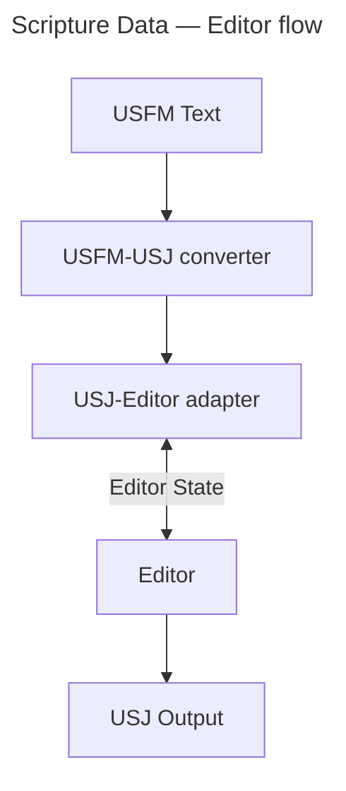

# Scripture Editor for Scribe using USJ

<div align="center">

[![Build Status][github-actions-status]][github-actions-url]
[![CodeQL][gitghub-codeql-status]][gitghub-codeql-url]
[![Github Tag][npm-version-image]][npm-version-url]

</div>

A lightweight Scripture editor React component that works on USJ Scripture data. A utility that converts USFM to USJ is also included. It is expected that data conforms to [USJ v3.1](https://docs.usfm.bible/usfm/3.1/).



## Install

```sh
npm install @biblionexus-foundation/scribe-editor
```

## Usage

> [!NOTE]
> This is an [uncontrolled React component](https://react.dev/learn/sharing-state-between-components#controlled-and-uncontrolled-components).

```typescript
import { useState, useMemo, SyntheticEvent, useRef, useEffect } from "react";
import { Usj, USJ_TYPE, USJ_VERSION } from "@biblionexus-foundation/scripture-utilities";
import { ScriptureReference } from "shared/utils/get-marker-action.model";
import { UsjNodeOptions } from "shared-react/nodes/usj/usj-node-options.model";
import { immutableNoteCallerNodeName } from "shared-react/nodes/usj/ImmutableNoteCallerNode";
import { getViewOptions, getDefaultViewMode } from "shared-react/views/view-options.utils";
import { SelectionRange } from "shared-react/plugins/usj/annotation/selection.model";
import Editor, { EditorRef } from "@biblionexus-foundation/scribe-editor";

const defaultUsj: Usj = {
  type: USJ_TYPE,
  version: USJ_VERSION,
  content: [],
};

const defaultScrRef: ScriptureReference = { book: "PSA", chapterNum: 1, verseNum: 1 };

const nodeOptions: UsjNodeOptions = {
  [immutableNoteCallerNodeName]: {
    onClick: (e: SyntheticEvent) => {
      console.log("note node clicked", e);
    },
  },
};

export default function App() {
  const editorRef = useRef<EditorRef>(null!);
  const [scrRef, setScrRef] = useState(defaultScrRef);
  const [viewMode] = useState(getDefaultViewMode);
  const viewOptions = useMemo(() => getViewOptions(viewMode), [viewMode]);

  const onChange = async (usj: Usj) => {
    console.log("USJ changed:", usj);
  };

  const onSelectionChange = (selection: SelectionRange | undefined) => {
    console.log("Selection changed:", selection);
  };

  // Example: Load USJ data after component mounts
  useEffect(() => {
    const timeoutId = setTimeout(() => {
      // Load your USJ data here
      // editorRef.current?.setUsj(yourUsjData);
    }, 1000);
    return () => clearTimeout(timeoutId);
  }, []);

  return (
    <div className="flex-center m-2 flex h-editor justify-center p-8">
      <div className="relative w-2/3 overflow-hidden rounded-md border-2 border-secondary">
        <div className="h-editor overflow-y-auto p-2">
          <Editor
            usjInput={defaultUsj}
            ref={editorRef}
            onChange={onChange}
            onSelectionChange={onSelectionChange}
            viewOptions={viewOptions}
            nodeOptions={nodeOptions}
            scrRef={scrRef}
            onScrRefChange={setScrRef}
          />
        </div>
      </div>
    </div>
  );
}
```

## Features

- **USJ editor** with USFM support via conversion utilities
- **Read-only and edit mode** - configurable editor state
- **History** - undo & redo functionality
- **Cut, copy, paste** - context menu and keyboard shortcuts
- **Format block type** - change `<para>` markers with a proof-of-concept implementation
- **Insert markers** - type '\\' (backslash) for a marker menu. Selected text will have the marker applied if possible
- **BCV linkage** - change the book/chapter/verse externally and the cursor moves; move the cursor and it updates the external book/chapter/verse
- **Selection tracking** - get and set cursor location or selection range
- **Auto-numbering support** - for verse and chapter numbering
- **Keyboard shortcuts** - common editing shortcuts
- **Arrow navigation** - enhanced navigation between verses and chapters
- **Text direction support** - automatic text direction detection

### Supported USJ Nodes

- `<book>` - Book identification
- `<chapter>` - Chapter markers
- `<verse>` - Verse markers and ranges
- `<para>` - Paragraph styles
- `<char>` - Character styles
- `<note>` - Footnotes and cross-references
- `<ms>` - Milestone markers

### Node Options

- **Note caller customization** - callback for when a `<note>` link is clicked
- **Custom note callers** - specify note caller characters when caller is '+'

## API Reference

### Editor Properties

```typescript
type EditorProps = {
  /** Scripture data in USJ form */
  usjInput?: Usj;
  /** Callback function when USJ Scripture data has changed */
  onChange?: (usj: Usj) => void;
  /** Callback function when the cursor selection changes */
  onSelectionChange?: (selection: SelectionRange | undefined) => void;
  /** View options for rendering */
  viewOptions?: ViewOptions;
  /** Node-specific options and callbacks */
  nodeOptions?: UsjNodeOptions;
  /** Current Scripture reference */
  scrRef: ScriptureReference;
  /** Callback function when the Scripture reference changes */
  onScrRefChange: (scrRef: ScriptureReference) => void;
};
```

### Editor Ref

```typescript
export type EditorRef = {
  /** Focus the editor */
  focus(): void;
  /** Get current USJ Scripture data */
  getUsj(): Usj | undefined;
  /** Set the USJ Scripture data */
  setUsj(usj: Usj): void;
  /**
   * Get the selection location or range
   * @returns the selection location or range, or `undefined` if there is no selection
   */
  getSelection(): SelectionRange | undefined;
  /**
   * Set the selection location or range
   * @param selection - A selection location or range
   */
  setSelection(selection: SelectionRange): void;
};
```

### Scripture Reference

```typescript
export interface ScriptureReference {
  /** Book code (e.g., "GEN", "PSA", "MAT") */
  book: string;
  /** Chapter number */
  chapterNum: number;
  /** Verse number */
  verseNum: number;
  /** Optional verse range (e.g., "1-3" for verses 1 through 3) */
  verse?: string;
}
```

## Demo and Development Environment

To run the demo app locally, first follow the [Developer Quick Start](/README.md#developer-quick-start), then run:

```sh
nx dev scribe
```

## Develop in App

To develop the editor in a target application you can use [yalc](https://www.npmjs.com/package/yalc) to link the editor without publishing to NPM every time something changes.

1. In this monorepo, publish the editor to `yalc`:
   ```bash
   nx devpub scribe
   ```
2. In the target application repo, link from `yalc`:
   ```bash
   yalc link @biblionexus-foundation/scribe-editor
   ```
3. In this monorepo, make changes and re-publish the editor (repeat step 1).
4. When finished developing, unlink from `yalc` in the target application:
   ```bash
   yalc remove @biblionexus-foundation/scribe-editor && npm i
   ```

## License

[MIT][github-license] © [BiblioNexus Foundation](https://biblionexus.org/)

<!-- define variables used above -->

[github-actions-status]: https://github.com/BiblioNexus-Foundation/scripture-editors/actions/workflows/test-publish.yml/badge.svg
[github-actions-url]: https://github.com/BiblioNexus-Foundation/scripture-editors/actions
[gitghub-codeql-status]: https://github.com/BiblioNexus-Foundation/scripture-editors/actions/workflows/codeql.yml/badge.svg
[gitghub-codeql-url]: https://github.com/BiblioNexus-Foundation/scripture-editors/actions/workflows/codeql.yml
[npm-version-image]: https://img.shields.io/npm/v/@biblionexus-foundation/scribe-editor
[npm-version-url]: https://github.com/BiblioNexus-Foundation/scripture-editors/releases
[github-license]: https://github.com/BiblioNexus-Foundation/scripture-editors/blob/main/packages/scribe/LICENSE
